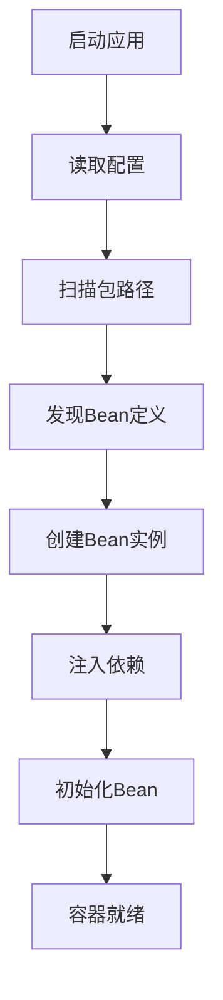
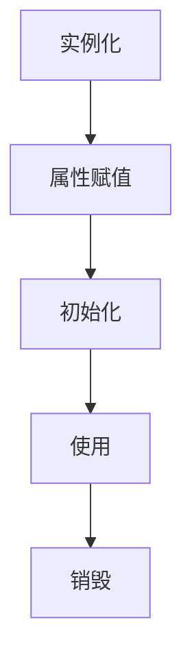

# 02-Spring Boot核心概念学习

> **学习目标**：深入理解Spring Boot核心概念，掌握IoC容器和依赖注入机制

## 🎯 本章概览

| 内容 | 预计时间 | 难度 | 状态 |
|------|----------|------|------|
| IoC容器原理 | 25分钟 | ⭐⭐⭐ | ⏳ |
| 依赖注入机制 | 20分钟 | ⭐⭐⭐ | ⏳ |
| Bean生命周期 | 15分钟 | ⭐⭐ | ⏳ |
| 自动配置原理 | 20分钟 | ⭐⭐⭐ | ⏳ |

---

## 🏗️ IoC容器深度解析

### 🔹 什么是IoC容器

IoC（Inversion of Control）控制反转是Spring框架的核心思想。

#### 传统开发方式 vs IoC方式

**传统方式（程序员控制）：**
```java
// 程序员手动创建和管理对象
public class UserService {
    private UserRepository userRepository = new UserRepositoryImpl(); // 强依赖
    private EmailService emailService = new EmailServiceImpl();   // 强依赖

    public UserService() {
        // 构造函数中创建依赖对象
    }
}
```

**IoC方式（容器控制）：**
```java
@Service  // 告诉Spring这是一个Bean
public class UserService {
    private final UserRepository userRepository;
    private final EmailService emailService;

    // 构造函数注入，由容器提供依赖
    public UserService(UserRepository userRepository, EmailService emailService) {
        this.userRepository = userRepository;
        this.emailService = emailService;
    }
}
```

#### IoC容器的核心职责

1. **Bean的实例化** - 根据配置信息创建对象
2. **依赖关系管理** - 自动注入所需的依赖
3. **生命周期管理** - 管理Bean的创建、初始化、销毁
4. **配置管理** - 应用外部化配置

### 🔹 IoC容器工作流程



---

## 🔧 依赖注入详解

### 🔹 依赖注入的三种方式

#### 1. 构造函数注入（推荐）
```java
@Service
public class UserService {
    private final UserRepository userRepository;
    private final EmailService emailService;

    // 构造函数注入 - 推荐方式
    public UserService(UserRepository userRepository, EmailService emailService) {
        this.userRepository = userRepository;
        this.emailService = emailService;
    }
}
```

**优势**：
- 依赖明确，通过构造方法参数体现
- 不可变性，对象创建后依赖不可修改
- 易于测试，可以通过构造函数传入Mock对象
- 符合单一职责原则

#### 2. Setter注入
```java
@Service
public class UserService {
    private UserRepository userRepository;

    @Autowired
    public void setUserRepository(UserRepository userRepository) {
        this.userRepository = userRepository;
    }
}
```

**优势**：
- 可选择性注入，不一定所有依赖都是必需的
- 可以在对象创建后重新设置依赖

**劣势**：
- 对象可能处于不完整状态
- 不符合不可变性原则

#### 3. 字段注入
```java
@Service
public class UserService {
    @Autowired
    private UserRepository userRepository;

    // 字段注入 - 不推荐
}
```

**优势**：
- 代码简洁
- 使用方便

**劣势**：
- 违反不可变性原则
- 难以测试
- 掩饰器注入，可能影响性能

### 🔹 注解说明

#### `@Component` 系列注解
```java
@Component  // 通用组件
@Service    // 服务层组件
@Repository // 数据访问层组件
@Controller // 控制器层组件
@RestController // REST控制器
```

#### `@Autowired` 注解
```java
@Autowired  // 自动装配Bean
private UserRepository userRepository;
```

#### `@Value` 注解
```java
@Value("${app.name}")
private String appName;

@Value("${server.port}")
private int serverPort;
```

---

## 🌱 Bean对象管理

### 🔹 Bean的定义方式

#### 1. 注解方式（推荐）
```java
@Component
public class UserService {
    // 类注解，Spring自动扫描并注册为Bean
}
```

#### 2. Java配置方式
```java
@Configuration
public class AppConfig {
    @Bean
    public UserService userService() {
        return new UserService();
    }
}
```

#### 3. XML配置方式（传统方式）
```xml
<bean id="userService" class="com.example.UserService"/>
```

### 🔹 Bean的作用域

```java
@Component
@Scope("prototype")  // 原型作用域，每次请求创建新实例
public class UserService {
    // ...
}

@Component
@Scope("singleton") // 单例作用域（默认），整个应用只有一个实例
public class OrderService {
    // ...
}
```

**作用域类型：**
- **singleton** - 单例（默认）
- **prototype** - 原型
- **request** - Web应用中，每个HTTP请求一个实例
- **session** - Web应用中，每个用户会话一个实例
- **application** - ServletContext级别

### 🔹 Bean生命周期



#### 生命周期回调方法
```java
@Component
public class UserService implements InitializingBean, DisposableBean {

    // 1. 构造函数
    public UserService() {
        System.out.println("1. 构造函数执行");
    }

    // 2. 属性注入后
    @PostConstruct
    public void init() {
        System.out.println("2. @PostConstruct执行");
    }

    // 3. 初始化后
    @Override
    public void afterPropertiesSet() {
        System.out.println("3. afterPropertiesSet执行");
    }

    // 4. 销毁前
    @PreDestroy
    public void cleanup() {
        System.out.println("4. @PreDestroy执行");
    }
}
```

---

## ⚙️ 自动配置原理

### 🔹 什么是自动配置

Spring Boot的自动配置是其核心特性，能够根据类路径中的jar包自动配置应用。

#### 自动配置的工作原理

```mermaid
graph TD
    A[启动应用] --> B[@EnableAutoConfiguration]
    B --> C[扫描classpath]
    C --> D[发现条件注解]
    D --> E[创建配置类]
    E --> F[注册Bean]
    F --> G[应用就绪]
```

#### 条件注解示例
```java
@Configuration
@ConditionalOnClass(DataSource.class)  // 当存在DataSource类时生效
@ConditionalOnProperty(prefix = "app.datasource", name = "url")  // 当配置存在时生效
@ConditionalOnMissingBean(UserService.class)  // 当不存在UserService Bean时生效
public class DatabaseConfig {

    @Bean
    public DataSource dataSource() {
        return new HikariDataSource();
    }
}
```

### 🔹 常用条件注解

| 注解 | 作用 | 示例 |
|------|------|------|
| `@ConditionalOnClass` | 类存在时生效 | `@ConditionalOnClass(DataSource.class)` |
| `@ConditionalOnMissingClass` | 类不存在时生效 | `@ConditionalOnMissingClass(JdbcTemplate.class)` |
| `@ConditionalOnBean` | Bean存在时生效 | `@ConditionalOnBean(name = "userService")` |
| `@ConditionalOnMissingBean` | Bean不存在时生效 | `@ConditionalOnMissingBean(UserService.class)` |
| `@ConditionalOnProperty` | 属性满足条件时生效 | `@ConditionalOnProperty(name = "app.enabled")` |
| `@ConditionalOnResource` | 资源存在时生效 | `@ConditionalOnResource("classpath:application.properties")` |

---

## 🛠️ 实践练习

### 🔹 创建自定义配置类

```java
@Configuration
@EnableConfigurationProperties(prefix = "app")
public class AppProperties {

    private String name;
    private String version;
    private boolean enabled;

    // getter和setter方法
    public String getName() { return name; }
    public void setName(String name) { this.name = name; }
    public String getVersion() { return version; }
    public void setVersion(String version) { this.version = version; }
    public boolean isEnabled() { return enabled; }
    public void setEnabled(boolean enabled) { this.enabled = enabled; }
}
```

### 🔹 创建服务类并注册为Bean

```java
@Service
public class UserService {

    private final UserRepository userRepository;

    // 构造函数注入
    public UserService(UserRepository userRepository) {
        this.userRepository = userRepository;
    }

    public User findById(Long id) {
        return userRepository.findById(id);
    }

    public User save(User user) {
        return userRepository.save(user);
    }
}
```

### 🔹 创建控制器

```java
@RestController
@RequestMapping("/users")
public class UserController {

    private final UserService userService;

    // 构造函数注入
    public UserController(UserService userService) {
        this.userService = userService;
    }

    @GetMapping("/{id}")
    public ResponseEntity<User> getUser(@PathVariable Long id) {
        User user = userService.findById(id);
        return ResponseEntity.ok(user);
    }

    @PostMapping
    public ResponseEntity<User> createUser(@RequestBody User user) {
        User savedUser = userService.save(user);
        return ResponseEntity.status(HttpStatus.CREATED).body(savedUser);
    }
}
```

---

## 📝 本章小结

### ✅ 掌握概念
- [x] **IoC容器原理** - 理解控制反转的思想和实现
- [x] **依赖注入机制** - 掌握三种注入方式及其优缺点
- [x] **Bean生命周期** - 了解Bean的创建到销毁过程
- [x] **自动配置原理** - 理解条件注解和自动配置机制

### 🎯 实践能力
- [x] 能够创建和配置Spring Boot项目
- [x] 能够正确使用依赖注入
- [x] 能够管理Bean的生命周期
- [x] 能够编写自定义配置类

### 🚀 下一步
核心概念已经掌握，下一章我们将创建用户实体类和数据访问层，为用户认证API开发做准备。

---

## ❓ 常见问题

### Q1: 为什么推荐构造函数注入？
**A**:
1. **不可变性** - 依赖一旦注入就不能修改
2. **可测试性** - 容易通过构造函数注入Mock对象
3. **明确性** - 依赖关系在构造函数中一目了然
4. **符合原则** - 符合单一职责和开闭原则

### Q2: Bean的默认作用域是什么？
**A**: 默认是singleton（单例），整个Spring容器中只创建一个实例。

### Q3: @Autowired和@Resource有什么区别？
**A**:
- `@Autowired` 是Spring的注解
- `@Resource` 是JSR-250注解，默认按名称注入
- 推荐使用`@Autowired`

### Q4: 如何解决循环依赖？
**A**:
- 使用@Lazy注解延迟初始化
- 使用Setter注入替代构造函数注入
- 重新设计代码结构，避免循环依赖

---

**恭喜！您已经掌握了Spring Boot的核心概念。** 🎉

**下一章：[03-用户实体类设计](03-用户实体类设计.md)**