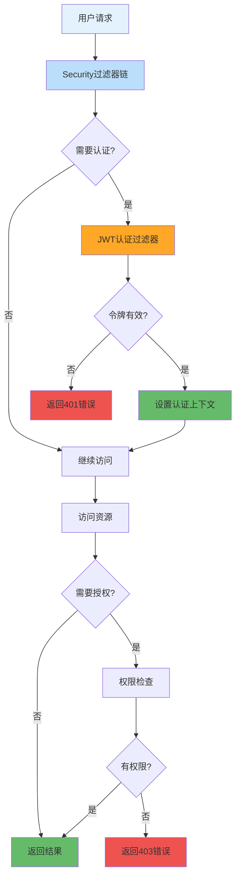

---
tags:
  - Spring Security
  - 安全配置
  - 用户认证
  - 密码加密
  - 配置类
created: 2025-11-19
modified: 2025-11-19
category: 开发教程
difficulty: intermediate
---

# 01-Spring Security基础配置

> **学习目标**: 配置Spring Security安全框架，实现基础的用户认证和授权机制

## 🎯 本章概览

**学习时间**: 30-45分钟 | **难度等级**: ⭐⭐⭐ | **重点程度**: 🔥🔥🔥🔥

Spring Security是Spring生态系统的安全框架，提供认证和授权功能。本章将教你配置Spring Security基础架构，为后续的JWT认证奠定基础。

---

## 📋 核心需求

### 🎯 业务目标
- 配置Spring Security基础框架
- 实现密码加密存储
- 设置HTTP安全策略
- 配置用户认证服务

### 🛠️ 技术需求
- Spring Security配置类
- BCrypt密码加密
- 自定义用户详情服务
- HTTP安全配置

---

## 🏗️ Spring Security核心概念

### 🎯 认证与授权流程



---

## 💻 实战：Spring Security配置

### 1️⃣ 安全配置主类

```java
package com.cmliy.springweb.config;

import com.cmliy.springweb.security.JwtAuthenticationEntryPoint;
import com.cmliy.springweb.security.JwtAuthenticationFilter;
import org.springframework.beans.factory.annotation.Autowired;
import org.springframework.context.annotation.Bean;
import org.springframework.context.annotation.Configuration;
import org.springframework.security.authentication.AuthenticationManager;
import org.springframework.security.config.annotation.authentication.configuration.AuthenticationConfiguration;
import org.springframework.security.config.annotation.method.configuration.EnableMethodSecurity;
import org.springframework.security.config.annotation.web.builders.HttpSecurity;
import org.springframework.security.config.annotation.web.configuration.EnableWebSecurity;
import org.springframework.security.config.http.SessionCreationPolicy;
import org.springframework.security.crypto.bcrypt.BCryptPasswordEncoder;
import org.springframework.security.crypto.password.PasswordEncoder;
import org.springframework.security.web.SecurityFilterChain;
import org.springframework.security.web.authentication.UsernamePasswordAuthenticationFilter;
import org.springframework.web.cors.CorsConfiguration;
import org.springframework.web.cors.CorsConfigurationSource;
import org.springframework.web.cors.UrlBasedCorsConfigurationSource;

import java.util.Arrays;

@Configuration
@EnableWebSecurity
@EnableMethodSecurity(prePostEnabled = true)  // 🎯 启用方法级安全
public class SecurityConfig {

    @Autowired
    private JwtAuthenticationEntryPoint jwtAuthenticationEntryPoint;

    @Autowired
    private JwtAuthenticationFilter jwtAuthenticationFilter;

    @Autowired
    private CustomUserDetailsService customUserDetailsService;

    /**
     * 🔐 密码编码器配置
     * 使用BCrypt强哈希算法加密密码
     */
    @Bean
    public PasswordEncoder passwordEncoder() {
        return new BCryptPasswordEncoder();
    }

    /**
     * 🔑 认证管理器配置
     * 用于处理用户认证逻辑
     */
    @Bean
    public AuthenticationManager authenticationManager(
            AuthenticationConfiguration config) throws Exception {
        return config.getAuthenticationManager();
    }

    /**
     * 🌐 CORS跨域配置
     * 允许前端应用跨域访问
     */
    @Bean
    public CorsConfigurationSource corsConfigurationSource() {
        CorsConfiguration configuration = new CorsConfiguration();

        // 🎯 允许的源
        configuration.setAllowedOriginPatterns(Arrays.asList("*"));

        // 🎯 允许的HTTP方法
        configuration.setAllowedMethods(Arrays.asList("GET", "POST", "PUT", "DELETE", "OPTIONS"));

        // 🎯 允许的请求头
        configuration.setAllowedHeaders(Arrays.asList("*"));

        // 🎯 允许凭证
        configuration.setAllowCredentials(true);

        // 🎯 预检请求缓存时间
        configuration.setMaxAge(3600L);

        UrlBasedCorsConfigurationSource source = new UrlBasedCorsConfigurationSource();
        source.registerCorsConfiguration("/**", configuration);
        return source;
    }

    /**
     * 🛡️ 安全过滤器链配置
     * 核心安全配置，定义访问规则和认证流程
     */
    @Bean
    public SecurityFilterChain filterChain(HttpSecurity http) throws Exception {
        http
            // 🚫 禁用CSRF（JWT不需要CSRF保护）
            .csrf(csrf -> csrf.disable())

            // 🌐 配置CORS
            .cors(cors -> cors.configurationSource(corsConfigurationSource()))

            // 🎯 配置会话管理（无状态）
            .sessionManagement(session ->
                session.sessionCreationPolicy(SessionCreationPolicy.STATELESS))

            // 🔐 配置异常处理
            .exceptionHandling(exception ->
                exception.authenticationEntryPoint(jwtAuthenticationEntryPoint))

            // 🎯 配置请求授权规则
            .authorizeHttpRequests(auth -> auth
                // 📄 公开访问的端点
                .requestMatchers("/api/auth/**").permitAll()
                .requestMatchers("/api/public/**").permitAll()

                // 🔧 管理员端点
                .requestMatchers("/api/admin/**").hasRole("ADMIN")

                // 📊 Swagger文档（开发环境）
                .requestMatchers("/swagger-ui/**", "/v3/api-docs/**").permitAll()

                // 🔍 健康检查端点
                .requestMatchers("/actuator/health").permitAll()

                // 🛡️ 其他所有请求都需要认证
                .anyRequest().authenticated()
            )

            // 🔑 添加用户详情服务
            .userDetailsService(customUserDetailsService);

        // 🎯 添加JWT认证过滤器
        http.addFilterBefore(jwtAuthenticationFilter, UsernamePasswordAuthenticationFilter.class);

        return http.build();
    }
}
```

### 2️⃣ 自定义用户详情服务

```java
package com.cmliy.springweb.security;

import com.cmliy.springweb.model.User;
import com.cmliy.springweb.repository.UserRepository;
import org.springframework.beans.factory.annotation.Autowired;
import org.springframework.security.core.authority.SimpleGrantedAuthority;
import org.springframework.security.core.userdetails.UserDetails;
import org.springframework.security.core.userdetails.UserDetailsService;
import org.springframework.security.core.userdetails.UsernameNotFoundException;
import org.springframework.stereotype.Service;

import java.util.Collections;

/**
 * 👤 自定义用户详情服务
 * 从数据库加载用户信息供Spring Security使用
 */
@Service
public class CustomUserDetailsService implements UserDetailsService {

    @Autowired
    private UserRepository userRepository;

    /**
     * 🔍 根据用户名加载用户详情
     * @param username 用户名
     * @return 用户详情对象
     * @throws UsernameNotFoundException 用户不存在异常
     */
    @Override
    public UserDetails loadUserByUsername(String username) throws UsernameNotFoundException {
        // 🗄️ 从数据库查询用户
        User user = userRepository.findByUsername(username)
                .orElseThrow(() -> new UsernameNotFoundException("用户不存在: " + username));

        // 🎯 转换为Spring Security用户对象
        return org.springframework.security.core.userdetails.User.builder()
                .username(user.getUsername())
                .password(user.getPassword())
                .authorities(Collections.singletonList(
                    new SimpleGrantedAuthority("ROLE_" + user.getRole())
                ))
                .accountExpired(false)      // 账户未过期
                .accountLocked(false)       // 账户未锁定
                .credentialsExpired(false)  // 凭证未过期
                .disabled(!user.isEnabled()) // 账户是否禁用
                .build();
    }
}
```

### 3️⃣ JWT认证入口点

```java
package com.cmliy.springweb.security;

import com.fasterxml.jackson.databind.ObjectMapper;
import jakarta.servlet.ServletException;
import jakarta.servlet.http.HttpServletRequest;
import jakarta.servlet.http.HttpServletResponse;
import org.springframework.http.MediaType;
import org.springframework.security.core.AuthenticationException;
import org.springframework.security.web.AuthenticationEntryPoint;
import org.springframework.stereotype.Component;

import java.io.IOException;
import java.time.LocalDateTime;
import java.util.HashMap;
import java.util.Map;

/**
 * 🚨 JWT认证入口点
 * 处理未认证的请求，返回统一的错误响应
 */
@Component
public class JwtAuthenticationEntryPoint implements AuthenticationEntryPoint {

    @Autowired
    private ObjectMapper objectMapper;

    /**
     * 🚨 处理认证失败
     * 当用户未认证访问受保护资源时调用
     */
    @Override
    public void commence(HttpServletRequest request,
                        HttpServletResponse response,
                        AuthenticationException authException) throws IOException, ServletException {

        // 🎯 设置响应状态和内容类型
        response.setStatus(HttpServletResponse.SC_UNAUTHORIZED);
        response.setContentType(MediaType.APPLICATION_JSON_VALUE);
        response.setCharacterEncoding("UTF-8");

        // 📝 构建错误响应
        Map<String, Object> body = new HashMap<>();
        body.put("status", HttpServletResponse.SC_UNAUTHORIZED);
        body.put("error", "Unauthorized");
        body.put("message", "认证失败，请先登录");
        body.put("path", request.getServletPath());
        body.put("timestamp", LocalDateTime.now().toString());

        // 📤 写入响应
        objectMapper.writeValue(response.getOutputStream(), body);
    }
}
```

---

## 🛠️ 密码加密工具

### 1️⃣ 密码工具类

```java
package com.cmliy.springweb.util;

import org.springframework.security.crypto.bcrypt.BCryptPasswordEncoder;
import org.springframework.stereotype.Component;

/**
 * 🔐 密码工具类
 * 提供密码加密和验证功能
 */
@Component
public class PasswordUtil {

    private final BCryptPasswordEncoder passwordEncoder = new BCryptPasswordEncoder();

    /**
     * 🔐 加密密码
     * @param rawPassword 原始密码
     * @return 加密后的密码
     */
    public String encode(String rawPassword) {
        return passwordEncoder.encode(rawPassword);
    }

    /**
     * ✅ 验证密码
     * @param rawPassword 原始密码
     * @param encodedPassword 加密后的密码
     * @return 密码是否匹配
     */
    public boolean matches(String rawPassword, String encodedPassword) {
        return passwordEncoder.matches(rawPassword, encodedPassword);
    }

    /**
     * 🔍 生成随机密码
     * @param length 密码长度
     * @return 随机密码
     */
    public String generateRandomPassword(int length) {
        String chars = "ABCDEFGHIJKLMNOPQRSTUVWXYZabcdefghijklmnopqrstuvwxyz0123456789!@#$%^&*";
        StringBuilder password = new StringBuilder();

        for (int i = 0; i < length; i++) {
            int index = (int) (Math.random() * chars.length());
            password.append(chars.charAt(index));
        }

        return password.toString();
    }
}
```

### 2️⃣ 密码验证测试

```java
package com.cmliy.springweb.util;

import org.junit.jupiter.api.Test;
import org.springframework.boot.test.context.SpringBootTest;

import static org.junit.jupiter.api.Assertions.*;

@SpringBootTest
public class PasswordUtilTest {

    @Test
    public void testPasswordEncoding() {
        // 🎯 创建密码工具实例
        PasswordUtil passwordUtil = new PasswordUtil();

        // 🔐 测试密码加密
        String rawPassword = "password123";
        String encodedPassword = passwordUtil.encode(rawPassword);

        // ✅ 验证加密结果
        assertNotNull(encodedPassword);
        assertNotEquals(rawPassword, encodedPassword);
        assertTrue(encodedPassword.startsWith("$2a$"));  // BCrypt特征

        System.out.println("原始密码: " + rawPassword);
        System.out.println("加密密码: " + encodedPassword);
    }

    @Test
    public void testPasswordMatching() {
        PasswordUtil passwordUtil = new PasswordUtil();

        String rawPassword = "password123";
        String encodedPassword = passwordUtil.encode(rawPassword);

        // ✅ 验证密码匹配
        assertTrue(passwordUtil.matches(rawPassword, encodedPassword));
        assertFalse(passwordUtil.matches("wrongpassword", encodedPassword));

        System.out.println("✅ 密码验证测试通过");
    }

    @Test
    public void testRandomPasswordGeneration() {
        PasswordUtil passwordUtil = new PasswordUtil();

        // 🔍 生成随机密码
        String randomPassword = passwordUtil.generateRandomPassword(12);

        // ✅ 验证随机密码
        assertNotNull(randomPassword);
        assertEquals(12, randomPassword.length());

        System.out.println("生成的随机密码: " + randomPassword);
    }
}
```

---

## 🧪 Spring Security配置测试

### 1️⃣ 安全配置测试

```java
package com.cmliy.springweb.config;

import com.cmliy.springweb.repository.UserRepository;
import com.cmliy.springweb.security.CustomUserDetailsService;
import org.junit.jupiter.api.Test;
import org.springframework.beans.factory.annotation.Autowired;
import org.springframework.boot.test.context.SpringBootTest;
import org.springframework.security.core.userdetails.UserDetails;
import org.springframework.security.core.userdetails.UsernameNotFoundException;
import org.springframework.security.crypto.password.PasswordEncoder;
import org.springframework.test.context.ActiveProfiles;

import static org.junit.jupiter.api.Assertions.*;

@SpringBootTest
@ActiveProfiles("test")
public class SecurityConfigTest {

    @Autowired
    private PasswordEncoder passwordEncoder;

    @Autowired
    private CustomUserDetailsService userDetailsService;

    @Autowired
    private UserRepository userRepository;

    @Test
    public void testPasswordEncoderBean() {
        // ✅ 验证密码编码器配置
        assertNotNull(passwordEncoder);

        // 🔐 测试密码加密
        String password = "testpassword";
        String encodedPassword = passwordEncoder.encode(password);

        assertTrue(passwordEncoder.matches(password, encodedPassword));
        System.out.println("✅ 密码编码器配置正确");
    }

    @Test
    public void testUserDetailsService() {
        // 👤 创建测试用户
        com.cmliy.springweb.model.User testUser = new com.cmliy.springweb.model.User();
        testUser.setUsername("testuser");
        testUser.setEmail("test@example.com");
        testUser.setPassword(passwordEncoder.encode("password123"));
        testUser.setRole("USER");
        testUser.setEnabled(true);

        userRepository.save(testUser);

        // 🔍 测试用户详情加载
        UserDetails userDetails = userDetailsService.loadUserByUsername("testuser");

        // ✅ 验证用户详情
        assertNotNull(userDetails);
        assertEquals("testuser", userDetails.getUsername());
        assertTrue(userDetails.getAuthorities().stream()
                .anyMatch(auth -> auth.getAuthority().equals("ROLE_USER")));
        assertTrue(userDetails.isEnabled());

        System.out.println("✅ 用户详情服务配置正确");
    }

    @Test
    public void testUserNotFound() {
        // ❌ 测试用户不存在的情况
        assertThrows(UsernameNotFoundException.class, () -> {
            userDetailsService.loadUserByUsername("nonexistentuser");
        });

        System.out.println("✅ 用户不存在异常处理正确");
    }
}
```

---

## 🚀 常见问题与解决方案

### ❓ 问题1: 密码编码器类型不匹配

**错误**: `Encoded password does not look like BCrypt`

**解决方案**:
```java
// ✅ 确保使用同一类型的密码编码器
@Bean
public PasswordEncoder passwordEncoder() {
    return new BCryptPasswordEncoder();
}

// 📝 在保存用户时正确加密密码
@Autowired
private PasswordEncoder passwordEncoder;

public void createUser(User user) {
    user.setPassword(passwordEncoder.encode(user.getPassword()));
    userRepository.save(user);
}
```

### ❓ 问题2: CORS跨域问题

**错误**: `Access to XMLHttpRequest blocked by CORS policy`

**解决方案**:
```java
// ✅ 正确配置CORS
@Bean
public CorsConfigurationSource corsConfigurationSource() {
    CorsConfiguration configuration = new CorsConfiguration();
    configuration.setAllowedOriginPatterns(Arrays.asList("*"));
    configuration.setAllowedMethods(Arrays.asList("*"));
    configuration.setAllowedHeaders(Arrays.asList("*"));
    configuration.setAllowCredentials(true);

    UrlBasedCorsConfigurationSource source = new UrlBasedCorsConfigurationSource();
    source.registerCorsConfiguration("/**", configuration);
    return source;
}
```

### ❓ 问题3: 静态资源访问被拦截

**错误**: 静态资源无法访问

**解决方案**:
```java
// ✅ 在安全配置中允许静态资源访问
.authorizeHttpRequests(auth -> auth
    .requestMatchers("/static/**", "/css/**", "/js/**", "/images/**").permitAll()
    // 其他配置...
)
```

---

## 📊 配置最佳实践

### ✅ 推荐做法

1. **🔐 使用强密码编码器** - BCrypt是推荐选择
2. **🌐 正确配置CORS** - 允许前端跨域访问
3. **🛡️ 最小权限原则** - 只开放必要的端点
4. **📝 统一异常处理** - 提供友好的错误响应
5. **🔍 启用方法级安全** - 细粒度权限控制

### ❌ 避免做法

1. **🚫 硬编码密码** - 使用配置文件管理
2. **🚫 过度开放权限** - 避免permitAll()滥用
3. **🚫 忽略异常处理** - 提供清晰的错误信息
4. **🚫 混淆认证和授权** - 保持概念清晰

---

## 📝 本章小结

### ✅ 已掌握技能

- [ ] **配置** Spring Security基础框架
- [ ] **实现** BCrypt密码加密
- [ ] **创建** 自定义用户详情服务
- [ ] **配置** HTTP安全策略
- [ ] **处理** 认证异常情况

### 🎯 关键要点

1. **安全配置** - 通过SecurityConfig类定义安全策略
2. **密码加密** - 使用BCrypt保护用户密码
3. **用户服务** - 自定义UserDetailsService加载用户信息
4. **异常处理** - 统一的认证失败响应

### 🚀 下一步学习

现在你已经掌握了Spring Security基础配置，接下来可以学习：
- → **02-JWT认证机制实现** - 实现无状态令牌认证
- → **03-用户管理服务开发** - 实现用户业务逻辑
- → **04-认证API控制器** - 开发RESTful接口

---

**记住：安全是应用的基础，正确配置Security至关重要！** 🎉

---