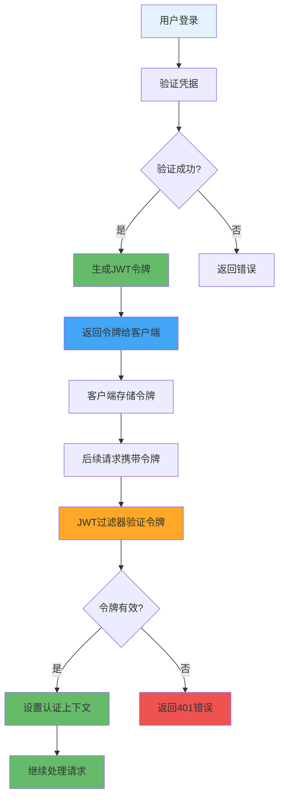

---
tags:
  - JWT认证
  - Json Web Token
  - 无状态认证
  - 令牌管理
  - 认证过滤器
created: 2025-11-19
modified: 2025-11-19
category: 开发教程
difficulty: intermediate
---

# 02-JWT认证机制实现

> **学习目标**: 实现JWT（JSON Web Token）认证机制，提供无状态的用户认证解决方案

## 🎯 本章概览

**学习时间**: 45-60分钟 | **难度等级**: ⭐⭐⭐⭐ | **重点程度**: 🔥🔥🔥🔥🔥

JWT是一种开放标准（RFC 7519），用于在各方之间安全地传输信息作为JSON对象。本章将教你实现完整的JWT认证机制，包括令牌生成、验证和过滤功能。

---

## 📋 核心需求

### 🎯 业务目标
- 实现用户登录后生成JWT令牌
- 验证请求中的JWT令牌有效性
- 提供令牌刷新机制
- 实现无状态认证流程

### 🛠️ 技术需求
- JWT令牌生成和解析
- 自定义认证过滤器
- 令牌有效性验证
- 异常处理机制

---

## 🏗️ JWT认证流程

### 🎯 JWT认证工作原理



### 🔑 JWT令牌结构

```json
// JWT Header
{
  "alg": "HS256",
  "typ": "JWT"
}

// JWT Payload
{
  "sub": "1234567890",
  "username": "admin",
  "role": "ADMIN",
  "iat": 1516239022,
  "exp": 1516242622
}

// JWT Signature (由Header + Payload + Secret生成)
```

---

## 💻 实战：JWT核心实现

### 1️⃣ JWT配置类

```java
package com.cmliy.springweb.config;

import org.springframework.boot.context.properties.ConfigurationProperties;
import org.springframework.context.annotation.Configuration;

/**
 * 🔑 JWT配置类
 * 从配置文件读取JWT相关配置
 */
@Configuration
@ConfigurationProperties(prefix = "spring.jwt")
public class JwtConfig {

    private String secret;
    private long expiration;
    private long refreshExpiration;

    // 🎯 默认构造函数
    public JwtConfig() {
        this.secret = "mySecretKey123456789012345678901234567890";
        this.expiration = 86400000;        // 24小时（毫秒）
        this.refreshExpiration = 604800000; // 7天（毫秒）
    }

    // Getter和Setter方法
    public String getSecret() {
        return secret;
    }

    public void setSecret(String secret) {
        this.secret = secret;
    }

    public long getExpiration() {
        return expiration;
    }

    public void setExpiration(long expiration) {
        this.expiration = expiration;
    }

    public long getRefreshExpiration() {
        return refreshExpiration;
    }

    public void setRefreshExpiration(long refreshExpiration) {
        this.refreshExpiration = refreshExpiration;
    }
}
```

### 2️⃣ JWT工具类

```java
package com.cmliy.springweb.util;

import com.cmliy.springweb.config.JwtConfig;
import io.jsonwebtoken.*;
import io.jsonwebtoken.security.Keys;
import org.springframework.beans.factory.annotation.Autowired;
import org.springframework.security.core.userdetails.UserDetails;
import org.springframework.stereotype.Component;

import javax.crypto.SecretKey;
import java.util.Date;
import java.util.HashMap;
import java.util.Map;
import java.util.function.Function;

/**
 * 🔑 JWT工具类
 * 提供JWT令牌的生成、解析和验证功能
 */
@Component
public class JwtUtil {

    @Autowired
    private JwtConfig jwtConfig;

    /**
     * 🔑 获取签名密钥
     * @return 用于JWT签名的密钥
     */
    private SecretKey getSigningKey() {
        return Keys.hmacShaKeyFor(jwtConfig.getSecret().getBytes());
    }

    /**
     * 📤 从令牌中提取用户名
     * @param token JWT令牌
     * @return 用户名
     */
    public String extractUsername(String token) {
        return extractClaim(token, Claims::getSubject);
    }

    /**
     * ⏰ 从令牌中提取过期时间
     * @param token JWT令牌
     * @return 过期时间
     */
    public Date extractExpiration(String token) {
        return extractClaim(token, Claims::getExpiration);
    }

    /**
     * 🎯 从令牌中提取指定声明
     * @param token JWT令牌
     * @param claimsResolver 声明解析函数
     * @return 指定的声明值
     */
    public <T> T extractClaim(String token, Function<Claims, T> claimsResolver) {
        final Claims claims = extractAllClaims(token);
        return claimsResolver.apply(claims);
    }

    /**
     * 📋 从令牌中提取所有声明
     * @param token JWT令牌
     * @return 所有声明
     */
    private Claims extractAllClaims(String token) {
        return Jwts.parserBuilder()
                .setSigningKey(getSigningKey())
                .build()
                .parseClaimsJws(token)
                .getBody();
    }

    /**
     * ⏰ 检查令牌是否过期
     * @param token JWT令牌
     * @return 是否过期
     */
    private Boolean isTokenExpired(String token) {
        return extractExpiration(token).before(new Date());
    }

    /**
     * 🔑 生成访问令牌
     * @param userDetails 用户详情
     * @return JWT访问令牌
     */
    public String generateToken(UserDetails userDetails) {
        Map<String, Object> claims = new HashMap<>();

        // 🎯 添加用户角色到声明中
        userDetails.getAuthorities().forEach(auth -> {
            claims.put("role", auth.getAuthority());
        });

        return createToken(claims, userDetails.getUsername(), jwtConfig.getExpiration());
    }

    /**
     * 🔄 生成刷新令牌
     * @param userDetails 用户详情
     * @return JWT刷新令牌
     */
    public String generateRefreshToken(UserDetails userDetails) {
        Map<String, Object> claims = new HashMap<>();
        claims.put("type", "refresh");

        return createToken(claims, userDetails.getUsername(), jwtConfig.getRefreshExpiration());
    }

    /**
     * 🔧 创建令牌
     * @param claims 声明
     * @param subject 主题（用户名）
     * @param expiration 过期时间
     * @return JWT令牌
     */
    private String createToken(Map<String, Object> claims, String subject, long expiration) {
        Date now = new Date();
        Date expiryDate = new Date(now.getTime() + expiration);

        return Jwts.builder()
                .setClaims(claims)
                .setSubject(subject)
                .setIssuedAt(now)
                .setExpiration(expiryDate)
                .signWith(getSigningKey(), SignatureAlgorithm.HS256)
                .compact();
    }

    /**
     * ✅ 验证令牌有效性
     * @param token JWT令牌
     * @param userDetails 用户详情
     * @return 令牌是否有效
     */
    public Boolean validateToken(String token, UserDetails userDetails) {
        try {
            final String username = extractUsername(token);
            return (username.equals(userDetails.getUsername()) && !isTokenExpired(token));
        } catch (JwtException | IllegalArgumentException e) {
            return false;
        }
    }

    /**
     * 🔍 检查令牌是否为刷新令牌
     * @param token JWT令牌
     * @return 是否为刷新令牌
     */
    public Boolean isRefreshToken(String token) {
        try {
            String type = extractClaim(token, claims -> claims.get("type", String.class));
            return "refresh".equals(type);
        } catch (Exception e) {
            return false;
        }
    }

    /**
     * 🕐 获取令牌剩余有效时间
     * @param token JWT令牌
     * @return 剩余时间（毫秒）
     */
    public long getRemainingValidity(String token) {
        try {
            Date expiration = extractExpiration(token);
            return expiration.getTime() - System.currentTimeMillis();
        } catch (Exception e) {
            return 0;
        }
    }
}
```

### 3️⃣ JWT认证过滤器

```java
package com.cmliy.springweb.security;

import com.cmliy.springweb.util.JwtUtil;
import jakarta.servlet.FilterChain;
import jakarta.servlet.ServletException;
import jakarta.servlet.http.HttpServletRequest;
import jakarta.servlet.http.HttpServletResponse;
import org.springframework.beans.factory.annotation.Autowired;
import org.springframework.security.authentication.UsernamePasswordAuthenticationToken;
import org.springframework.security.core.context.SecurityContextHolder;
import org.springframework.security.core.userdetails.UserDetails;
import org.springframework.security.core.userdetails.UserDetailsService;
import org.springframework.security.web.authentication.WebAuthenticationDetailsSource;
import org.springframework.stereotype.Component;
import org.springframework.web.filter.OncePerRequestFilter;

import java.io.IOException;

/**
 * 🔑 JWT认证过滤器
 * 拦截请求并验证JWT令牌
 */
@Component
public class JwtAuthenticationFilter extends OncePerRequestFilter {

    @Autowired
    private JwtUtil jwtUtil;

    @Autowired
    private UserDetailsService userDetailsService;

    /**
     * 🔍 过滤器核心逻辑
     * 从请求中提取JWT令牌并验证
     */
    @Override
    protected void doFilterInternal(HttpServletRequest request,
                                  HttpServletResponse response,
                                  FilterChain filterChain) throws ServletException, IOException {

        // 🔍 从请求头中获取Authorization
        final String authorizationHeader = request.getHeader("Authorization");

        String username = null;
        String jwt = null;

        // 🎯 检查Authorization头格式
        if (authorizationHeader != null && authorizationHeader.startsWith("Bearer ")) {
            jwt = authorizationHeader.substring(7); // 移除"Bearer "前缀

            try {
                // 📤 从JWT中提取用户名
                username = jwtUtil.extractUsername(jwt);
            } catch (Exception e) {
                logger.warn("无法从JWT令牌中提取用户名: " + e.getMessage());
            }
        }

        // 🔐 如果用户名不为空且当前没有认证
        if (username != null && SecurityContextHolder.getContext().getAuthentication() == null) {
            // 👤 加载用户详情
            UserDetails userDetails = this.userDetailsService.loadUserByUsername(username);

            // ✅ 验证JWT令牌
            if (jwtUtil.validateToken(jwt, userDetails)) {
                // 🔑 创建认证令牌
                UsernamePasswordAuthenticationToken authToken =
                    new UsernamePasswordAuthenticationToken(
                        userDetails,
                        null,
                        userDetails.getAuthorities()
                    );

                // 🎯 设置认证详情
                authToken.setDetails(new WebAuthenticationDetailsSource().buildDetails(request));

                // 🛡️ 设置安全上下文
                SecurityContextHolder.getContext().setAuthentication(authToken);
            }
        }

        // 🔄 继续过滤器链
        filterChain.doFilter(request, response);
    }

    /**
     * 🚫 是否跳过此过滤器
     * 对于公开端点跳过JWT验证
     */
    @Override
    protected boolean shouldNotFilter(HttpServletRequest request) throws ServletException {
        String path = request.getRequestURI();

        // 🎯 公开端点列表
        return path.startsWith("/api/auth/") ||
               path.startsWith("/api/public/") ||
               path.equals("/actuator/health") ||
               path.startsWith("/swagger-ui/") ||
               path.startsWith("/v3/api-docs/");
    }
}
```

---

## 🛠️ JWT服务层

### 1️⃣ JWT认证服务

```java
package com.cmliy.springweb.service;

import com.cmliy.springweb.dto.AuthResponse;
import com.cmliy.springweb.dto.LoginRequest;
import com.cmliy.springweb.dto.RefreshTokenRequest;
import com.cmliy.springweb.model.User;
import com.cmliy.springweb.repository.UserRepository;
import com.cmliy.springweb.util.JwtUtil;
import org.springframework.beans.factory.annotation.Autowired;
import org.springframework.security.authentication.AuthenticationManager;
import org.springframework.security.authentication.BadCredentialsException;
import org.springframework.security.authentication.UsernamePasswordAuthenticationToken;
import org.springframework.security.core.Authentication;
import org.springframework.security.core.userdetails.UserDetails;
import org.springframework.stereotype.Service;

import java.time.LocalDateTime;

/**
 * 🔑 JWT认证服务
 * 处理用户登录、令牌生成和刷新
 */
@Service
public class JwtAuthService {

    @Autowired
    private AuthenticationManager authenticationManager;

    @Autowired
    private JwtUtil jwtUtil;

    @Autowired
    private UserRepository userRepository;

    @Autowired
    private UserService userService;

    /**
     * 🔐 用户登录认证
     * @param loginRequest 登录请求
     * @return 认证响应
     */
    public AuthResponse authenticate(LoginRequest loginRequest) {
        try {
            // 🔐 执行认证
            Authentication authentication = authenticationManager.authenticate(
                new UsernamePasswordAuthenticationToken(
                    loginRequest.getUsername(),
                    loginRequest.getPassword()
                )
            );

            // 👤 获取认证用户
            UserDetails userDetails = (UserDetails) authentication.getPrincipal();

            // 🔑 生成JWT令牌
            String accessToken = jwtUtil.generateToken(userDetails);
            String refreshToken = jwtUtil.generateRefreshToken(userDetails);

            // 📝 更新用户最后登录时间
            User user = userRepository.findByUsername(loginRequest.getUsername())
                    .orElseThrow(() -> new BadCredentialsException("用户不存在"));
            user.setLastLoginTime(LocalDateTime.now());
            userRepository.save(user);

            // 📤 返回认证响应
            return new AuthResponse(
                accessToken,
                refreshToken,
                "Bearer",
                jwtUtil.getExpiration(),
                user
            );

        } catch (BadCredentialsException e) {
            throw new BadCredentialsException("用户名或密码错误");
        }
    }

    /**
     * 🔄 刷新访问令牌
     * @param refreshTokenRequest 刷新令牌请求
     * @return 新的认证响应
     */
    public AuthResponse refreshToken(RefreshTokenRequest refreshTokenRequest) {
        String refreshToken = refreshTokenRequest.getRefreshToken();

        try {
            // 🔍 从刷新令牌中提取用户名
            String username = jwtUtil.extractUsername(refreshToken);

            // 👤 加载用户详情
            UserDetails userDetails = userService.loadUserByUsername(username);

            // ✅ 验证刷新令牌
            if (jwtUtil.isRefreshToken(refreshToken) && jwtUtil.validateToken(refreshToken, userDetails)) {
                // 🔑 生成新的访问令牌
                String newAccessToken = jwtUtil.generateToken(userDetails);
                String newRefreshToken = jwtUtil.generateRefreshToken(userDetails);

                // 📤 返回新的认证响应
                User user = userRepository.findByUsername(username)
                        .orElseThrow(() -> new BadCredentialsException("用户不存在"));

                return new AuthResponse(
                    newAccessToken,
                    newRefreshToken,
                    "Bearer",
                    jwtUtil.getExpiration(),
                    user
                );
            } else {
                throw new BadCredentialsException("无效的刷新令牌");
            }

        } catch (Exception e) {
            throw new BadCredentialsException("刷新令牌验证失败: " + e.getMessage());
        }
    }

    /**
     * 🚪 用户登出（客户端处理令牌失效）
     * @param token JWT令牌
     */
    public void logout(String token) {
        // 📝 这里可以实现令牌黑名单机制
        // 简单实现：记录登出日志
        if (token != null && token.startsWith("Bearer ")) {
            String jwt = token.substring(7);
            String username = jwtUtil.extractUsername(jwt);

            System.out.println("用户 " + username + " 已登出");
            // TODO: 实现令牌黑名单
        }
    }

    /**
     * 🔍 验证令牌有效性
     * @param token JWT令牌
     * @return 令牌是否有效
     */
    public boolean validateToken(String token) {
        try {
            if (token != null && token.startsWith("Bearer ")) {
                String jwt = token.substring(7);
                String username = jwtUtil.extractUsername(jwt);

                UserDetails userDetails = userService.loadUserByUsername(username);
                return jwtUtil.validateToken(jwt, userDetails);
            }
            return false;
        } catch (Exception e) {
            return false;
        }
    }
}
```

---

## 🧪 JWT功能测试

### 1️⃣ JWT工具类测试

```java
package com.cmliy.springweb.util;

import org.junit.jupiter.api.Test;
import org.springframework.boot.test.context.SpringBootTest;
import org.springframework.security.core.authority.SimpleGrantedAuthority;
import org.springframework.security.core.userdetails.User;
import org.springframework.security.core.userdetails.UserDetails;
import org.springframework.test.context.ActiveProfiles;

import java.util.Collections;

import static org.junit.jupiter.api.Assertions.*;

@SpringBootTest
@ActiveProfiles("test")
public class JwtUtilTest {

    @Autowired
    private JwtUtil jwtUtil;

    private UserDetails createTestUser() {
        return User.builder()
                .username("testuser")
                .password("password")
                .authorities(Collections.singletonList(
                    new SimpleGrantedAuthority("ROLE_USER")
                ))
                .build();
    }

    @Test
    public void testTokenGeneration() {
        // 👤 创建测试用户
        UserDetails userDetails = createTestUser();

        // 🔑 生成JWT令牌
        String token = jwtUtil.generateToken(userDetails);

        // ✅ 验证令牌
        assertNotNull(token);
        assertTrue(token.length() > 0);

        System.out.println("生成的JWT令牌: " + token);
        System.out.println("✅ 令牌生成测试通过");
    }

    @Test
    public void testTokenExtraction() {
        UserDetails userDetails = createTestUser();
        String token = jwtUtil.generateToken(userDetails);

        // 📤 提取用户名
        String username = jwtUtil.extractUsername(token);

        // ✅ 验证提取结果
        assertEquals("testuser", username);

        System.out.println("✅ 用户名提取测试通过");
    }

    @Test
    public void testTokenValidation() {
        UserDetails userDetails = createTestUser();
        String token = jwtUtil.generateToken(userDetails);

        // ✅ 验证令牌有效性
        assertTrue(jwtUtil.validateToken(token, userDetails));

        // ❌ 测试无效令牌
        String invalidToken = token + "invalid";
        assertFalse(jwtUtil.validateToken(invalidToken, userDetails));

        System.out.println("✅ 令牌验证测试通过");
    }

    @Test
    public void testRefreshToken() {
        UserDetails userDetails = createTestUser();

        // 🔄 生成刷新令牌
        String refreshToken = jwtUtil.generateRefreshToken(userDetails);

        // ✅ 验证刷新令牌
        assertNotNull(refreshToken);
        assertTrue(jwtUtil.isRefreshToken(refreshToken));
        assertFalse(jwtUtil.isRefreshToken(jwtUtil.generateToken(userDetails)));

        System.out.println("✅ 刷新令牌测试通过");
    }

    @Test
    public void testTokenExpiration() {
        UserDetails userDetails = createTestUser();
        String token = jwtUtil.generateToken(userDetails);

        // ⏰ 检查令牌剩余有效时间
        long remainingTime = jwtUtil.getRemainingValidity(token);

        // ✅ 验证剩余时间
        assertTrue(remainingTime > 0);
        assertTrue(remainingTime <= 86400000); // 不超过24小时

        System.out.println("令牌剩余有效时间: " + remainingTime + "ms");
        System.out.println("✅ 令牌过期时间测试通过");
    }
}
```

---

## 🚀 常见问题与解决方案

### ❓ 问题1: JWT令牌解析失败

**错误**: `JWT signature does not match locally computed signature`

**解决方案**:
```java
// ✅ 确保使用相同的密钥
@Bean
public JwtConfig jwtConfig() {
    JwtConfig config = new JwtConfig();
    config.setSecret("mySecretKey123456789012345678901234567890"); // 至少32字符
    return config;
}

// 🔑 密钥长度必须足够长
private SecretKey getSigningKey() {
    byte[] keyBytes = jwtConfig.getSecret().getBytes();
    if (keyBytes.length < 32) {
        throw new IllegalArgumentException("JWT密钥长度必须至少32字节");
    }
    return Keys.hmacShaKeyFor(keyBytes);
}
```

### ❓ 问题2: 令牌过期处理

**错误**: `JWT expired at`

**解决方案**:
```java
// ✅ 在过滤器中优雅处理过期令牌
try {
    username = jwtUtil.extractUsername(jwt);
} catch (ExpiredJwtException e) {
    logger.warn("JWT令牌已过期: " + e.getMessage());
    response.sendError(HttpServletResponse.SC_UNAUTHORIZED, "令牌已过期");
    return;
}
```

### ❓ 问题3: 跨域认证问题

**错误**: 前端无法携带Authorization头

**解决方案**:
```javascript
// ✅ 前端请求配置
axios.defaults.headers.common['Authorization'] = `Bearer ${token}`;

// 🌐 后端CORS配置
@Bean
public CorsConfigurationSource corsConfigurationSource() {
    CorsConfiguration configuration = new CorsConfiguration();
    configuration.setAllowedHeaders(Arrays.asList("*"));
    configuration.setExposedHeaders(Arrays.asList("Authorization"));
    // ...
}
```

---

## 📊 JWT最佳实践

### ✅ 推荐做法

1. **🔐 使用强密钥** - 至少32字节的随机字符串
2. **⏰ 设置合理过期时间** - 访问令牌较短，刷新令牌较长
3. **🔄 实现令牌刷新** - 避免频繁登录
4. **🛡️ 验证令牌类型** - 区分访问令牌和刷新令牌
5. **📝 记录认证日志** - 便于安全审计

### ❌ 避免做法

1. **🚫 在JWT中存储敏感信息** - JWT是Base64编码的，不是加密
2. **🚫 令牌过期时间过长** - 增加安全风险
3. **🚫 忽略令牌验证** - 始终验证令牌签名和过期时间
4. **🚫 硬编码密钥** - 使用配置文件管理

---

## 📝 本章小结

### ✅ 已掌握技能

- [ ] **实现** JWT令牌生成和解析
- [ ] **创建** JWT认证过滤器
- [ ] **开发** JWT认证服务
- [ ] **处理** 令牌刷新机制
- [ ] **测试** JWT功能完整性

### 🎯 关键要点

1. **JWT结构** - Header、Payload、Signature三部分
2. **令牌生成** - 使用密钥签名JWT
3. **令牌验证** - 验证签名和过期时间
4. **无状态认证** - 不依赖服务器会话

### 🚀 下一步学习

现在你已经掌握了JWT认证机制，接下来可以学习：
- → **03-用户管理服务开发** - 实现用户业务逻辑
- → **04-认证API控制器** - 开发RESTful认证接口
- → **05-异常处理和安全增强** - 完善系统安全性

---

**记住：JWT是无状态认证的关键技术，正确实现至关重要！** 🎉

---