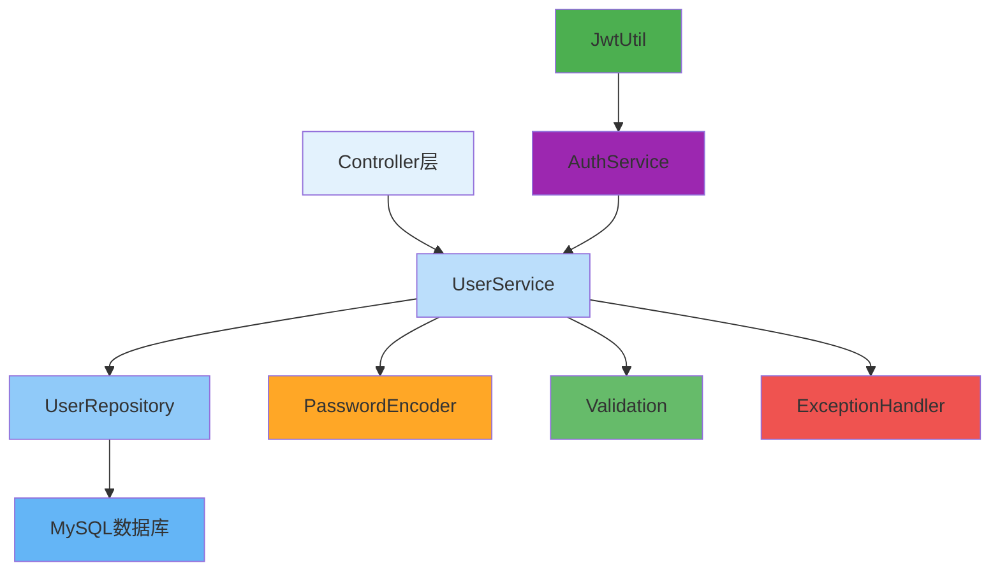

---
tags:
  - 用户管理
  - 业务服务
  - 数据验证
  - 用户注册
  - 密码加密
created: 2025-11-19
modified: 2025-11-19
category: 开发教程
difficulty: intermediate
---

# 03-用户管理服务开发

> **学习目标**: 实现完整的用户管理业务逻辑，包括用户注册、信息管理、数据验证等功能

## 🎯 本章概览

**学习时间**: 45-60分钟 | **难度等级**: ⭐⭐⭐ | **重点程度**: 🔥🔥🔥🔥

用户管理服务是认证系统的核心业务层，负责处理用户注册、信息更新、数据验证等业务逻辑。本章将教你实现完整的用户管理服务。

---

## 📋 核心需求

### 🎯 业务目标
- 实现用户注册功能
- 提供用户信息管理
- 确保数据完整性和一致性
- 处理用户状态变更

### 🛠️ 技术需求
- Spring Service层开发
- 数据验证和业务规则
- 事务管理
- 异常处理

---

## 🏗️ 用户管理架构

### 🎯 服务层架构图



---

## 💻 实战：用户实体和Repository

### 1️⃣ 用户实体模型

```java
package com.cmliy.springweb.model;

import jakarta.persistence.*;
import jakarta.validation.constraints.Email;
import jakarta.validation.constraints.NotBlank;
import jakarta.validation.constraints.Size;
import org.hibernate.annotations.CreationTimestamp;
import org.hibernate.annotations.UpdateTimestamp;

import java.time.LocalDateTime;

/**
 * 👤 用户实体模型
 * 对应数据库users表
 */
@Entity
@Table(name = "users", indexes = {
    @Index(name = "idx_username", columnList = "username"),
    @Index(name = "idx_email", columnList = "email")
})
public class User {

    @Id
    @GeneratedValue(strategy = GenerationType.IDENTITY)
    private Long id;

    @NotBlank(message = "用户名不能为空")
    @Size(min = 3, max = 50, message = "用户名长度必须在3-50之间")
    @Column(name = "username", unique = true, nullable = false, length = 50)
    private String username;

    @NotBlank(message = "邮箱不能为空")
    @Email(message = "邮箱格式不正确")
    @Column(name = "email", unique = true, nullable = false, length = 100)
    private String email;

    @NotBlank(message = "密码不能为空")
    @Size(min = 6, message = "密码长度不能少于6位")
    @Column(name = "password", nullable = false)
    private String password;

    @Column(name = "role", nullable = false, length = 20)
    private String role = "USER";

    @Column(name = "enabled", nullable = false)
    private Boolean enabled = true;

    @Column(name = "phone", length = 20)
    private String phone;

    @Column(name = "full_name", length = 100)
    private String fullName;

    @Column(name = "avatar_url", length = 500)
    private String avatarUrl;

    @Column(name = "last_login_time")
    private LocalDateTime lastLoginTime;

    @CreationTimestamp
    @Column(name = "created_at", updatable = false, nullable = false)
    private LocalDateTime createdAt;

    @UpdateTimestamp
    @Column(name = "updated_at", nullable = false)
    private LocalDateTime updatedAt;

    // 🏗️ 默认构造函数
    public User() {}

    // 📝 带参构造函数
    public User(String username, String email, String password, String role) {
        this.username = username;
        this.email = email;
        this.password = password;
        this.role = role;
    }

    // Getter和Setter方法
    public Long getId() { return id; }
    public void setId(Long id) { this.id = id; }

    public String getUsername() { return username; }
    public void setUsername(String username) { this.username = username; }

    public String getEmail() { return email; }
    public void setEmail(String email) { this.email = email; }

    public String getPassword() { return password; }
    public void setPassword(String password) { this.password = password; }

    public String getRole() { return role; }
    public void setRole(String role) { this.role = role; }

    public Boolean getEnabled() { return enabled; }
    public void setEnabled(Boolean enabled) { this.enabled = enabled; }

    public String getPhone() { return phone; }
    public void setPhone(String phone) { this.phone = phone; }

    public String getFullName() { return fullName; }
    public void setFullName(String fullName) { this.fullName = fullName; }

    public String getAvatarUrl() { return avatarUrl; }
    public void setAvatarUrl(String avatarUrl) { this.avatarUrl = avatarUrl; }

    public LocalDateTime getLastLoginTime() { return lastLoginTime; }
    public void setLastLoginTime(LocalDateTime lastLoginTime) { this.lastLoginTime = lastLoginTime; }

    public LocalDateTime getCreatedAt() { return createdAt; }
    public void setCreatedAt(LocalDateTime createdAt) { this.createdAt = createdAt; }

    public LocalDateTime getUpdatedAt() { return updatedAt; }
    public void setUpdatedAt(LocalDateTime updatedAt) { this.updatedAt = updatedAt; }

    // 🎯 用户信息DTO转换
    public UserDTO toDTO() {
        UserDTO dto = new UserDTO();
        dto.setId(this.id);
        dto.setUsername(this.username);
        dto.setEmail(this.email);
        dto.setRole(this.role);
        dto.setEnabled(this.enabled);
        dto.setPhone(this.phone);
        dto.setFullName(this.fullName);
        dto.setAvatarUrl(this.avatarUrl);
        dto.setLastLoginTime(this.lastLoginTime);
        dto.setCreatedAt(this.createdAt);
        return dto;
    }

    @Override
    public String toString() {
        return "User{" +
               "id=" + id +
               ", username='" + username + '\'' +
               ", email='" + email + '\'' +
               ", role='" + role + '\'' +
               ", enabled=" + enabled +
               ", createdAt=" + createdAt +
               '}';
    }
}
```

### 2️⃣ 用户Repository

```java
package com.cmliy.springweb.repository;

import com.cmliy.springweb.model.User;
import org.springframework.data.jpa.repository.JpaRepository;
import org.springframework.data.jpa.repository.Modifying;
import org.springframework.data.jpa.repository.Query;
import org.springframework.data.repository.query.Param;
import org.springframework.stereotype.Repository;

import java.time.LocalDateTime;
import java.util.Optional;

/**
 * 👤 用户数据访问层
 * 提供用户数据CRUD操作
 */
@Repository
public interface UserRepository extends JpaRepository<User, Long> {

    // 🔍 根据用户名查找用户
    Optional<User> findByUsername(String username);

    // 🔍 根据邮箱查找用户
    Optional<User> findByEmail(String email);

    // 🔍 根据用户名或邮箱查找用户
    Optional<User> findByUsernameOrEmail(String username, String email);

    // 🔍 检查用户名是否存在
    boolean existsByUsername(String username);

    // 🔍 检查邮箱是否存在
    boolean existsByEmail(String email);

    // 📊 统计指定角色的用户数量
    long countByRole(String role);

    // 📊 统计启用的用户数量
    long countByEnabledTrue();

    // 🔍 查找最近登录的用户
    @Query("SELECT u FROM User u WHERE u.lastLoginTime >= :since ORDER BY u.lastLoginTime DESC")
    java.util.List<User> findRecentlyActiveUsers(@Param("since") LocalDateTime since);

    // 🔄 更新用户最后登录时间
    @Modifying
    @Query("UPDATE User u SET u.lastLoginTime = :loginTime WHERE u.id = :userId")
    int updateLastLoginTime(@Param("userId") Long userId, @Param("loginTime") LocalDateTime loginTime);

    // 🔄 更新用户状态
    @Modifying
    @Query("UPDATE User u SET u.enabled = :enabled WHERE u.id = :userId")
    int updateUserEnabled(@Param("userId") Long userId, @Param("enabled") Boolean enabled);
}
```

---

## 🛠️ 用户服务实现

### 1️⃣ 用户服务接口

```java
package com.cmliy.springweb.service;

import com.cmliy.springweb.dto.RegisterRequest;
import com.cmliy.springweb.dto.UserDTO;
import com.cmliy.springweb.dto.UserUpdateRequest;
import com.cmliy.springweb.model.User;
import org.springframework.data.domain.Page;
import org.springframework.data.domain.Pageable;

import java.util.List;
import java.util.Optional;

/**
 * 👤 用户服务接口
 * 定义用户管理相关的业务操作
 */
public interface UserService {

    /**
     * 👤 创建新用户（注册）
     * @param registerRequest 注册请求
     * @return 创建的用户
     */
    User registerUser(RegisterRequest registerRequest);

    /**
     * 🔍 根据ID查找用户
     * @param id 用户ID
     * @return 用户信息
     */
    Optional<User> findById(Long id);

    /**
     * 🔍 根据用户名查找用户
     * @param username 用户名
     * @return 用户信息
     */
    Optional<User> findByUsername(String username);

    /**
     * 📝 更新用户信息
     * @param id 用户ID
     * @param updateRequest 更新请求
     * @return 更新后的用户
     */
    User updateUser(Long id, UserUpdateRequest updateRequest);

    /**
     * 🔐 修改用户密码
     * @param userId 用户ID
     * @param oldPassword 旧密码
     * @param newPassword 新密码
     * @return 是否修改成功
     */
    boolean changePassword(Long userId, String oldPassword, String newPassword);

    /**
     * 🔄 启用/禁用用户
     * @param userId 用户ID
     * @param enabled 是否启用
     * @return 是否操作成功
     */
    boolean toggleUserStatus(Long userId, Boolean enabled);

    /**
     * 👥 获取所有用户（分页）
     * @param pageable 分页参数
     * @return 用户分页列表
     */
    Page<UserDTO> getAllUsers(Pageable pageable);

    /**
     * 🔍 根据角色获取用户
     * @param role 用户角色
     * @return 用户列表
     */
    List<UserDTO> getUsersByRole(String role);

    /**
     * 📊 获取用户统计信息
     * @return 用户统计
     */
    UserStatistics getUserStatistics();

    /**
     * 🔍 检查用户名是否可用
     * @param username 用户名
     * @return 是否可用
     */
    boolean isUsernameAvailable(String username);

    /**
     * 🔍 检查邮箱是否可用
     * @param email 邮箱
     * @return 是否可用
     */
    boolean isEmailAvailable(String email);
}
```

### 2️⃣ 用户服务实现类

```java
package com.cmliy.springweb.service;

import com.cmliy.springweb.dto.RegisterRequest;
import com.cmliy.springweb.dto.UserDTO;
import com.cmliy.springweb.dto.UserUpdateRequest;
import com.cmliy.springweb.exception.BusinessException;
import com.cmliy.springweb.model.User;
import com.cmliy.springweb.repository.UserRepository;
import com.cmliy.springweb.util.PasswordUtil;
import org.springframework.beans.factory.annotation.Autowired;
import org.springframework.data.domain.Page;
import org.springframework.data.domain.Pageable;
import org.springframework.security.crypto.password.PasswordEncoder;
import org.springframework.stereotype.Service;
import org.springframework.transaction.annotation.Transactional;
import org.springframework.util.StringUtils;

import java.time.LocalDateTime;
import java.util.List;
import java.util.Optional;
import java.util.stream.Collectors;

/**
 * 👤 用户服务实现
 * 提供用户管理的具体业务逻辑
 */
@Service
@Transactional
public class UserServiceImpl implements UserService {

    @Autowired
    private UserRepository userRepository;

    @Autowired
    private PasswordEncoder passwordEncoder;

    /**
     * 👤 用户注册
     */
    @Override
    public User registerUser(RegisterRequest registerRequest) {
        // 🔍 验证用户名唯一性
        if (userRepository.existsByUsername(registerRequest.getUsername())) {
            throw new BusinessException("用户名已存在: " + registerRequest.getUsername());
        }

        // 🔍 验证邮箱唯一性
        if (userRepository.existsByEmail(registerRequest.getEmail())) {
            throw new BusinessException("邮箱已被注册: " + registerRequest.getEmail());
        }

        // 👤 创建新用户
        User user = new User();
        user.setUsername(registerRequest.getUsername());
        user.setEmail(registerRequest.getEmail());
        user.setPassword(passwordEncoder.encode(registerRequest.getPassword()));
        user.setRole("USER");  // 默认角色
        user.setEnabled(true);  // 默认启用
        user.setFullName(registerRequest.getFullName());
        user.setPhone(registerRequest.getPhone());

        // 💾 保存用户
        User savedUser = userRepository.save(user);

        System.out.println("✅ 用户注册成功: " + savedUser.getUsername());
        return savedUser;
    }

    /**
     * 🔍 根据ID查找用户
     */
    @Override
    @Transactional(readOnly = true)
    public Optional<User> findById(Long id) {
        return userRepository.findById(id);
    }

    /**
     * 🔍 根据用户名查找用户
     */
    @Override
    @Transactional(readOnly = true)
    public Optional<User> findByUsername(String username) {
        return userRepository.findByUsername(username);
    }

    /**
     * 📝 更新用户信息
     */
    @Override
    public User updateUser(Long id, UserUpdateRequest updateRequest) {
        // 🔍 查找用户
        User user = userRepository.findById(id)
                .orElseThrow(() -> new BusinessException("用户不存在: " + id));

        // 📝 更新基本信息
        if (StringUtils.hasText(updateRequest.getFullName())) {
            user.setFullName(updateRequest.getFullName());
        }
        if (StringUtils.hasText(updateRequest.getPhone())) {
            user.setPhone(updateRequest.getPhone());
        }
        if (StringUtils.hasText(updateRequest.getAvatarUrl())) {
            user.setAvatarUrl(updateRequest.getAvatarUrl());
        }

        // 💾 保存更新
        User updatedUser = userRepository.save(user);

        System.out.println("✅ 用户信息更新成功: " + updatedUser.getUsername());
        return updatedUser;
    }

    /**
     * 🔐 修改密码
     */
    @Override
    public boolean changePassword(Long userId, String oldPassword, String newPassword) {
        // 🔍 查找用户
        User user = userRepository.findById(userId)
                .orElseThrow(() -> new BusinessException("用户不存在: " + userId));

        // ✅ 验证旧密码
        if (!passwordEncoder.matches(oldPassword, user.getPassword())) {
            throw new BusinessException("原密码不正确");
        }

        // 🔐 设置新密码
        user.setPassword(passwordEncoder.encode(newPassword));
        userRepository.save(user);

        System.out.println("✅ 密码修改成功: " + user.getUsername());
        return true;
    }

    /**
     * 🔄 启用/禁用用户
     */
    @Override
    public boolean toggleUserStatus(Long userId, Boolean enabled) {
        // 🔍 查找用户
        User user = userRepository.findById(userId)
                .orElseThrow(() -> new BusinessException("用户不存在: " + userId));

        // 🔄 防止禁用管理员账户
        if ("ADMIN".equals(user.getRole()) && !enabled) {
            throw new BusinessException("不能禁用管理员账户");
        }

        // 🔄 更新状态
        user.setEnabled(enabled);
        userRepository.save(user);

        String status = enabled ? "启用" : "禁用";
        System.out.println("✅ 用户状态更新成功: " + user.getUsername() + " 已" + status);

        return true;
    }

    /**
     * 👥 获取所有用户（分页）
     */
    @Override
    @Transactional(readOnly = true)
    public Page<UserDTO> getAllUsers(Pageable pageable) {
        return userRepository.findAll(pageable)
                .map(User::toDTO);
    }

    /**
     * 🔍 根据角色获取用户
     */
    @Override
    @Transactional(readOnly = true)
    public List<UserDTO> getUsersByRole(String role) {
        return userRepository.findAll().stream()
                .filter(user -> role.equals(user.getRole()))
                .map(User::toDTO)
                .collect(Collectors.toList());
    }

    /**
     * 📊 获取用户统计信息
     */
    @Override
    @Transactional(readOnly = true)
    public UserStatistics getUserStatistics() {
        long totalUsers = userRepository.count();
        long enabledUsers = userRepository.countByEnabledTrue();
        long adminUsers = userRepository.countByRole("ADMIN");
        long regularUsers = userRepository.countByRole("USER");

        // 🔍 最近活跃用户
        LocalDateTime since = LocalDateTime.now().minusDays(7);
        List<User> recentlyActive = userRepository.findRecentlyActiveUsers(since);

        return new UserStatistics(
            totalUsers,
            enabledUsers,
            adminUsers,
            regularUsers,
            recentlyActive.size()
        );
    }

    /**
     * 🔍 检查用户名是否可用
     */
    @Override
    @Transactional(readOnly = true)
    public boolean isUsernameAvailable(String username) {
        return !userRepository.existsByUsername(username);
    }

    /**
     * 🔍 检查邮箱是否可用
     */
    @Override
    @Transactional(readOnly = true)
    public boolean isEmailAvailable(String email) {
        return !userRepository.existsByEmail(email);
    }

    /**
     * 📝 更新最后登录时间
     */
    public void updateLastLoginTime(Long userId) {
        userRepository.updateLastLoginTime(userId, LocalDateTime.now());
    }
}
```

---

## 🧪 用户服务测试

### 1️⃣ 用户注册测试

```java
package com.cmliy.springweb.service;

import com.cmliy.springweb.dto.RegisterRequest;
import com.cmliy.springweb.exception.BusinessException;
import com.cmliy.springweb.model.User;
import com.cmliy.springweb.repository.UserRepository;
import org.junit.jupiter.api.BeforeEach;
import org.junit.jupiter.api.Test;
import org.springframework.beans.factory.annotation.Autowired;
import org.springframework.boot.test.context.SpringBootTest;
import org.springframework.boot.test.mock.mockito.MockBean;
import org.springframework.security.crypto.password.PasswordEncoder;
import org.springframework.test.context.ActiveProfiles;

import java.util.Optional;

import static org.junit.jupiter.api.Assertions.*;
import static org.mockito.ArgumentMatchers.*;
import static org.mockito.Mockito.*;

@SpringBootTest
@ActiveProfiles("test")
public class UserServiceTest {

    @Autowired
    private UserService userService;

    @MockBean
    private UserRepository userRepository;

    @MockBean
    private PasswordEncoder passwordEncoder;

    private RegisterRequest validRegisterRequest;

    @BeforeEach
    public void setUp() {
        validRegisterRequest = new RegisterRequest();
        validRegisterRequest.setUsername("testuser");
        validRegisterRequest.setEmail("test@example.com");
        validRegisterRequest.setPassword("password123");
        validRegisterRequest.setFullName("测试用户");
        validRegisterRequest.setPhone("13800138000");
    }

    @Test
    public void testRegisterUserSuccess() {
        // 🎯 模拟Repository行为
        when(userRepository.existsByUsername("testuser")).thenReturn(false);
        when(userRepository.existsByEmail("test@example.com")).thenReturn(false);
        when(passwordEncoder.encode("password123")).thenReturn("encoded_password");
        when(userRepository.save(any(User.class))).thenAnswer(invocation -> {
            User user = invocation.getArgument(0);
            user.setId(1L);
            return user;
        });

        // 👤 执行注册
        User registeredUser = userService.registerUser(validRegisterRequest);

        // ✅ 验证结果
        assertNotNull(registeredUser);
        assertEquals("testuser", registeredUser.getUsername());
        assertEquals("test@example.com", registeredUser.getEmail());
        assertEquals("USER", registeredUser.getRole());
        assertTrue(registeredUser.getEnabled());

        // 🧪 验证方法调用
        verify(userRepository).existsByUsername("testuser");
        verify(userRepository).existsByEmail("test@example.com");
        verify(userRepository).save(any(User.class));

        System.out.println("✅ 用户注册测试通过");
    }

    @Test
    public void testRegisterUserWithExistingUsername() {
        // 🎯 模拟用户名已存在
        when(userRepository.existsByUsername("testuser")).thenReturn(true);

        // ❌ 执行注册应该抛出异常
        BusinessException exception = assertThrows(BusinessException.class, () -> {
            userService.registerUser(validRegisterRequest);
        });

        assertEquals("用户名已存在: testuser", exception.getMessage());
        System.out.println("✅ 用户名重复测试通过");
    }

    @Test
    public void testRegisterUserWithExistingEmail() {
        // 🎯 模拟邮箱已存在
        when(userRepository.existsByUsername("testuser")).thenReturn(false);
        when(userRepository.existsByEmail("test@example.com")).thenReturn(true);

        // ❌ 执行注册应该抛出异常
        BusinessException exception = assertThrows(BusinessException.class, () -> {
            userService.registerUser(validRegisterRequest);
        });

        assertEquals("邮箱已被注册: test@example.com", exception.getMessage());
        System.out.println("✅ 邮箱重复测试通过");
    }

    @Test
    public void testChangePasswordSuccess() {
        // 🎯 创建测试用户
        User testUser = new User();
        testUser.setId(1L);
        testUser.setUsername("testuser");
        testUser.setPassword("encoded_old_password");

        // 🎯 模拟Repository和密码编码器行为
        when(userRepository.findById(1L)).thenReturn(Optional.of(testUser));
        when(passwordEncoder.matches("oldpassword", "encoded_old_password")).thenReturn(true);
        when(passwordEncoder.encode("newpassword")).thenReturn("encoded_new_password");

        // 🔐 执行密码修改
        boolean result = userService.changePassword(1L, "oldpassword", "newpassword");

        // ✅ 验证结果
        assertTrue(result);
        verify(passwordEncoder).matches("oldpassword", "encoded_old_password");
        verify(passwordEncoder).encode("newpassword");
        verify(userRepository).save(testUser);

        System.out.println("✅ 密码修改测试通过");
    }

    @Test
    public void testChangePasswordWithWrongOldPassword() {
        // 🎯 创建测试用户
        User testUser = new User();
        testUser.setId(1L);
        testUser.setUsername("testuser");
        testUser.setPassword("encoded_old_password");

        // 🎯 模拟旧密码验证失败
        when(userRepository.findById(1L)).thenReturn(Optional.of(testUser));
        when(passwordEncoder.matches("wrongpassword", "encoded_old_password")).thenReturn(false);

        // ❌ 执行密码修改应该抛出异常
        BusinessException exception = assertThrows(BusinessException.class, () -> {
            userService.changePassword(1L, "wrongpassword", "newpassword");
        });

        assertEquals("原密码不正确", exception.getMessage());
        System.out.println("✅ 原密码错误测试通过");
    }
}
```

---

## 🚀 常见问题与解决方案

### ❓ 问题1: 用户注册时数据验证失败

**错误**: `MethodArgumentNotValidException`

**解决方案**:
```java
// ✅ 在Controller层添加数据验证
@PostMapping("/register")
public ResponseEntity<?> register(@Valid @RequestBody RegisterRequest request) {
    // 业务逻辑
}

// ✅ 在DTO类中添加验证注解
public class RegisterRequest {
    @NotBlank(message = "用户名不能为空")
    @Size(min = 3, max = 50, message = "用户名长度必须在3-50之间")
    private String username;

    @NotBlank(message = "邮箱不能为空")
    @Email(message = "邮箱格式不正确")
    private String email;
}
```

### ❓ 问题2: 密码编码不匹配

**错误**: `Bad credentialsException`

**解决方案**:
```java
// ✅ 确保在所有地方使用相同的密码编码器
@Service
public class UserServiceImpl implements UserService {
    @Autowired
    private PasswordEncoder passwordEncoder;  // 使用同一个Bean

    public User registerUser(RegisterRequest request) {
        user.setPassword(passwordEncoder.encode(request.getPassword()));
        // ...
    }
}
```

### ❓ 问题3: 事务回滚问题

**错误**: 异常发生后数据没有回滚

**解决方案**:
```java
// ✅ 正确配置事务注解
@Service
@Transactional  // 类级别事务
public class UserServiceImpl implements UserService {

    @Transactional(rollbackFor = BusinessException.class)  // 指定回滚异常
    public User registerUser(RegisterRequest request) {
        if (userRepository.existsByUsername(request.getUsername())) {
            throw new BusinessException("用户名已存在");  // 会触发回滚
        }
        // ...
    }
}
```

---

## 📊 用户服务最佳实践

### ✅ 推荐做法

1. **🔐 密码安全** - 始终加密存储密码
2. **📝 数据验证** - 多层次验证用户输入
3. **🔄 事务管理** - 确保数据一致性
4. **🚨 异常处理** - 提供清晰的错误信息
5. **🧪 单元测试** - 全面测试业务逻辑

### ❌ 避免做法

1. **🚫 明文存储密码** - 必须加密存储
2. **🚫 忽略数据验证** - 防止脏数据
3. **🚫 业务逻辑泄露** - 保持服务层纯净
4. **🚫 过长的服务方法** - 拆分为小方法

---

## 📝 本章小结

### ✅ 已掌握技能

- [ ] **实现** 用户注册功能
- [ ] **开发** 用户信息管理
- [ ] **处理** 密码加密和验证
- [ ] **掌握** 事务管理
- [ ] **创建** 完整的业务服务

### 🎯 关键要点

1. **用户实体** - 定义用户数据模型
2. **Repository层** - 提供数据访问接口
3. **Service层** - 实现业务逻辑
4. **数据验证** - 确保数据完整性

### 🚀 下一步学习

现在你已经掌握了用户管理服务，接下来可以学习：
- → **04-认证API控制器** - 开发RESTful认证接口
- → **05-异常处理和安全增强** - 完善系统安全性
- → **06-功能测试和验证** - 验证认证系统

---

**记住：用户服务是认证系统的核心，确保业务逻辑的正确性和安全性！** 🎉

---