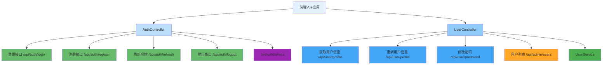

---
tags:
  - API控制器
  - RESTful接口
  - 用户认证
  - 登录注册
  - JWT令牌
created: 2025-11-19
modified: 2025-11-19
category: 开发教程
difficulty: intermediate
---

# 04-认证API控制器实现

> **学习目标**: 开发完整的RESTful认证API接口，实现前端与后端的数据交互

## 🎯 本章概览

**学习时间**: 45-60分钟 | **难度等级**: ⭐⭐⭐ | **重点程度**: 🔥🔥🔥🔥🔥

API控制器是前后端交互的桥梁，负责接收前端请求并返回响应。本章将教你实现完整的认证API接口，包括登录、注册、用户信息管理等功能。

---

## 📋 核心需求

### 🎯 业务目标
- 实现用户登录API
- 实现用户注册API
- 提供用户信息管理API
- 实现JWT令牌刷新API

### 🛠️ 技术需求
- RESTful API设计
- 数据验证和绑定
- 统一响应格式
- 异常处理机制

---

## 🏗️ API设计架构

### 🎯 接口设计图



---

## 💻 实战：数据传输对象

### 1️⃣ 请求DTO类

```java
package com.cmliy.springweb.dto;

import jakarta.validation.constraints.Email;
import jakarta.validation.constraints.NotBlank;
import jakarta.validation.constraints.Size;

/**
 * 🔐 登录请求DTO
 */
public class LoginRequest {

    @NotBlank(message = "用户名不能为空")
    private String username;

    @NotBlank(message = "密码不能为空")
    private String password;

    // Getter和Setter
    public String getUsername() { return username; }
    public void setUsername(String username) { this.username = username; }

    public String getPassword() { return password; }
    public void setPassword(String password) { this.password = password; }
}

/**
 * 👤 注册请求DTO
 */
public class RegisterRequest {

    @NotBlank(message = "用户名不能为空")
    @Size(min = 3, max = 50, message = "用户名长度必须在3-50之间")
    private String username;

    @NotBlank(message = "邮箱不能为空")
    @Email(message = "邮箱格式不正确")
    private String email;

    @NotBlank(message = "密码不能为空")
    @Size(min = 6, message = "密码长度不能少于6位")
    private String password;

    @Size(max = 100, message = "姓名长度不能超过100字符")
    private String fullName;

    @Size(max = 20, message = "手机号长度不能超过20字符")
    private String phone;

    // Getter和Setter
    public String getUsername() { return username; }
    public void setUsername(String username) { this.username = username; }

    public String getEmail() { return email; }
    public void setEmail(String email) { this.email = email; }

    public String getPassword() { return password; }
    public void setPassword(String password) { this.password = password; }

    public String getFullName() { return fullName; }
    public void setFullName(String fullName) { this.fullName = fullName; }

    public String getPhone() { return phone; }
    public void setPhone(String phone) { this.phone = phone; }
}

/**
 * 🔄 刷新令牌请求DTO
 */
public class RefreshTokenRequest {

    @NotBlank(message = "刷新令牌不能为空")
    private String refreshToken;

    // Getter和Setter
    public String getRefreshToken() { return refreshToken; }
    public void setRefreshToken(String refreshToken) { this.refreshToken = refreshToken; }
}

/**
 * 📝 用户更新请求DTO
 */
public class UserUpdateRequest {

    @Size(max = 100, message = "姓名长度不能超过100字符")
    private String fullName;

    @Size(max = 20, message = "手机号长度不能超过20字符")
    private String phone;

    @Size(max = 500, message = "头像URL长度不能超过500字符")
    private String avatarUrl;

    // Getter和Setter
    public String getFullName() { return fullName; }
    public void setFullName(String fullName) { this.fullName = fullName; }

    public String getPhone() { return phone; }
    public void setPhone(String phone) { this.phone = phone; }

    public String getAvatarUrl() { return avatarUrl; }
    public void setAvatarUrl(String avatarUrl) { this.avatarUrl = avatarUrl; }
}

/**
 * 🔐 密码修改请求DTO
 */
public class PasswordChangeRequest {

    @NotBlank(message = "原密码不能为空")
    private String oldPassword;

    @NotBlank(message = "新密码不能为空")
    @Size(min = 6, message = "新密码长度不能少于6位")
    private String newPassword;

    // Getter和Setter
    public String getOldPassword() { return oldPassword; }
    public void setOldPassword(String oldPassword) { this.oldPassword = oldPassword; }

    public String getNewPassword() { return newPassword; }
    public void setNewPassword(String newPassword) { this.newPassword = newPassword; }
}
```

### 2️⃣ 响应DTO类

```java
package com.cmliy.springweb.dto;

import java.time.LocalDateTime;

/**
 * 🔐 登录响应DTO
 */
public class LoginResponseDTO {

    private String token;
    private String tokenType;
    private Long expiresIn;
    private UserDTO user;
    private String timestamp;

    // 🏗️ 构造函数
    public LoginResponseDTO() {}

    public LoginResponseDTO(String token, String tokenType, Long expiresIn, UserDTO user, String timestamp) {
        this.token = token;
        this.tokenType = tokenType;
        this.expiresIn = expiresIn;
        this.user = user;
        this.timestamp = timestamp;
    }

    // Getter和Setter
    public String getToken() { return token; }
    public void setToken(String token) { this.token = token; }

    public String getTokenType() { return tokenType; }
    public void setTokenType(String tokenType) { this.tokenType = tokenType; }

    public Long getExpiresIn() { return expiresIn; }
    public void setExpiresIn(Long expiresIn) { this.expiresIn = expiresIn; }

    public UserDTO getUser() { return user; }
    public void setUser(UserDTO user) { this.user = user; }

    public String getTimestamp() { return timestamp; }
    public void setTimestamp(String timestamp) { this.timestamp = timestamp; }
}

/**
 * 👤 用户DTO
 */
public class UserDTO {

    private Long id;
    private String username;
    private String email;
    private String role;

    // 🏗️ 构造函数
    public UserDTO() {}

    public UserDTO(Long id, String username, String email, String role) {
        this.id = id;
        this.username = username;
        this.email = email;
        this.role = role;
    }

    // Getter和Setter
    public Long getId() { return id; }
    public void setId(Long id) { this.id = id; }

    public String getUsername() { return username; }
    public void setUsername(String username) { this.username = username; }

    public String getEmail() { return email; }
    public void setEmail(String email) { this.email = email; }

    public String getRole() { return role; }
    public void setRole(String role) { this.role = role; }
}

/**
 * 📝 注册响应DTO
 */
public class RegisterResponseDTO {

    private String timestamp;

    // 🏗️ 构造函数
    public RegisterResponseDTO() {}

    public RegisterResponseDTO(String timestamp) {
        this.timestamp = timestamp;
    }

    // Getter和Setter
    public String getTimestamp() { return timestamp; }
    public void setTimestamp(String timestamp) { this.timestamp = timestamp; }
}

/**
 * 💊 健康检查响应DTO
 */
public class HealthResponseDTO {

    private String status;
    private String timestamp;
    private String application;
    private String version;

    // 🏗️ 构造函数
    public HealthResponseDTO() {}

    public HealthResponseDTO(String status, String timestamp, String application, String version) {
        this.status = status;
        this.timestamp = timestamp;
        this.application = application;
        this.version = version;
    }

    // Getter和Setter
    public String getStatus() { return status; }
    public void setStatus(String status) { this.status = status; }

    public String getTimestamp() { return timestamp; }
    public void setTimestamp(String timestamp) { this.timestamp = timestamp; }

    public String getApplication() { return application; }
    public void setApplication(String application) { this.application = application; }

    public String getVersion() { return version; }
    public void setVersion(String version) { this.version = version; }
}
```

### 3️⃣ 统一响应格式

```java
package com.cmliy.springweb.common;

import java.time.LocalDateTime;

/**
 * 📦 统一API响应包装类
 *
 * 所有API响应都应使用此包装类，确保响应格式一致
 */
public class ApiResponse<T> {

    private int code;
    private T data;
    private String message;
    private String timestamp;

    // 🏗️ 构造函数
    public ApiResponse() {}

    public ApiResponse(int code, T data, String message) {
        this.code = code;
        this.data = data;
        this.message = message;
        this.timestamp = LocalDateTime.now().toString();
    }

    // 🎯 成功响应工厂方法
    public static <T> ApiResponse<T> success(T data, String message) {
        return new ApiResponse<>(200, data, message);
    }

    // ❌ 错误响应工厂方法
    public static <T> ApiResponse<T> error(String message, int code) {
        return new ApiResponse<>(code, null, message);
    }

    // Getter和Setter
    public int getCode() { return code; }
    public void setCode(int code) { this.code = code; }

    public T getData() { return data; }
    public void setData(T data) { this.data = data; }

    public String getMessage() { return message; }
    public void setMessage(String message) { this.message = message; }

    public String getTimestamp() { return timestamp; }
    public void setTimestamp(String timestamp) { this.timestamp = timestamp; }
}
```

> 💡 **重要说明**：当前系统使用`ApiResponse<T>`作为统一响应包装类，所有API响应都应通过`ApiResponse.success()`或`ApiResponse.error()`方法创建，而不是直接返回原始数据。前端通过`code`字段判断请求状态，通过`data`字段获取实际数据。
---

## 🛠️ API控制器实现

### 1️⃣ 认证控制器

```java
package com.cmliy.springweb.controller;

import com.cmliy.springweb.dto.AuthResponse;
import com.cmliy.springweb.dto.LoginRequest;
import com.cmliy.springweb.dto.RefreshTokenRequest;
import com.cmliy.springweb.dto.RegisterRequest;
import com.cmliy.springweb.exception.BusinessException;
import com.cmliy.springweb.model.User;
import com.cmliy.springweb.service.JwtAuthService;
import com.cmliy.springweb.service.UserService;
import com.cmliy.springweb.util.JwtUtil;
import jakarta.servlet.http.HttpServletRequest;
import jakarta.validation.Valid;
import org.springframework.beans.factory.annotation.Autowired;
import org.springframework.http.HttpStatus;
import org.springframework.http.ResponseEntity;
import org.springframework.web.bind.annotation.*;

import java.util.HashMap;
import java.util.Map;

/**
 * 🔐 认证控制器
 * 处理登录、注册、令牌刷新等认证相关请求
 */
@RestController
@RequestMapping("/api/auth")
@CrossOrigin(origins = "*", maxAge = 3600)
public class AuthController {

    @Autowired
    private JwtAuthService jwtAuthService;

    @Autowired
    private UserService userService;

    @Autowired
    private JwtUtil jwtUtil;

    /**
     * 🔐 用户登录
     * @param loginRequest 登录请求
     * @return 认证响应
     */
    @PostMapping("/login")
    public ResponseEntity<?> authenticateUser(@Valid @RequestBody LoginRequest loginRequest) {
        try {
            // 🔐 执行认证
            AuthResponse authResponse = jwtAuthService.authenticate(loginRequest);

            // 📤 返回成功响应
            return ResponseEntity.ok(createSuccessResponse("登录成功", authResponse));

        } catch (Exception e) {
            // ❌ 返回错误响应
            return ResponseEntity.badRequest()
                    .body(createErrorResponse("登录失败", e.getMessage()));
        }
    }

    /**
     * 👤 用户注册
     * @param registerRequest 注册请求
     * @return 认证响应
     */
    @PostMapping("/register")
    public ResponseEntity<?> registerUser(@Valid @RequestBody RegisterRequest registerRequest) {
        try {
            // 👤 执行注册
            User registeredUser = userService.registerUser(registerRequest);

            // 🔐 自动登录获取令牌
            LoginRequest loginRequest = new LoginRequest();
            loginRequest.setUsername(registeredUser.getUsername());
            loginRequest.setPassword(registerRequest.getPassword());

            AuthResponse authResponse = jwtAuthService.authenticate(loginRequest);

            // 📤 返回成功响应
            return ResponseEntity.status(HttpStatus.CREATED)
                    .body(createSuccessResponse("注册成功", authResponse));

        } catch (BusinessException e) {
            // ❌ 返回业务错误响应
            return ResponseEntity.badRequest()
                    .body(createErrorResponse("注册失败", e.getMessage()));
        } catch (Exception e) {
            // ❌ 返回系统错误响应
            return ResponseEntity.status(HttpStatus.INTERNAL_SERVER_ERROR)
                    .body(createErrorResponse("系统错误", "注册过程中发生错误"));
        }
    }

    /**
     * 🔄 刷新访问令牌
     * @param refreshTokenRequest 刷新令牌请求
     * @return 新的认证响应
     */
    @PostMapping("/refresh")
    public ResponseEntity<?> refreshToken(@Valid @RequestBody RefreshTokenRequest refreshTokenRequest) {
        try {
            // 🔄 刷新令牌
            AuthResponse authResponse = jwtAuthService.refreshToken(refreshTokenRequest);

            // 📤 返回成功响应
            return ResponseEntity.ok(createSuccessResponse("令牌刷新成功", authResponse));

        } catch (Exception e) {
            // ❌ 返回错误响应
            return ResponseEntity.status(HttpStatus.UNAUTHORIZED)
                    .body(createErrorResponse("令牌刷新失败", e.getMessage()));
        }
    }

    /**
     * 🚪 用户登出
     * @param request HTTP请求
     * @return 登出响应
     */
    @PostMapping("/logout")
    public ResponseEntity<?> logoutUser(HttpServletRequest request) {
        try {
            // 🔍 获取Authorization头
            String authorizationHeader = request.getHeader("Authorization");

            // 🚪 执行登出
            jwtAuthService.logout(authorizationHeader);

            // 📤 返回成功响应
            return ResponseEntity.ok(createSuccessResponse("登出成功", null));

        } catch (Exception e) {
            // ❌ 返回错误响应
            return ResponseEntity.badRequest()
                    .body(createErrorResponse("登出失败", e.getMessage()));
        }
    }

    /**
     * 🔍 验证令牌有效性
     * @param request HTTP请求
     * @return 验证结果
     */
    @GetMapping("/validate")
    public ResponseEntity<?> validateToken(HttpServletRequest request) {
        try {
            // 🔍 获取Authorization头
            String authorizationHeader = request.getHeader("Authorization");

            // ✅ 验证令牌
            boolean isValid = jwtAuthService.validateToken(authorizationHeader);

            Map<String, Object> result = new HashMap<>();
            result.put("valid", isValid);
            result.put("message", isValid ? "令牌有效" : "令牌无效");

            // 📤 返回验证结果
            return ResponseEntity.ok(createSuccessResponse("令牌验证完成", result));

        } catch (Exception e) {
            // ❌ 返回错误响应
            return ResponseEntity.status(HttpStatus.UNAUTHORIZED)
                    .body(createErrorResponse("令牌验证失败", e.getMessage()));
        }
    }

    /**
     * 🔍 检查用户名可用性
     * @param username 用户名
     * @return 检查结果
     */
    @GetMapping("/check-username")
    public ResponseEntity<?> checkUsernameAvailability(@RequestParam String username) {
        try {
            // 🔍 检查用户名
            boolean available = userService.isUsernameAvailable(username);

            Map<String, Object> result = new HashMap<>();
            result.put("username", username);
            result.put("available", available);
            result.put("message", available ? "用户名可用" : "用户名已被占用");

            // 📤 返回检查结果
            return ResponseEntity.ok(createSuccessResponse("用户名检查完成", result));

        } catch (Exception e) {
            // ❌ 返回错误响应
            return ResponseEntity.badRequest()
                    .body(createErrorResponse("用户名检查失败", e.getMessage()));
        }
    }

    /**
     * 🔍 检查邮箱可用性
     * @param email 邮箱
     * @return 检查结果
     */
    @GetMapping("/check-email")
    public ResponseEntity<?> checkEmailAvailability(@RequestParam String email) {
        try {
            // 🔍 检查邮箱
            boolean available = userService.isEmailAvailable(email);

            Map<String, Object> result = new HashMap<>();
            result.put("email", email);
            result.put("available", available);
            result.put("message", available ? "邮箱可用" : "邮箱已被注册");

            // 📤 返回检查结果
            return ResponseEntity.ok(createSuccessResponse("邮箱检查完成", result));

        } catch (Exception e) {
            // ❌ 返回错误响应
            return ResponseEntity.badRequest()
                    .body(createErrorResponse("邮箱检查失败", e.getMessage()));
        }
    }

    /**
     * 📝 创建成功响应
     */
    private Map<String, Object> createSuccessResponse(String message, Object data) {
        Map<String, Object> response = new HashMap<>();
        response.put("success", true);
        response.put("message", message);
        response.put("data", data);
        response.put("timestamp", System.currentTimeMillis());
        return response;
    }

    /**
     * ❌ 创建错误响应
     */
    private Map<String, Object> createErrorResponse(String message, String error) {
        Map<String, Object> response = new HashMap<>();
        response.put("success", false);
        response.put("message", message);
        response.put("error", error);
        response.put("timestamp", System.currentTimeMillis());
        return response;
    }
}
```

### 2️⃣ 用户控制器

```java
package com.cmliy.springweb.controller;

import com.cmliy.springweb.dto.PasswordChangeRequest;
import com.cmliy.springweb.dto.UserDTO;
import com.cmliy.springweb.dto.UserStatistics;
import com.cmliy.springweb.dto.UserUpdateRequest;
import com.cmliy.springweb.exception.BusinessException;
import com.cmliy.springweb.model.User;
import com.cmliy.springweb.service.UserService;
import jakarta.validation.Valid;
import org.springframework.beans.factory.annotation.Autowired;
import org.springframework.data.domain.Page;
import org.springframework.data.domain.PageRequest;
import org.springframework.data.domain.Pageable;
import org.springframework.http.HttpStatus;
import org.springframework.http.ResponseEntity;
import org.springframework.security.access.prepost.PreAuthorize;
import org.springframework.security.core.Authentication;
import org.springframework.security.core.context.SecurityContextHolder;
import org.springframework.web.bind.annotation.*;

import java.util.HashMap;
import java.util.List;
import java.util.Map;

/**
 * 👤 用户控制器
 * 处理用户信息管理相关请求
 */
@RestController
@RequestMapping("/api/user")
@CrossOrigin(origins = "*", maxAge = 3600)
public class UserController {

    @Autowired
    private UserService userService;

    /**
     * 👤 获取当前用户信息
     * @return 用户信息
     */
    @GetMapping("/profile")
    public ResponseEntity<?> getCurrentUserProfile() {
        try {
            // 🔍 获取当前认证用户
            Authentication authentication = SecurityContextHolder.getContext().getAuthentication();
            String username = authentication.getName();

            // 👤 查找用户信息
            User user = userService.findByUsername(username)
                    .orElseThrow(() -> new BusinessException("用户不存在"));

            // 📤 返回用户信息
            return ResponseEntity.ok(createSuccessResponse("获取用户信息成功", new UserDTO(user)));

        } catch (Exception e) {
            // ❌ 返回错误响应
            return ResponseEntity.badRequest()
                    .body(createErrorResponse("获取用户信息失败", e.getMessage()));
        }
    }

    /**
     * 📝 更新当前用户信息
     * @param updateRequest 更新请求
     * @return 更新后的用户信息
     */
    @PutMapping("/profile")
    public ResponseEntity<?> updateCurrentUserProfile(@Valid @RequestBody UserUpdateRequest updateRequest) {
        try {
            // 🔍 获取当前认证用户
            Authentication authentication = SecurityContextHolder.getContext().getAuthentication();
            String username = authentication.getName();

            // 👤 查找用户
            User user = userService.findByUsername(username)
                    .orElseThrow(() -> new BusinessException("用户不存在"));

            // 📝 更新用户信息
            User updatedUser = userService.updateUser(user.getId(), updateRequest);

            // 📤 返回更新后的用户信息
            return ResponseEntity.ok(createSuccessResponse("用户信息更新成功", new UserDTO(updatedUser)));

        } catch (BusinessException e) {
            // ❌ 返回业务错误响应
            return ResponseEntity.badRequest()
                    .body(createErrorResponse("用户信息更新失败", e.getMessage()));
        } catch (Exception e) {
            // ❌ 返回系统错误响应
            return ResponseEntity.status(HttpStatus.INTERNAL_SERVER_ERROR)
                    .body(createErrorResponse("系统错误", "更新用户信息时发生错误"));
        }
    }

    /**
     * 🔐 修改当前用户密码
     * @param passwordChangeRequest 密码修改请求
     * @return 修改结果
     */
    @PutMapping("/password")
    public ResponseEntity<?> changeCurrentUserPassword(@Valid @RequestBody PasswordChangeRequest passwordChangeRequest) {
        try {
            // 🔍 获取当前认证用户
            Authentication authentication = SecurityContextHolder.getContext().getAuthentication();
            String username = authentication.getName();

            // 👤 查找用户
            User user = userService.findByUsername(username)
                    .orElseThrow(() -> new BusinessException("用户不存在"));

            // 🔐 修改密码
            boolean success = userService.changePassword(
                    user.getId(),
                    passwordChangeRequest.getOldPassword(),
                    passwordChangeRequest.getNewPassword()
            );

            if (success) {
                // 📤 返回成功响应
                return ResponseEntity.ok(createSuccessResponse("密码修改成功", null));
            } else {
                // ❌ 返回失败响应
                return ResponseEntity.badRequest()
                        .body(createErrorResponse("密码修改失败", "请检查原密码是否正确"));
            }

        } catch (BusinessException e) {
            // ❌ 返回业务错误响应
            return ResponseEntity.badRequest()
                    .body(createErrorResponse("密码修改失败", e.getMessage()));
        } catch (Exception e) {
            // ❌ 返回系统错误响应
            return ResponseEntity.status(HttpStatus.INTERNAL_SERVER_ERROR)
                    .body(createErrorResponse("系统错误", "修改密码时发生错误"));
        }
    }

    /**
     * 👥 获取用户列表（管理员权限）
     * @param page 页码
     * @param size 每页大小
     * @return 用户分页列表
     */
    @GetMapping("/list")
    @PreAuthorize("hasRole('ADMIN')")
    public ResponseEntity<?> getUserList(
            @RequestParam(defaultValue = "0") int page,
            @RequestParam(defaultValue = "10") int size) {
        try {
            // 📊 分页查询用户列表
            Pageable pageable = PageRequest.of(page, size);
            Page<UserDTO> users = userService.getAllUsers(pageable);

            // 📤 返回用户列表
            return ResponseEntity.ok(createSuccessResponse("获取用户列表成功", users));

        } catch (Exception e) {
            // ❌ 返回错误响应
            return ResponseEntity.badRequest()
                    .body(createErrorResponse("获取用户列表失败", e.getMessage()));
        }
    }

    /**
     * 📊 获取用户统计信息（管理员权限）
     * @return 用户统计
     */
    @GetMapping("/statistics")
    @PreAuthorize("hasRole('ADMIN')")
    public ResponseEntity<?> getUserStatistics() {
        try {
            // 📊 获取用户统计
            UserStatistics statistics = userService.getUserStatistics();

            // 📤 返回统计信息
            return ResponseEntity.ok(createSuccessResponse("获取用户统计成功", statistics));

        } catch (Exception e) {
            // ❌ 返回错误响应
            return ResponseEntity.badRequest()
                    .body(createErrorResponse("获取用户统计失败", e.getMessage()));
        }
    }

    /**
     * 🔄 切换用户状态（管理员权限）
     * @param userId 用户ID
     * @param enabled 是否启用
     * @return 操作结果
     */
    @PutMapping("/{userId}/status")
    @PreAuthorize("hasRole('ADMIN')")
    public ResponseEntity<?> toggleUserStatus(
            @PathVariable Long userId,
            @RequestParam Boolean enabled) {
        try {
            // 🔄 切换用户状态
            boolean success = userService.toggleUserStatus(userId, enabled);

            if (success) {
                // 📤 返回成功响应
                String message = enabled ? "用户启用成功" : "用户禁用成功";
                return ResponseEntity.ok(createSuccessResponse(message, null));
            } else {
                // ❌ 返回失败响应
                return ResponseEntity.badRequest()
                        .body(createErrorResponse("用户状态切换失败", "操作未成功"));
            }

        } catch (BusinessException e) {
            // ❌ 返回业务错误响应
            return ResponseEntity.badRequest()
                    .body(createErrorResponse("用户状态切换失败", e.getMessage()));
        } catch (Exception e) {
            // ❌ 返回系统错误响应
            return ResponseEntity.status(HttpStatus.INTERNAL_SERVER_ERROR)
                    .body(createErrorResponse("系统错误", "切换用户状态时发生错误"));
        }
    }

    /**
     * 🔍 根据角色获取用户（管理员权限）
     * @param role 用户角色
     * @return 用户列表
     */
    @GetMapping("/by-role")
    @PreAuthorize("hasRole('ADMIN')")
    public ResponseEntity<?> getUsersByRole(@RequestParam String role) {
        try {
            // 🔍 根据角色获取用户
            List<UserDTO> users = userService.getUsersByRole(role);

            // 📤 返回用户列表
            return ResponseEntity.ok(createSuccessResponse("获取角色用户成功", users));

        } catch (Exception e) {
            // ❌ 返回错误响应
            return ResponseEntity.badRequest()
                    .body(createErrorResponse("获取角色用户失败", e.getMessage()));
        }
    }

    /**
     * 📝 创建成功响应
     */
    private Map<String, Object> createSuccessResponse(String message, Object data) {
        Map<String, Object> response = new HashMap<>();
        response.put("success", true);
        response.put("message", message);
        response.put("data", data);
        response.put("timestamp", System.currentTimeMillis());
        return response;
    }

    /**
     * ❌ 创建错误响应
     */
    private Map<String, Object> createErrorResponse(String message, String error) {
        Map<String, Object> response = new HashMap<>();
        response.put("success", false);
        response.put("message", message);
        response.put("error", error);
        response.put("timestamp", System.currentTimeMillis());
        return response;
    }
}
```

---

## 🧪 API接口测试

### 1️⃣ 认证接口测试

```java
package com.cmliy.springweb.controller;

import com.cmliy.springweb.dto.LoginRequest;
import com.cmliy.springweb.dto.RegisterRequest;
import com.fasterxml.jackson.databind.ObjectMapper;
import org.junit.jupiter.api.Test;
import org.springframework.beans.factory.annotation.Autowired;
import org.springframework.boot.test.autoconfigure.web.servlet.AutoConfigureWebMvc;
import org.springframework.boot.test.context.SpringBootTest;
import org.springframework.http.MediaType;
import org.springframework.test.context.ActiveProfiles;
import org.springframework.test.web.servlet.MockMvc;
import org.springframework.test.web.servlet.setup.MockMvcBuilders;
import org.springframework.web.context.WebApplicationContext;

import static org.springframework.test.web.servlet.request.MockMvcRequestBuilders.*;
import static org.springframework.test.web.servlet.result.MockMvcResultMatchers.*;

@SpringBootTest
@AutoConfigureWebMvc
@ActiveProfiles("test")
public class AuthControllerTest {

    @Autowired
    private WebApplicationContext webApplicationContext;

    @Autowired
    private ObjectMapper objectMapper;

    private MockMvc mockMvc;

    @BeforeEach
    public void setUp() {
        mockMvc = MockMvcBuilders.webAppContextSetup(webApplicationContext).build();
    }

    @Test
    public void testRegisterSuccess() throws Exception {
        // 📝 创建注册请求
        RegisterRequest registerRequest = new RegisterRequest();
        registerRequest.setUsername("newuser");
        registerRequest.setEmail("newuser@example.com");
        registerRequest.setPassword("password123");
        registerRequest.setFullName("新用户");

        // 📤 发送注册请求
        mockMvc.perform(post("/api/auth/register")
                .contentType(MediaType.APPLICATION_JSON)
                .content(objectMapper.writeValueAsString(registerRequest)))
                .andExpect(status().isCreated())
                .andExpect(jsonPath("$.success").value(true))
                .andExpect(jsonPath("$.message").value("注册成功"))
                .andExpect(jsonPath("$.data.user.username").value("newuser"))
                .andExpect(jsonPath("$.data.accessToken").exists());

        System.out.println("✅ 用户注册接口测试通过");
    }

    @Test
    public void testLoginSuccess() throws Exception {
        // 📝 创建登录请求
        LoginRequest loginRequest = new LoginRequest();
        loginRequest.setUsername("admin");
        loginRequest.setPassword("123456");

        // 📤 发送登录请求
        mockMvc.perform(post("/api/auth/login")
                .contentType(MediaType.APPLICATION_JSON)
                .content(objectMapper.writeValueAsString(loginRequest)))
                .andExpect(status().isOk())
                .andExpect(jsonPath("$.success").value(true))
                .andExpect(jsonPath("$.message").value("登录成功"))
                .andExpect(jsonPath("$.data.accessToken").exists())
                .andExpect(jsonPath("$.data.user.username").value("admin"));

        System.out.println("✅ 用户登录接口测试通过");
    }

    @Test
    public void testLoginWithInvalidCredentials() throws Exception {
        // 📝 创建错误的登录请求
        LoginRequest loginRequest = new LoginRequest();
        loginRequest.setUsername("admin");
        loginRequest.setPassword("wrongpassword");

        // 📤 发送登录请求
        mockMvc.perform(post("/api/auth/login")
                .contentType(MediaType.APPLICATION_JSON)
                .content(objectMapper.writeValueAsString(loginRequest)))
                .andExpect(status().isBadRequest())
                .andExpect(jsonPath("$.success").value(false))
                .andExpect(jsonPath("$.message").value("登录失败"));

        System.out.println("✅ 登录失败接口测试通过");
    }

    @Test
    public void testCheckUsernameAvailability() throws Exception {
        // 📤 检查可用用户名
        mockMvc.perform(get("/api/auth/check-username")
                .param("username", "newusername123"))
                .andExpect(status().isOk())
                .andExpect(jsonPath("$.success").value(true))
                .andExpect(jsonPath("$.data.available").value(true));

        // 📤 检查已占用用户名
        mockMvc.perform(get("/api/auth/check-username")
                .param("username", "admin"))
                .andExpected(status().isOk())
                .andExpect(jsonPath("$.success").value(true))
                .andExpect(jsonPath("$.data.available").value(false));

        System.out.println("✅ 用户名可用性检查接口测试通过");
    }
}
```

---

## 🚀 常见问题与解决方案

### ❓ 问题1: 跨域请求被阻止

**错误**: `Access to XMLHttpRequest blocked by CORS policy`

**解决方案**:
```java
// ✅ 在Controller类上添加跨域配置
@CrossOrigin(origins = {"http://localhost:5173", "http://localhost:3000"}, maxAge = 3600)
@RestController
public class AuthController {
    // ...
}

// 🌐 或者在全局配置中处理
@Configuration
public class WebConfig implements WebMvcConfigurer {
    @Override
    public void addCorsMappings(CorsRegistry registry) {
        registry.addMapping("/api/**")
                .allowedOrigins("http://localhost:5173")
                .allowedMethods("*")
                .allowedHeaders("*");
    }
}
```

### ❓ 问题2: 数据验证失败

**错误**: `MethodArgumentNotValidException`

**解决方案**:
```java
// ✅ 添加全局异常处理器
@RestControllerAdvice
public class GlobalExceptionHandler {

    @ExceptionHandler(MethodArgumentNotValidException.class)
    public ResponseEntity<?> handleValidationExceptions(MethodArgumentNotValidException ex) {
        Map<String, String> errors = new HashMap<>();
        ex.getBindingResult().getFieldErrors().forEach(error ->
            errors.put(error.getField(), error.getDefaultMessage())
        );

        return ResponseEntity.badRequest()
                .body(Map.of(
                    "success", false,
                    "message", "数据验证失败",
                    "errors", errors
                ));
    }
}
```

### ❓ 问题3: JSON序列化问题

**错误**: 循环引用导致序列化失败

**解决方案**:
```java
// ✅ 在DTO中使用@JsonInclude排除null值
@JsonInclude(JsonInclude.Include.NON_NULL)
public class UserDTO {
    // ...
}

// 🔍 在实体中使用@JsonIgnore避免循环引用
@JsonIgnore
@OneToMany(mappedBy = "user")
private List<Order> orders;
```

---

## 📊 API设计最佳实践

### ✅ 推荐做法

1. **🎯 RESTful设计** - 遵循REST API设计原则
2. **📝 数据验证** - 使用Bean Validation进行参数验证
3. **📤 统一响应格式** - 提供一致的API响应结构
4. **🛡️ 权限控制** - 使用注解进行方法级权限控制
5. **🚨 异常处理** - 提供清晰的错误信息

### ❌ 避免做法

1. **🚫 硬编码响应** - 使用统一的响应构建方法
2. **🚫 忽略数据验证** - 验证所有输入参数
3. **🚫 过度暴露信息** - 只返回必要的用户信息
4. **🚫 缺少权限检查** - 保护敏感接口

---

## 📝 本章小结

### ✅ 已掌握技能

- [ ] **实现** 认证API接口
- [ ] **开发** 用户管理API
- [ ] **处理** 数据验证和绑定
- [ ] **创建** 统一响应格式
- [ ] **测试** API接口功能

### 🎯 关键要点

1. **RESTful API** - 遵循REST设计原则
2. **数据传输对象** - 使用DTO进行数据交互
3. **统一响应** - 提供一致的API响应结构
4. **权限控制** - 保护敏感API接口

### 🚀 下一步学习

现在你已经掌握了认证API控制器，接下来可以学习：
- → **05-异常处理和安全增强** - 完善系统安全性
- → **06-功能测试和验证** - 验证认证系统
- → **功能二开发** - 开始商品管理系统开发

---

**记住：API是前后端交互的桥梁，良好的API设计是系统成功的关键！** 🎉

---