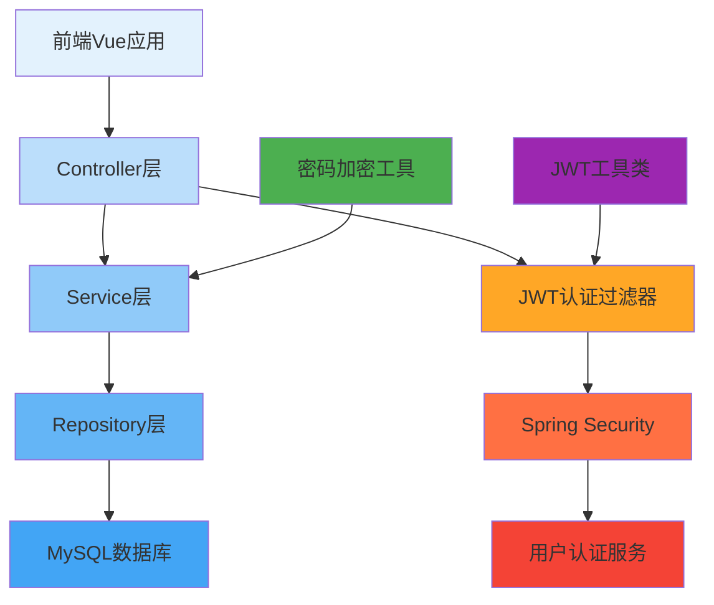

# 用户认证系统 - 学习指南

> **学习目标**：通过实际开发，掌握Vue 3 + Spring Boot用户认证功能

## 📊 学习概览

### 🎯 **学习成果**
完成本系统学习后，您将掌握：
- ✅ Vue 3 Composition API核心技能
- ✅ Pinia状态管理最佳实践
- ✅ Vue Router路由权限控制
- ✅ Element Plus UI组件使用
- ✅ Axios HTTP请求封装
- ✅ 现代前端工程化开发

### ⏱️ **学习时间规划**
| 章节 | 内容 | 预计时间 | 状态 |
|------|------|----------|------|
| 01 | 项目环境准备 | 30分钟 | ⏳ |
| 02 | Vue核心概念学习 | 40分钟 | ⏳ |
| 03 | 用户状态管理 | 40分钟 | ⏳ |
| 04 | 路由配置与守卫 | 30分钟 | ⏳ |
| 05 | API服务封装 | 30分钟 | ⏳ |
| 06 | 登录页面开发 | 60分钟 | ⏳ |
| 07 | 注册页面开发 | 60分钟 | ⏳ |
| 08 | 仪表板页面开发 | 45分钟 | ⏳ |
| 09 | 功能测试与验证 | 30分钟 | ⏳ |
| 10 | 学习总结与展望 | 20分钟 | ⏳ |

**总计学习时间：约6小时**

---

## 🗺️ 学习路径

### 📍 **第1章：项目环境准备**
**文档**: [01-项目环境准备.md](01-项目环境准备.md)

**学习内容**:
- Vue 3项目创建和依赖安装
- Element Plus UI组件库配置
- 项目结构理解和开发工具准备

**完成标准**:
- [ ] Vue项目能够正常启动 `npm run dev`
- [ ] Element Plus组件正常显示
- [ ] 项目结构清晰理解

---

### 📍 **第2章：Vue核心概念学习**
**文档**: [02-Vue核心概念学习.md](02-Vue核心概念学习.md)

**学习内容**:
- ref响应式数据
- reactive响应式对象
- computed计算属性
- 组件生命周期钩子

**完成标准**:
- [ ] 理解Vue 3响应式原理
- [ ] 掌握ref和reactive的使用
- [ ] 能够使用computed优化性能

---

### 📍 **第3章：用户状态管理**
**文档**: [03-用户状态管理.md](03-用户状态管理.md)

**学习内容**:
- Pinia状态管理基础
- 创建用户认证Store
- 状态持久化策略
- 组件间状态共享

**完成标准**:
- [ ] 创建完整的auth Store
- [ ] 实现状态持久化
- [ ] 在多个组件中共享状态

---

### 📍 **第4章：路由配置与守卫**
**文档**: [04-路由配置与守卫.md](04-路由配置与守卫.md)

**学习内容**:
- Vue Router基础配置
- 路由元信息设置
- 全局路由守卫实现
- 权限控制逻辑

**完成标准**:
- [ ] 配置完整的路由系统
- [ ] 实现页面访问权限控制
- [ ] 处理登录状态跳转

---

### 📍 **第5章：API服务封装**
**文档**: [05-API服务封装.md](05-API服务封装.md)

**学习内容**:
- Axios基础配置
- 请求拦截器实现
- 响应拦截器处理
- 模拟API开发

**完成标准**:
- [ ] 创建axios实例配置
- [ ] 实现请求响应拦截
- [ ] 开发模拟认证API

---

### 📍 **第6章：登录页面开发**
**文档**: [06-登录页面开发.md](06-登录页面开发.md)

**学习内容**:
- 登录页面UI设计
- 表单验证规则
- 登录逻辑实现
- 用户体验优化

**完成标准**:
- [ ] 创建美观的登录界面
- [ ] 实现完整的表单验证
- [ ] 完成登录功能逻辑

---

### 📍 **第7章：注册页面开发**
**文档**: [07-注册页面开发.md](07-注册页面开发.md)

**学习内容**:
- 注册页面UI设计
- 复杂表单验证
- 密码确认逻辑
- 注册流程实现

**完成标准**:
- [ ] 创建用户注册界面
- [ ] 实现密码确认验证
- [ ] 完成注册功能逻辑

---

### 📍 **第8章：仪表板页面开发**
**文档**: [08-仪表板页面开发.md](08-仪表板页面开发.md)

**学习内容**:
- 仪表板布局设计
- 用户信息展示
- 快速操作菜单
- 退出登录功能

**完成标准**:
- [ ] 创建仪表板主页面
- [ ] 展示用户相关信息
- [ ] 实现退出登录功能

---

### 📍 **第9章：功能测试与验证**
**文档**: [09-功能测试与验证.md](09-功能测试与验证.md)

**学习内容**:
- 功能完整性测试
- 权限控制验证
- 用户体验检查
- 常见问题排查

**完成标准**:
- [ ] 通过所有功能测试
- [ ] 验证权限控制正确
- [ ] 确保用户体验良好

---

### 📍 **第10章：学习总结与展望**
**文档**: [10-学习总结与展望.md](10-学习总结与展望.md)

**学习内容**:
- 学习成果总结
- 技能掌握评估
- 后续发展规划
- 学习资源推荐

**完成标准**:
- [ ] 总结学习收获
- [ ] 评估技能掌握
- [ ] 制定后续计划

---

## 🛠️ 技术栈

### 🎨 **前端技术栈**
```
Vue 3.4+          - 渐进式JavaScript框架
Vue Router 4+      - 官方路由管理器
Pinia 2+           - 状态管理库
Element Plus 2+    - Vue 3 UI组件库
Axios 1+           - HTTP请求库
Vite 5+            - 构建工具
```

### 🚀 **开发工具**
```
VS Code            - 前端开发IDE
Node.js 16+        - JavaScript运行环境
npm 8+             - 包管理器
Chrome DevTools    - 浏览器开发工具
```

---

## 🎯 学习方法

### 🔄 **学→练→会 循环学习法**

#### 📖 **学一点**
- 精读每个章节的理论部分
- 理解概念和原理
- 记录关键知识点

#### 💻 **练一点**
- 按照教程编写代码
- 动手实践每个功能
- 遇到问题及时调试

#### ✅ **会一点**
- 测试验证功能正确性
- 举一反三扩展功能
- 总结经验和心得

### 📋 **学习建议**

#### ✅ **推荐做法**
- **循序渐进** - 严格按照章节顺序学习
- **边学边做** - 理论学习立即动手实践
- **记录笔记** - 整理重要知识点和问题
- **及时测试** - 每完成一个功能都要验证

#### ❌ **避免误区**
- **不要跳跃** - 不要跳过基础章节
- **不要复制** - 不要直接复制粘贴代码
- **不要放弃** - 遇到困难不要轻易放弃
- **不要孤立** - 遇到问题及时寻求帮助

---

## 🆘 学习支持

### 🤖 **AI辅助学习**
- **实时指导** - 根据学习进度提供个性化指导
- **问题解答** - 遇到问题随时向AI提问
- **进度跟踪** - 帮助跟踪学习进度和效果
- **资源推荐** - 推荐相关学习资源和练习

### 📚 **补充资源**
- **Vue 3官方文档** - 权威技术参考
- **Element Plus组件库** - UI组件使用指南
- **Pinia状态管理** - 状态管理最佳实践

---

## 🎉 完成标准

### ✅ **功能完成标准**
完成所有学习后，您应该能够：

#### 🎯 **理论掌握**
- [ ] 解释Vue 3 Composition API的工作原理
- [ ] 说明Pinia状态管理的优势
- [ ] 理解路由守卫的作用机制
- [ ] 掌握HTTP请求封装的方法

#### 💻 **实践能力**
- [ ] 独立创建Vue 3项目
- [ ] 开发响应式用户界面
- [ ] 实现用户认证功能
- [ ] 配置权限控制系统

#### 🚀 **综合应用**
- [ ] 设计合理的系统架构
- [ ] 解决常见技术问题
- [ ] 优化系统性能和体验
- [ ] 具备独立开发能力

---

## 🚀 开始学习

**准备好开始您的全栈开发之旅了吗？**

从 **[第1章：项目环境准备](01-项目环境准备.md)** 开始，按照学习路径逐步前进。

> **边学边练，循序渐进，真正掌握每个技术点！**

---

## 🖥️ 后端开发教程

完成前端学习后，继续学习Spring Boot后端开发，实现全栈用户认证系统：

> **学习目标**: 掌握Spring Boot后端用户认证系统的完整实现，包括Spring Security配置、JWT认证、用户管理等功能

### 📋 **后端学习路径**
| 章节 | 内容 | 预计时间 | 难度 | 状态 |
|------|------|----------|------|------|
| 11 | 项目文件结构说明 | 15分钟 | ⭐ | ⏳ |
| 12 | Spring Security基础配置 | 45分钟 | ⭐⭐⭐ | ⏳ |
| 13 | JWT认证机制实现 | 60分钟 | ⭐⭐⭐⭐ | ⏳ |
| 14 | 用户管理服务开发 | 60分钟 | ⭐⭐⭐ | ⏳ |
| 15 | 认证API控制器实现 | 60分钟 | ⭐⭐⭐ | ⏳ |

**后端总计学习时间：约4小时**

### 🎯 **后端功能需求**

#### 业务需求
- 用户注册和登录功能
- JWT令牌认证机制
- 用户信息管理
- 权限控制和安全防护
- 密码加密和验证

#### 技术需求
- Spring Security安全框架
- JWT令牌认证
- MySQL数据库集成
- RESTful API设计
- 密码加密存储

### 🏗️ **后端架构设计**

#### 系统架构图



#### 项目结构

```
src/main/java/com/cmliy/springweb/
├── config/                    # 配置类
│   ├── SecurityConfig.java    # Spring Security配置
│   ├── JwtConfig.java         # JWT配置
│   └── DatabaseConfig.java    # 数据库配置
├── controller/                # 控制器层
│   ├── AuthController.java    # 认证控制器
│   └── UserController.java    # 用户控制器
├── service/                   # 服务层
│   ├── AuthService.java       # 认证服务
│   ├── UserService.java       # 用户服务
│   └── JwtAuthService.java    # JWT认证服务
├── repository/                # 数据访问层
│   ├── UserRepository.java    # 用户仓库
│   └── RoleRepository.java    # 角色仓库
├── model/                     # 实体模型
│   ├── User.java             # 用户实体
│   └── Role.java             # 角色实体
├── dto/                       # 数据传输对象
│   ├── LoginRequest.java     # 登录请求
│   ├── RegisterRequest.java  # 注册请求
│   └── AuthResponse.java     # 认证响应
├── security/                  # 安全相关
│   ├── JwtAuthenticationFilter.java  # JWT认证过滤器
│   └── CustomUserDetailsService.java # 自定义用户详情服务
├── exception/                 # 异常处理
│   ├── GlobalExceptionHandler.java   # 全局异常处理器
│   └── BusinessException.java          # 业务异常
└── util/                      # 工具类
    ├── JwtUtil.java          # JWT工具类
    └── PasswordUtil.java     # 密码工具类
```

### 🚀 **后端学习入口**

#### 📁 第11章：项目文件结构说明
**文档**: [11-项目文件结构说明.md](11-项目文件结构说明.md)
- **学习时间**: 15分钟 | **难度**: ⭐
- **学习内容**:
  - Spring Boot项目目录结构
  - 各层代码组织方式
  - 配置文件位置说明
  - 测试文件结构

#### 🛡️ 第12章：Spring Security基础配置
**文档**: [12-Spring Security基础配置.md](12-Spring Security基础配置.md)
- **学习时间**: 45分钟 | **难度**: ⭐⭐⭐
- **学习内容**:
  - Spring Security安全框架配置
  - 密码编码器配置
  - 自定义用户详情服务
  - HTTP安全策略设置

#### 🔑 第13章：JWT认证机制实现
**文档**: [13-JWT认证机制实现.md](13-JWT认证机制实现.md)
- **学习时间**: 60分钟 | **难度**: ⭐⭐⭐⭐
- **学习内容**:
  - JWT令牌生成和解析
  - JWT认证过滤器开发
  - 令牌刷新机制
  - 无状态认证实现

#### 👤 第14章：用户管理服务开发
**文档**: [14-用户管理服务开发.md](14-用户管理服务开发.md)
- **学习时间**: 60分钟 | **难度**: ⭐⭐⭐
- **学习内容**:
  - 用户实体模型设计
  - Repository数据访问层
  - 业务服务层实现
  - 数据验证和事务管理

#### 🌐 第15章：认证API控制器实现
**文档**: [15-认证API控制器实现.md](15-认证API控制器实现.md)
- **学习时间**: 60分钟 | **难度**: ⭐⭐⭐
- **学习内容**:
  - RESTful API接口设计
  - 数据传输对象(DTO)
  - 统一响应格式
  - 异常处理机制

### 🗄️ **数据库准备**

#### 数据库配置
```yaml
spring:
  datasource:
    url: jdbc:mysql://localhost:3306/clothes_db?useSSL=false&serverTimezone=UTC&allowPublicKeyRetrieval=true
    username: root
    password: 123456
    driver-class-name: com.mysql.cj.jdbc.Driver

  jpa:
    hibernate:
      ddl-auto: update
    show-sql: true
    properties:
      hibernate:
        dialect: org.hibernate.dialect.MySQL8Dialect
        format_sql: true

  jwt:
    secret: mySecretKey123456789012345678901234567890
    expiration: 86400000  # 24小时（毫秒）
```

#### 数据库表结构
系统将自动创建：
- `users` - 用户表
- `roles` - 角色表（预留）
- `user_roles` - 用户角色关联表（预留）

### 🛠️ **开发环境要求**

- **JDK**: 17+
- **Spring Boot**: 3.x
- **MySQL**: 8.0+
- **Maven**: 3.6+
- **IDE**: IntelliJ IDEA 或 Eclipse

### 🎯 **前后端整合成果**

完成前后端学习后，你将拥有：
- 🎨 完整的Vue 3前端界面
- 🛡️ 企业级Spring Boot后端API
- 🔐 JWT无状态认证系统
- 🌐 RESTful API接口
- 📊 全栈用户认证功能
- 🔧 统一的异常处理机制
- 📊 完整的测试覆盖

### 🎓 **技能掌握度**

| 技能点 | 前端掌握度 | 后端掌握度 | 应用场景 |
|--------|------------|------------|----------|
| Vue 3 + Composition API | ⭐⭐⭐⭐⭐ | - | 现代前端开发 |
| Spring Security | - | ⭐⭐⭐⭐⭐ | 企业级安全框架 |
| JWT认证 | ⭐⭐⭐ | ⭐⭐⭐⭐⭐ | 无状态认证 |
| RESTful API | ⭐⭐⭐ | ⭐⭐⭐⭐ | 前后端分离 |
| 状态管理 | ⭐⭐⭐⭐ | - | 复杂应用状态 |
| 数据库集成 | - | ⭐⭐⭐⭐ | 数据持久化 |

---

如果在学习过程中遇到任何问题，随时向AI提问，获得即时帮助和指导。

**祝您学习愉快！** 🎯✨