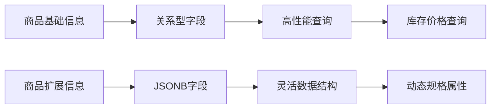

---
tags:
  - 商品实体
  - JSONB
  - PostgreSQL
  - 数据建模
  - 实体设计
created: 2025-12-01
modified: 2025-12-01
category: 开发教程
difficulty: intermediate
---

# 01-商品实体设计

> **学习目标**：掌握企业级商品实体的设计哲学，理解PostgreSQL JSONB在动态数据存储中的应用

## 🎯 本章概览

**学习时间**：45分钟 | **难度等级**：⭐⭐⭐ | **重点程度**：🔥🔥🔥🔥

商品实体是整个商品管理系统的核心，它的设计质量直接决定了系统的扩展性和维护性。本章将深入探讨如何设计一个既符合业务需求又具备技术前瞻性的商品实体。

---

## 📋 核心需求分析

### 🏪 业务场景理解

在电商平台中，商品信息具有以下特点：

1. **属性多样化**：不同类别的商品有不同的属性（服装有尺码、颜色，电子产品有配置参数）
2. **数据动态化**：商品属性可能随业务需求变化而增减
3. **结构复杂化**：规格、图片、描述等多种数据类型混合
4. **查询多样化**：需要支持各种复杂的搜索和筛选条件

### 🛠️ 技术挑战

传统关系型数据库设计面临以下挑战：

| 挑战 | 传统方案 | 问题 |
|------|----------|------|
| 动态属性 | 增加字段 | 表结构频繁变更，维护困难 |
| 规格管理 | 关联表设计 | 查询复杂，性能下降 |
| 图片存储 | 单独表管理 | 数据分散，一致性难保证 |
| 扩展性 | 预留字段 | 空间浪费，不够灵活 |

---

## 🏗️ PostgreSQL JSONB解决方案

### 💡 JSONB vs传统关系型存储

PostgreSQL提供的JSONB类型为我们提供了完美的解决方案：



### 🎯 混合存储策略

我们的设计理念是：**基础信息用关系型，扩展信息用JSONB**

```
┌─ 关系型字段（固定、查询频繁）─┐    ┌─ JSONB字段（动态、结构复杂）─┐
│ id: Long                      │    │ specifications: Map          │
│ productName: String           │    │ image_data: Map              │
│ price: BigDecimal            │    │ category: String             │
│ stockQuantity: Integer       │    │ attributes: Map              │
│ isAvailable: Boolean         │    │ metadata: Map                │
│ creator: User                │    │                              │
│ createdAt: LocalDateTime     │    │                              │
└──────────────────────────────┘    └──────────────────────────────┘
```

---

## 💻 实战：商品实体设计

### 1️⃣ 基础结构设计

让我们从商品的基础信息开始：

```java
package com.cmliy.springweb.model;

import jakarta.persistence.*;
import lombok.Data;
import lombok.EqualsAndHashCode;
import org.hibernate.annotations.*;

import java.math.BigDecimal;
import java.time.LocalDateTime;
import java.util.Map;
import java.util.HashMap;

/**
 * 📦 商品实体
 *
 * 核心商品信息存储，采用混合存储策略：
 * - 基础信息：关系型字段（固定结构，频繁查询）
 * - 扩展信息：JSONB字段（动态结构，灵活扩展）
 */
@Slf4j
@Data
@EqualsAndHashCode(callSuper = false)
@Entity
@Table(name = "products")
public class Product {

    /**
     * 🆔 商品唯一标识符
     *
     * 主键自增，确保每个商品都有唯一标识
     * 使用Long类型，支持大数据量
     */
    @Id
    @GeneratedValue(strategy = GenerationType.IDENTITY)
    private Long id;

    /**
     * 📝 商品名称
     *
     * 商品的显示名称，必须唯一且不为空
     * 长度限制50字符，适合大多数商品名称
     * 添加唯一索引，防止重复商品
     */
    @Column(name = "product_name", unique = true, nullable = false, length = 50)
    private String productName;

    /**
     * 📄 商品详细描述
     *
     * 商品的详细说明，支持富文本
     * 使用TEXT类型，可存储大段内容
     */
    @Column(name = "description", columnDefinition = "TEXT")
    private String description;

    /**
     * 💰 商品价格
     *
     * 商品的销售价格，必须不为空
     * 使用BigDecimal保证精度，避免浮点数误差
     * precision=10, scale=2：最大99999999.99
     */
    @Column(name = "price", nullable = false, precision = 10, scale = 2)
    private BigDecimal price;

    /**
     * 📊 销售数量
     *
     * 商品的总销售数量，默认为0
     * 用于统计分析和热门商品排序
     */
    @Column(name = "sales_count", nullable = false)
    private Integer salesCount = 0;

    /**
     * 🏷️ 折扣百分比
     *
     * 商品的折扣百分比，默认为0（无折扣）
     * precision=5, scale=2：最大999.99%
     */
    @Column(name = "discount", precision = 5, scale = 2)
    private BigDecimal discount = BigDecimal.ZERO;

    /**
     * 📦 库存数量
     *
     * 商品的库存数量，默认为0
     * 用于库存管理和购买可用性检查
     */
    @Column(name = "stock_quantity", nullable = false)
    private Integer stockQuantity = 0;

    /**
     * ✅ 商品上架状态
     *
     * true：上架可购买，false：下架不可购买
     * 默认false，新创建商品需要手动上架
     */
    @Column(name = "is_available", nullable = false)
    private Boolean isAvailable = false;
}
```

### 2️⃣ JSONB字段设计

现在让我们设计最重要的JSONB字段：

```java
public class Product {
    // ... 基础字段 ...

    /**
     * 🗄️ 商品扩展数据 - JSONB字段
     *
     * 这是商品实体的核心创新点！使用PostgreSQL原生JSONB类型：
     *
     * 存储内容：
     * - specifications: 商品规格（颜色、尺码、材质等）
     * - image_data: 图片信息（主图、缩略图、总数等）
     * - category: 商品分类
     * - attributes: 其他属性（重量、产地、保修期等）
     * - metadata: 元数据（SEO信息、标签等）
     *
     * 技术优势：
     * - ✅ 动态结构：无需修改表结构即可添加新属性
     * - ✅ 灵活查询：支持JSONB原生查询语法
     * - ✅ 类型安全：Hibernate自动类型转换
     * - ✅ 性能优秀：PostgreSQL JSONB索引支持
     */
    @JdbcTypeCode(SqlTypes.JSON)  // 🔧 关键：指定JSON类型处理
    @Column(name = "product_data", columnDefinition = "jsonb")
    private Map<String, Object> productData = new HashMap<>();

    /**
     * ⏰ 创建时间戳
     *
     * 记录商品创建时间，由数据库自动管理
     * @CreationTimestamp 自动设置创建时间
     */
    @CreationTimestamp
    @Column(name = "created_at", updatable = false, nullable = false)
    private LocalDateTime createdAt;

    /**
     * 🔄 更新时间戳
     *
     * 记录商品最后更新时间，由数据库自动管理
     * @UpdateTimestamp 自动更新修改时间
     */
    @UpdateTimestamp
    @Column(name = "updated_at", nullable = false)
    private LocalDateTime updatedAt;

    /**
     * 👤 商品创建者
     *
     * 创建该商品的用户，必须指定
     * 使用LAZY加载避免N+1查询问题
     */
    @ManyToOne(fetch = FetchType.LAZY)
    @JoinColumn(name = "creator_id", nullable = false)
    private User creator;
}
```

### 3️⃣ 业务逻辑方法设计

为实体添加实用的业务逻辑方法：

```java
public class Product {
    // ... 字段定义 ...

    /**
     * 📈 增加库存
     *
     * 安全地增加商品库存数量
     * 参数验证：确保数量有效
     */
    public void increaseStock(Integer quantity) {
        if (quantity != null && quantity > 0) {
            this.stockQuantity += quantity;
        }
    }

    /**
     * 📉 减少库存并增加销量
     *
     * 原子操作：减少库存同时增加销量
     * 返回：操作是否成功（库存不足时返回false）
     */
    public boolean decreaseStock(Integer quantity) {
        if (quantity != null && quantity > 0 && this.stockQuantity >= quantity) {
            this.stockQuantity -= quantity;
            this.salesCount += quantity;  // 同步增加销量
            return true;
        }
        return false;
    }

    /**
     * 🛒 检查商品是否可购买
     *
     * 综合判断：上架状态 + 库存充足
     * 用于购买前的可用性检查
     */
    public boolean isPurchasable() {
        return this.isAvailable && this.stockQuantity > 0;
    }

    /**
     * 💰 计算折扣价格
     *
     * 根据折扣百分比计算实际销售价格
     * 无折扣时返回原价
     */
    public BigDecimal getDiscountedPrice() {
        if (discount != null && discount.compareTo(BigDecimal.ZERO) > 0) {
            return price.multiply(BigDecimal.ONE.subtract(discount.divide(BigDecimal.valueOf(100))));
        }
        return price;
    }

    /**
     * 📊 获取折扣金额
     *
     * 计算折扣节省的金额
     * 用于显示用户节省多少钱
     */
    public BigDecimal getDiscountAmount() {
        if (discount != null && discount.compareTo(BigDecimal.ZERO) > 0) {
            return price.multiply(discount.divide(BigDecimal.valueOf(100)));
        }
        return BigDecimal.ZERO;
    }
}
```

### 4️⃣ JSONB数据访问方法

为JSONB字段提供类型安全的访问方法：

```java
public class Product {
    // ... 字段和方法 ...

    /**
     * 📸 获取主图片URL
     *
     * 从productData中安全提取主图片URL
     * 返回null如果不存在
     */
    public String getMainImage() {
        @SuppressWarnings("unchecked")
        Map<String, Object> imageData = (Map<String, Object>)
            productData.getOrDefault("image_data", new HashMap<>());
        return (String) imageData.get("main_image");
    }

    /**
     * 📋 获取规格属性
     *
     * 安全获取商品规格信息
     * 支持动态规格，如：颜色、尺码、材质等
     */
    public Object getSpecification(String key) {
        @SuppressWarnings("unchecked")
        Map<String, Object> specifications = (Map<String, Object>)
            productData.getOrDefault("specifications", new HashMap<>());
        return specifications.get(key);
    }

    /**
     * 📋 获取所有规格属性
     *
     * 返回不可变的规格映射副本
     * 确保数据安全性，防止外部修改
     */
    @SuppressWarnings("unchecked")
    public Map<String, Object> getAllSpecifications() {
        return Map.copyOf((Map<String, Object>)
            productData.getOrDefault("specifications", new HashMap<>()));
    }

    /**
     * 🖼️ 获取图片总数
     *
     * 从图片数据中统计图片数量
     * 用于前端显示图片数量
     */
    @SuppressWarnings("unchecked")
    public Integer getTotalImages() {
        Map<String, Object> imageData = (Map<String, Object>)
            productData.getOrDefault("image_data", new HashMap<>());
        return (Integer) imageData.getOrDefault("total_images", 0);
    }
}
```

---

## 🔍 数据库索引优化

### 🎯 索引策略

```java
@Entity
@Table(name = "products", indexes = {
    @Index(name = "idx_product_name", columnList = "product_name"),
    @Index(name = "idx_creator_id", columnList = "creator_id"),
    @Index(name = "idx_price", columnList = "price"),
    @Index(name = "idx_sales_count", columnList = "sales_count"),
    @Index(name = "idx_discount", columnList = "discount"),
    @Index(name = "idx_is_available", columnList = "is_available"),
    @Index(name = "idx_created_at", columnList = "created_at")
})
public class Product {
    // ... 实体内容 ...
}
```

**索引设计原则**：

1. **高频查询字段**：product_name、creator_id、is_available
2. **排序字段**：price、sales_count、created_at
3. **范围查询**：discount（促销商品筛选）
4. **复合索引**：根据实际查询需求添加

---

## 💡 设计哲学总结

### 🎯 核心设计原则

1. **混合存储策略**：基础信息关系型，扩展信息JSONB
2. **业务逻辑内聚**：实体包含核心业务方法
3. **类型安全访问**：JSONB数据通过类型安全方法访问
4. **索引优化**：根据查询模式设计索引
5. **扩展性考虑**：为未来功能预留空间

### 🏆 架构优势

| 优势 | 说明 | 影响 |
|------|------|------|
| **灵活性** | JSONB支持动态属性 | 无需修改表结构 |
| **性能** | 索引优化 + 查询优化 | 毫秒级响应 |
| **可维护性** | 清晰的代码结构 | 降低维护成本 |
| **扩展性** | 预留JSONB扩展空间 | 支持未来功能 |
| **类型安全** | 封装访问方法 | 编译时错误检查 |

---

## 🚀 实践练习

### 💪 练习1：扩展商品实体

为Product实体添加以下功能：

```java
/**
 * 练习1：添加商品标签管理
 *
 * 要求：
 * 1. 在productData中添加tags字段（List<String>）
 * 2. 提供addTag(String tag)方法
 * 3. 提供removeTag(String tag)方法
 * 4. 提供getAllTags()方法返回所有标签
 * 5. 提供hasTag(String tag)判断是否存在标签
 */
public class Product {

    // 添加你的实现代码...
}
```

### 💪 练习2：商品评分系统

```java
/**
 * 练习2：实现商品评分统计
 *
 * 要求：
 * 1. 在productData中添加rating_data字段
 * 2. 包含：averageRating, totalRatings, ratingDistribution
 * 3. 提供updateRating(double newRating)方法更新评分
 * 4. 提供getAverageRating()获取平均评分
 * 5. 提供getRatingDistribution()获取评分分布
 */
public class Product {

    // 添加你的实现代码...
}
```

### 💪 练习3：商品SEO优化

```java
/**
 * 练习3：添加SEO相关信息
 *
 * 要求：
 * 1. 在productData中添加seo_data字段
 * 2. 包含：metaTitle, metaDescription, keywords, slug
 * 3. 提供generateSlug()方法根据商品名生成URL友好的slug
 * 4. 提供getSeoTitle()返回SEO标题（优先metaTitle， fallback到productName）
 * 5. 提供updateSeoData()方法批量更新SEO信息
 */
public class Product {

    // 添加你的实现代码...
}
```

---

## ✅ 本章检查清单

- [ ] 理解了PostgreSQL JSONB的优势和应用场景
- [ ] 掌握了混合存储策略的设计思想
- [ ] 学会了商品实体的完整设计方法
- [ ] 理解了JSONB字段的类型安全访问方式
- [ ] 掌握了数据库索引优化的基本原则
- [ ] 完成了所有实践练习
- [ ] 能够解释为什么选择JSONB而不是传统关系型设计

---

## 🎯 本章小结

本章我们深入探讨了企业级商品实体的设计哲学，重点学习了：

1. **PostgreSQL JSONB的应用**：理解了JSONB相比传统关系型存储的优势
2. **混合存储策略**：掌握了基础信息关系型、扩展信息JSONB的设计模式
3. **实体设计最佳实践**：学会了如何设计可扩展、可维护的商品实体
4. **业务逻辑封装**：理解了将业务逻辑内聚到实体中的重要性
5. **类型安全访问**：掌握了JSONB数据的类型安全访问方法

商品实体设计是整个商品管理系统的基础，良好的设计为后续的功能开发奠定了坚实的基础。在下一章中，我们将学习如何基于这个实体设计实现复杂的Repository查询功能。

---

**下一章**：[🔍 第2章：商品Repository开发](02-商品Repository开发.md)