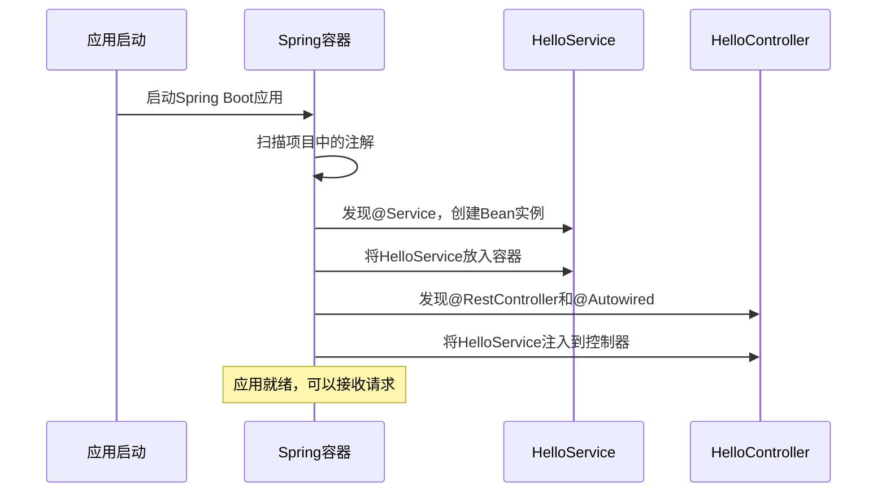

---
tags:
  - 快速入门
  - Spring入门
  - 实践指南
  - 第一个Spring程序
created: 2025-11-18
modified: 2025-11-18
category: Spring核心概念
difficulty: beginner
---

# Spring快速入门指南

> **学习目标**：20分钟内创建你的第一个Spring应用，体验IoC和DI的魔力！

## 🎯 学习目标

通过这个快速入门，你将：
- ✅ 理解IoC和DI的核心思想
- ✅ 掌握最常用的Spring注解
- ✅ 创建一个完整的Spring应用
- ✅ 体验依赖注入的便利

---

## 🚀 开始第一步：创建Spring Boot项目

### 使用Spring Initializr（推荐）

1. 访问 https://start.spring.io
2. 配置项目：
   - Project: Maven
   - Language: Java
   - Spring Boot: 3.x.x
   - Group: com.example
   - Artifact: quickstart
   - Packaging: Jar
   - Java: 17
3. 添加依赖：
   - Spring Web
4. 点击"Generate"下载项目

### 项目结构说明

```
quickstart/
├── src/
│   ├── main/
│   │   ├── java/
│   │   │   └── com/example/quickstart/
│   │   │       ├── QuickstartApplication.java  # 主启动类
│   │   └── resources/
│   │       └── application.properties          # 配置文件
└── pom.xml                                     # Maven配置
```

---

## 🏗️ 第二步：创建你的第一个Bean

### 1. 创建服务类

```java
// 文件：src/main/java/com/example/quickstart/service/HelloService.java
package com.example.quickstart.service;

import org.springframework.stereotype.Service;

@Service  // ← 告诉Spring：这是一个Bean，请管理我！
public class HelloService {

    public String sayHello(String name) {
        return "Hello, " + name + "! 欢迎来到Spring世界！";
    }
}
```

### 2. 创建控制器类

```java
// 文件：src/main/java/com/example/quickstart/controller/HelloController.java
package com.example.quickstart.controller;

import com.example.quickstart.service.HelloService;
import org.springframework.beans.factory.annotation.Autowired;
import org.springframework.web.bind.annotation.*;

@RestController  // ← 告诉Spring：这是一个REST控制器
public class HelloController {

    @Autowired  // ← 告诉Spring：我需要一个HelloService，请给我！
    private HelloService helloService;

    @GetMapping("/hello")
    public String hello(@RequestParam(defaultValue = "World") String name) {
        // 直接使用helloService，我们从未创建过它！
        return helloService.sayHello(name);
    }
}
```

### 3. 启动应用

```java
// 文件：src/main/java/com/example/quickstart/QuickstartApplication.java
package com.example.quickstart;

import org.springframework.boot.SpringApplication;
import org.springframework.boot.autoconfigure.SpringBootApplication;

@SpringBootApplication  // ← 主启动类注解
public class QuickstartApplication {
    public static void main(String[] args) {
        SpringApplication.run(QuickstartApplication.class, args);
    }
}
```

---

## 🎉 第三步：运行并测试

### 启动应用

```bash
# 在项目根目录运行
mvn spring-boot:run
```

看到以下输出说明启动成功：
```
  .   ____          _            __ _ _
 /\\ / ___'_ __ _ _(_)_ __  __ _ \ \ \ \
( ( )\___ | '_ | '_| | '_ \/ _` | \ \ \ \
 \\/  ___)| |_)| | | | | || (_| |  ) ) ) )
  '  |____| .__|_| |_|_| |_\__, | / / / /
 =========|_|==============|___/=/_/_/_/
 :: Spring Boot ::                (v3.x.x)

... 启动成功 ...
Started QuickstartApplication in 2.5 seconds
```

### 测试功能

打开浏览器访问：`http://localhost:8080/hello`

默认输出：
```
Hello, World! 欢迎来到Spring世界！
```

尝试带参数：`http://localhost:8080/hello?name=张三`

输出：
```
Hello, 张三! 欢迎来到Spring世界！
```

---

## 🔍 第四步：理解发生了什么？

### 神奇之处分析

让我们分析刚才的代码：

```java
@Service
public class HelloService {
    // Spring自动创建了这个对象
}

@RestController
public class HelloController {
    @Autowired
    private HelloService helloService;  // Spring自动注入了HelloService
}
```

**传统方式 vs Spring方式：**

```java
// ❌ 传统方式（如果我们不用Spring）
public class HelloController {
    private HelloService helloService;

    public HelloController() {
        // 必须手动创建依赖
        this.helloService = new HelloService();
    }
}

// ✅ Spring方式
@RestController
public class HelloController {
    @Autowired  // Spring自动搞定一切！
    private HelloService helloService;
}
```

### IoC容器的工作流程



---

## 🛠️ 第五步：添加更多功能

### 创建用户服务

```java
// 文件：src/main/java/com/example/quickstart/service/UserService.java
package com.example.quickstart.service;

import org.springframework.stereotype.Service;
import java.util.*;

@Service
public class UserService {
    private Map<Long, String> users = new HashMap<>();
    private long nextId = 1;

    public UserService() {
        // 初始化一些测试数据
        users.put(nextId++, "张三");
        users.put(nextId++, "李四");
        users.put(nextId++, "王五");
    }

    public List<String> getAllUsers() {
        return new ArrayList<>(users.values());
    }

    public String addUser(String name) {
        users.put(nextId++, name);
        return "添加成功：" + name;
    }
}
```

### 创建用户控制器

```java
// 文件：src/main/java/com/example/quickstart/controller/UserController.java
package com.example.quickstart.controller;

import com.example.quickstart.service.UserService;
import org.springframework.beans.factory.annotation.Autowired;
import org.springframework.web.bind.annotation.*;

import java.util.List;

@RestController
@RequestMapping("/api/users")  // 统一路径前缀
public class UserController {

    @Autowired
    private UserService userService;

    @GetMapping
    public List<String> getAllUsers() {
        return userService.getAllUsers();
    }

    @PostMapping
    public String addUser(@RequestParam String name) {
        return userService.addUser(name);
    }
}
```

### 测试新功能

重启应用后测试：

1. 获取所有用户：`http://localhost:8080/api/users`
```json
["张三", "李四", "王五"]
```

2. 添加新用户：`http://localhost:8080/api/users?name=赵六`
```
添加成功：赵六
```

3. 再次获取用户：`http://localhost:8080/api/users`
```json
["张三", "李四", "王五", "赵六"]
```

---

## 🎯 第六步：理解核心概念

### 你已经掌握的核心概念

1. **@Service** - 定义业务层Bean
2. **@RestController** - 定义REST API控制器
3. **@Autowired** - 自动装配依赖
4. **@GetMapping** - 处理GET请求
5. **@PostMapping** - 处理POST请求
6. **@RequestMapping** - 配置路由

### IoC和DI的实际体现

```java
// 我们从未写过这样的代码：
// HelloService helloService = new HelloService();
// UserService userService = new UserService();

// 而是直接使用：
@Autowired
private HelloService helloService;

@Autowired
private UserService userService;
```

这就是IoC（控制反转）+ DI（依赖注入）的魔力！

---

## 🚀 进阶练习

### 练习1：创建邮件服务

```java
@Service
public class EmailService {
    public void sendWelcomeEmail(String username) {
        System.out.println("发送欢迎邮件给：" + username);
    }
}

// 在UserService中使用
@Service
public class UserService {
    @Autowired
    private EmailService emailService;

    public String addUser(String name) {
        users.put(nextId++, name);
        emailService.sendWelcomeEmail(name);  // 发送欢迎邮件
        return "添加成功：" + name;
    }
}
```

### 练习2：使用配置值

```properties
# 在application.properties中添加
app.name=QuickStart应用
app.version=1.0.0
```

```java
@Service
public class AppConfigService {
    @Value("${app.name}")
    private String appName;

    @Value("${app.version}")
    private String version;

    public String getAppInfo() {
        return appName + " v" + version;
    }
}
```

---

## 📋 学习检查清单

### ✅ 基础概念掌握
- [ ] 理解什么是IoC（控制反转）
- [ ] 理解什么是DI（依赖注入）
- [ ] 知道Spring容器的作用

### ✅ 注解使用
- [ ] 会使用@Service、@RestController定义Bean
- [ ] 会使用@Autowired自动注入依赖
- [ ] 会使用@GetMapping、@PostMapping处理请求

### ✅ 实践能力
- [ ] 能够创建Spring Boot项目
- [ ] 能够编写简单的REST API
- [ ] 能够理解依赖注入的工作原理

---

## 🎯 下一步学习

恭喜你完成了快速入门！接下来建议按顺序学习：

1. **深入IoC和DI**
   - [[01-IoC容器与依赖注入核心思想.md|IoC容器与依赖注入核心思想]]
   - [[02-Spring注解体系概览.md|Spring注解体系概览]]

2. **学习依赖注入细节**
   - [[02-依赖注入/02-注入方式(构造函数,字段,Setter注入).md|注入方式详解]]

3. **掌握配置管理**
   - [[03-配置管理/01-基础配置(@Configuration,@Bean等).md|配置管理基础]]

---

## 🎉 总结

通过这个快速入门，你已经：
- 创建了第一个Spring Boot应用
- 体验了IoC和DI的便利
- 掌握了最常用的Spring注解
- 理解了Spring的核心价值

**记住：Spring的核心就是"让框架帮你管理对象"！** 🚀

继续加油，Spring的世界很精彩！