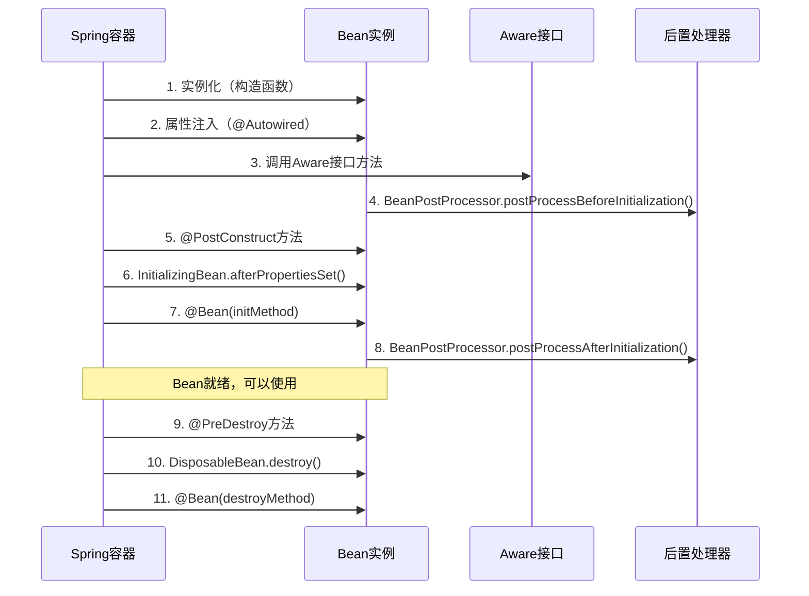

---
tags:
  - 依赖注入
  - IoC容器
  - Bean生命周期
  - Spring容器
  - 核心概念
created: 2025-11-16
modified: 2025-11-16
category: 依赖注入
difficulty: intermediate
---

# 核心概念：IoC容器和Bean生命周期

## 依赖注入基础概念

### 什么是依赖注入？

依赖注入（Dependency Injection，简称DI）是Spring框架的核心机制之一。它是一种设计模式，通过外部容器（Spring容器）来管理对象之间的依赖关系，而不是由对象自己创建依赖。

> [!IMPORTANT] 核心思想
> **核心思想：** 不用你自己去找依赖对象，Spring会自动把合适的依赖对象"注入"给你。

---

## Spring Bean 概念详解

### 什么是 Spring Bean？

**一句话解释：**

> Spring Bean 就是一个 **被 Spring 框架管理的 Java 对象**。

"被管理"意味着：

1. **Spring 负责创建它** (你不用写 `new MyService()`)
2. **Spring 负责储存它** (放在一个叫 "Spring容器" 的特殊仓库里)
3. **Spring 负物把它交给需要它的地方** (通过 `@Autowired` 自动注入)

### 如何制作一个 Spring Bean？

非常简单！只需要给你的 Java 类加上一个"**我是豆子**"的标签就行。

最常用的标签有四个，但新手阶段只用记住 `@Component` 和 `@Service`：

```java
// 1. 写一个普通的Java类
public class EmailService {
    public void sendEmail(String to) {
        System.out.println("正在给 " + to + " 发送邮件...");
    }
}

// 2. 给它加一个 "我是豆子" 的标签
import org.springframework.stereotype.Service;

@Service  // ← 就加这一行！告诉Spring：请把我变成一个Bean！
public class EmailService {
    public void sendEmail(String to) {
        System.out.println("正在给 " + to + " 发送邮件...");
    }
}
```

Spring 启动时，会像个扫地机器人一样扫描整个项目，看到带 `@Service` 标签的类，就会自动：

1. `new EmailService()` (创建一个实例)
2. 把这个实例放到它的"Bean仓库"里

### Bean 和 @Autowired 的关系

- `@Service` **/** `@Component`: **定义Bean**。就像在仓库注册："嘿Spring，我这里有货，请管好它！"
- `@Autowired`: **使用Bean**。就像下单："嘿Spring，我需要一个这玩意儿，给我发货！"

让我们把两者连起来看：

```java
// 步骤1：定义一个Bean (注册商品)
@Service // "我是一个邮件服务Bean！"
public class EmailService {
    public void send(String message) {
        System.out.println("邮件已发送：" + message);
    }
}

// 步骤2：在别的地方使用它 (下单购买)
@RestController
public class MessageController {

    @Autowired // "Spring！我需要一个EmailService，请给我一个！"
    private EmailService emailService; // Spring会自动把仓库里的EmailService实例放这里

    @GetMapping("/send")
    public String sendMsg() {
        emailService.send("你好，世界！"); // 直接用！
        return "发送成功！";
    }
}
```

---

## Spring容器类型匹配机制

### 基本匹配流程

当Spring容器遇到`@Autowired`注解时，会按以下步骤进行Bean匹配：

```java
@Service
public class UserService {
    @Autowired
    private UserRepository userRepository;  // Spring需要找到匹配的Bean
}
```

### 详细匹配过程

#### 1. 类型解析

```java
// 假设有以下结构
public interface UserRepository {
    void save(User user);
}

@Repository
public class JpaUserRepository implements UserRepository {
    @Override
    public void save(User user) {
        // JPA实现
    }
}

@Repository
public class MongoUserRepository implements UserRepository {
    @Override
    public void save(User user) {
        // MongoDB实现
    }
}

@Service
public class UserService {
    @Autowired
    private UserRepository userRepository;  // 这里需要解析UserRepository类型
}
```

#### 2. Bean查找算法

Spring容器使用以下算法来匹配Bean：

```java
// 简化的匹配过程
public class AutowiredMatchingProcess {

    public Object findMatchingBean(Class<?> requiredType) {
        // 步骤1: 精确类型匹配
        List<BeanDefinition> exactMatches = findBeansByExactType(requiredType);

        if (exactMatches.size() == 1) {
            return getBean(exactMatches.get(0));
        }

        // 步骤2: 子类型匹配（包括实现类、子类）
        List<BeanDefinition> subtypeMatches = findBeansBySubtype(requiredType);

        if (subtypeMatches.size() == 1) {
            return getBean(subtypeMatches.get(0));
        }

        // 步骤3: 如果有多个匹配，检查@Qualifier
        if (subtypeMatches.size() > 1) {
            return resolveMultipleBeans(subtypeMatches);
        }

        // 步骤4: 抛出异常
        throw new NoSuchBeanDefinitionException(requiredType);
    }
}
```

### 具体示例说明

#### 示例1: 精确匹配

```java
@Repository
public class UserRepositoryImpl implements UserRepository {
    // 实现
}

@Service
public class UserService {
    @Autowired
    private UserRepositoryImpl userRepository;  // 精确匹配UserRepositoryImpl类
}
```

#### 示例2: 接口匹配实现类

```java
@Repository
public class JpaUserRepository implements UserRepository {
    // JPA实现
}

@Service
public class UserService {
    @Autowired
    private UserRepository userRepository;  // 匹配实现接口的JpaUserRepository
}
```

### 处理多个Bean的情况

#### 1. 使用@Qualifier指定

```java
@Repository("mysqlUserRepository")
public class MysqlUserRepository implements UserRepository {
    // MySQL实现
}

@Repository("mongoUserRepository")
public class MongoUserRepository implements UserRepository {
    // MongoDB实现
}

@Service
public class UserService {
    @Autowired
    @Qualifier("mysqlUserRepository")  // 明确指定要注入的Bean
    private UserRepository userRepository;
}
```

#### 2. 注入所有匹配的Bean

```java
@Service
public class UserService {
    @Autowired
    private List<UserRepository> userRepositories;  // 注入所有UserRepository实现

    @Autowired
    private Map<String, UserRepository> userRepositoryMap;  // 按Bean名称映射
}
```

### 高级匹配场景

#### 1. 泛型类型匹配

```java
public interface Repository<T> {
    void save(T entity);
}

@Repository
public class UserRepository implements Repository<User> {
    public void save(User user) { /* 实现 */ }
}

@Repository
public class OrderRepository implements Repository<Order> {
    public void save(Order order) { /* 实现 */ }
}

@Service
public class DataService {
    @Autowired
    private Repository<User> userRepository;  // 基于泛型参数匹配

    @Autowired
    private Repository<Order> orderRepository;  // 基于泛型参数匹配
}
```

#### 2. 继承层次匹配

```java
public abstract class BaseService<T> {
    // 基础服务
}

@Service
public class UserService extends BaseService<User> {
    // 用户服务实现
}

@Service
public class OrderService extends BaseService<Order> {
    // 订单服务实现
}

@Controller
public class UserController {
    @Autowired
    private BaseService<User> userService;  // 匹配UserService
}
```

---

## Bean生命周期和作用域

### Bean的作用域有哪些？如何选择？

**A:** Spring支持多种作用域：

| 作用域 | 描述 | 生命周期 | 适用场景 |
|--------|------|----------|----------|
| **singleton** | 默认，整个应用只有一个实例 | 应用启动时创建，应用关闭时销毁 | 无状态服务（推荐） |
| **prototype** | 每次注入都创建新实例 | 每次请求时创建，由GC回收 | 有状态对象 |
| **request** | Web应用，每个HTTP请求一个实例 | 请求开始创建，请求结束销毁 | 请求相关数据 |
| **session** | Web应用，每个HTTP会话一个实例 | 会话开始创建，会话结束销毁 | 用户会话数据 |

**使用示例：**

```java
// ✅ 默认singleton - 无状态服务
@Service
@Scope("singleton")  // 可省略，这是默认值
public class UserService {
    // 无状态，线程安全
    public User findUser(Long id) { }
}

// ✅ prototype - 有状态对象
@Component
@Scope("prototype")
public class ShoppingCart {
    private List<Item> items = new ArrayList<>();
    // 每次注入都是新的购物车
    public void addItem(Item item) { items.add(item); }
}

// ✅ request - 请求作用域
@Component
@Scope(value = WebApplicationContext.SCOPE_REQUEST, proxyMode = ScopedProxyMode.TARGET_CLASS)
public class RequestData {
    private String requestId;
    // 每个HTTP请求一个实例
}

// ✅ session - 会话作用域
@Component
@Scope(value = WebApplicationContext.SCOPE_SESSION, proxyMode = ScopedProxyMode.TARGET_CLASS)
public class UserSession {
    private User currentUser;
    // 每个用户会话一个实例
}
```

### Bean的完整生命周期是怎样的？

**A:** Bean生命周期包含多个阶段：



**代码示例：**

```java
@Service
public class LifecycleService implements InitializingBean, DisposableBean, ApplicationContextAware {

    @Autowired
    private DependencyService dependencyService;

    // 1. 构造函数
    public LifecycleService() {
        System.out.println("1. 构造函数执行");
    }

    // 2. 属性注入后
    @Override
    public void setApplicationContext(ApplicationContext applicationContext) {
        System.out.println("3. ApplicationContextAware.setApplicationContext()");
    }

    // 4. 初始化前处理
    @PostConstruct
    public void postConstruct() {
        System.out.println("5. @PostConstruct执行");
    }

    // 6. InitializingBean接口
    @Override
    public void afterPropertiesSet() {
        System.out.println("6. InitializingBean.afterPropertiesSet()");
    }

    // 9. 销毁前处理
    @PreDestroy
    public void preDestroy() {
        System.out.println("9. @PreDestroy执行");
    }

    // 10. DisposableBean接口
    @Override
    public void destroy() {
        System.out.println("10. DisposableBean.destroy()");
    }
}
```

---

## 📚 相关概念交叉引用

- [[02-注入方式(构造函数,字段,Setter注入)]] - 详细了解各种注入方式
- [[03-高级特性(循环依赖,作用域,条件注入)]] - 深入学习高级DI特性
- [[04-问题排查(NoSuchBeanDefinitionException等)]] - 常见问题解决方案

## 🎯 核心要点总结

1. **IoC容器**：Spring容器负责Bean的创建、管理和销毁
2. **Bean定义**：通过注解或@Bean方法定义Spring管理的对象
3. **类型匹配**：Spring按精确类型→子类型→@Qualifier的顺序匹配
4. **生命周期**：Bean经历实例化→属性注入→初始化→使用→销毁的完整过程
5. **作用域选择**：根据业务需求选择合适的Bean作用域

掌握这些核心概念是理解Spring依赖注入机制的基础，为后续学习注入方式和高级特性做好准备。