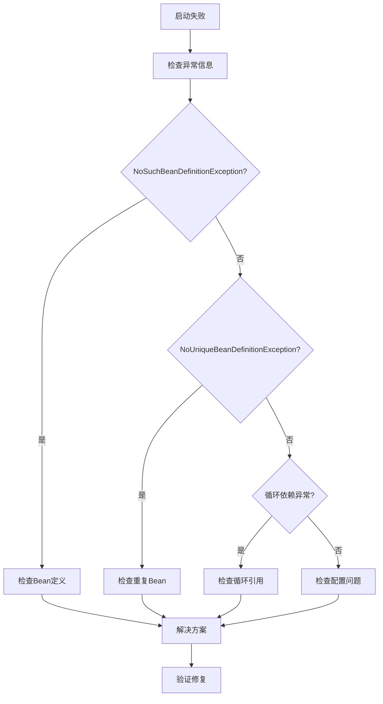

---
tags:
  - 依赖注入
  - 问题排查
  - NoSuchBeanDefinitionException
  - NoUniqueBeanDefinitionException
  - 循环依赖
  - 故障排查
  - 异常处理
created: 2025-11-16
modified: 2025-11-16
category: 依赖注入
difficulty: intermediate
---

# 问题排查：常见依赖注入异常和解决方案

## 🚨 常见异常类型

### 1. NoSuchBeanDefinitionException

**异常描述：** 找不到匹配的Bean定义

```java
// 问题场景
@Service
public class UserService {
    @Autowired
    private NonExistentService service;  // 抛出NoSuchBeanDefinitionException
}
```

**常见原因和解决方案：**

#### 原因1：忘记添加组件注解

```java
// ❌ 问题：忘记添加@Service注解
public class EmailService {
    public void sendEmail(String to) {
        System.out.println("发送邮件给: " + to);
    }
}

// ✅ 解决方案：添加组件注解
@Service
public class EmailService {
    public void sendEmail(String to) {
        System.out.println("发送邮件给: " + to);
    }
}
```

#### 原因2：包扫描路径不正确

```java
// ❌ 问题：Bean不在扫描路径中
@SpringBootApplication
public class Application {
    public static void main(String[] args) {
        SpringApplication.run(Application.class, args);
    }
}

// 假设EmailService在com.other.service包中，但扫描路径是com.example
// ✅ 解决方案1：调整扫描路径
@SpringBootApplication
@ComponentScan(basePackages = {"com.example", "com.other.service"})
public class Application {
    public static void main(String[] args) {
        SpringApplication.run(Application.class, args);
    }
}

// ✅ 解决方案2：将Bean移到扫描路径下
@Service
public class EmailService {
    // 确保在com.example或其子包中
}
```

#### 原因3：依赖Bean在配置类中未定义

```java
// ❌ 问题：第三方类需要@Bean定义
@Service
public class UserService {
    @Autowired
    private ObjectMapper objectMapper;  // Jackson的ObjectMapper，Spring不会自动创建
}

// ✅ 解决方案：在配置类中定义Bean
@Configuration
public class AppConfig {

    @Bean
    public ObjectMapper objectMapper() {
        ObjectMapper mapper = new ObjectMapper();
        mapper.setDateFormat(new SimpleDateFormat("yyyy-MM-dd HH:mm:ss"));
        mapper.configure(DeserializationFeature.FAIL_ON_UNKNOWN_PROPERTIES, false);
        return mapper;
    }
}
```

#### 原因4：条件注解导致Bean未被创建

```java
// ❌ 问题：条件不满足，Bean未被创建
@Service
@ConditionalOnProperty(name = "feature.enabled", havingValue = "true")
public class FeatureService {
    // 只有当feature.enabled=true时才会创建
}

// ✅ 解决方案1：满足条件
// application.properties
feature.enabled=true

// ✅ 解决方案2：提供默认实现
@Service
@ConditionalOnProperty(name = "feature.enabled", havingValue = "true")
public class FeatureService {
    // 启用时的实现
}

@Service
@ConditionalOnProperty(name = "feature.enabled", havingValue = "false", matchIfMissing = true)
public class DefaultFeatureService implements FeatureServiceInterface {
    // 禁用时的默认实现
}
```

### 2. NoUniqueBeanDefinitionException

**异常描述：** 找到多个匹配的Bean，无法确定注入哪一个

```java
// 问题场景
public interface PaymentService {
    void processPayment(double amount);
}

@Service
public class CreditCardPaymentService implements PaymentService {
    @Override
    public void processPayment(double amount) {
        // 信用卡支付
    }
}

@Service
public class PayPalPaymentService implements PaymentService {
    @Override
    public void processPayment(double amount) {
        // PayPal支付
    }
}

@Service
public class OrderService {
    @Autowired
    private PaymentService paymentService;  // 抛出NoUniqueBeanDefinitionException
}
```

**解决方案：**

#### 方案1：使用@Qualifier指定具体Bean

```java
@Service
public class OrderService {
    @Autowired
    @Qualifier("creditCardPaymentService")  // 指定Bean名称
    private PaymentService paymentService;
}
```

#### 方案2：使用@Primary标记首选实现

```java
@Service
@Primary  // 标记为首选实现
public class CreditCardPaymentService implements PaymentService {
    @Override
    public void processPayment(double amount) {
        // 信用卡支付
    }
}

@Service
public class OrderService {
    @Autowired
    private PaymentService paymentService;  // 自动注入CreditCardPaymentService
}
```

#### 方案3：注入所有实现

```java
@Service
public class OrderService {
    @Autowired
    private List<PaymentService> paymentServices;  // 注入所有实现

    @Autowired
    private Map<String, PaymentService> paymentServiceMap;  // 按名称映射

    public void processPayment(double amount, String type) {
        PaymentService service = paymentServiceMap.get(type + "PaymentService");
        if (service != null) {
            service.processPayment(amount);
        }
    }
}
```

### 3. 循环依赖异常

**异常描述：** Bean正在创建中，无法完成循环依赖

```java
// ❌ 构造函数循环依赖 - 无法解决
@Service
public class ServiceA {
    private final ServiceB serviceB;

    public ServiceA(ServiceB serviceB) {  // 需要ServiceB
        this.serviceB = serviceB;
    }
}

@Service
public class ServiceB {
    private final ServiceA serviceA;

    public ServiceB(ServiceA serviceA) {  // 需要ServiceA
        this.serviceA = serviceA;
    }
}
```

**解决方案：**

#### 方案1：使用@Lazy延迟初始化

```java
@Service
public class ServiceA {
    private final ServiceB serviceB;

    public ServiceA(@Lazy ServiceB serviceB) {  // 延迟初始化
        this.serviceB = serviceB;
    }
}

@Service
public class ServiceB {
    private final ServiceA serviceA;

    public ServiceB(ServiceA serviceA) {
        this.serviceA = serviceA;
    }
}
```

#### 方案2：改为Setter注入

```java
@Service
public class ServiceA {
    private ServiceB serviceB;

    @Autowired
    public void setServiceB(ServiceB serviceB) {
        this.serviceB = serviceB;
    }
}

@Service
public class ServiceB {
    private ServiceA serviceA;

    @Autowired
    public void setServiceA(ServiceA serviceA) {
        this.serviceA = serviceA;
    }
}
```

#### 方案3：重构设计，提取共同依赖

```java
@Service
public class SharedService {
    // 共同逻辑
}

@Service
public class ServiceA {
    private final SharedService sharedService;
    public ServiceA(SharedService sharedService) {
        this.sharedService = sharedService;
    }
}

@Service
public class ServiceB {
    private final SharedService sharedService;
    public ServiceB(SharedService sharedService) {
        this.sharedService = sharedService;
    }
}
```

---

## 🔧 故障排查流程

### 系统排查步骤



### 具体排查方法

#### 1. 检查Bean是否存在

```java
// 启动时列出所有Bean
@Component
public class BeanLister implements CommandLineRunner {

    @Autowired
    private ApplicationContext applicationContext;

    @Override
    public void run(String... args) throws Exception {
        String[] beanNames = applicationContext.getBeanDefinitionNames();
        Arrays.stream(beanNames)
              .filter(name -> name.contains("Service"))
              .sorted()
              .forEach(System.out::println);
    }
}
```

#### 2. 检查依赖关系

```java
// 自定义Bean后置处理器观察注入过程
@Component
public class InjectionDebugger implements BeanPostProcessor {

    private static final Logger logger = LoggerFactory.getLogger(InjectionDebugger.class);

    @Override
    public Object postProcessBeforeInitialization(Object bean, String beanName) {
        logger.debug("Bean初始化前: {} - {}", beanName, bean.getClass().getSimpleName());
        return bean;
    }

    @Override
    public Object postProcessAfterInitialization(Object bean, String beanName) {
        logger.debug("Bean初始化完成: {} - {}", beanName, bean.getClass().getSimpleName());
        return bean;
    }
}
```

#### 3. 启用调试日志

```properties
# application.properties
logging.level.org.springframework.beans.factory=DEBUG
logging.level.org.springframework.context=DEBUG
```

---

## 🎯 特定场景问题解决

### 场景1：测试环境中的依赖注入问题

```java
// ❌ 问题：测试类中找不到Bean
@SpringBootTest
public class UserServiceTest {

    @Autowired
    private UserService userService;  // 可能找不到Bean

    @Test
    public void testUser() {
        // 测试逻辑
    }
}

// ✅ 解决方案1：使用@MockBean
@SpringBootTest
public class UserServiceTest {

    @Autowired
    private UserService userService;

    @MockBean
    private UserRepository userRepository;  // 模拟依赖

    @Test
    public void testUser() {
        // 设置模拟行为
        when(userRepository.findById(1L)).thenReturn(Optional.of(new User()));
        // 测试逻辑
    }
}

// ✅ 解决方案2：使用@TestConfiguration
@SpringBootTest
public class UserServiceTest {

    @Autowired
    private UserService userService;

    @TestConfiguration
    static class TestConfig {

        @Bean
        @Primary
        public UserRepository testUserRepository() {
            return new InMemoryUserRepository();
        }
    }

    @Test
    public void testUser() {
        // 测试逻辑
    }
}
```

### 场景2：多模块项目中的依赖问题

```java
// ❌ 问题：跨模块依赖找不到
// module-a
@Service
public class ServiceA {
    @Autowired
    private ServiceB serviceB;  // 在module-b中
}

// module-b
@Service
public class ServiceB {
    // 实现
}

// ✅ 解决方案：确保模块依赖和扫描配置
// module-a的pom.xml
<dependency>
    <groupId>com.example</groupId>
    <artifactId>module-b</artifactId>
    <version>1.0.0</version>
</dependency>

// 主应用类
@SpringBootApplication
@ComponentScan(basePackages = {"com.example.modulea", "com.example.moduleb"})
public class Application {
    public static void main(String[] args) {
        SpringApplication.run(Application.class, args);
    }
}
```

### 场景3：条件Bean未生效

```java
// ❌ 问题：条件Bean未创建
@Service
@ConditionalOnClass(name = "redis.clients.jedis.Jedis")
public class RedisService {
    // Redis服务
}

// ✅ 解决方案：检查条件是否满足
@Component
public class ConditionChecker implements CommandLineRunner {

    @Autowired
    private ApplicationContext applicationContext;

    @Override
    public void run(String... args) {
        boolean jedisExists = false;
        try {
            Class.forName("redis.clients.jedis.Jedis");
            jedisExists = true;
        } catch (ClassNotFoundException e) {
            jedisExists = false;
        }

        System.out.println("Jedis class exists: " + jedisExists);

        // 检查Bean是否存在
        try {
            applicationContext.getBean(RedisService.class);
            System.out.println("RedisService bean exists");
        } catch (NoSuchBeanDefinitionException e) {
            System.out.println("RedisService bean not found: " + e.getMessage());
        }
    }
}
```

---

## 🛠️ 调试工具和技巧

### 1. Bean定义信息查看

```java
@RestController
public class BeanDebugController {

    @Autowired
    private ApplicationContext applicationContext;

    @GetMapping("/beans")
    public Map<String, Object> listBeans() {
        Map<String, Object> result = new HashMap<>();

        // 获取所有Bean名称
        String[] beanNames = applicationContext.getBeanDefinitionNames();
        List<Map<String, Object>> beanInfos = new ArrayList<>();

        for (String beanName : beanNames) {
            try {
                Object bean = applicationContext.getBean(beanName);
                Map<String, Object> beanInfo = new HashMap<>();
                beanInfo.put("name", beanName);
                beanInfo.put("type", bean.getClass().getName());
                beanInfo.put("scope", applicationContext.isSingleton(beanName) ? "singleton" : "prototype");
                beanInfos.add(beanInfo);
            } catch (Exception e) {
                // 忽略无法获取的Bean
            }
        }

        result.put("beans", beanInfos);
        result.put("total", beanInfos.size());
        return result;
    }

    @GetMapping("/beans/{type}")
    public List<String> getBeansByType(@PathVariable String type) {
        try {
            Class<?> clazz = Class.forName(type);
            String[] beanNames = applicationContext.getBeanNamesForType(clazz);
            return Arrays.asList(beanNames);
        } catch (ClassNotFoundException e) {
            return Collections.singletonList("Type not found: " + type);
        }
    }
}
```

### 2. 依赖关系可视化

```java
@Component
public class DependencyAnalyzer {

    @Autowired
    private ApplicationContext applicationContext;

    public void analyzeDependencies(String beanName) {
        BeanDefinition beanDefinition =
            ((ConfigurableApplicationContext) applicationContext)
                .getBeanFactory()
                .getBeanDefinition(beanName);

        System.out.println("Bean: " + beanName);
        System.out.println("Class: " + beanDefinition.getBeanClassName());

        // 分析依赖
        ConstructorArgumentValues constructorArgs = beanDefinition.getConstructorArgumentValues();
        MutablePropertyValues properties = beanDefinition.getPropertyValues();

        System.out.println("Constructor arguments:");
        constructorArgs.getGenericArgumentValues().forEach(arg -> {
            System.out.println("  " + arg.getValue());
        });

        System.out.println("Properties:");
        properties.forEach(propertyValue -> {
            System.out.println("  " + propertyValue.getName() + " = " + propertyValue.getValue());
        });
    }
}
```

### 3. 实时监控Bean创建

```java
@Component
public class BeanCreationMonitor implements BeanPostProcessor, BeanFactoryAware {

    private BeanFactory beanFactory;

    @Override
    public void setBeanFactory(BeanFactory beanFactory) {
        this.beanFactory = beanFactory;
    }

    @Override
    public Object postProcessBeforeInitialization(Object bean, String beanName) {
        System.out.println("创建Bean: " + beanName + " [" + bean.getClass().getSimpleName() + "]");
        return bean;
    }

    @Override
    public Object postProcessAfterInitialization(Object bean, String beanName) {
        System.out.println("初始化完成: " + beanName);
        return bean;
    }
}
```

---

## 📋 常见问题检查清单

### 启动前检查

- [ ] 所有需要注入的类都有正确的组件注解（@Service, @Component, @Repository等）
- [ ] 包扫描路径包含所有需要的包
- [ ] 配置类上有@Configuration注解
- [ ] @Bean方法在配置类中定义
- [ ] 条件注解的条件是否满足

### 异常排查检查

- [ ] 查看完整异常堆栈信息
- [ ] 确认异常类型（NoSuchBeanDefinitionException, NoUniqueBeanDefinitionException等）
- [ ] 检查Bean名称拼写是否正确
- [ ] 确认泛型类型匹配是否正确
- [ ] 检查是否存在循环依赖

### 配置验证检查

- [ ] application.properties/ymal配置正确
- [ ] 条件化Bean的条件满足
- [ ] 第三方库依赖正确引入
- [ ] 配置类的@Import注解正确

---

## 📚 相关概念交叉引用

- [[01-核心概念(IoC容器,Bean生命周期等)]] - 了解IoC容器工作原理
- [[02-注入方式(构造函数,字段,Setter注入)]] - 掌握不同注入方式的特点
- [[03-高级特性(循环依赖,作用域,条件注入)]] - 深入了解高级特性

## 🎯 核心要点总结

1. **异常识别**：快速识别NoSuchBeanDefinitionException、NoUniqueBeanDefinitionException等常见异常
2. **系统排查**：按照异常类型→原因分析→解决方案的步骤系统排查
3. **调试工具**：利用日志、Bean信息查看、依赖分析等工具定位问题
4. **预防措施**：通过良好的代码结构和配置避免常见问题
5. **测试环境**：特别注意测试环境中的依赖注入配置
6. **最佳实践**：使用@Qualifier、@Primary等注解明确依赖关系

掌握这些问题排查技巧，能够快速定位和解决依赖注入中的各种问题，提高开发效率。