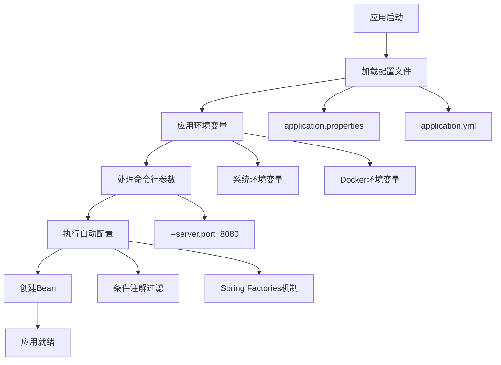

---
tags:
  - 配置管理
  - Spring Boot
  - 概览
  - 目录索引
  - 学习指南
created: 2025-11-16
modified: 2025-11-16
category: 配置管理
difficulty: beginner
---

# Spring Boot 配置管理概览

## 📚 学习指南

本文档是 Spring Boot 配置管理的总览和索引页面。配置管理是 Spring Boot 的核心功能之一，它提供了强大而灵活的配置机制，让开发者能够轻松管理各种应用配置。

## 🎯 学习路径

建议按照以下顺序学习配置管理的各个方面：

1. **[[01-基础配置(@Configuration,@Bean等)]]** - 学习 Spring Boot 的基础配置注解
2. **[[02-属性配置(Properties,YAML,Environment等)]]** - 掌握属性文件和环境配置
3. **[[03-自动配置(@EnableAutoConfiguration,@Conditional等)]]** - 理解 Spring Boot 的自动配置机制
4. **[[04-外部化配置(配置文件,环境变量等)]]** - 学习外部化配置的最佳实践

---

## 📋 配置管理概览

### 核心配置概念

| 概念 | 描述 | 相关文档 |
|------|------|----------|
| **基础配置** | `@Configuration`、`@Bean`、组件扫描等基础注解 | [[01-基础配置(@Configuration,@Bean等)]] |
| **属性配置** | Properties、YAML、Environment 等配置源 | [[02-属性配置(Properties,YAML,Environment等)]] |
| **自动配置** | Spring Boot 的智能自动配置机制 | [[03-自动配置(@EnableAutoConfiguration,@Conditional等)]] |
| **外部化配置** | 配置文件、环境变量、命令行参数等 | [[04-外部化配置(配置文件,环境变量等)]] |

### 配置管理流程



---

## 🔍 详细学习内容

### 1. 基础配置 (@Configuration, @Bean等)

**学习重点：**
- `@Configuration` 和 `@Bean` 注解的使用
- Spring Bean 的概念和生命周期
- 组件扫描机制 (`@ComponentScan`)
- Bean 作用域和依赖关系

**核心概念：**
- **Spring Bean**：被 Spring 框架管理的 Java 对象
- **配置类**：使用 `@Configuration` 标记的类，包含 `@Bean` 方法
- **组件扫描**：自动发现和注册带注解的类

> 💡 **快速开始**：从 [[01-基础配置(@Configuration,@Bean等)]] 开始学习基础配置概念

### 2. 属性配置 (Properties, YAML, Environment等)

**学习重点：**
- Properties 和 YAML 配置文件格式
- Environment 对象的使用
- `@ConfigurationProperties` 属性绑定
- 多环境配置管理

**核心概念：**
- **配置文件**：`application.properties` 和 `application.yml`
- **属性绑定**：将外部配置映射到 Java 对象
- **环境配置**：开发、测试、生产环境的配置分离

> 💡 **快速开始**：学习 [[02-属性配置(Properties,YAML,Environment等)]] 掌握配置文件使用

### 3. 自动配置 (@EnableAutoConfiguration, @Conditional等)

**学习重点：**
- `@EnableAutoConfiguration` 的工作原理
- 条件注解的使用 (`@ConditionalOnClass`、`@ConditionalOnProperty` 等)
- 自定义自动配置类
- 自动配置的调试和控制

**核心概念：**
- **自动配置**：根据依赖自动配置应用组件
- **条件注解**：控制配置生效的条件
- **约定优于配置**：Spring Boot 的核心理念

> 💡 **快速开始**：深入了解 [[03-自动配置(@EnableAutoConfiguration,@Conditional等)]] 的自动配置机制

### 4. 外部化配置 (配置文件,环境变量等)

**学习重点：**
- 外部化配置的优先级顺序
- 环境变量配置规则
- 命令行参数配置
- 容器化部署配置

**核心概念：**
- **外部化配置**：将配置从代码中分离
- **配置优先级**：不同配置源的加载顺序
- **容器化配置**：Docker、Kubernetes 环境的配置管理

> 💡 **快速开始**：学习 [[04-外部化配置(配置文件,环境变量等)]] 的外部化配置最佳实践

---

## 🛠️ 实用工具和技巧

### 配置调试

```properties
# 开启自动配置调试
debug=true

# 查看配置属性
spring.config.import=optional:classpath:debug.properties
```

### 常用配置示例

```yaml
# 基础配置模板
spring:
  application:
    name: myapp
  profiles:
    active: ${SPRING_PROFILES_ACTIVE:dev}

server:
  port: ${SERVER_PORT:8080}

app:
  name: MyApplication
  version: @project.version@
  features:
    cache-enabled: ${APP_CACHE_ENABLED:true}
```

### 配置验证

```java
@Component
@ConfigurationProperties(prefix = "app")
@Data
@Validated
public class AppProperties {
    @NotBlank
    private String name;

    @Min(1)
    @Max(100)
    private int maxConnections = 10;
}
```

---

## 📖 学习建议

### 初学者路径

1. **理解基础概念**：从 [[01-基础配置(@Configuration,@Bean等)]] 开始
2. **掌握配置文件**：学习 [[02-属性配置(Properties,YAML,Environment等)]]
3. **实践项目配置**：在实际项目中应用所学知识
4. **深入了解自动配置**：学习 [[03-自动配置(@EnableAutoConfiguration,@Conditional等)]]
5. **掌握外部化配置**：学习 [[04-外部化配置(配置文件,环境变量等)]]

### 进阶学习

- **自定义 Starter 开发**
- **配置中心集成** (Spring Cloud Config)
- **配置热更新机制**
- **多租户配置管理**
- **配置安全最佳实践**

### 常见问题解决

| 问题 | 解决方案 | 相关文档 |
|------|----------|----------|
| Bean 创建失败 | 检查依赖注入和配置 | [[01-基础配置(@Configuration,@Bean等)]] |
| 配置不生效 | 检查配置文件位置和优先级 | [[02-属性配置(Properties,YAML,Environment等)]] |
| 自动配置冲突 | 排除特定自动配置 | [[03-自动配置(@EnableAutoConfiguration,@Conditional等)]] |
| 环境配置混乱 | 使用外部化配置 | [[04-外部化配置(配置文件,环境变量等)]] |

---

## 🎯 学习目标

完成配置管理学习后，你应该能够：

✅ **熟练使用** `@Configuration` 和 `@Bean` 进行基础配置
✅ **掌握** Properties 和 YAML 配置文件的编写
✅ **理解** Spring Boot 自动配置的工作原理
✅ **运用** 外部化配置管理不同环境
✅ **调试** 配置相关的问题
✅ **遵循** 配置管理的最佳实践

---

## 📚 扩展阅读

### 官方文档
- [Spring Boot Configuration](https://docs.spring.io/spring-boot/docs/current/reference/html/features.html#features.external-config)
- [Spring Boot Auto-configuration](https://docs.spring.io/spring-boot/docs/current/reference/html/features.html#features.developing-auto-configuration)

### 相关学习笔记
- [[Spring注解详解]] - Spring注解完整详解
- [[依赖注入详解]] - 依赖注入深度解析
- [[最佳实践指南]] - Spring Boot最佳实践

### 技术文档
- Bean生命周期管理 - Bean创建和销毁的完整流程
- 配置属性绑定 - @ConfigurationProperties使用指南
- Spring Boot Actuator - 应用监控和管理

---

## 🔄 持续更新

本文档会根据 Spring Boot 版本更新和最佳实践演进持续更新。如果你有建议或发现问题，欢迎反馈。

**最后更新：** 2025-11-16
**适用版本：** Spring Boot 2.7+ / 3.x