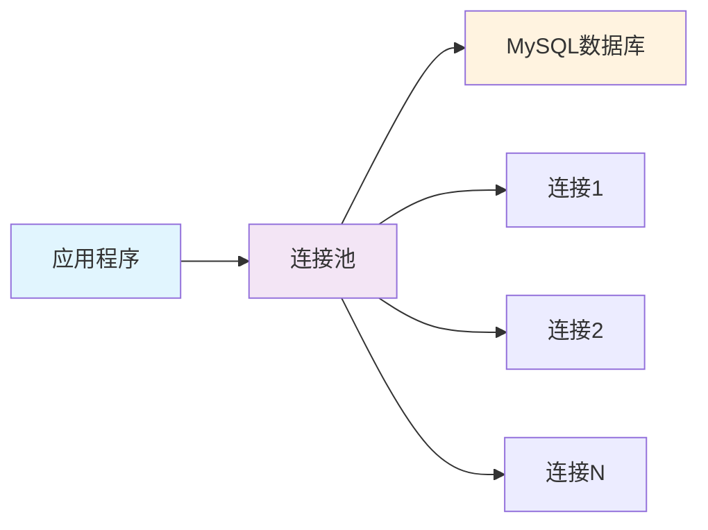

---
tags:
  - 数据库配置
  - Spring Boot
  - MySQL
  - 连接池
  - 数据源
created: 2025-11-19
modified: 2025-11-19
category: 数据库技术
difficulty: beginner
---

# 01-数据库配置与连接

> **学习目标**: 掌握Spring Boot数据库环境搭建，实现简单的数据库连接和基础CRUD操作

## 🎯 本章概览

**学习时间**: 45-60分钟 | **难度等级**: ⭐⭐ | **重点程度**: 🔥🔥🔥

本章将教你如何在Spring Boot项目中配置数据库连接，为后续的CRUD操作打下基础。考虑到你已经掌握SQL，我们将重点放在Spring Boot的配置和集成上。

---

## 📋 核心需求

### 🎯 业务目标
- 配置MySQL数据库连接
- 实现基础的数据源配置
- 测试数据库连接状态
- 为简单CRUD操作做好准备

### 🛠️ 技术需求
- Spring Boot数据源配置
- MySQL连接器集成
- 连接池基础配置
- 多环境数据库配置

---

## 🏗️ 数据库配置核心概念

### 🔧 数据源 (DataSource) 配置

Spring Boot通过`DataSource`对象管理数据库连接：

```java
// 🎯 Spring Boot自动配置的数据源
@Configuration
public class DataSourceConfig {

    @Bean
    @ConfigurationProperties(prefix = "spring.datasource")
    public DataSource dataSource() {
        return DataSourceBuilder.create().build();
    }
}
```

### 📊 连接池 (Connection Pool) 原理



**连接池优势**:
- ✅ **性能提升** - 避免频繁创建/销毁连接
- ✅ **资源管理** - 限制最大连接数
- ✅ **连接复用** - 提高数据库访问效率

---

## 💻 实战配置步骤

### 1️⃣ 添加MySQL依赖

在`pom.xml`中添加MySQL连接器：

```xml
<dependencies>
    <!-- 🎯 Spring Boot JPA Starter -->
    <dependency>
        <groupId>org.springframework.boot</groupId>
        <artifactId>spring-boot-starter-data-jpa</artifactId>
    </dependency>

    <!-- 🔗 MySQL连接器 -->
    <dependency>
        <groupId>mysql</groupId>
        <artifactId>mysql-connector-java</artifactId>
        <scope>runtime</scope>
    </dependency>

    <!-- 🔧 H2数据库（测试用） -->
    <dependency>
        <groupId>com.h2database</groupId>
        <artifactId>h2</artifactId>
        <scope>test</scope>
    </dependency>
</dependencies>
```

### 2️⃣ 配置数据库连接

在`application.yml`中配置数据源：

```yaml
# 🎯 数据库配置
spring:
  datasource:
    # 🔗 数据库连接信息
    url: jdbc:mysql://localhost:3306/clothing_store?useSSL=false&serverTimezone=UTC&allowPublicKeyRetrieval=true
    username: root
    password: 123456
    driver-class-name: com.mysql.cj.jdbc.Driver

    # 🏊 连接池配置
    hikari:
      maximum-pool-size: 10              # 最大连接数
      minimum-idle: 5                    # 最小空闲连接
      idle-timeout: 300000               # 空闲超时时间（毫秒）
      connection-timeout: 20000          # 连接超时时间（毫秒）
      max-lifetime: 1200000              # 连接最大生存时间（毫秒）

  # 🎯 JPA配置
  jpa:
    hibernate:
      ddl-auto: update                   # 自动更新表结构
    show-sql: true                       # 显示SQL语句
    properties:
      hibernate:
        format_sql: true                 # 格式化SQL输出
        dialect: org.hibernate.dialect.MySQL8Dialect
```

### 3️⃣ 多环境配置

创建不同环境的配置文件：

**application-dev.yml**（开发环境）:
```yaml
spring:
  datasource:
    url: jdbc:mysql://localhost:3306/clothing_store_dev?useSSL=false&serverTimezone=UTC
    username: root
    password: 123456
  jpa:
    show-sql: true
    hibernate:
      ddl-auto: update
```

**application-prod.yml**（生产环境）:
```yaml
spring:
  datasource:
    url: jdbc:mysql://prod-db:3306/clothing_store?useSSL=true&serverTimezone=UTC
    username: ${DB_USERNAME:app_user}
    password: ${DB_PASSWORD:secure_password}
  jpa:
    show-sql: false
    hibernate:
      ddl-auto: validate
```

---

## 🧪 数据库连接测试

### 1️⃣ 创建测试数据库

```sql
-- 🎯 创建数据库
CREATE DATABASE IF NOT EXISTS clothing_store
CHARACTER SET utf8mb4
COLLATE utf8mb4_unicode_ci;

-- 📊 使用数据库
USE clothing_store;

-- 👥 创建测试用户表（后续章节会详细讲JPA）
CREATE TABLE IF NOT EXISTS users (
    id BIGINT AUTO_INCREMENT PRIMARY KEY,
    username VARCHAR(50) NOT NULL UNIQUE,
    email VARCHAR(100) NOT NULL UNIQUE,
    password VARCHAR(255) NOT NULL,
    created_at TIMESTAMP DEFAULT CURRENT_TIMESTAMP,
    updated_at TIMESTAMP DEFAULT CURRENT_TIMESTAMP ON UPDATE CURRENT_TIMESTAMP
);

-- 📝 插入测试数据
INSERT INTO users (username, email, password) VALUES
('admin', 'admin@example.com', '$2a$10$YourHashedPasswordHere'),
('testuser', 'test@example.com', '$2a$10$YourHashedPasswordHere');
```

### 2️⃣ 创建连接测试组件

```java
@Component
@Slf4j
public class DatabaseConnectionTester {

    @Autowired
    private DataSource dataSource;

    @EventListener(ApplicationReadyEvent.class)
    public void testConnection() {
        try (Connection connection = dataSource.getConnection()) {
            log.info("🎉 数据库连接成功!");
            log.info("📊 数据库信息: {}", connection.getMetaData().getDatabaseProductName());
            log.info("🔗 连接URL: {}", connection.getMetaData().getURL());
            log.info("👤 用户名: {}", connection.getMetaData().getUserName());

            // 🧪 简单查询测试
            try (Statement stmt = connection.createStatement();
                 ResultSet rs = stmt.executeQuery("SELECT COUNT(*) FROM users")) {
                if (rs.next()) {
                    log.info("👥 用户表记录数: {}", rs.getInt(1));
                }
            }

        } catch (SQLException e) {
            log.error("❌ 数据库连接失败: {}", e.getMessage());
        }
    }
}
```

---

## 🚀 常见问题与解决方案

### ❓ 问题1: 连接超时

**错误信息**: `Connection timeout`

**解决方案**:
```yaml
spring:
  datasource:
    hikari:
      connection-timeout: 60000        # 增加连接超时时间
      maximum-pool-size: 20            # 增加连接池大小
```

### ❓ 问题2: 时区错误

**错误信息**: `The server time zone value 'XXX' is unrecognized`

**解决方案**:
```yaml
spring:
  datasource:
    url: jdbc:mysql://localhost:3306/clothing_store?useSSL=false&serverTimezone=Asia/Shanghai
```

### ❓ 问题3: SSL连接问题

**错误信息**: `SSL connection required`

**解决方案**:
```yaml
spring:
  datasource:
    url: jdbc:mysql://localhost:3306/clothing_store?useSSL=false&allowPublicKeyRetrieval=true
```

---

## 📊 配置参数详解

### 🔧 核心配置参数

| 参数 | 默认值 | 说明 | 推荐值 |
|------|--------|------|--------|
| `spring.datasource.url` | - | 数据库连接URL | 根据环境配置 |
| `spring.datasource.username` | - | 数据库用户名 | 应用专用用户 |
| `spring.datasource.password` | - | 数据库密码 | 强密码 |
| `spring.datasource.hikari.maximum-pool-size` | 10 | 最大连接数 | 10-20 |
| `spring.datasource.hikari.minimum-idle` | 10 | 最小空闲连接 | 5-10 |
| `spring.datasource.hikari.connection-timeout` | 30000 | 连接超时(ms) | 20000-60000 |

### 📈 性能优化建议

**开发环境**:
```yaml
spring:
  datasource:
    hikari:
      maximum-pool-size: 5
      minimum-idle: 2
```

**生产环境**:
```yaml
spring:
  datasource:
    hikari:
      maximum-pool-size: 20
      minimum-idle: 10
      max-lifetime: 1800000
```

---

## 📝 本章小结

### ✅ 已掌握技能

- [ ] **理解** Spring Boot数据源配置原理
- [ ] **能够** 配置MySQL数据库连接
- [ ] **掌握** 连接池基础参数设置
- [ ] **了解** 多环境数据库配置方法
- [ ] **能够** 测试数据库连接状态

### 🎯 关键要点

1. **数据源配置** - 通过`application.yml`配置数据库连接参数
2. **连接池管理** - HikariCP提供高效的连接池管理
3. **多环境支持** - 通过profile实现不同环境的配置
4. **连接测试** - 验证数据库连接的正确性

### 🚀 下一步学习

现在你已经掌握了数据库配置基础，接下来可以学习：
- → **02-JPA核心技术** - 学习实体映射和关系设计
- → **03-数据访问层Repository** - 掌握数据访问接口设计
- → **实战项目** - 开始实现用户认证的数据库操作

---

**记住：良好的数据库配置是稳定应用的基础！** 🎉

---