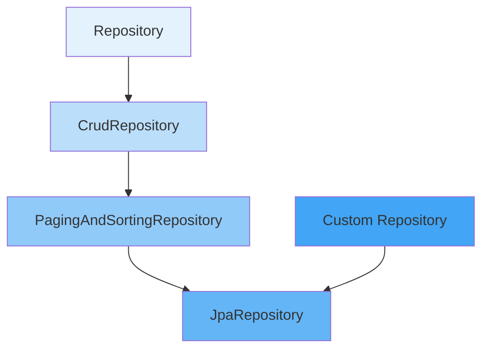

---
tags:
  - Repository
  - Spring Data JPA
  - CRUD操作
  - 查询方法
  - 数据访问
created: 2025-11-19
modified: 2025-11-19
category: 数据库技术
difficulty: intermediate
---

# 03-数据访问层Repository

> **学习目标**: 掌握Spring Data JPA Repository接口，实现简单的CRUD操作

## 🎯 本章概览

**学习时间**: 75-90分钟 | **难度等级**: ⭐⭐⭐ | **重点程度**: 🔥🔥🔥🔥

Repository是Spring Data JPA的核心，它提供了强大的数据访问能力。本章将教你如何使用Repository接口实现简单的CRUD操作，这是数据库编程的基础技能。

---

## 📋 核心需求

### 🎯 业务目标
- 实现用户和商品的基础CRUD操作
- 提供简单的查询功能
- 为业务层提供数据访问接口
- 确保数据操作的安全性和可靠性

### 🛠️ 技术需求
- Spring Data JPA Repository接口
- 自定义查询方法
- 分页和排序功能
- 基础的事务管理

---

## 🏗️ Repository核心概念

### 🎯 Repository接口体系



**接口层次说明**:
- `Repository`: 标记接口，提供类型安全
- `CrudRepository`: 提供基础CRUD操作
- `PagingAndSortingRepository`: 增加分页和排序功能
- `JpaRepository`: 增加批量操作等JPA特定功能

---

## 💻 实战：Repository接口实现

### 1️⃣ 用户Repository

```java
package com.cmliy.springweb.repository;

import com.cmliy.springweb.model.User;
import org.springframework.data.domain.Page;
import org.springframework.data.domain.Pageable;
import org.springframework.data.jpa.repository.JpaRepository;
import org.springframework.data.jpa.repository.Query;
import org.springframework.data.repository.query.Param;
import org.springframework.stereotype.Repository;

import java.util.List;
import java.util.Optional;

@Repository
public interface UserRepository extends JpaRepository<User, Long> {

    // 🔍 根据用户名查找用户
    Optional<User> findByUsername(String username);

    // 🔍 根据邮箱查找用户
    Optional<User> findByEmail(String email);

    // 🔍 根据用户名或邮箱查找用户
    Optional<User> findByUsernameOrEmail(String username, String email);

    // 👥 根据角色查找用户列表
    List<User> findByRole(String role);

    // 📊 分页查询用户（按创建时间倒序）
    Page<User> findByOrderByCreatedAtDesc(Pageable pageable);

    // 🔍 自定义查询：根据关键词搜索用户
    @Query("SELECT u FROM User u WHERE " +
           "LOWER(u.username) LIKE LOWER(CONCAT('%', :keyword, '%')) OR " +
           "LOWER(u.email) LIKE LOWER(CONCAT('%', :keyword, '%'))")
    Page<User> searchUsers(@Param("keyword") String keyword, Pageable pageable);

    // 📊 统计用户数量
    long countByRole(String role);

    // 🔍 检查用户名是否存在
    boolean existsByUsername(String username);

    // 🔍 检查邮箱是否存在
    boolean existsByEmail(String email);
}
```

### 2️⃣ 商品Repository

```java
package com.cmliy.springweb.repository;

import com.cmliy.springweb.model.Product;
import org.springframework.data.domain.Page;
import org.springframework.data.domain.Pageable;
import org.springframework.data.jpa.repository.JpaRepository;
import org.springframework.data.jpa.repository.Query;
import org.springframework.data.repository.query.Param;
import org.springframework.stereotype.Repository;

import java.math.BigDecimal;
import java.util.List;

@Repository
public interface ProductRepository extends JpaRepository<Product, Long> {

    // 🔍 根据商品名称查找
    List<Product> findByNameContainingIgnoreCase(String name);

    // 📦 根据分类查找商品
    List<Product> findByCategory(String category);

    // 💰 根据价格范围查找商品
    List<Product> findByPriceBetween(BigDecimal minPrice, BigDecimal maxPrice);

    // 📊 分页查询商品（按价格升序）
    Page<Product> findByOrderByPriceAsc(Pageable pageable);

    // 📊 分页查询商品（按创建时间倒序）
    Page<Product> findByOrderByCreatedAtDesc(Pageable pageable);

    // 🔍 复合条件查询：分类 + 价格范围
    @Query("SELECT p FROM Product p WHERE " +
           "(:category IS NULL OR p.category = :category) AND " +
           "(:minPrice IS NULL OR p.price >= :minPrice) AND " +
           "(:maxPrice IS NULL OR p.price <= :maxPrice)")
    Page<Product> findProductsByConditions(
            @Param("category") String category,
            @Param("minPrice") BigDecimal minPrice,
            @Param("maxPrice") BigDecimal maxPrice,
            Pageable pageable);

    // 🔍 搜索商品（名称或描述）
    @Query("SELECT p FROM Product p WHERE " +
           "LOWER(p.name) LIKE LOWER(CONCAT('%', :keyword, '%')) OR " +
           "LOWER(p.description) LIKE LOWER(CONCAT('%', :keyword, '%'))")
    Page<Product> searchProducts(@Param("keyword") String keyword, Pageable pageable);

    // 📊 统计商品数量
    long countByCategory(String category);

    // 🔍 检查商品名是否存在
    boolean existsByName(String name);
}
```

---

## 🛠️ Repository服务层封装

### 1️⃣ 用户服务

```java
package com.cmliy.springweb.service;

import com.cmliy.springweb.model.User;
import com.cmliy.springweb.repository.UserRepository;
import org.springframework.beans.factory.annotation.Autowired;
import org.springframework.data.domain.Page;
import org.springframework.data.domain.Pageable;
import org.springframework.stereotype.Service;
import org.springframework.transaction.annotation.Transactional;

import java.util.List;
import java.util.Optional;

@Service
@Transactional
public class UserService {

    @Autowired
    private UserRepository userRepository;

    // 👤 创建用户
    public User createUser(User user) {
        // 🔍 检查用户名是否已存在
        if (userRepository.existsByUsername(user.getUsername())) {
            throw new RuntimeException("用户名已存在: " + user.getUsername());
        }

        // 🔍 检查邮箱是否已存在
        if (userRepository.existsByEmail(user.getEmail())) {
            throw new RuntimeException("邮箱已存在: " + user.getEmail());
        }

        // 💾 保存用户
        return userRepository.save(user);
    }

    // 🔍 根据ID查找用户
    @Transactional(readOnly = true)
    public Optional<User> findUserById(Long id) {
        return userRepository.findById(id);
    }

    // 🔍 根据用户名查找用户
    @Transactional(readOnly = true)
    public Optional<User> findUserByUsername(String username) {
        return userRepository.findByUsername(username);
    }

    // 🔍 根据邮箱查找用户
    @Transactional(readOnly = true)
    public Optional<User> findUserByEmail(String email) {
        return userRepository.findByEmail(email);
    }

    // 📝 更新用户信息
    public User updateUser(User user) {
        // 🔍 检查用户是否存在
        if (!userRepository.existsById(user.getId())) {
            throw new RuntimeException("用户不存在: " + user.getId());
        }

        // 💾 更新用户
        return userRepository.save(user);
    }

    // 🗑️ 删除用户
    public void deleteUser(Long id) {
        if (!userRepository.existsById(id)) {
            throw new RuntimeException("用户不存在: " + id);
        }
        userRepository.deleteById(id);
    }

    // 👥 获取所有用户
    @Transactional(readOnly = true)
    public List<User> getAllUsers() {
        return userRepository.findAll();
    }

    // 📊 分页查询用户
    @Transactional(readOnly = true)
    public Page<User> getUsersPage(Pageable pageable) {
        return userRepository.findByOrderByCreatedAtDesc(pageable);
    }

    // 🔍 搜索用户
    @Transactional(readOnly = true)
    public Page<User> searchUsers(String keyword, Pageable pageable) {
        return userRepository.searchUsers(keyword, pageable);
    }

    // 👥 根据角色获取用户
    @Transactional(readOnly = true)
    public List<User> getUsersByRole(String role) {
        return userRepository.findByRole(role);
    }
}
```

### 2️⃣ 商品服务

```java
package com.cmliy.springweb.service;

import com.cmliy.springweb.model.Product;
import com.cmliy.springweb.repository.ProductRepository;
import org.springframework.beans.factory.annotation.Autowired;
import org.springframework.data.domain.Page;
import org.springframework.data.domain.Pageable;
import org.springframework.stereotype.Service;
import org.springframework.transaction.annotation.Transactional;

import java.math.BigDecimal;
import java.util.List;
import java.util.Optional;

@Service
@Transactional
public class ProductService {

    @Autowired
    private ProductRepository productRepository;

    // 📦 创建商品
    public Product createProduct(Product product) {
        // 🔍 检查商品名是否已存在
        if (productRepository.existsByName(product.getName())) {
            throw new RuntimeException("商品名称已存在: " + product.getName());
        }

        // 💾 保存商品
        return productRepository.save(product);
    }

    // 🔍 根据ID查找商品
    @Transactional(readOnly = true)
    public Optional<Product> findProductById(Long id) {
        return productRepository.findById(id);
    }

    // 📝 更新商品信息
    public Product updateProduct(Product product) {
        // 🔍 检查商品是否存在
        if (!productRepository.existsById(product.getId())) {
            throw new RuntimeException("商品不存在: " + product.getId());
        }

        // 💾 更新商品
        return productRepository.save(product);
    }

    // 🗑️ 删除商品
    public void deleteProduct(Long id) {
        if (!productRepository.existsById(id)) {
            throw new RuntimeException("商品不存在: " + id);
        }
        productRepository.deleteById(id);
    }

    // 📦 获取所有商品
    @Transactional(readOnly = true)
    public List<Product> getAllProducts() {
        return productRepository.findAll();
    }

    // 📊 分页查询商品
    @Transactional(readOnly = true)
    public Page<Product> getProductsPage(Pageable pageable) {
        return productRepository.findByOrderByCreatedAtDesc(pageable);
    }

    // 🔍 搜索商品
    @Transactional(readOnly = true)
    public Page<Product> searchProducts(String keyword, Pageable pageable) {
        return productRepository.searchProducts(keyword, pageable);
    }

    // 📦 根据分类获取商品
    @Transactional(readOnly = true)
    public List<Product> getProductsByCategory(String category) {
        return productRepository.findByCategory(category);
    }

    // 💰 根据价格范围获取商品
    @Transactional(readOnly = true)
    public List<Product> getProductsByPriceRange(BigDecimal minPrice, BigDecimal maxPrice) {
        return productRepository.findByPriceBetween(minPrice, maxPrice);
    }

    // 🔍 条件查询商品
    @Transactional(readOnly = true)
    public Page<Product> findProductsByConditions(String category,
                                                 BigDecimal minPrice,
                                                 BigDecimal maxPrice,
                                                 Pageable pageable) {
        return productRepository.findProductsByConditions(category, minPrice, maxPrice, pageable);
    }
}
```

---

## 🧪 Repository测试

### 1️⃣ 用户Repository测试

```java
@SpringBootTest
@TestMethodOrder(OrderAnnotation.class)
public class UserRepositoryTest {

    @Autowired
    private UserRepository userRepository;

    private User testUser;

    @BeforeEach
    public void setUp() {
        testUser = new User();
        testUser.setUsername("testuser_" + System.currentTimeMillis());
        testUser.setEmail("test_" + System.currentTimeMillis() + "@example.com");
        testUser.setPassword("password123");
        testUser.setRole("USER");
    }

    @Test
    @Order(1)
    public void testCreateUser() {
        // 💾 保存用户
        User savedUser = userRepository.save(testUser);

        // ✅ 验证保存结果
        assertNotNull(savedUser.getId());
        assertEquals(testUser.getUsername(), savedUser.getUsername());
        assertEquals(testUser.getEmail(), savedUser.getEmail());

        System.out.println("✅ 用户创建成功: " + savedUser);
    }

    @Test
    @Order(2)
    public void testFindUserByUsername() {
        // 💾 先保存用户
        User savedUser = userRepository.save(testUser);

        // 🔍 根据用户名查找
        Optional<User> foundUser = userRepository.findByUsername(savedUser.getUsername());

        // ✅ 验证查找结果
        assertTrue(foundUser.isPresent());
        assertEquals(savedUser.getUsername(), foundUser.get().getUsername());

        System.out.println("✅ 用户名查找成功: " + foundUser.get());
    }

    @Test
    @Order(3)
    public void testExistsByUsername() {
        // 💾 先保存用户
        userRepository.save(testUser);

        // 🔍 检查用户名是否存在
        boolean exists = userRepository.existsByUsername(testUser.getUsername());

        // ✅ 验证检查结果
        assertTrue(exists);

        System.out.println("✅ 用户名存在性检查成功: " + exists);
    }

    @Test
    @Order(4)
    public void testCountByRole() {
        // 💾 保存多个用户
        userRepository.save(testUser);

        User adminUser = new User();
        adminUser.setUsername("admin_" + System.currentTimeMillis());
        adminUser.setEmail("admin_" + System.currentTimeMillis() + "@example.com");
        adminUser.setPassword("admin123");
        adminUser.setRole("ADMIN");
        userRepository.save(adminUser);

        // 📊 统计用户数量
        long userCount = userRepository.countByRole("USER");
        long adminCount = userRepository.countByRole("ADMIN");

        // ✅ 验证统计结果
        assertTrue(userCount >= 1);
        assertTrue(adminCount >= 1);

        System.out.println("✅ 角色统计成功 - USER: " + userCount + ", ADMIN: " + adminCount);
    }

    @Test
    @Order(5)
    public void testSearchUsers() {
        // 💾 保存测试用户
        userRepository.save(testUser);

        // 🔍 搜索用户
        Pageable pageable = PageRequest.of(0, 10);
        Page<User> searchResult = userRepository.searchUsers("test", pageable);

        // ✅ 验证搜索结果
        assertTrue(searchResult.getContent().size() >= 1);
        assertTrue(searchResult.getContent().get(0).getUsername().contains("test"));

        System.out.println("✅ 用户搜索成功，找到 " + searchResult.getTotalElements() + " 个结果");
    }
}
```

### 2️⃣ 商品Repository测试

```java
@SpringBootTest
@TestMethodOrder(OrderAnnotation.class)
public class ProductRepositoryTest {

    @Autowired
    private ProductRepository productRepository;

    private Product testProduct;

    @BeforeEach
    public void setUp() {
        testProduct = new Product();
        testProduct.setName("测试商品_" + System.currentTimeMillis());
        testProduct.setDescription("这是一个测试商品的描述");
        testProduct.setPrice(new BigDecimal("99.99"));
        testProduct.setStock(100);
        testProduct.setCategory("服装");
    }

    @Test
    @Order(1)
    public void testCreateProduct() {
        // 💾 保存商品
        Product savedProduct = productRepository.save(testProduct);

        // ✅ 验证保存结果
        assertNotNull(savedProduct.getId());
        assertEquals(testProduct.getName(), savedProduct.getName());
        assertEquals(testProduct.getPrice(), savedProduct.getPrice());

        System.out.println("✅ 商品创建成功: " + savedProduct);
    }

    @Test
    @Order(2)
    public void testFindByNameContaining() {
        // 💾 保存商品
        productRepository.save(testProduct);

        // 🔍 根据名称模糊查找
        List<Product> foundProducts = productRepository.findByNameContainingIgnoreCase("测试商品");

        // ✅ 验证查找结果
        assertTrue(foundProducts.size() >= 1);
        assertTrue(foundProducts.get(0).getName().contains("测试商品"));

        System.out.println("✅ 商品名称模糊查找成功: " + foundProducts.size() + " 个结果");
    }

    @Test
    @Order(3)
    public void testFindByPriceBetween() {
        // 💾 保存商品
        productRepository.save(testProduct);

        // 🔍 根据价格范围查找
        BigDecimal minPrice = new BigDecimal("50.00");
        BigDecimal maxPrice = new BigDecimal("150.00");
        List<Product> foundProducts = productRepository.findByPriceBetween(minPrice, maxPrice);

        // ✅ 验证查找结果
        assertTrue(foundProducts.size() >= 1);
        for (Product product : foundProducts) {
            assertTrue(product.getPrice().compareTo(minPrice) >= 0);
            assertTrue(product.getPrice().compareTo(maxPrice) <= 0);
        }

        System.out.println("✅ 价格范围查找成功: " + foundProducts.size() + " 个结果");
    }

    @Test
    @Order(4)
    public void testSearchProducts() {
        // 💾 保存商品
        productRepository.save(testProduct);

        // 🔍 搜索商品
        Pageable pageable = PageRequest.of(0, 10);
        Page<Product> searchResult = productRepository.searchProducts("测试", pageable);

        // ✅ 验证搜索结果
        assertTrue(searchResult.getContent().size() >= 1);

        System.out.println("✅ 商品搜索成功，找到 " + searchResult.getTotalElements() + " 个结果");
    }
}
```

---

## 🚀 常见问题与解决方案

### ❓ 问题1: 查询方法命名错误

**错误**: `PropertyReferenceException: No property 'nam' found for type 'Product'`

**解决方案**:
```java
// ❌ 错误的查询方法名
List<Product> findByNam(String name);

// ✅ 正确的查询方法名
List<Product> findByName(String name);
```

### ❓ 问题2: 分页参数错误

**错误**: `Pageable中的参数无效`

**解决方案**:
```java
// ✅ 正确的分页参数
Pageable pageable = PageRequest.of(0, 10);  // 页码从0开始
Page<Product> page = productRepository.findAll(pageable);
```

### ❓ 问题3: 事务注解使用不当

**错误**: 修改操作没有事务支持

**解决方案**:
```java
@Service
@Transactional  // 在类级别添加事务
public class UserService {

    @Transactional(readOnly = true)  // 只读操作
    public List<User> getAllUsers() {
        return userRepository.findAll();
    }

    // 写操作使用默认事务
    public User createUser(User user) {
        return userRepository.save(user);
    }
}
```

---

## 📊 Repository最佳实践

### ✅ 推荐做法

1. **📝 使用有意义的查询方法名**
2. **🔍 只查询必要的数据**
3. **📊 合理使用分页查询**
4. **💾 正确使用事务注解**
5. **🧪 编写完整的Repository测试**
6. **🛡️ 在Service层处理业务逻辑**

### ❌ 避免做法

1. **🚫 在Controller中直接调用Repository**
2. **🚫 过度复杂的自定义查询**
3. **🚫 忽略事务管理**
4. **🚫 返回实体对象而不是DTO**
5. **🚫 不进行参数验证**

---

## 📝 本章小结

### ✅ 已掌握技能

- [ ] **理解** Repository接口体系
- [ ] **能够** 创建自定义Repository接口
- [ ] **掌握** 查询方法命名规则
- [ ] **了解** 分页和排序功能
- [ ] **能够** 封装Service层

### 🎯 关键要点

1. **Repository接口** - 提供强大的数据访问能力
2. **查询方法** - 通过方法名自动生成查询
3. **分页支持** - 处理大量数据的分页查询
4. **服务封装** - 在Service层处理业务逻辑

### 🚀 下一步学习

现在你已经掌握了Repository数据访问，接下来可以学习：
- → **04-高级查询技术** - 掌握复杂查询方法
- → **05-事务管理** - 学习事务控制机制
- → **实战项目** - 开始实现完整的业务功能

---

**记住：Repository是数据访问的门户，良好的设计是系统性能的基础！** 🎉

---