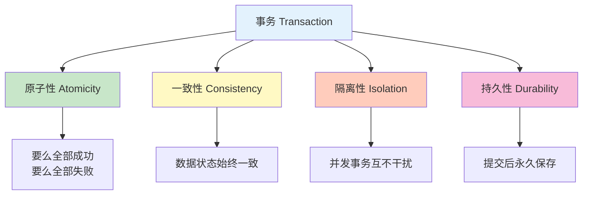

---
tags:
  - 事务管理
  - Spring事务
  - 传播行为
  - 隔离级别
  - 回滚
created: 2025-11-19
modified: 2025-11-19
category: 数据库技术
difficulty: intermediate
---

# 05-事务管理

> **学习目标**: 掌握Spring事务管理机制，确保数据操作的一致性和可靠性

## 🎯 本章概览

**学习时间**: 60-75分钟 | **难度等级**: ⭐⭐⭐⭐ | **重点程度**: 🔥🔥🔥

事务管理是保证数据一致性的重要机制。本章将教你Spring事务管理的核心概念和在简单CRUD操作中的应用，确保你的数据库操作安全可靠。

---

## 📋 核心需求

### 🎯 业务目标
- 确保数据库操作的原子性
- 处理业务操作中的异常回滚
- 控制事务的传播行为
- 保证数据的一致性

### 🛠️ 技术需求
- Spring事务注解使用
- 事务传播行为理解
- 异常处理与回滚
- 事务边界控制

---

## 🏗️ 事务管理核心概念

### 🔄 事务ACID特性



### 🎯 Spring事务传播行为

| 传播行为 | 说明 | 使用场景 |
|----------|------|----------|
| `REQUIRED` | 默认值，有事务则加入，无则创建 | 大多数业务方法 |
| `REQUIRES_NEW` | 总是创建新事务 | 需要独立事务的操作 |
| `SUPPORTS` | 有事务则加入，无则非事务执行 | 查询操作 |
| `NOT_SUPPORTED` | 总是非事务执行 | 不需要事务的操作 |
| `MANDATORY` | 必须在事务中执行，否则抛异常 | 强制事务要求 |
| `NEVER` | 必须非事务执行，否则抛异常 | 禁止事务的操作 |

---

## 💻 实战：Spring事务配置

### 1️⃣ 事务配置类

```java
@Configuration
@EnableTransactionManagement  // 🎯 启用事务管理
public class TransactionConfig {

    // 🎯 事务管理器配置（Spring Boot自动配置，通常不需要手动配置）
    @Bean
    public PlatformTransactionManager transactionManager(EntityManagerFactory entityManagerFactory) {
        return new JpaTransactionManager(entityManagerFactory);
    }

    // 🎯 事务模板（编程式事务）
    @Bean
    public TransactionTemplate transactionTemplate(PlatformTransactionManager transactionManager) {
        TransactionTemplate template = new TransactionTemplate(transactionManager);
        template.setPropagationBehavior(TransactionDefinition.PROPAGATION_REQUIRED);
        template.setIsolationLevel(TransactionDefinition.ISOLATION_READ_COMMITTED);
        template.setTimeout(30);  // 30秒超时
        return template;
    }
}
```

### 2️⃣ 用户服务事务管理

```java
@Service
@Transactional  // 🎯 类级别事务：所有public方法都启用事务
public class UserService {

    @Autowired
    private UserRepository userRepository;
    @Autowired
    private AuditLogService auditLogService;

    // 👤 创建用户（默认事务传播）
    @Transactional
    public User createUser(User user) {
        // 🔍 检查用户名唯一性
        if (userRepository.existsByUsername(user.getUsername())) {
            throw new BusinessException("用户名已存在: " + user.getUsername());
        }

        // 🔍 检查邮箱唯一性
        if (userRepository.existsByEmail(user.getEmail())) {
            throw new BusinessException("邮箱已存在: " + user.getEmail());
        }

        // 💾 保存用户
        User savedUser = userRepository.save(user);

        // 📝 记录审计日志（同一事务）
        auditLogService.logUserAction("CREATE_USER", savedUser.getId(),
                                     "创建用户: " + savedUser.getUsername());

        return savedUser;
    }

    // 📝 更新用户信息
    @Transactional
    public User updateUser(Long userId, UserUpdateRequest request) {
        // 🔍 查找用户
        User user = userRepository.findById(userId)
            .orElseThrow(() -> new BusinessException("用户不存在: " + userId));

        // 📝 记录更新前状态
        String oldInfo = user.toString();

        // 🔄 更新用户信息
        if (request.getUsername() != null) {
            user.setUsername(request.getUsername());
        }
        if (request.getEmail() != null) {
            user.setEmail(request.getEmail());
        }

        // 💾 保存更新
        User updatedUser = userRepository.save(user);

        // 📝 记录审计日志
        auditLogService.logUserAction("UPDATE_USER", userId,
                                     String.format("更新用户信息: %s -> %s", oldInfo, updatedUser));

        return updatedUser;
    }

    // 🔄 批量更新用户角色
    @Transactional
    public int batchUpdateUserRole(List<Long> userIds, String newRole) {
        int updatedCount = 0;

        for (Long userId : userIds) {
            User user = userRepository.findById(userId)
                .orElseThrow(() -> new BusinessException("用户不存在: " + userId));

            String oldRole = user.getRole();
            user.setRole(newRole);
            userRepository.save(user);

            // 📝 记录角色变更日志
            auditLogService.logUserAction("CHANGE_ROLE", userId,
                                         String.format("角色变更: %s -> %s", oldRole, newRole));

            updatedCount++;
        }

        return updatedCount;
    }

    // 🗑️ 删除用户（级联删除相关数据）
    @Transactional
    public void deleteUser(Long userId) {
        User user = userRepository.findById(userId)
            .orElseThrow(() -> new BusinessException("用户不存在: " + userId));

        // 📝 记录删除日志（在删除前记录）
        auditLogService.logUserAction("DELETE_USER", userId,
                                     "删除用户: " + user.getUsername());

        // 🗑️ 删除用户（会级联删除相关数据）
        userRepository.deleteById(userId);
    }

    // 🔄 转账示例（需要事务保证一致性）
    @Transactional
    public void transferUserPoints(Long fromUserId, Long toUserId, Integer points) {
        if (points <= 0) {
            throw new BusinessException("转账积分必须大于0");
        }

        User fromUser = userRepository.findById(fromUserId)
            .orElseThrow(() -> new BusinessException("转出用户不存在: " + fromUserId));

        User toUser = userRepository.findById(toUserId)
            .orElseThrow(() -> new BusinessException("转入用户不存在: " + toUserId));

        // 🔍 检查余额
        if (fromUser.getPoints() < points) {
            throw new BusinessException("积分余额不足");
        }

        // 💸 扣除转出用户积分
        fromUser.setPoints(fromUser.getPoints() - points);
        userRepository.save(fromUser);

        // 💸 增加转入用户积分
        toUser.setPoints(toUser.getPoints() + points);
        userRepository.save(toUser);

        // 📝 记录转账日志
        auditLogService.logUserAction("TRANSFER_POINTS", fromUserId,
                                     String.format("向用户%d转账%d积分", toUserId, points));
        auditLogService.logUserAction("RECEIVE_POINTS", toUserId,
                                     String.format("从用户%d接收%d积分", fromUserId, points));
    }

    // 🔍 只读查询（只读事务优化）
    @Transactional(readOnly = true)
    public User getUserById(Long userId) {
        return userRepository.findById(userId)
            .orElseThrow(() -> new BusinessException("用户不存在: " + userId));
    }

    // 📊 用户统计（只读事务）
    @Transactional(readOnly = true)
    public UserStatistics getUserStatistics() {
        long totalUsers = userRepository.count();
        long activeUsers = userRepository.countByLastLoginTimeAfter(
            LocalDateTime.now().minusDays(30));

        return new UserStatistics(totalUsers, activeUsers);
    }
}
```

---

## 🛠️ 复杂事务场景

### 1️⃣ 嵌套事务处理

```java
@Service
public class OrderService {

    @Autowired
    private UserService userService;
    @Autowired
    private ProductService productService;
    @Autowired
    private OrderRepository orderRepository;
    @Autowired
    private InventoryService inventoryService;

    // 🛒 创建订单（主事务）
    @Transactional
    public Order createOrder(Long userId, List<OrderItemRequest> items) {
        // 🔍 验证用户
        User user = userService.getUserById(userId);

        // 📦 创建订单
        Order order = new Order();
        order.setUserId(userId);
        order.setStatus("PENDING");
        order.setTotalAmount(BigDecimal.ZERO);
        order.setCreatedAt(LocalDateTime.now());

        // 🛍️ 处理订单项（嵌套事务）
        for (OrderItemRequest item : items) {
            processOrderItem(order, item);
        }

        // 💾 保存订单
        Order savedOrder = orderRepository.save(order);

        // 📉 扣减库存（独立事务）
        try {
            inventoryService.deductInventory(items);
        } catch (InsufficientInventoryException e) {
            throw new BusinessException("库存不足，订单创建失败");
        }

        return savedOrder;
    }

    // 🛍️ 处理订单项（当前事务的一部分）
    @Transactional(propagation = Propagation.REQUIRED)  // 默认传播行为
    private void processOrderItem(Order order, OrderItemRequest item) {
        // 🔍 验证商品
        Product product = productService.getProductById(item.getProductId());

        // 💰 计算小计
        BigDecimal subtotal = product.getPrice().multiply(BigDecimal.valueOf(item.getQuantity()));

        // 📦 添加订单项
        OrderItem orderItem = new OrderItem();
        orderItem.setProductId(item.getProductId());
        orderItem.setQuantity(item.getQuantity());
        orderItem.setUnitPrice(product.getPrice());
        orderItem.setSubtotal(subtotal);

        order.addItem(orderItem);

        // 🔄 更新订单总金额
        order.setTotalAmount(order.getTotalAmount().add(subtotal));
    }
}
```

### 2️⃣ 独立事务处理

```java
@Service
public class AuditLogService {

    @Autowired
    private AuditLogRepository auditLogRepository;

    // 📝 记录审计日志（独立事务）
    @Transactional(propagation = Propagation.REQUIRES_NEW)  // 总是创建新事务
    public void logUserAction(String action, Long userId, String description) {
        try {
            AuditLog log = new AuditLog();
            log.setAction(action);
            log.setUserId(userId);
            log.setDescription(description);
            log.setCreatedAt(LocalDateTime.now());
            log.setIpAddress(getCurrentIpAddress());

            auditLogRepository.save(log);
        } catch (Exception e) {
            // 🚨 日志记录失败不应影响主业务
            System.err.println("审计日志记录失败: " + e.getMessage());
            // 不抛出异常，避免影响主事务
        }
    }

    // 📊 清理旧日志（独立事务）
    @Transactional(propagation = Propagation.REQUIRES_NEW)
    public int cleanOldLogs(int daysToKeep) {
        LocalDateTime cutoffDate = LocalDateTime.now().minusDays(daysToKeep);
        return auditLogRepository.deleteByCreatedAtBefore(cutoffDate);
    }

    private String getCurrentIpAddress() {
        // 获取当前请求IP地址的实现
        return "127.0.0.1";  // 简化实现
    }
}
```

---

## 🧪 事务测试

### 1️⃣ 事务回滚测试

```java
@SpringBootTest
@TestMethodOrder(OrderAnnotation.class)
public class TransactionManagementTest {

    @Autowired
    private UserService userService;

    @Test
    @Order(1)
    public void testTransactionRollbackOnException() {
        // 📊 初始用户数量
        long initialCount = userService.count();

        // 👤 创建一个会失败的用户（邮箱重复）
        User user = new User();
        user.setUsername("rollback_test");
        user.setEmail("existing@example.com");  // 假设这个邮箱已存在
        user.setPassword("password123");

        // ❌ 预期会抛出异常并回滚
        assertThrows(BusinessException.class, () -> {
            userService.createUser(user);
        });

        // ✅ 验证事务回滚：用户数量没有增加
        long finalCount = userService.count();
        assertEquals(initialCount, finalCount);

        System.out.println("✅ 事务回滚测试通过：异常后数据未发生变化");
    }

    @Test
    @Order(2)
    public void testSuccessfulTransaction() {
        // 📊 初始用户数量
        long initialCount = userService.count();

        // 👤 创建正常用户
        User user = new User();
        user.setUsername("success_test_" + System.currentTimeMillis());
        user.setEmail("success_" + System.currentTimeMillis() + "@example.com");
        user.setPassword("password123");

        // ✅ 成功创建用户
        User savedUser = userService.createUser(user);

        // ✅ 验证事务提交：用户数量增加
        long finalCount = userService.count();
        assertEquals(initialCount + 1, finalCount);
        assertNotNull(savedUser.getId());

        System.out.println("✅ 成功事务测试通过：数据正确保存");
    }

    @Test
    @Order(3)
    public void testNestedTransaction() {
        // 👤 创建测试用户
        User user = new User();
        user.setUsername("nested_test_" + System.currentTimeMillis());
        user.setEmail("nested_" + System.currentTimeMillis() + "@example.com");
        user.setPassword("password123");
        user.setPoints(100);

        User savedUser = userService.createUser(user);
        assertNotNull(savedUser.getId());

        // 🔄 测试转账（涉及多个更新操作）
        Long fromUserId = savedUser.getId();

        // 👤 创建另一个用户
        User toUser = new User();
        toUser.setUsername("receiver_" + System.currentTimeMillis());
        toUser.setEmail("receiver_" + System.currentTimeMillis() + "@example.com");
        toUser.setPassword("password123");
        toUser.setPoints(50);

        User savedToUser = userService.createUser(toUser);
        Long toUserId = savedToUser.getId();

        // 💸 执行转账
        userService.transferUserPoints(fromUserId, toUserId, 30);

        // ✅ 验证转账结果
        User updatedFromUser = userService.getUserById(fromUserId);
        User updatedToUser = userService.getUserById(toUserId);

        assertEquals(70, updatedFromUser.getPoints());  // 100 - 30
        assertEquals(80, updatedToUser.getPoints());    // 50 + 30

        System.out.println("✅ 嵌套事务测试通过：转账操作成功");
    }
}
```

---

## 🚀 常见问题与解决方案

### ❓ 问题1: 事务不回滚

**现象**: 抛出异常后数据仍然被保存

**解决方案**:
```java
// ✅ 明确指定回滚异常类型
@Transactional(rollbackFor = {BusinessException.class, RuntimeException.class})
public void createUser(User user) {
    // 业务逻辑
}

// 或者捕获异常后手动标记回滚
@Transactional
public void createUser(User user) {
    try {
        // 业务逻辑
    } catch (Exception e) {
        TransactionAspectSupport.currentTransactionStatus().setRollbackOnly();
        throw e;
    }
}
```

### ❓ 问题2: 只读事务中的写操作

**现象**: 在只读事务中进行写操作报错

**解决方案**:
```java
// ❌ 错误：只读事务不能写数据
@Transactional(readOnly = true)
public void updateUser(User user) {
    userRepository.save(user);  // 会抛出异常
}

// ✅ 正确：写操作使用读写事务
@Transactional
public void updateUser(User user) {
    userRepository.save(user);
}
```

### ❓ 问题3: 事务传播行为配置错误

**现象**: 嵌套事务行为不符合预期

**解决方案**:
```java
// ✅ 根据业务需求选择正确的传播行为
@Transactional(propagation = Propagation.REQUIRES_NEW)  // 独立事务
public void logOperation(String message) {
    // 日志记录逻辑
}

@Transactional(propagation = Propagation.REQUIRED)     // 加入现有事务
public void businessOperation() {
    // 业务逻辑
    logOperation("操作完成");  // 会在同一事务中执行
}
```

---

## 📊 事务最佳实践

### ✅ 推荐做法

1. **🎯 明确事务边界** - 在Service层管理事务
2. **🔄 合理设置传播行为** - 根据业务需求选择
3. **🚨 正确处理异常** - 指定回滚异常类型
4. **📊 只读事务优化** - 查询操作使用只读事务
5. **⏰ 设置合理超时** - 避免长时间事务
6. **🧪 编写事务测试** - 验证回滚和提交行为

### ❌ 避免做法

1. **🚫 在Controller层管理事务**
2. **🚫 过长的事务时间**
3. **🚫 忽略异常处理**
4. **🚫 滥用REQUIRES_NEW传播**
5. **🚫 在事务中进行外部调用**

---

## 📝 本章小结

### ✅ 已掌握技能

- [ ] **理解** 事务ACID特性
- [ ] **能够** 配置Spring事务
- [ ] **掌握** 事务传播行为
- [ ] **了解** 异常处理与回滚
- [ ] **能够** 测试事务行为

### 🎯 关键要点

1. **事务管理** - 保证数据操作的原子性和一致性
2. **传播行为** - 控制事务之间的边界和关系
3. **异常处理** - 正确处理异常以确保事务回滚
4. **性能优化** - 合理使用只读事务和超时设置

### 🚀 下一步学习

现在你已经掌握了事务管理，接下来可以学习：
- → **06-性能优化** - 学习数据库性能调优
- → **功能一后端开发** - 开始实现用户认证系统
- → **实战项目** - 应用事务管理到实际业务

---

**记住：正确的事务管理是数据一致性的重要保障！** 🎉

---