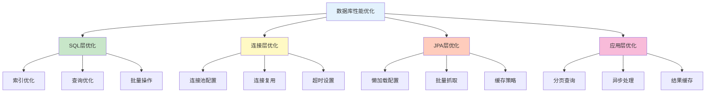

---
tags:
  - 性能优化
  - SQL优化
  - JPA调优
  - 缓存策略
  - 连接池优化
created: 2025-11-19
modified: 2025-11-19
category: 数据库技术
difficulty: advanced
---

# 06-性能优化

> **学习目标**: 掌握数据库性能优化技巧，提升简单CRUD操作的执行效率

## 🎯 本章概览

**学习时间**: 60-90分钟 | **难度等级**: ⭐⭐⭐⭐⭐ | **重点程度**: 🔥🔥🔥🔥🔥🔥

性能优化是提升应用响应速度的关键。本章将教你实用的数据库优化技巧，重点关注简单CRUD操作的性能提升，让你的应用运行更快速。

---

## 📋 核心需求

### 🎯 业务目标
- 提升查询响应速度
- 减少数据库连接开销
- 优化批量操作性能
- 监控数据库性能指标

### 🛠️ 技术需求
- SQL查询优化
- JPA性能调优
- 连接池配置优化
- 基础缓存策略

---

## 🏗️ 性能优化核心策略

### 🎯 优化层次



---

## 💻 实战：连接池优化

### 1️⃣ HikariCP性能配置

```yaml
# 🎯 application.yml - 高性能连接池配置
spring:
  datasource:
    url: jdbc:mysql://localhost:3306/clothing_store?useSSL=false&serverTimezone=UTC&rewriteBatchedStatements=true
    username: root
    password: 123456
    driver-class-name: com.mysql.cj.jdbc.Driver

    # 🏊 HikariCP连接池优化
    hikari:
      # 🔗 基础连接配置
      maximum-pool-size: 20              # 最大连接数
      minimum-idle: 10                    # 最小空闲连接
      idle-timeout: 600000                # 空闲超时（10分钟）
      connection-timeout: 30000           # 连接超时（30秒）
      max-lifetime: 1800000               # 连接最大生存时间（30分钟）

      # 🚀 性能优化配置
      auto-commit: true                   # 自动提交
      connection-test-query: SELECT 1     # 连接测试查询
      validation-timeout: 5000            # 验证超时
      leak-detection-threshold: 60000     # 连接泄漏检测（1分钟）

      # 📊 监控配置
      pool-name: "ClothingStoreHikariCP"  # 连接池名称
      register-mbeans: true               # 注册JMX监控

  # 🎯 JPA性能优化
  jpa:
    hibernate:
      ddl-auto: update
    show-sql: false                      # 生产环境关闭SQL日志
    properties:
      hibernate:
        # 🚀 批处理优化
        jdbc:
          batch_size: 50                 # 批处理大小
          batch_versioned_data: true      # 批处理版本化数据
        order_inserts: true              # 优化插入顺序
        order_updates: true              # 优化更新顺序

        # 📊 查询优化
        query:
          plan_cache_max_size: 4096      # 查询计划缓存大小
          in_clause_parameter_padding: true

        # 🔍 统计监控
        generate_statistics: false       # 生产环境关闭统计
        session:
          events:
            log:
              statement_formatting: false
```

### 2️⃣ 连接池监控配置

```java
@Component
@Slf4j
public class ConnectionPoolMonitor {

    @Autowired
    private DataSource dataSource;

    @EventListener(ApplicationReadyEvent.class)
    public void logConnectionPoolInfo() {
        if (dataSource instanceof HikariDataSource) {
            HikariDataSource hikariDataSource = (HikariDataSource) dataSource;
            HikariPoolMXBean poolProxy = hikariDataSource.getHikariPoolMXBean();

            log.info("🏊 连接池信息:");
            log.info("  📊 活跃连接数: {}", poolProxy.getActiveConnections());
            log.info("  📊 空闲连接数: {}", poolProxy.getIdleConnections());
            log.info("  📊 总连接数: {}", poolProxy.getTotalConnections());
            log.info("  📊 等待线程数: {}", poolProxy.getThreadsAwaitingConnection());
            log.info("  📊 最大连接数: {}", hikariDataSource.getMaximumPoolSize());
        }
    }

    @Scheduled(fixedRate = 300000)  // 每5分钟监控一次
    public void monitorConnectionPool() {
        if (dataSource instanceof HikariDataSource) {
            HikariDataSource hikariDataSource = (HikariDataSource) dataSource;
            HikariPoolMXBean poolProxy = hikariDataSource.getHikariPoolMXBean();

            int active = poolProxy.getActiveConnections();
            int total = poolProxy.getTotalConnections();
            int max = hikariDataSource.getMaximumPoolSize();

            double usageRate = (double) active / max * 100;

            if (usageRate > 80) {
                log.warn("⚠️ 连接池使用率过高: {:.1f}% ({}/{})", usageRate, active, max);
            } else {
                log.info("📊 连接池状态: {:.1f}% ({}/{})", usageRate, active, max);
            }
        }
    }
}
```

---

## 🛠️ JPA性能优化

### 1️⃣ 实体层优化

```java
@Entity
@Table(name = "users", indexes = {
    @Index(name = "idx_username", columnList = "username"),
    @Index(name = "idx_email", columnList = "email"),
    @Index(name = "idx_role_created", columnList = "role, created_at")
})
@Cacheable  // 启用二级缓存
@org.hibernate.annotations.Cache(usage = CacheConcurrencyStrategy.READ_WRITE)
public class User {

    @Id
    @GeneratedValue(strategy = GenerationType.IDENTITY)
    private Long id;

    // 📝 字段长度优化
    @Column(name = "username", unique = true, nullable = false, length = 50)
    private String username;

    @Column(name = "email", unique = true, nullable = false, length = 100)
    private String email;

    // 📄 大字段使用延迟加载
    @Lob
    @Basic(fetch = FetchType.LAZY)
    @Column(name = "profile_data")
    private String profileData;

    // 🔗 一对多关系优化
    @OneToMany(mappedBy = "user", cascade = CascadeType.ALL, fetch = FetchType.LAZY)
    @BatchSize(size = 20)  // 批量抓取优化
    private List<Order> orders = new ArrayList<>();

    // 🎨 多对多关系优化
    @ManyToMany(fetch = FetchType.LAZY)
    @JoinTable(
        name = "user_roles",
        joinColumns = @JoinColumn(name = "user_id"),
        inverseJoinColumns = @JoinColumn(name = "role_id")
    )
    @BatchSize(size = 20)
    private Set<Role> roles = new HashSet<>();
}
```

### 2️⃣ Repository层优化

```java
@Repository
public interface UserRepository extends JpaRepository<User, Long>, JpaSpecificationExecutor<User> {

    // 🚀 批量操作优化
    @Modifying
    @Query("UPDATE User u SET u.lastLoginTime = :loginTime WHERE u.id = :userId")
    int updateLastLoginTime(@Param("userId") Long userId, @Param("loginTime") LocalDateTime loginTime);

    // 📊 批量更新用户状态
    @Modifying
    @Query("UPDATE User u SET u.status = :status WHERE u.id IN :userIds")
    int batchUpdateUserStatus(@Param("userIds") List<Long> userIds, @Param("status") String status);

    // 🔍 优化的用户搜索（使用索引）
    @Query("SELECT u FROM User u WHERE " +
           "(:username IS NULL OR u.username LIKE CONCAT('%', :username, '%')) AND " +
           "(:role IS NULL OR u.role = :role) AND " +
           "u.createdAt >= :startDate")
    Page<User> searchUsersOptimized(
            @Param("username") String username,
            @Param("role") String role,
            @Param("startDate") LocalDateTime startDate,
            Pageable pageable);

    // 📊 投影查询 - 只查询需要的字段
    @Query("SELECT new com.cmliy.springweb.dto.UserSummary(u.id, u.username, u.email, u.createdAt) " +
           "FROM User u WHERE u.role = :role")
    List<UserSummary> findUserSummariesByRole(@Param("role") String role);

    // 🔍 统计查询优化
    @Query("SELECT COUNT(u) FROM User u WHERE u.role = :role")
    long countByRole(@Param("role") String role);
}
```

### 3️⃣ 服务层批量优化

```java
@Service
@Transactional
public class OptimizedUserService {

    @Autowired
    private UserRepository userRepository;

    @PersistenceContext
    private EntityManager entityManager;

    // 🚀 批量插入优化
    @Transactional
    public List<User> batchCreateUsers(List<User> users) {
        List<User> savedUsers = new ArrayList<>();

        for (int i = 0; i < users.size(); i++) {
            User user = users.get(i);
            savedUsers.add(userRepository.save(user));

            // 🔄 批处理优化：每50个实体清理一次缓存
            if (i % 50 == 0) {
                entityManager.flush();
                entityManager.clear();
            }
        }

        return savedUsers;
    }

    // 🚀 批量更新优化
    @Transactional
    public int batchUpdateUsers(List<User> users) {
        int updatedCount = 0;

        for (int i = 0; i < users.size(); i++) {
            User user = users.get(i);
            entityManager.merge(user);

            // 🔄 批处理优化
            if (i % 50 == 0) {
                entityManager.flush();
                entityManager.clear();
            }
            updatedCount++;
        }

        return updatedCount;
    }

    // 📊 分页查询优化
    @Transactional(readOnly = true)
    public Page<UserSummary> getUsersPageOptimized(UserSearchCriteria criteria, Pageable pageable) {
        Specification<User> spec = buildSpecification(criteria);

        // 🎯 使用投影查询减少数据传输
        return userRepository.findAll(spec, pageable)
                .map(this::convertToSummary);
    }

    private UserSummary convertToSummary(User user) {
        return new UserSummary(
            user.getId(),
            user.getUsername(),
            user.getEmail(),
            user.getCreatedAt()
        );
    }

    private Specification<User> buildSpecification(UserSearchCriteria criteria) {
        return Specification.where(null)
                .and(criteria.hasUsername() ? UserSpecifications.hasUsername(criteria.getUsername()) : null)
                .and(criteria.hasRole() ? UserSpecifications.hasRole(criteria.getRole()) : null);
    }
}
```

---

## 🧪 性能测试

### 1️⃣ 查询性能测试

```java
@SpringBootTest
@TestMethodOrder(OrderAnnotation.class)
public class PerformanceTest {

    @Autowired
    private UserRepository userRepository;

    @Autowired
    private UserService userService;

    private List<Long> testUserIds;

    @BeforeEach
    public void setupTestData() {
        // 创建测试数据
        testUserIds = new ArrayList<>();
        for (int i = 0; i < 1000; i++) {
            User user = new User();
            user.setUsername("perf_test_" + i);
            user.setEmail("perf_test_" + i + "@example.com");
            user.setPassword("password123");
            user.setRole(i % 3 == 0 ? "ADMIN" : "USER");

            User saved = userRepository.save(user);
            testUserIds.add(saved.getId());
        }
    }

    @Test
    @Order(1)
    public void testSingleQueryPerformance() {
        long startTime = System.currentTimeMillis();

        // 🔍 单个用户查询
        for (Long userId : testUserIds.subList(0, 100)) {
            userRepository.findById(userId).orElse(null);
        }

        long endTime = System.currentTimeMillis();
        long duration = endTime - startTime;

        System.out.println("📊 单个查询100次耗时: " + duration + "ms");
        assertTrue("查询性能应该足够快", duration < 1000);
    }

    @Test
    @Order(2)
    public void testBatchQueryPerformance() {
        long startTime = System.currentTimeMillis();

        // 📊 批量查询
        List<User> users = userRepository.findAllById(testUserIds.subList(0, 100));

        long endTime = System.currentTimeMillis();
        long duration = endTime - startTime;

        assertEquals(100, users.size());
        System.out.println("📊 批量查询100个用户耗时: " + duration + "ms");
        assertTrue("批量查询应该更快", duration < 500);
    }

    @Test
    @Order(3)
    public void testProjectionQueryPerformance() {
        long startTime = System.currentTimeMillis();

        // 🎯 投影查询
        List<UserSummary> summaries = userRepository.findUserSummariesByRole("USER");

        long endTime = System.currentTimeMillis();
        long duration = endTime - startTime;

        assertFalse(summaries.isEmpty());
        System.out.println("📊 投影查询耗时: " + duration + "ms，返回" + summaries.size() + "条记录");
        assertTrue("投影查询应该更快", duration < 300);
    }

    @Test
    @Order(4)
    public void testBatchInsertPerformance() {
        // 清理测试数据
        userRepository.deleteAll();

        List<User> newUsers = new ArrayList<>();
        for (int i = 0; i < 500; i++) {
            User user = new User();
            user.setUsername("batch_insert_" + i);
            user.setEmail("batch_insert_" + i + "@example.com");
            user.setPassword("password123");
            user.setRole("USER");
            newUsers.add(user);
        }

        long startTime = System.currentTimeMillis();

        // 🚀 批量插入
        List<User> savedUsers = userService.batchCreateUsers(newUsers);

        long endTime = System.currentTimeMillis();
        long duration = endTime - startTime;

        assertEquals(500, savedUsers.size());
        System.out.println("📊 批量插入500个用户耗时: " + duration + "ms");
        assertTrue("批量插入应该高效", duration < 2000);
    }
}
```

---

## 🚀 常见性能问题与解决方案

### ❓ 问题1: N+1查询问题

**现象**: 查询1个主对象，触发N次关联对象查询

**解决方案**:
```java
// ❌ 问题代码
@Entity
public class User {
    @OneToMany(mappedBy = "user", fetch = FetchType.LAZY)  // 懒加载导致N+1
    private List<Order> orders;
}

// ✅ 解决方案1：使用JOIN FETCH
@Query("SELECT u FROM User u LEFT JOIN FETCH u.orders WHERE u.id = :userId")
User findUserWithOrders(@Param("userId") Long userId);

// ✅ 解决方案2：使用@BatchSize
@OneToMany(mappedBy = "user", fetch = FetchType.LAZY)
@BatchSize(size = 20)  // 批量抓取
private List<Order> orders;

// ✅ 解决方案3：使用EntityGraph
@EntityGraph(attributePaths = {"orders"})
List<User> findAllUsersWithOrders();
```

### ❓ 问题2: 连接池耗尽

**现象**: 获取连接超时，应用响应缓慢

**解决方案**:
```yaml
# 🎯 优化连接池配置
spring:
  datasource:
    hikari:
      maximum-pool-size: 30              # 增加最大连接数
      minimum-idle: 10                    # 保持最小连接
      connection-timeout: 60000           # 增加连接超时
      leak-detection-threshold: 30000     # 减少泄漏检测阈值
```

### ❓ 问题3: 查询慢

**现象**: 简单查询执行时间过长

**解决方案**:
```java
// ✅ 添加数据库索引
@Table(name = "users", indexes = {
    @Index(name = "idx_username", columnList = "username"),
    @Index(name = "idx_email", columnList = "email"),
    @Index(name = "idx_role_created", columnList = "role, created_at")
})

// ✅ 使用投影查询
@Query("SELECT new com.example.dto.UserSummary(u.id, u.username) FROM User u WHERE u.role = :role")
List<UserSummary> findUserSummariesByRole(@Param("role") String role);

// ✅ 分页查询大数据集
Page<User> users = userRepository.findAll(PageRequest.of(0, 50));
```

---

## 📊 性能监控指标

### 🎯 关键性能指标

| 指标 | 正常范围 | 说明 |
|------|----------|------|
| 连接池使用率 | < 80% | 活跃连接数/最大连接数 |
| 查询响应时间 | < 100ms | 简单查询执行时间 |
| 批处理吞吐量 | > 1000/s | 每秒处理记录数 |
| 缓存命中率 | > 80% | 二级缓存命中比例 |
| 内存使用率 | < 70% | JVM内存使用情况 |

### 📈 监控实现

```java
@Component
@Slf4j
public class PerformanceMonitor {

    @Autowired
    private MeterRegistry meterRegistry;

    @EventListener
    public void handleQueryExecution(QueryExecutionEvent event) {
        Timer.Sample sample = Timer.start(meterRegistry);
        sample.stop(Timer.builder("database.query.duration")
                .tag("query", event.getQueryName())
                .register(meterRegistry));
    }

    @Scheduled(fixedRate = 60000)  // 每分钟收集指标
    public void collectMetrics() {
        // 连接池指标
        collectConnectionPoolMetrics();

        // JVM指标
        collectJVMMetrics();
    }

    private void collectConnectionPoolMetrics() {
        // 实现连接池指标收集
    }

    private void collectJVMMetrics() {
        // 实现JVM指标收集
    }
}
```

---

## 📝 本章小结

### ✅ 已掌握技能

- [ ] **理解** 数据库性能优化策略
- [ ] **能够** 优化连接池配置
- [ ] **掌握** JPA性能调优技巧
- [ ] **了解** 批量操作优化
- [ ] **能够** 进行性能测试

### 🎯 关键要点

1. **连接池优化** - 合理配置连接池参数
2. **查询优化** - 使用索引、投影和批量操作
3. **JPA调优** - 懒加载、批处理和缓存策略
4. **性能监控** - 持续监控关键性能指标

### 🚀 下一步学习

现在你已经掌握了数据库性能优化，接下来可以：
- → **功能一后端开发** - 应用优化技术实现用户认证系统
- → **实战项目** - 在实际项目中应用性能优化
- → **高级主题** - 学习分布式数据库和缓存技术

---

**记住：性能优化是持续的过程，需要不断监控和调整！** 🎉

---