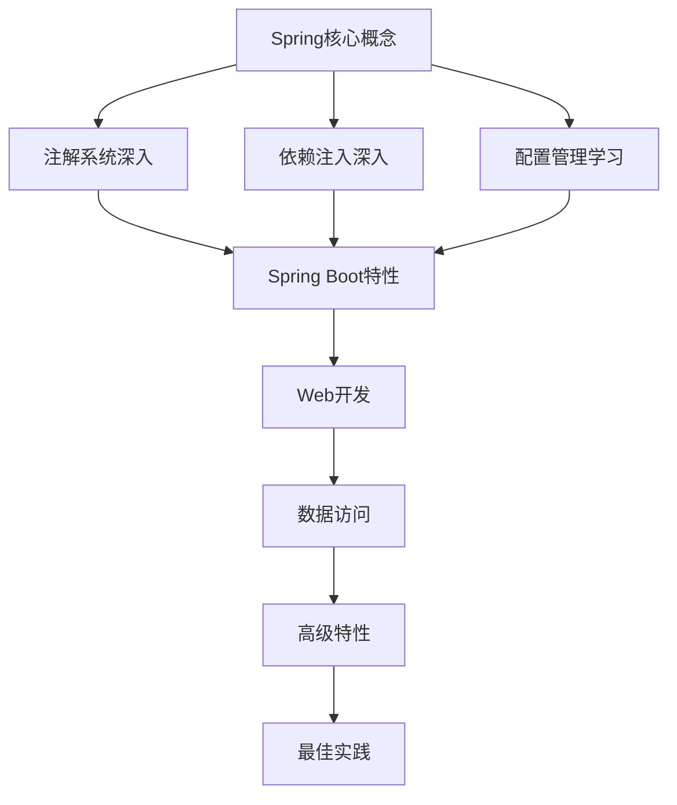

---
tags:
  - SpringBoot
  - 学习笔记
  - 教程
  - 学习指南
created: 2025-11-18
modified: 2025-11-18
category: 学习指南
difficulty: beginner
---

# Spring Boot 学习笔记

> **系统化学习Spring Boot，从核心概念到实战应用**

## 🎯 学习理念

### 🏗️ 概念优先，实践并重
我们采用**概念驱动**的学习方法：
1. **先理解核心思想** - 掌握Spring的设计哲学
2. **再学习具体技术** - 在理解基础上学习Spring Boot
3. **最后实战应用** - 通过项目巩固所学知识

### 🔄 学→练→会 循环学习
每个知识点都遵循这个循环：
- **学** - 理论学习，理解概念
- **练** - 动手实践，编写代码
- **会** - 总结提升，真正掌握

---

## 📚 学习结构

### 🥇 第一层：核心概念基础（必读）
**目录**: [[00-Spring核心概念/]]

这个层次是整个学习体系的基石，**强烈建议按顺序学习**：

1. [[00-Spring核心概念/01-IoC容器与依赖注入核心思想.md|IoC容器与依赖注入核心思想]]
   - 理解Spring的灵魂：控制反转和依赖注入
   - 通过对比传统方式，理解为什么需要Spring

2. [[00-Spring核心概念/02-Spring注解体系概览.md|Spring注解体系概览]]
   - 掌握Spring的"语言"：注解系统
   - 学会正确使用各种注解

3. [[00-Spring核心概念/03-快速入门指南.md|Spring快速入门指南]]
   - 20分钟创建第一个Spring应用
   - 体验IoC和DI的魔力

4. [[00-Spring核心概念/README.md|核心概念学习指南]]
   - 详细的学习路径和方法指导

### 🥈 第二层：技术深入（核心技能）
掌握核心概念后，深入学习具体技术：

#### 🔧 Spring注解系统
**目录**: [[01-Spring注解/]]
- [[01-Spring注解/01-核心注解(@Required,@Autowired,@Component等).md|核心注解详解]]
- [[01-Spring注解/02-配置注解(@Configuration,@Bean,@Value等).md|配置注解详解]]
- [[01-Spring注解/03-分层注解(@Service,@Repository,@Controller等).md|分层注解详解]]
- [[01-Spring注解/04-高级注解(@Qualifier,@Primary,@Lazy等).md|高级注解详解]]

#### 💉 依赖注入深入
**目录**: [[02-依赖注入/]]
- [[02-依赖注入/01-核心概念(IoC容器,Bean生命周期等).md|IoC容器核心概念]]
- [[02-依赖注入/02-注入方式(构造函数,字段,Setter注入).md|注入方式详解]]
- [[02-依赖注入/03-高级特性(循环依赖,作用域,条件注入).md|高级DI特性]]
- [[02-依赖注入/04-问题排查(NoSuchBeanDefinitionException等).md|问题排查指南]]

#### ⚙️ 配置管理
**目录**: [[03-配置管理/]]
- [[03-配置管理/01-基础配置(@Configuration,@Bean等).md|基础配置]]
- [[03-配置管理/02-属性配置(Properties,YAML,Environment等).md|属性配置]]
- [[03-配置管理/03-自动配置(@EnableAutoConfiguration,@Conditional等).md|自动配置]]
- [[03-配置管理/04-外部化配置(配置文件,环境变量等).md|外部化配置]]

### 🥉 第三层：最佳实践（进阶提升）
**目录**: [[04-最佳实践/]]
- [[04-最佳实践/最佳实践指南.md|最佳实践指南]]

---

## 🗺️ 学习路线

### 🎯 完整学习路径

### ⏰ 时间安排建议

| 阶段 | 内容 | 预计时间 | 重要性 |
|------|------|----------|--------|
| 核心概念 | IoC、DI、注解体系 | 3-5天 | ⭐⭐⭐⭐⭐ |
| 技术深入 | 注解、DI、配置 | 1-2周 | ⭐⭐⭐⭐ |
| Spring Boot | Boot特性、自动配置 | 1-2周 | ⭐⭐⭐ |
| Web开发 | REST API、Web进阶 | 2-3周 | ⭐⭐⭐ |
| 数据访问 | JPA、事务、缓存 | 2-3周 | ⭐⭐ |
| 高级特性 | 安全、监控、微服务 | 3-4周 | ⭐⭐ |

---

## 🎯 学习方法

### 📖 如何使用这些笔记

#### 1️⃣ 按顺序学习
**强烈建议**从 [[00-Spring核心概念/]] 开始，按顺序学习。核心概念是后续所有内容的基础。

#### 2️⃣ 理论与实践结合
每个章节都包含：
- **理论解释** - 概念和原理
- **代码示例** - 实际应用
- **练习题目** - 巩固理解
- **总结要点** - 关键知识

#### 3️⃣ 使用Obsidian功能
- **双向链接** - 点击 `[[文件名]]` 跳转相关内容
- **标签系统** - 通过标签快速定位相关主题
- **图谱视图** - 查看知识关联关系

### 🛠️ 环境准备

#### 必需工具
- **JDK 17+** - Java开发环境
- **Maven 3.6+** - 项目构建工具
- **IDE** - IntelliJ IDEA 或 VS Code
- **Obsidian** - 笔记管理（推荐）

#### 推荐工具
- **Postman** - API测试
- **MySQL** - 数据库（数据访问章节使用）
- **Git** - 版本控制

---

## 📋 学习检查清单

### ✅ 核心概念掌握
- [ ] 理解IoC（控制反转）的本质和价值
- [ ] 掌握DI（依赖注入）的工作原理
- [ ] 熟悉Spring注解体系
- [ ] 能够创建基本的Spring应用

### ✅ 技术技能培养
- [ ] 正确使用各种Spring注解
- [ ] 实现不同方式的依赖注入
- [ ] 配置Spring Boot应用
- [ ] 处理常见的Spring问题

### ✅ 实践项目能力
- [ ] 独立创建Spring Boot项目
- [ ] 开发REST API接口
- [ ] 实现数据库操作
- [ ] 应用最佳实践

---

## 🚀 快速开始

### 🎯 如果你是初学者
1. 从 [[00-Spring核心概念/01-IoC容器与依赖注入核心思想.md]] 开始
2. 按顺序完成核心概念部分
3. 逐步深入技术细节
4. 通过实践项目巩固

### 🎯 如果你有Spring基础
1. 快速浏览 [[00-Spring核心概念/]] 查漏补缺
2. 重点学习薄弱环节
3. 直接进入感兴趣的技术领域
4. 关注最佳实践部分

### 🎯 如果你要面试准备
1. 重点复习核心概念
2. 深入理解IoC和DI原理
3. 掌握常见面试题
4. 查看最佳实践指南

---

## 🎉 学习成果

完成这个学习体系后，你将：

### 🎓 理论深度
- **系统理解** Spring框架的设计哲学
- **深入掌握** IoC、DI等核心概念
- **全面了解** Spring Boot的各种特性
- **建立正确** 的Java开发思维

### 💻 实践能力
- **独立开发** Spring Boot应用
- **灵活运用** 各种Spring特性
- **快速解决** 常见技术问题
- **遵循最佳** 实践规范

### 🚀 职业发展
- **胜任** Spring Boot开发岗位
- **通过** 技术面试
- **具备** 持续学习能力
- **成为** 优秀的Java开发者

---

## 📞 支持与反馈

### 🤔 遇到问题
- 检查学习顺序是否正确
- 查看相关章节的问题排查部分
- 回顾核心概念理解
- 动手实践验证理论

### 💡 建议反馈
- 学习路径是否合理
- 内容深度是否适宜
- 实践例子是否清晰
- 还需要补充哪些内容

---

**开始你的Spring Boot学习之旅吧！记住：扎实的基础是成功的基石！** 🚀✨

---

**相关链接**:
- [[学习路线图.md|完整学习路线图]]
- [[快速参考手册.md|常用命令速查]]
- [[../02-前后端分离实战-服装销售系统/|实战项目教程]]