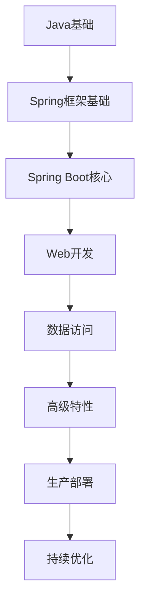

---
tags:
  - 学习路线
  - 入门指南
  - 学习计划
  - Spring-Boot
created: 2025-11-16
modified: 2025-11-16
category: 指南
difficulty: beginner
---

# Spring Boot 学习路线图

> 🗺️ 从零基础到熟练掌握Spring Boot的完整学习路径

## 📊 学习阶段概览

---

## 🎯 阶段一：基础准备（1-2周）

### 📚 必备知识

#### Java基础强化
- [ ] **面向对象编程**
  - 封装、继承、多态
  - 接口和抽象类
  - 设计模式基础

- [ ] **Java 8+ 新特性**
  - Lambda表达式
  - Stream API
  - Optional类
  - 注解基础

#### 构建工具
- [ ] **Maven/Gradle**
  - 项目结构理解
  - 依赖管理
  - 常用命令

### 📖 推荐资源
- [[01-Spring注解/01-核心注解(@Required,@Autowired,@Component等).md|Spring注解基础]]
- Java官方文档
- Maven官方指南

---

## 🎯 阶段二：Spring框架基础（2-3周）

### 🏗️ 核心概念

#### IoC容器理解
- [ ] **控制反转原理**
  - 什么是IoC
  - IoC容器的作用
  - Bean的生命周期

- [ ] **依赖注入**
  - [[02-依赖注入/01-核心概念(IoC容器,Bean生命周期等).md|DI核心概念]]
  - 注入方式对比
  - 最佳实践

#### Spring注解掌握
- [ ] **核心注解**
  - `@Component`系列注解
  - `@Autowired`用法
  - `@Configuration`和`@Bean`

### 📝 实践项目
- 简单的Spring IoC项目
- 实现基本的依赖注入
- 编写自定义配置类

---

## 🎯 阶段三：Spring Boot入门（2-3周）

### 🚀 Boot特性

#### 自动配置
- [ ] [[03-配置管理/03-自动配置(@EnableAutoConfiguration,@Conditional等).md|自动配置原理]]
- [ ] 条件注解使用
- [ ] 自定义自动配置

#### 起步依赖
- [ ] 理解starter机制
- [ ] 常用starter使用
- [ ] 自定义starter开发

#### 配置管理
- [ ] [[03-配置管理/02-属性配置(Properties,YAML,Environment等).md|属性配置]]
- [ ] 多环境配置
- [ ] 配置属性绑定

### 🛠️ 实践项目
- 创建第一个Spring Boot应用
- 实现多环境配置
- 开发自定义starter

---

## 🎯 阶段四：Web开发（3-4周）

### 🌐 Web层开发

#### REST API开发
- [ ] `@RestController`使用
- [ ] 请求映射注解
- [ ] 参数绑定和验证
- [ ] 统一响应格式

#### Web进阶
- [ ] 拦截器和过滤器
- [ ] 异常处理机制
- [ ] 跨域配置
- [ ] 文件上传下载

### 📝 实践项目
- 开发完整的REST API
- 实现用户认证系统
- 文件管理服务

---

## 🎯 阶段五：数据访问（3-4周）

### 💾 持久层开发

#### Spring Data JPA
- [ ] JPA基础概念
- [ ] Repository接口使用
- [ ] 自定义查询方法
- [ ] 关联关系映射

#### 数据库集成
- [ ] 多数据源配置
- [ ] 事务管理
- [ ] 数据库迁移

#### 缓存机制
- [ ] Spring Cache抽象
- [ ] Redis集成
- [ ] 缓存策略设计

### 📝 实践项目
- 博客系统数据层
- 电商订单系统
- 缓存优化方案

---

## 🎯 阶段六：高级特性（4-5周）

### 🔧 高级功能

#### 安全框架
- [ ] Spring Security基础
- [ ] JWT认证实现
- [ ] 权限控制设计
- [ ] OAuth2集成

#### 微服务支持
- [ ] Spring Cloud基础
- [ ] 服务注册发现
- [ ] 配置中心
- [ ] 服务间调用

#### 监控运维
- [ ] Spring Boot Actuator
- [ ] 健康检查
- [ ] 指标监控
- [ ] 日志管理

### 📝 实践项目
- 微服务架构应用
- 安全认证系统
- 监控运维平台

---

## 🎯 阶段七：生产部署（2-3周）

### 🐳 部署实践

#### 容器化部署
- [ ] Docker基础
- [ ] Dockerfile编写
- [ ] Docker Compose
- [ ] 容器编排

#### 云平台部署
- [ ] 云服务器部署
- [ ] 容器服务使用
- [ ] CI/CD流水线
- [ ] 自动化部署

### 📝 实践项目
- Docker化Spring Boot应用
- 云平台部署实践
- CI/CD流水线搭建

---

## 🎯 阶段八：持续优化（持续进行）

### 📈 性能优化

#### 应用优化
- [ ] JVM调优
- [ ] 数据库优化
- [ ] 缓存策略优化
- [ ] 并发处理优化

#### 架构优化
- [ ] 代码重构
- [ ] 架构演进
- [ ] 技术债务管理
- [ ] 最佳实践应用

### 📚 持续学习
- [ ] 关注Spring Boot更新
- [ ] 学习新特性和最佳实践
- [ ] 参与开源项目
- [ ] 技术分享和交流

---

## 📋 学习检查清单

### 🎯 每阶段完成标准

- [ ] **理论掌握**: 理解核心概念和原理
- [ ] **代码实践**: 完成阶段实践项目
- [ ] **问题解决**: 能够独立解决常见问题
- [ ] **知识总结**: 整理学习笔记和心得

### 🏆 学习成果展示

- [ ] GitHub项目仓库
- [ ] 技术博客文章
- [ ] 开源项目贡献
- [ ] 技术分享演讲

---

## ⏰ 时间规划建议

| 阶段 | 建议时间 | 学习强度 | 重点内容 |
|------|----------|----------|----------|
| 基础准备 | 1-2周 | 中等 | Java基础、构建工具 |
| Spring框架 | 2-3周 | 高 | IoC、DI、注解 |
| Spring Boot | 2-3周 | 高 | 自动配置、配置管理 |
| Web开发 | 3-4周 | 高 | REST API、Web进阶 |
| 数据访问 | 3-4周 | 中等 | JPA、数据库、缓存 |
| 高级特性 | 4-5周 | 中等 | 安全、微服务、监控 |
| 生产部署 | 2-3周 | 高 | 容器化、云部署 |
| 持续优化 | 持续 | 低 | 性能优化、新技术 |

---

## 🎯 学习建议

### 💡 高效学习方法

1. **理论与实践结合**
   - 每个概念都要写代码验证
   - 通过项目巩固理论知识

2. **问题导向学习**
   - 带着实际问题去学习
   - 在解决问题的过程中深入理解

3. **循序渐进**
   - 不要跳过基础概念
   - 确保每个阶段都扎实掌握

4. **持续总结**
   - 定期整理学习笔记
   - 分享学习心得和经验

### 🚀 加速学习技巧

- **多看源码**: 理解框架内部实现
- **多写代码**: 实践是最好的老师
- **多问问题**: 积极参与技术社区
- **多读文档**: 官方文档是最权威的资料

---

> 🎉 **恭喜！** 按照这个路线图学习，你将在4-6个月内成为Spring Boot开发高手。记住，学习是一个持续的过程，保持好奇心和学习的热情是最重要的！

**开始你的Spring Boot学习之旅吧！** 🚀