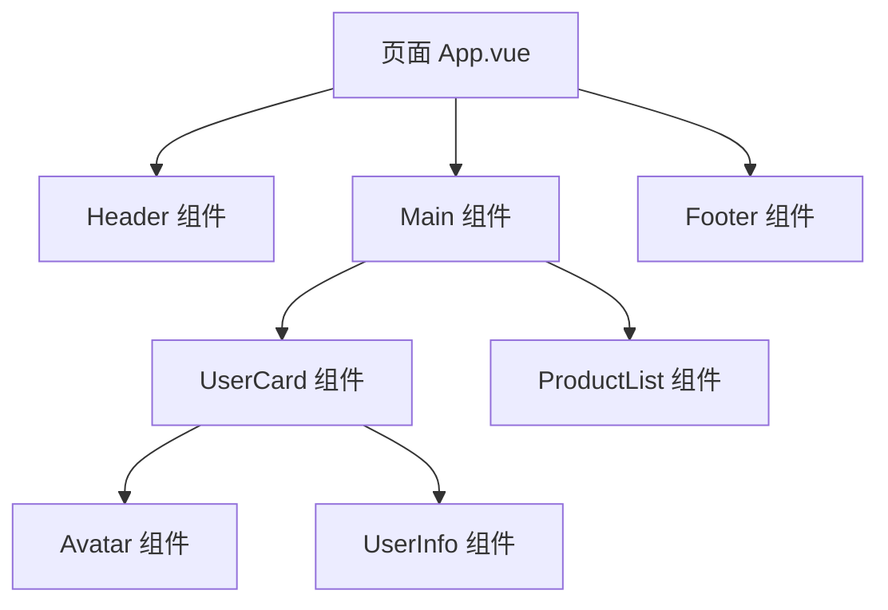

---
tags:
  - Vue核心
  - 响应式原理
  - 组件化
  - Vue3
  - CompositionAPI
created: 2025-11-18
modified: 2025-11-18
category: Vue核心概念
difficulty: beginner
---

# Vue核心思想：响应式原理与组件化开发

> **学习目标**：深入理解Vue 3的灵魂 - 响应式系统和组件化思想，这是学习Vue生态系统的必备基础！

## 🎯 为什么先学这个？

**传统前端开发的问题：**
```javascript
// ❌ 传统方式：手动操作DOM
function updateUserName(newName) {
    // 手动查找DOM元素
    const nameElement = document.getElementById('username');
    // 手动更新内容
    nameElement.textContent = newName;

    // 如果其他地方也显示用户名，需要一一更新
    const headerElement = document.querySelector('.header-username');
    headerElement.textContent = newName;

    // 手动处理样式变化
    if (newName.length > 10) {
        nameElement.classList.add('long-name');
    }
}
```

**问题：**
- 数据和视图分离，容易产生不一致
- 手动操作DOM，代码复杂且容易出错
- 难以维护和扩展
- 代码复用性差

---

## 🚀 Vue的解决方案：响应式 + 组件化

### 什么是响应式系统？

**一句话解释：**
> **数据变化，视图自动更新！你只需要关心数据，Vue会自动处理DOM**

**传统方式 vs Vue方式：**

```javascript
// ❌ 传统方式：手动更新视图
let userName = '张三';
function changeName(newName) {
    userName = newName;
    // 必须手动更新所有显示用户名的地方
    document.getElementById('username').textContent = userName;
    document.querySelector('.header-username').textContent = userName;
}

// ✅ Vue方式：数据驱动视图
import { ref } from 'vue';

const userName = ref('张三');
function changeName(newName) {
    userName.value = newName;  // 只需要修改数据，视图自动更新！
}
```

**响应式的核心价值：**
- **数据驱动** - 只需要操作数据，视图自动响应
- **声明式编程** - 描述要什么，而不是怎么做
- **高效更新** - Vue智能地只更新需要变化的部分
- **代码简洁** - 减少大量手动DOM操作

---

## 🧩 什么是组件化开发？

### 组件化就像搭积木

把复杂的页面拆分成一个个独立的、可复用的组件：



### 生活中的比喻

想象一下组装电脑：

```javascript
// ❌ 传统方式：所有功能写在一起
function buildComputer() {
    // 主板功能
    function connectCPU() { /* ... */ }
    function connectMemory() { /* ... */ }

    // CPU功能
    function process() { /* ... */ }
    function calculate() { /* ... */ }

    // 内存功能
    function store() { /* ... */ }
    function retrieve() { /* ... */ }

    // 所有代码混在一起，难以维护...
}

// ✅ 组件化方式：独立的功能模块
// Motherboard.vue
export default {
    name: 'Motherboard',
    methods: {
        connectCPU() { /* 主板逻辑 */ },
        connectMemory() { /* 主板逻辑 */ }
    }
}

// CPU.vue
export default {
    name: 'CPU',
    methods: {
        process() { /* CPU逻辑 */ },
        calculate() { /* CPU逻辑 */ }
    }
}

// Memory.vue
export default {
    name: 'Memory',
    methods: {
        store() { /* 内存逻辑 */ },
        retrieve() { /* 内存逻辑 */ }
    }
}
```

---

## 🏗️ Vue 3响应式系统工作原理

### 响应式数据创建

Vue 3使用`ref`和`reactive`创建响应式数据：

```javascript
import { ref, reactive } from 'vue';

// 1. ref - 用于基本类型数据
const count = ref(0);
const message = ref('Hello Vue');

// 2. reactive - 用于对象类型数据
const user = reactive({
    name: '张三',
    age: 25,
    email: 'zhangsan@example.com'
});

// 3. 访问和修改
// ref需要通过.value访问
console.log(count.value);  // 0
count.value = 1;  // 修改会触发视图更新

// reactive直接访问
console.log(user.name);  // '张三'
user.name = '李四';  // 修改会触发视图更新
```

### 响应式工作流程

```mermaid
sequenceDiagram
    participant Dev as 开发者
    participant Vue as Vue响应式系统
    component Data as 响应式数据
    component View as 视图模板

    Dev->>Data: 创建响应式数据
    Data->>Vue: 建立依赖关系
    Vue->>View: 初始渲染

    Dev->>Data: 修改数据
    Data->>Vue: 通知变化
    Vue->>View: 智能更新DOM
    Note over Dev,View: 用户看到最新界面
```

---

## 🧪 动手理解：创建第一个Vue应用

### 步骤1：创建响应式数据

```vue
<!-- UserCard.vue -->
<template>
  <div class="user-card">
    <h2>{{ user.name }}</h2>
    <p>年龄：{{ user.age }}</p>
    <p>邮箱：{{ user.email }}</p>
    <button @click="incrementAge">过生日</button>
    <p>计数器：{{ count }}</p>
  </div>
</template>

<script setup>
import { ref, reactive } from 'vue';

// 响应式数据
const user = reactive({
  name: '张三',
  age: 25,
  email: 'zhangsan@example.com'
});

const count = ref(0);

// 响应式方法
function incrementAge() {
  user.age++;  // 修改响应式对象
  count.value++;  // 修改响应式基本类型
}
</script>

<style scoped>
.user-card {
  border: 1px solid #ddd;
  padding: 20px;
  border-radius: 8px;
}
</style>
```

### 步骤2：使用组件

```vue
<!-- App.vue -->
<template>
  <div>
    <h1>用户管理系统</h1>
    <UserCard />
    <UserCard />
  </div>
</template>

<script setup>
import UserCard from './UserCard.vue';
</script>
```

### 步骤3：体验响应式

点击"过生日"按钮，你会看到：
- 年龄数字自动增加
- 计数器自动增加
- 无需手动操作DOM！

---

## 🔍 第四步：理解发生了什么？

### 神奇之处分析

让我们分析刚才的代码：

```vue
<script setup>
const user = reactive({
  name: '张三',
  age: 25
});

function incrementAge() {
  user.age++;  // 只修改了数据
}
</script>

<template>
  <p>年龄：{{ user.age }}</p>  <!-- 视图自动更新！ -->
</template>
```

**传统方式 vs Vue方式：**

```javascript
// ❌ 传统方式（如果我们不用Vue）
function updateUserAge() {
  user.age++;
  // 必须手动更新DOM
  document.querySelector('.age').textContent = '年龄：' + user.age;
}

// ✅ Vue方式
function updateUserAge() {
  user.age++;  // Vue自动处理DOM更新
}
```

### 组件化的威力

```vue
<!-- 我们写了UserCard组件一次 -->
<UserCard />  <!-- 可以重复使用 -->
<UserCard />  <!-- 每个实例都是独立的 -->
<UserCard />  <!-- 数据和状态互不影响 -->
```

---

## 🛠️ 第五步：添加更多功能

### 创建可复用的组件

```vue
<!-- Avatar.vue -->
<template>
  <div class="avatar" :style="{ width: size + 'px', height: size + 'px' }">
    
  </div>
</template>

<script setup>
// 定义组件的属性（Props）
const props = defineProps({
  src: String,
  name: String,
  size: {
    type: Number,
    default: 50
  }
});
</script>

<style scoped>
.avatar {
  border-radius: 50%;
  overflow: hidden;
}

.avatar img {
  width: 100%;
  height: 100%;
  object-fit: cover;
}
</style>
```

### 在UserCard中使用Avatar

```vue
<!-- UserCard.vue -->
<template>
  <div class="user-card">
    <Avatar :src="user.avatar" :name="user.name" :size="80" />
    <h2>{{ user.name }}</h2>
    <p>年龄：{{ user.age }}</p>
  </div>
</template>

<script setup>
import { reactive } from 'vue';
import Avatar from './Avatar.vue';

const user = reactive({
  name: '张三',
  age: 25,
  avatar: 'https://picsum.photos/seed/user1/100/100.jpg'
});
</script>
```

---

## 🎯 第六步：理解核心概念

### 你已经掌握的核心概念

1. **响应式数据** - `ref`和`reactive`创建的数据
2. **模板语法** - `{{ }}`插值和指令
3. **事件处理** - `@click`等事件绑定
4. **组件化** - 组件的定义和使用
5. **Props传递** - 父子组件通信

### 响应式和组件化的实际体现

```vue
<!-- 我们从未写过这样的代码： -->
<!-- document.querySelector('.age').textContent = user.age; -->
<!-- document.querySelector('.name').textContent = user.name; -->

<!-- 而是直接使用： -->
<template>
  <p>年龄：{{ user.age }}</p>  <!-- 数据变化自动更新 -->
  <p>姓名：{{ user.name }}</p>  <!-- 组件复用 -->
</template>
```

这就是响应式 + 组件化的魔力！

---

## 🚀 进阶练习

### 练习1：创建计数器组件

```vue
<!-- Counter.vue -->
<template>
  <div class="counter">
    <button @click="decrement">-</button>
    <span>{{ count }}</span>
    <button @click="increment">+</button>
  </div>
</template>

<script setup>
import { ref } from 'vue';

const count = ref(0);

function increment() {
  count.value++;
}

function decrement() {
  if (count.value > 0) {
    count.value--;
  }
}
</script>

<style scoped>
.counter {
  display: flex;
  align-items: center;
  gap: 10px;
}

.counter button {
  width: 30px;
  height: 30px;
}

.counter span {
  font-size: 18px;
  font-weight: bold;
}
</style>
```

### 练习2：使用计算属性

```vue
<!-- UserCard.vue -->
<template>
  <div class="user-card">
    <h2>{{ user.name }}</h2>
    <p>年龄：{{ user.age }}</p>
    <p>状态：{{ userStatus }}</p>  <!-- 计算属性 -->
  </div>
</template>

<script setup>
import { reactive, computed } from 'vue';

const user = reactive({
  name: '张三',
  age: 25
});

// 计算属性：根据其他数据计算得出
const userStatus = computed(() => {
  if (user.age < 18) return '未成年';
  if (user.age < 30) return '青年';
  if (user.age < 50) return '中年';
  return '老年';
});
</script>
```

---

## 📋 学习检查清单

### ✅ 基础概念掌握
- [ ] 理解什么是响应式系统
- [ ] 理解什么是组件化开发
- [ ] 知道ref和reactive的区别
- [ ] 掌握组件的基本使用

### ✅ 实践能力
- [ ] 能够创建响应式数据
- [ ] 能够编写Vue组件
- [ ] 能够使用Props传递数据
- [ ] 能够处理用户交互事件

---

## 🎯 下一步学习

恭喜你掌握了Vue的核心思想！接下来建议按顺序学习：

1. **深入响应式系统**
   - [[02-Vue核心概念/02-CompositionAPI详解.md|Composition API详解]]
   - [[02-Vue核心概念/03-生命周期与钩子函数.md|生命周期与钩子函数]]

2. **学习组件进阶**
   - [[02-Vue学习笔记/01-组件系统/01-组件通信.md|组件通信]]
   - [[02-Vue学习笔记/01-组件系统/02-插槽与动态组件.md|插槽与动态组件]]

3. **掌握状态管理**
   - [[02-Vue学习笔记/02-状态管理/01-Pinia状态管理.md|Pinia状态管理]]

---

## 🎉 总结

通过这个核心概念学习，你已经：
- 理解了Vue响应式系统的威力
- 体验了组件化开发的便利
- 掌握了Vue的核心编程思想
- 建立了现代前端开发的思维

**记住：Vue的核心就是"数据驱动视图，组件化构建"！** 🚀

继续加油，Vue的世界很精彩！