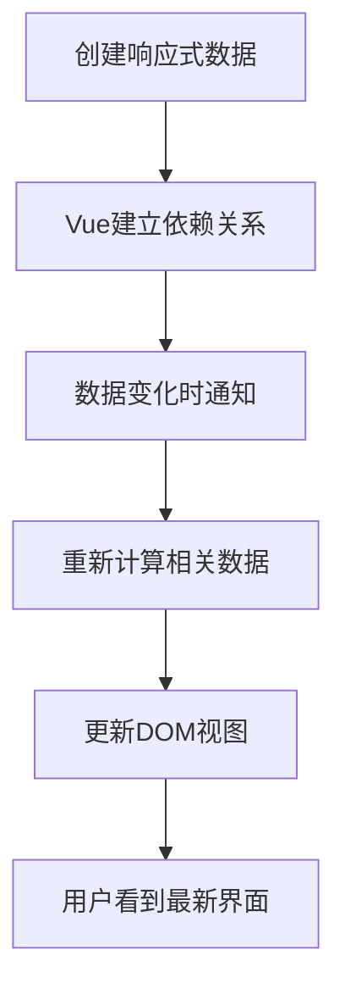

---
tags:
  - Vue响应式
  - ref
  - reactive
  - 状态管理
  - watch
  - watchEffect
  - Vue3
created: 2025-11-18
modified: 2025-11-18
category: Vue核心概念
difficulty: beginner
---

# Vue响应式数据与状态管理

> **学习目标**：深入理解Vue 3的响应式系统，掌握ref、reactive等响应式API的使用方法

## 🎯 本章概览

| 内容 | 预计时间 | 难度 | 状态 |
|------|----------|------|------|
| 响应式系统原理 | 15分钟 | ⭐⭐ | ⏳ |
| ref响应式引用 | 15分钟 | ⭐⭐ | ⏳ |
| reactive响应式对象 | 15分钟 | ⭐⭐ | ⏳ |
| 响应式监听器 | 20分钟 | ⭐⭐⭐ | ⏳ |
| 状态管理最佳实践 | 15分钟 | ⭐⭐ | ⏳ |

---

## 🔄 什么是响应式系统？

### 响应式的核心思想

**响应式** = **数据变化** → **自动更新视图**

```javascript
// 传统方式（非响应式）
let count = 0
count = 1  // 数据变了，但界面不会自动更新

// Vue响应式方式
const count = ref(0)
count.value = 1  // 数据变了，界面自动更新！
```

### 响应式系统的工作流程



### 为什么需要响应式？

**传统前端开发的问题：**
```javascript
// 手动更新DOM - 繁琐且容易出错
function updateUserName(newName) {
  document.getElementById('name').textContent = newName
  document.getElementById('header').textContent = newName
  document.getElementById('avatar').alt = newName
  // 如果有100个地方显示用户名，就要写100行代码！
}
```

**Vue响应式解决方案：**
```javascript
// 只需要更新数据
const userName = ref('张三')
userName.value = '李四'  // 所有使用userName的地方都会自动更新！
```

---

## 📦 ref：创建响应式引用

### ref的基本用法

`ref`用于创建**任何类型**的响应式数据：

```javascript
import { ref } from 'vue'

// 基本类型
const count = ref(0)
const message = ref('Hello Vue')
const isVisible = ref(true)

// 对象类型
const user = ref({
  name: '张三',
  age: 25
})

// 数组类型
const items = ref([1, 2, 3])
```

### ref的访问方式

#### 在JavaScript中访问

```javascript
// 必须使用 .value 访问
console.log(count.value)        // 0
console.log(message.value)      // 'Hello Vue'
console.log(user.value.name)    // '张三'

// 修改数据
count.value = 10
message.value = 'Hello World'
user.value.name = '李四'
```

#### 在模板中访问

```vue
<template>
  <!-- 模板中直接使用，不需要 .value -->
  <div>计数: {{ count }}</div>
  <div>消息: {{ message }}</div>
  <div>用户: {{ user.name }}</div>

  <!-- 事件处理中也不需要 .value -->
  <button @click="count++">增加</button>
  <button @click="message = '已点击'">改变消息</button>
</template>

<script setup>
import { ref } from 'vue'

const count = ref(0)
const message = ref('Hello Vue')
const user = ref({
  name: '张三',
  age: 25
})
</script>
```

### ref的实际应用

#### 示例：计数器组件

```vue
<!-- Counter.vue -->
<template>
  <div class="counter">
    <h2>计数器: {{ count }}</h2>
    <p>点击次数: {{ clickCount }}</p>
    <p>是否双位数: {{ isDoubleDigit }}</p>

    <div class="buttons">
      <button @click="increment">+1</button>
      <button @click="decrement">-1</button>
      <button @click="reset">重置</button>
    </div>

    <div class="history">
      <h3>操作历史</h3>
      <ul>
        <li v-for="(action, index) in history" :key="index">
          {{ action }}
        </li>
      </ul>
    </div>
  </div>
</template>

<script setup>
import { ref } from 'vue'

// 基础计数器
const count = ref(0)

// 派生状态
const clickCount = ref(0)
const history = ref([])

// 计算属性（稍后详细讲解）
const isDoubleDigit = computed(() => count.value >= 10)

// 方法
function increment() {
  count.value++
  clickCount.value++
  history.value.unshift(`增加: ${count.value}`)
}

function decrement() {
  if (count.value > 0) {
    count.value--
    clickCount.value++
    history.value.unshift(`减少: ${count.value}`)
  }
}

function reset() {
  history.value.unshift(`重置: ${count.value} → 0`)
  count.value = 0
}
</script>

<style scoped>
.counter {
  border: 2px solid #42b883;
  border-radius: 8px;
  padding: 20px;
  max-width: 400px;
}

.buttons {
  margin: 15px 0;
  display: flex;
  gap: 10px;
}

.buttons button {
  padding: 8px 16px;
  border: none;
  border-radius: 4px;
  background-color: #42b883;
  color: white;
  cursor: pointer;
}

.buttons button:hover {
  background-color: #369870;
}

.history {
  margin-top: 20px;
  max-height: 150px;
  overflow-y: auto;
}

.history ul {
  list-style: none;
  padding: 0;
}

.history li {
  padding: 4px 0;
  border-bottom: 1px solid #eee;
  font-size: 14px;
}
</style>
```

---

## 🏗️ reactive：创建响应式对象

### reactive的基本用法

`reactive`专门用于创建**对象类型**的响应式数据：

```javascript
import { reactive } from 'vue'

// 响应式对象
const user = reactive({
  name: '张三',
  age: 25,
  email: 'zhangsan@example.com',
  profile: {
    city: '北京',
    job: '前端开发'
  }
})

// 响应式数组
const items = reactive([
  { id: 1, name: '商品1', price: 100 },
  { id: 2, name: '商品2', price: 200 }
])

// 访问和修改（不需要 .value）
console.log(user.name)        // '张三'
console.log(user.profile.city) // '北京'

user.age = 26                 // 直接修改
user.profile.city = '上海'     // 深层响应式
items.push({ id: 3, name: '商品3', price: 300 })  // 响应式数组操作
```

### reactive vs ref 对比

| 特性 | ref | reactive |
|------|-----|----------|
| **适用类型** | 任何类型 | 仅对象类型 |
| **访问方式** | `.value` | 直接访问 |
| **整体替换** | 支持 | 不支持 |
| **解构** | 失去响应式 | 失去响应式 |
| **推荐场景** | 基本类型、需要替换的对象 | 复杂对象结构 |

### 实际应用对比

```vue
<!-- UserInfo.vue -->
<template>
  <div class="user-info">
    <h2>用户信息管理</h2>

    <!-- 使用reactive -->
    <div class="reactive-user">
      <h3>使用 reactive</h3>
      <input v-model="reactiveUser.name" placeholder="姓名">
      <input v-model.number="reactiveUser.age" type="number" placeholder="年龄">
      <p>{{ reactiveUser.name }} - {{ reactiveUserUser.age }}岁</p>
    </div>

    <!-- 使用ref -->
    <div class="ref-user">
      <h3>使用 ref</h3>
      <input v-model="refUser.value.name" placeholder="姓名">
      <input v-model.number="refUser.value.age" type="number" placeholder="年龄">
      <p>{{ refUser.name }} - {{ refUser.age }}岁</p>
    </div>

    <div class="actions">
      <button @click="logData">查看数据</button>
      <button @click="replaceReactive">替换reactive对象</button>
      <button @click="replaceRef">替换ref对象</button>
    </div>
  </div>
</template>

<script setup>
import { reactive, ref } from 'vue'

// reactive对象
const reactiveUser = reactive({
  name: '张三',
  age: 25
})

// ref包裹的对象
const refUser = ref({
  name: '李四',
  age: 30
})

function logData() {
  console.log('reactiveUser:', reactiveUser)
  console.log('refUser:', refUser.value)
}

// ❌ reactive不能整体替换
function replaceReactive() {
  // reactiveUser = { name: '王五', age: 35 }  // 错误！会失去响应式

  // ✅ 正确方式：逐个属性替换
  Object.assign(reactiveUser, { name: '王五', age: 35 })
}

// ✅ ref可以整体替换
function replaceRef() {
  refUser.value = { name: '赵六', age: 40 }  // 正确！保持响应式
}
</script>

<style scoped>
.user-info {
  border: 1px solid #ddd;
  border-radius: 8px;
  padding: 20px;
  max-width: 500px;
}

.reactive-user, .ref-user {
  margin: 15px 0;
  padding: 15px;
  border: 1px solid #eee;
  border-radius: 4px;
}

input {
  display: block;
  width: 100%;
  margin: 8px 0;
  padding: 8px;
  border: 1px solid #ddd;
  border-radius: 4px;
}

.actions {
  margin-top: 20px;
  display: flex;
  gap: 10px;
}

.actions button {
  padding: 8px 16px;
  border: none;
  border-radius: 4px;
  background-color: #42b883;
  color: white;
  cursor: pointer;
}
</style>
```

---

## 👀 响应式监听器

### watch：监听特定数据

`watch`用于监听特定数据的变化：

```vue
<!-- WatchExample.vue -->
<template>
  <div class="watch-example">
    <h2>响应式监听器示例</h2>

    <div class="input-group">
      <label>用户名：</label>
      <input v-model="user.name" placeholder="输入用户名">
    </div>

    <div class="input-group">
      <label>年龄：</label>
      <input v-model.number="user.age" type="number" placeholder="输入年龄">
    </div>

    <div class="input-group">
      <label>搜索关键词：</label>
      <input v-model="searchKeyword" placeholder="输入搜索关键词">
    </div>

    <div class="output">
      <p><strong>当前用户：</strong>{{ user.name }} ({{ user.age }}岁)</p>
      <p><strong>搜索关键词：</strong>{{ searchKeyword }}</p>
      <p><strong>监听日志：</strong></p>
      <ul>
        <li v-for="(log, index) in watchLogs" :key="index">
          {{ log }}
        </li>
      </ul>
    </div>
  </div>
</template>

<script setup>
import { ref, reactive, watch } from 'vue'

// 响应式数据
const user = reactive({
  name: '张三',
  age: 25
})

const searchKeyword = ref('')
const watchLogs = ref([])

// 1. 监听reactive对象的特定属性
watch(() => user.name, (newName, oldName) => {
  watchLogs.value.unshift(`用户名变化: ${oldName} → ${newName}`)
})

// 2. 监听reactive对象的多个属性
watch([() => user.name, () => user.age], ([newName, newAge], [oldName, oldAge]) => {
  watchLogs.value.unshift(`用户信息变化: ${oldName}(${oldAge}) → ${newName}(${newAge})`)
})

// 3. 监听ref数据
watch(searchKeyword, (newKeyword, oldKeyword) => {
  if (newKeyword) {
    watchLogs.value.unshift(`搜索关键词变化: ${oldKeyword} → ${newKeyword}`)
  }
})

// 4. 深度监听对象
watch(
  user,
  (newValue, oldValue) => {
    watchLogs.value.unshift('用户对象深度变化')
  },
  { deep: true }  // 深度监听
)

// 5. 立即执行监听器
watch(
  searchKeyword,
  (newKeyword) => {
    if (newKeyword) {
      watchLogs.value.unshift(`立即执行：搜索 "${newKeyword}"`)
    }
  },
  { immediate: true }  // 立即执行一次
)
</script>

<style scoped>
.watch-example {
  border: 1px solid #ddd;
  border-radius: 8px;
  padding: 20px;
  max-width: 600px;
}

.input-group {
  margin: 15px 0;
}

.input-group label {
  display: block;
  margin-bottom: 5px;
  font-weight: bold;
}

.input-group input {
  width: 100%;
  padding: 8px;
  border: 1px solid #ddd;
  border-radius: 4px;
}

.output {
  margin-top: 20px;
  padding: 15px;
  background-color: #f9f9f9;
  border-radius: 4px;
}

.output ul {
  list-style: none;
  padding: 0;
  max-height: 200px;
  overflow-y: auto;
}

.output li {
  padding: 4px 0;
  border-bottom: 1px solid #eee;
  font-size: 14px;
  color: #666;
}
</style>
```

### watchEffect：自动收集依赖

`watchEffect`会自动收集函数内使用的响应式数据：

```vue
<!-- WatchEffectExample.vue -->
<template>
  <div class="watch-effect-example">
    <h2>watchEffect 示例</h2>

    <div class="input-group">
      <label>宽度：</label>
      <input v-model.number="width" type="range" min="100" max="500">
      <span>{{ width }}px</span>
    </div>

    <div class="input-group">
      <label>高度：</label>
      <input v-model.number="height" type="range" min="100" max="300">
      <span>{{ height }}px</span>
    </div>

    <div class="input-group">
      <label>边框：</label>
      <input v-model.number="borderWidth" type="range" min="0" max="20">
      <span>{{ borderWidth }}px</span>
    </div>

    <div class="preview">
      <div
        class="box"
        :style="boxStyle"
      >
        响应式盒子
      </div>
    </div>

    <div class="logs">
      <h3>自动更新日志：</h3>
      <ul>
        <li v-for="(log, index) in logs" :key="index">
          {{ log }}
        </li>
      </ul>
    </div>
  </div>
</template>

<script setup>
import { ref, computed, watchEffect } from 'vue'

// 响应式数据
const width = ref(200)
const height = ref(150)
const borderWidth = ref(2)
const logs = ref([])

// 计算属性
const boxStyle = computed(() => ({
  width: width.value + 'px',
  height: height.value + 'px',
  border: `${borderWidth.value}px solid #42b883`
}))

// watchEffect - 自动收集依赖
watchEffect(() => {
  // 自动监听函数内使用的所有响应式数据
  const area = width.value * height.value
  const perimeter = 2 * (width.value + height.value)

  logs.value.unshift(`盒子更新: ${width.value}x${height.value}, 面积=${area}, 周长=${perimeter}`)

  // 限制日志数量
  if (logs.value.length > 10) {
    logs.value = logs.value.slice(0, 10)
  }
})

// watchEffect vs watch 的区别演示
const searchQuery = ref('')
const searchResults = ref([])

// watchEffect - 自动依赖收集
watchEffect(() => {
  if (searchQuery.value.length > 2) {
    // 模拟搜索
    console.log(`搜索: ${searchQuery.value}`)
    // 这里会自动监听 searchQuery 的变化
  }
})

// watch - 明确指定监听的数据
watch(searchQuery, (newQuery) => {
  if (newQuery.length > 2) {
    // 模拟搜索
    console.log(`监听搜索: ${newQuery}`)
    // 这里明确监听 searchQuery
  }
})
</script>

<style scoped>
.watch-effect-example {
  border: 1px solid #ddd;
  border-radius: 8px;
  padding: 20px;
  max-width: 600px;
}

.input-group {
  margin: 15px 0;
  display: flex;
  align-items: center;
  gap: 10px;
}

.input-group label {
  min-width: 60px;
  font-weight: bold;
}

.input-group input[type="range"] {
  flex: 1;
}

.preview {
  margin: 20px 0;
  display: flex;
  justify-content: center;
  align-items: center;
  min-height: 350px;
  background-color: #f9f9f9;
  border-radius: 4px;
}

.box {
  display: flex;
  align-items: center;
  justify-content: center;
  background-color: #42b883;
  color: white;
  font-weight: bold;
  transition: all 0.3s ease;
}

.logs {
  margin-top: 20px;
}

.logs h3 {
  margin-bottom: 10px;
}

.logs ul {
  list-style: none;
  padding: 0;
  max-height: 150px;
  overflow-y: auto;
}

.logs li {
  padding: 4px 0;
  font-size: 14px;
  color: #666;
  border-bottom: 1px solid #eee;
}
</style>
```

---

## 🎯 响应式最佳实践

### 1. 选择合适的响应式API

```javascript
// ✅ 基本类型使用 ref
const count = ref(0)
const message = ref('Hello')

// ✅ 简单对象使用 ref（需要整体替换时）
const user = ref({ name: '张三', age: 25 })
user.value = { name: '李四', age: 30 }  // 可以整体替换

// ✅ 复杂对象结构使用 reactive
const formData = reactive({
  user: { name: '', email: '' },
  settings: { theme: 'light', lang: 'zh' },
  validation: { errors: [] }
})

// ✅ 需要解构时使用 toRefs
const user = reactive({ name: '张三', age: 25 })
const { name, age } = toRefs(user)  // 保持响应式
```

### 2. 避免常见陷阱

```javascript
// ❌ 解构 reactive 会失去响应式
const user = reactive({ name: '张三', age: 25 })
const { name, age } = user  // name 和 age 不再是响应式的

// ✅ 使用 toRefs 保持响应式
import { toRefs } from 'vue'
const { name, age } = toRefs(user)

// ❌ 直接替换 reactive 对象
const state = reactive({ count: 0 })
state = reactive({ count: 1 })  // 失去响应式

// ✅ 使用 Object.assign 或逐个属性更新
Object.assign(state, { count: 1 })

// ❌ 在模板中忘记 .value
const count = ref(0)
// <template>{{ count }}</template>  // 错误！应该是 count.value

// ✅ 在模板中直接使用（Vue自动解包）
// <template>{{ count }}</template>  // 正确！
```

### 3. 性能优化建议

```javascript
// ✅ 使用 watchEffect 进行副作用
const searchTerm = ref('')

watchEffect(() => {
  if (searchTerm.value) {
    // 自动搜索
    performSearch(searchTerm.value)
  }
})

// ✅ 使用 watch 进行精确控制
watch(searchTerm, (newTerm, oldTerm) => {
  if (newTerm.length >= 3 && newTerm !== oldTerm) {
    // 只在搜索词长度>=3且真正变化时搜索
    performSearch(newTerm)
  }
})

// ✅ 使用 computed 缓存计算结果
const expensiveValue = computed(() => {
  // 复杂计算只在依赖变化时重新执行
  return heavyCalculation(data.value)
})
```

---

## 📝 本章小结

### ✅ 掌握的核心概念

1. **响应式原理** - 数据变化自动更新视图
2. **ref API** - 创建任何类型的响应式数据
3. **reactive API** - 创建对象类型的响应式数据
4. **watch监听器** - 监听特定数据变化
5. **watchEffect** - 自动收集依赖的监听器

### 🎯 实践能力

- [ ] 能够正确选择 ref 或 reactive
- [ ] 能够处理响应式数据的访问和修改
- [ ] 能够使用监听器响应数据变化
- [ ] 能够避免常见的响应式陷阱

### 🚀 下一步学习

掌握了响应式数据后，继续学习：
- [[04-Vue计算属性与侦听器.md|计算属性与侦听器]]
- [[05-Vue指令与CompositionAPI体系概览.md|Vue指令与API体系]]

---

**记住：响应式是Vue的灵魂，掌握了响应式就掌握了Vue的核心！** 🎉