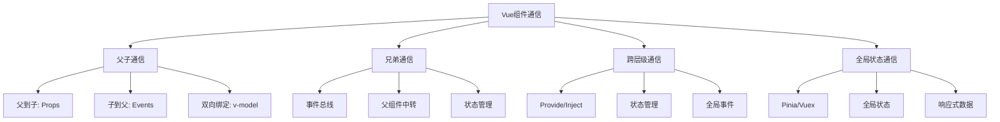

---
tags:
  - Vue组件
  - 组件通信
  - Props
  - Events
  - Provide/Inject
  - Vue3
  - 组件交互
created: 2025-11-18
modified: 2025-11-18
category: Vue核心概念
difficulty: intermediate
---

# Vue组件通信机制详解

> **学习目标**：深入理解Vue组件间的各种通信方式，掌握父子、兄弟、跨层级组件通信的实现方法

## 🎯 本章概览

| 内容 | 预计时间 | 难度 | 状态 |
|------|----------|------|------|
| 组件通信概述 | 15分钟 | ⭐⭐ | ⏳ |
| 父子组件通信 | 25分钟 | ⭐⭐ | ⏳ |
| 兄弟组件通信 | 20分钟 | ⭐⭐⭐ | ⏳ |
| 跨层级通信 | 25分钟 | ⭐⭐⭐ | ⏳ |
| 状态管理通信 | 20分钟 | ⭐⭐⭐ | ⏳ |

---

## 🌐 组件通信概述

### 通信场景分类



### 选择通信方式的依据

| 通信场景 | 推荐方式 | 复杂度 | 适用规模 |
|----------|----------|--------|----------|
| 父传子 | Props | ⭐ | 小型 |
| 子传父 | Events | ⭐ | 小型 |
| 兄弟组件 | 父组件中转/状态管理 | ⭐⭐ | 中型 |
| 跨层级 | Provide/Inject | ⭐⭐ | 中型 |
| 复杂应用 | 状态管理(Pinia) | ⭐⭐⭐ | 大型 |

---

## 👨‍👩‍👧‍👦 父子组件通信

### 父组件向子组件传递数据（Props）

#### 基础Props传递

```vue
<!-- ParentComponent.vue -->
<template>
  <div class="parent">
    <h2>父组件</h2>
    <p>当前用户：{{ currentUser.name }}</p>

    <!-- 通过Props向子组件传递数据 -->
    <ChildComponent
      :user="currentUser"
      :theme="currentTheme"
      :is-editable="canEdit"
      @user-update="handleUserUpdate"
    />
  </div>
</template>

<script setup>
import { reactive, ref } from 'vue'
import ChildComponent from './ChildComponent.vue'

const currentUser = reactive({
  id: 1,
  name: '张三',
  email: 'zhangsan@example.com',
  avatar: '/avatar.jpg'
})

const currentTheme = ref('light')
const canEdit = ref(true)

function handleUserUpdate(updatedUser) {
  Object.assign(currentUser, updatedUser)
  console.log('用户信息已更新：', currentUser)
}
</script>
```

```vue
<!-- ChildComponent.vue -->
<template>
  <div class="child" :class="theme">
    <h3>子组件</h3>
    <div class="user-info">
      
      <div class="info">
        <p v-if="!isEditing">姓名：{{ user.name }}</p>
        <input v-else v-model="editedUser.name" @blur="finishEdit">

        <p v-if="!isEditing">邮箱：{{ user.email }}</p>
        <input v-else v-model="editedUser.email" @blur="finishEdit">
      </div>
    </div>

    <div class="actions">
      <button v-if="!isEditing && isEditable" @click="startEdit">编辑</button>
      <button v-if="isEditing" @click="finishEdit">保存</button>
      <button v-if="isEditing" @click="cancelEdit">取消</button>
    </div>
  </div>
</template>

<script setup>
import { reactive, ref } from 'vue'

// 接收父组件传递的Props
const props = defineProps({
  user: {
    type: Object,
    required: true
  },
  theme: {
    type: String,
    default: 'light',
    validator: (value) => ['light', 'dark'].includes(value)
  },
  isEditable: {
    type: Boolean,
    default: false
  }
})

// 定义向父组件发送的事件
const emit = defineEmits(['user-update'])

const isEditing = ref(false)
const editedUser = reactive({ ...props.user })

function startEdit() {
  isEditing.value = true
  Object.assign(editedUser, props.user)
}

function finishEdit() {
  isEditing.value = false
  emit('user-update', { ...editedUser })
}

function cancelEdit() {
  isEditing.value = false
  Object.assign(editedUser, props.user)
}
</script>

<style scoped>
.child {
  border: 1px solid #ddd;
  border-radius: 8px;
  padding: 20px;
  margin: 10px 0;
}

.child.dark {
  background: #333;
  color: white;
}

.user-info {
  display: flex;
  align-items: center;
  gap: 15px;
  margin-bottom: 15px;
}

.avatar {
  width: 60px;
  height: 60px;
  border-radius: 50%;
}

.info input {
  margin: 5px 0;
  padding: 5px;
  border: 1px solid #ddd;
  border-radius: 4px;
}

.actions {
  display: flex;
  gap: 10px;
}
</style>
```

#### 双向数据绑定（v-model）

```vue
<!-- CustomInput.vue - 自定义输入组件 -->
<template>
  <div class="custom-input">
    <label v-if="label">{{ label }}</label>
    <input
      :type="type"
      :value="modelValue"
      :placeholder="placeholder"
      :disabled="disabled"
      @input="handleInput"
      @blur="handleBlur"
      @focus="handleFocus"
    >
    <span v-if="error" class="error">{{ error }}</span>
  </div>
</template>

<script setup>
const props = defineProps({
  // v-model默认接收modelValue
  modelValue: {
    type: [String, Number],
    default: ''
  },
  label: String,
  type: {
    type: String,
    default: 'text'
  },
  placeholder: String,
  disabled: Boolean,
  error: String
})

// v-model默认事件是update:modelValue
const emit = defineEmits(['update:modelValue', 'blur', 'focus'])

function handleInput(event) {
  emit('update:modelValue', event.target.value)
}

function handleBlur(event) {
  emit('blur', event.target.value)
}

function handleFocus(event) {
  emit('focus', event.target.value)
}
</script>

<style scoped>
.custom-input {
  margin-bottom: 15px;
}

.custom-input label {
  display: block;
  margin-bottom: 5px;
  font-weight: bold;
}

.custom-input input {
  width: 100%;
  padding: 8px;
  border: 1px solid #ddd;
  border-radius: 4px;
}

.error {
  color: red;
  font-size: 12px;
  margin-top: 5px;
  display: block;
}
</style>
```

```vue
<!-- ParentComponent.vue - 使用自定义输入组件 -->
<template>
  <div class="form">
    <h2>用户表单</h2>

    <!-- 基础v-model用法 -->
    <CustomInput
      v-model="user.name"
      label="姓名"
      placeholder="请输入姓名"
    />

    <!-- 带验证的v-model -->
    <CustomInput
      v-model="user.email"
      label="邮箱"
      type="email"
      placeholder="请输入邮箱"
      :error="emailError"
    />

    <!-- 支持修饰符 -->
    <CustomInput
      v-model.lazy="user.description"
      label="描述"
      placeholder="请输入描述"
    />

    <CustomInput
      v-model.number.trim="user.age"
      label="年龄"
      type="number"
      placeholder="请输入年龄"
    />

    <div class="preview">
      <h3>数据预览</h3>
      <pre>{{ user }}</pre>
    </div>
  </div>
</template>

<script setup>
import { ref, watch, computed } from 'vue'
import CustomInput from './CustomInput.vue'

const user = ref({
  name: '',
  email: '',
  description: '',
  age: ''
})

// 邮箱验证
const emailError = computed(() => {
  if (!user.value.email) return ''
  const emailRegex = /^[^\s@]+@[^\s@]+\.[^\s@]+$/
  return emailRegex.test(user.value.email) ? '' : '邮箱格式不正确'
})

// 监听数据变化
watch(user, (newUser) => {
  console.log('用户数据变化：', newUser)
}, { deep: true })
</script>
```

### 子组件向父组件传递数据（Events）

#### 基础事件传递

```vue
<!-- TodoItem.vue - 待办事项组件 -->
<template>
  <div class="todo-item" :class="{ completed: todo.completed }">
    <input
      type="checkbox"
      :checked="todo.completed"
      @change="toggleTodo"
    >
    <span v-if="!isEditing" @dblclick="startEdit" class="todo-text">
      {{ todo.text }}
    </span>
    <input
      v-else
      v-model="editText"
      @blur="finishEdit"
      @keyup.enter="finishEdit"
      @keyup.escape="cancelEdit"
      class="edit-input"
    >
    <div class="actions">
      <button @click="removeTodo">删除</button>
      <button @click="showDetails">详情</button>
    </div>
  </div>
</template>

<script setup>
import { ref } from 'vue'

const props = defineProps({
  todo: {
    type: Object,
    required: true
  }
})

// 定义可以向父组件发送的事件
const emit = defineEmits([
  'toggle',          // 切换完成状态
  'update',          // 更新文本
  'remove',          // 删除待办
  'details',         // 显示详情
  'priority-change'  // 优先级变更
])

const isEditing = ref(false)
const editText = ref(props.todo.text)

function toggleTodo() {
  emit('toggle', {
    id: props.todo.id,
    completed: !props.todo.completed
  })
}

function startEdit() {
  isEditing.value = true
  editText.value = props.todo.text
}

function finishEdit() {
  if (editText.value !== props.todo.text) {
    emit('update', {
      id: props.todo.id,
      text: editText.value
    })
  }
  isEditing.value = false
}

function cancelEdit() {
  editText.value = props.todo.text
  isEditing.value = false
}

function removeTodo() {
  emit('remove', props.todo.id)
}

function showDetails() {
  emit('details', props.todo)
}
</script>

<style scoped>
.todo-item {
  display: flex;
  align-items: center;
  gap: 10px;
  padding: 10px;
  border: 1px solid #ddd;
  border-radius: 4px;
  margin-bottom: 5px;
}

.todo-item.completed .todo-text {
  text-decoration: line-through;
  color: #999;
}

.todo-text {
  flex: 1;
  cursor: pointer;
}

.edit-input {
  flex: 1;
  padding: 5px;
  border: 1px solid #ddd;
  border-radius: 4px;
}

.actions {
  display: flex;
  gap: 5px;
}
</style>
```

```vue
<!-- TodoList.vue - 待办事项列表组件 -->
<template>
  <div class="todo-list">
    <h2>待办事项列表</h2>

    <!-- 添加新待办 -->
    <div class="add-todo">
      <input
        v-model="newTodoText"
        @keyup.enter="addTodo"
        placeholder="添加新待办事项..."
      >
      <button @click="addTodo">添加</button>
    </div>

    <!-- 待办列表 -->
    <div class="todos">
      <TodoItem
        v-for="todo in todos"
        :key="todo.id"
        :todo="todo"
        @toggle="handleToggle"
        @update="handleUpdate"
        @remove="handleRemove"
        @details="handleDetails"
        @priority-change="handlePriorityChange"
      />
    </div>

    <!-- 统计信息 -->
    <div class="stats">
      <p>总计：{{ todos.length }} 项</p>
      <p>已完成：{{ completedCount }} 项</p>
      <p>未完成：{{ uncompletedCount }} 项</p>
    </div>

    <!-- 详情模态框 -->
    <TodoDetails
      v-if="selectedTodo"
      :todo="selectedTodo"
      @close="selectedTodo = null"
    />
  </div>
</template>

<script setup>
import { ref, computed } from 'vue'
import TodoItem from './TodoItem.vue'
import TodoDetails from './TodoDetails.vue'

const todos = ref([
  { id: 1, text: '学习Vue组件通信', completed: false },
  { id: 2, text: '完成项目任务', completed: true },
  { id: 3, text: '准备技术分享', completed: false }
])

const newTodoText = ref('')
const selectedTodo = ref(null)

const completedCount = computed(() =>
  todos.value.filter(todo => todo.completed).length
)

const uncompletedCount = computed(() =>
  todos.value.filter(todo => !todo.completed).length
)

function addTodo() {
  if (newTodoText.value.trim()) {
    const newTodo = {
      id: Date.now(),
      text: newTodoText.value.trim(),
      completed: false
    }
    todos.value.push(newTodo)
    newTodoText.value = ''
  }
}

// 处理子组件事件
function handleToggle({ id, completed }) {
  const todo = todos.value.find(t => t.id === id)
  if (todo) {
    todo.completed = completed
    console.log(`待办事项 ${id} 状态已更新为：${completed ? '已完成' : '未完成'}`)
  }
}

function handleUpdate({ id, text }) {
  const todo = todos.value.find(t => t.id === id)
  if (todo) {
    todo.text = text
    console.log(`待办事项 ${id} 内容已更新为：${text}`)
  }
}

function handleRemove(id) {
  todos.value = todos.value.filter(todo => todo.id !== id)
  console.log(`待办事项 ${id} 已删除`)
}

function handleDetails(todo) {
  selectedTodo.value = todo
}

function handlePriorityChange({ id, priority }) {
  const todo = todos.value.find(t => t.id === id)
  if (todo) {
    todo.priority = priority
    console.log(`待办事项 ${id} 优先级已更新为：${priority}`)
  }
}
</script>

<style scoped>
.todo-list {
  max-width: 600px;
  margin: 0 auto;
  padding: 20px;
}

.add-todo {
  display: flex;
  gap: 10px;
  margin-bottom: 20px;
}

.add-todo input {
  flex: 1;
  padding: 8px;
  border: 1px solid #ddd;
  border-radius: 4px;
}

.stats {
  margin-top: 20px;
  padding: 15px;
  background: #f5f5f5;
  border-radius: 4px;
}

.stats p {
  margin: 5px 0;
}
</style>
```

---

## 👯 兄弟组件通信

### 通过父组件中转

```vue
<!-- ParentComponent.vue - 父组件作为通信中转站 -->
<template>
  <div class="parent">
    <h1>兄弟组件通信示例</h1>

    <div class="components">
      <!-- 左侧组件 -->
      <LeftComponent
        :message="sharedMessage"
        :counter="sharedCounter"
        @message-change="handleMessageChange"
        @counter-change="handleCounterChange"
      />

      <!-- 右侧组件 -->
      <RightComponent
        :message="sharedMessage"
        :counter="sharedCounter"
        @message-change="handleMessageChange"
        @counter-change="handleCounterChange"
      />
    </div>

    <div class="center-info">
      <h3>共享状态（父组件管理）</h3>
      <p>消息：{{ sharedMessage }}</p>
      <p>计数器：{{ sharedCounter }}</p>
    </div>
  </div>
</template>

<script setup>
import { ref } from 'vue'
import LeftComponent from './LeftComponent.vue'
import RightComponent from './RightComponent.vue'

// 父组件管理共享状态
const sharedMessage = ref('来自父组件的初始消息')
const sharedCounter = ref(0)

// 处理左侧组件的事件
function handleMessageChange(newMessage) {
  sharedMessage.value = newMessage
  console.log('消息已更新（来自左侧组件）：', newMessage)
}

function handleCounterChange(change) {
  sharedCounter.value += change
  console.log('计数器已更新：', sharedCounter.value)
}

// 处理右侧组件的事件（共用同一个处理函数）
// 因为逻辑完全相同，所以可以复用
</script>

<style scoped>
.parent {
  max-width: 800px;
  margin: 0 auto;
  padding: 20px;
}

.components {
  display: grid;
  grid-template-columns: 1fr 1fr;
  gap: 20px;
  margin-bottom: 20px;
}

.center-info {
  padding: 20px;
  background: #f0f8ff;
  border-radius: 8px;
  text-align: center;
}
</style>
```

```vue
<!-- LeftComponent.vue - 左侧组件 -->
<template>
  <div class="left-component">
    <h2>左侧组件</h2>

    <div class="input-group">
      <label>发送消息：</label>
      <input
        v-model="localMessage"
        @keyup.enter="sendMessage"
        placeholder="输入消息..."
      >
      <button @click="sendMessage">发送</button>
    </div>

    <div class="counter-controls">
      <h3>计数器控制</h3>
      <button @click="increment">+1</button>
      <button @click="decrement">-1</button>
      <button @click="reset">重置</button>
    </div>

    <div class="received-data">
      <h3>接收到的数据</h3>
      <p>消息：{{ message }}</p>
      <p>计数器：{{ counter }}</p>
    </div>
  </div>
</template>

<script setup>
import { ref } from 'vue'

const props = defineProps({
  message: String,
  counter: Number
})

const emit = defineEmits(['message-change', 'counter-change'])

const localMessage = ref('')

function sendMessage() {
  if (localMessage.value.trim()) {
    emit('message-change', `[左] ${localMessage.value}`)
    localMessage.value = ''
  }
}

function increment() {
  emit('counter-change', 1)
}

function decrement() {
  emit('counter-change', -1)
}

function reset() {
  emit('counter-change', -props.counter) // 重置为0
}
</script>

<style scoped>
.left-component {
  padding: 20px;
  border: 2px solid #4CAF50;
  border-radius: 8px;
  background: #f9fff9;
}

.input-group {
  margin-bottom: 20px;
}

.input-group input {
  width: 100%;
  padding: 8px;
  margin: 5px 0;
  border: 1px solid #ddd;
  border-radius: 4px;
}

.counter-controls {
  margin-bottom: 20px;
}

.counter-controls button {
  margin-right: 10px;
  padding: 8px 16px;
  background: #4CAF50;
  color: white;
  border: none;
  border-radius: 4px;
  cursor: pointer;
}

.received-data {
  padding: 15px;
  background: #e8f5e8;
  border-radius: 4px;
}
</style>
```

### 使用事件总线

```vue
<!-- EventBus.js - 事件总线实现 -->
<script>
import { ref } from 'vue'

// 简单的事件总线实现
class EventBus {
  constructor() {
    this.events = ref({})
  }

  // 订阅事件
  on(eventName, callback) {
    if (!this.events.value[eventName]) {
      this.events.value[eventName] = []
    }
    this.events.value[eventName].push(callback)

    // 返回取消订阅函数
    return () => {
      const callbacks = this.events.value[eventName]
      if (callbacks) {
        const index = callbacks.indexOf(callback)
        if (index > -1) {
          callbacks.splice(index, 1)
        }
      }
    }
  }

  // 取消订阅事件
  off(eventName, callback) {
    const callbacks = this.events.value[eventName]
    if (callbacks) {
      const index = callbacks.indexOf(callback)
      if (index > -1) {
        callbacks.splice(index, 1)
      }
    }
  }

  // 发布事件
  emit(eventName, ...args) {
    const callbacks = this.events.value[eventName]
    if (callbacks) {
      callbacks.forEach(callback => {
        callback(...args)
      })
    }
  }

  // 清除所有事件
  clear() {
    this.events.value = {}
  }
}

// 创建全局事件总线
export const eventBus = new EventBus()
</script>
```

```vue
<!-- BrotherA.vue - 兄弟组件A -->
<template>
  <div class="brother-a">
    <h2>兄弟组件 A</h2>

    <div class="message-sender">
      <label>发送消息给兄弟B：</label>
      <input
        v-model="message"
        @keyup.enter="sendMessage"
        placeholder="输入消息..."
      >
      <button @click="sendMessage">发送</button>
    </div>

    <div class="received-messages">
      <h3>来自兄弟B的消息：</h3>
      <ul>
        <li v-for="(msg, index) in receivedMessages" :key="index">
          {{ msg }}
        </li>
      </ul>
    </div>

    <div class="shared-data">
      <h3>共享计数器：{{ sharedCounter }}</h3>
      <button @click="incrementCounter">增加</button>
      <button @click="decrementCounter">减少</button>
    </div>
  </div>
</template>

<script setup>
import { ref, onMounted, onUnmounted } from 'vue'
import { eventBus } from './EventBus.js'

const message = ref('')
const receivedMessages = ref([])
const sharedCounter = ref(0)

// 发送消息给兄弟组件B
function sendMessage() {
  if (message.value.trim()) {
    eventBus.emit('message-to-b', `[来自A] ${message.value}`)
    message.value = ''
  }
}

// 监听来自兄弟组件B的消息
function handleMessageFromB(msg) {
  receivedMessages.value.unshift(msg)
  // 只保留最近5条消息
  if (receivedMessages.value.length > 5) {
    receivedMessages.value.pop()
  }
}

// 监听计数器变化
function handleCounterChange(delta) {
  sharedCounter.value += delta
}

// 发送计数器变化
function incrementCounter() {
  eventBus.emit('counter-change', 1)
}

function decrementCounter() {
  eventBus.emit('counter-change', -1)
}

// 组件挂载时订阅事件
onMounted(() => {
  eventBus.on('message-to-a', handleMessageFromB)
  eventBus.on('counter-change', handleCounterChange)
})

// 组件卸载时取消订阅
onUnmounted(() => {
  eventBus.off('message-to-a', handleMessageFromB)
  eventBus.off('counter-change', handleCounterChange)
})
</script>

<style scoped>
.brother-a {
  padding: 20px;
  border: 2px solid #2196F3;
  border-radius: 8px;
  background: #f3f8ff;
}

.message-sender {
  margin-bottom: 20px;
}

.message-sender input {
  width: 100%;
  padding: 8px;
  margin: 5px 0;
  border: 1px solid #ddd;
  border-radius: 4px;
}

.received-messages {
  margin-bottom: 20px;
}

.received-messages ul {
  list-style: none;
  padding: 0;
}

.received-messages li {
  padding: 5px;
  background: #e3f2fd;
  margin-bottom: 5px;
  border-radius: 4px;
}

.shared-data {
  text-align: center;
}

.shared-data button {
  margin: 0 5px;
  padding: 8px 16px;
  background: #2196F3;
  color: white;
  border: none;
  border-radius: 4px;
  cursor: pointer;
}
</style>
```

---

## 🌉 跨层级通信

### Provide/Inject机制

```vue
<!-- GrandParentComponent.vue - 祖先组件 -->
<template>
  <div class="grand-parent">
    <h1>祖组件</h1>
    <p>主题：{{ currentTheme }}</p>
    <p>用户：{{ currentUser.name }}</p>

    <div class="theme-controls">
      <button @click="changeTheme('light')">浅色主题</button>
      <button @click="changeTheme('dark')">深色主题</button>
    </div>

    <!-- 使用provide向后代提供数据 -->
    <ParentComponent />
  </div>
</template>

<script setup>
import { reactive, ref, provide } from 'vue'
import ParentComponent from './ParentComponent.vue'

// 提供响应式数据
const currentTheme = ref('light')
const currentUser = reactive({
  id: 1,
  name: '张三',
  role: 'admin'
})

// 提供方法
const appConfig = reactive({
  apiBaseUrl: 'https://api.example.com',
  version: '1.0.0',
  debug: true
})

function changeTheme(theme) {
  currentTheme.value = theme
  console.log('主题已切换为：', theme)
}

function updateUser(newUserInfo) {
  Object.assign(currentUser, newUserInfo)
  console.log('用户信息已更新：', currentUser)
}

// 使用provide向后代组件提供数据和方法
provide('theme', currentTheme)
provide('currentUser', currentUser)
provide('appConfig', appConfig)
provide('changeTheme', changeTheme)
provide('updateUser', updateUser)

// 也可以一次性提供多个值
provide('app', {
  theme: currentTheme,
  user: currentUser,
  config: appConfig,
  actions: {
    changeTheme,
    updateUser
  }
})
</script>

<style scoped>
.grand-parent {
  max-width: 800px;
  margin: 0 auto;
  padding: 20px;
}

.theme-controls {
  margin: 20px 0;
}

.theme-controls button {
  margin-right: 10px;
  padding: 8px 16px;
  border: 1px solid #ddd;
  border-radius: 4px;
  cursor: pointer;
}
</style>
```

```vue
<!-- ParentComponent.vue - 中间层级组件 -->
<template>
  <div class="parent">
    <h2>父组件（不需要传递数据）</h2>
    <p>这个组件只是中间层，不处理任何数据传递</p>

    <ChildComponent />
  </div>
</template>

<script setup>
import ChildComponent from './ChildComponent.vue'

// 父组件不需要接收和传递数据
// 数据直接从祖组件传递到孙组件
</script>

<style scoped>
.parent {
  margin: 20px 0;
  padding: 20px;
  border: 1px solid #ddd;
  border-radius: 8px;
  background: #fafafa;
}
</style>
```

```vue
<!-- ChildComponent.vue - 孙组件 -->
<template>
  <div class="child" :class="theme">
    <h2>孙组件（直接接收祖组件数据）</h2>

    <div class="user-info">
      <h3>用户信息（来自祖组件）</h3>
      <p>姓名：{{ currentUser.name }}</p>
      <p>ID：{{ currentUser.id }}</p>
      <p>角色：{{ currentUser.role }}</p>
    </div>

    <div class="app-config">
      <h3>应用配置（来自祖组件）</h3>
      <p>API地址：{{ appConfig.apiBaseUrl }}</p>
      <p>版本：{{ appConfig.version }}</p>
      <p>调试模式：{{ appConfig.debug ? '开启' : '关闭' }}</p>
    </div>

    <div class="actions">
      <h3>操作（调用祖组件方法）</h3>
      <button @click="toggleTheme">切换主题</button>
      <button @click="changeUserRole">更改角色</button>
    </div>

    <!-- 也可以从统一的对象中获取 -->
    <div class="unified-access">
      <h3>统一访问方式</h3>
      <p>主题：{{ app.theme }}</p>
      <p>用户：{{ app.user.name }}</p>
      <button @click="app.actions.changeTheme('dark')">深色主题</button>
      <button @click="app.actions.updateUser({ name: '李四' })">更改用户名</button>
    </div>
  </div>
</template>

<script setup>
import { inject } from 'vue'

// 使用inject接收祖组件提供的数据
const theme = inject('theme', 'light')
const currentUser = inject('currentUser', {})
const appConfig = inject('appConfig', {})

// 接收祖组件提供的方法
const changeTheme = inject('changeTheme', () => console.warn('changeTheme方法未提供'))
const updateUser = inject('updateUser', () => console.warn('updateUser方法未提供'))

// 接收统一的对象
const app = inject('app', {})

// 组件内部方法
function toggleTheme() {
  const newTheme = theme.value === 'light' ? 'dark' : 'light'
  changeTheme(newTheme)
}

function changeUserRole() {
  const newRole = currentUser.role === 'admin' ? 'user' : 'admin'
  updateUser({ ...currentUser.value, role: newRole })
}
</script>

<style scoped>
.child {
  padding: 20px;
  border: 2px solid #4CAF50;
  border-radius: 8px;
}

.child.light {
  background: white;
  color: #333;
}

.child.dark {
  background: #333;
  color: white;
}

.user-info, .app-config, .actions, .unified-access {
  margin-bottom: 20px;
  padding: 15px;
  border-radius: 4px;
}

.child.light .user-info,
.child.light .app-config,
.child.light .actions,
.child.light .unified-access {
  background: #f0f8ff;
}

.child.dark .user-info,
.child.dark .app-config,
.child.dark .actions,
.child.dark .unified-access {
  background: #1a1a1a;
}

button {
  margin-right: 10px;
  margin-bottom: 5px;
  padding: 8px 16px;
  background: #4CAF50;
  color: white;
  border: none;
  border-radius: 4px;
  cursor: pointer;
}

.child.dark button {
  background: #666;
}
</style>
```

### 高级Provide/Inject用法

```vue
<!-- AdvancedProvider.vue - 高级提供者 -->
<template>
  <div class="advanced-provider">
    <slot />
  </div>
</template>

<script setup>
import { reactive, provide, readonly, computed } from 'vue'

// 创建响应式数据
const state = reactive({
  user: null,
  isLoading: false,
  error: null
})

// 创建计算属性
const isAuthenticated = computed(() => !!state.user)
const userRole = computed(() => state.user?.role || 'guest')

// 创建操作方法
const actions = {
  async login(username, password) {
    state.isLoading = true
    state.error = null

    try {
      // 模拟API调用
      await new Promise(resolve => setTimeout(resolve, 1000))

      if (username === 'admin' && password === 'password') {
        state.user = {
          id: 1,
          name: '管理员',
          role: 'admin',
          token: 'fake-token'
        }
      } else {
        throw new Error('用户名或密码错误')
      }
    } catch (error) {
      state.error = error.message
    } finally {
      state.isLoading = false
    }
  },

  logout() {
    state.user = null
    state.error = null
  },

  clearError() {
    state.error = null
  }
}

// 创建工具方法
const utils = {
  formatUserName(user) {
    return user ? `${user.name} (${user.role})` : '未登录'
  },

  hasRole(role) {
    return state.user?.role === role
  }
}

// 提供数据（部分只读）
provide('authState', readonly(state))
provide('authActions', actions)
provide('authUtils', utils)

// 提供组合式API风格的数据
provide('useAuth', () => ({
  state: readonly(state),
  isAuthenticated,
  userRole,
  ...actions,
  ...utils
}))
</script>
```

```vue
<!-- ConsumerComponent.vue - 消费者组件 -->
<template>
  <div class="consumer">
    <div v-if="isLoading" class="loading">
      登录中...
    </div>

    <div v-else-if="error" class="error">
      <p>{{ error }}</p>
      <button @click="clearError">清除错误</button>
    </div>

    <div v-else-if="isAuthenticated" class="authenticated">
      <h3>欢迎，{{ user.name }}！</h3>
      <p>角色：{{ userRole }}</p>
      <button @click="logout">退出登录</button>
    </div>

    <div v-else class="login-form">
      <h3>用户登录</h3>
      <input
        v-model="username"
        placeholder="用户名"
        @keyup.enter="handleLogin"
      >
      <input
        v-model="password"
        type="password"
        placeholder="密码"
        @keyup.enter="handleLogin"
      >
      <button @click="handleLogin">登录</button>
      <p class="hint">用户名：admin，密码：password</p>
    </div>

    <div class="utils-demo">
      <h3>工具方法演示</h3>
      <p>格式化用户名：{{ formatUserName(user) }}</p>
      <p>是否有管理员权限：{{ hasRole('admin') ? '是' : '否' }}</p>
    </div>
  </div>
</template>

<script setup>
import { ref, inject } from 'vue'

// 方式1：分别inject
const state = inject('authState')
const actions = inject('authActions')
const utils = inject('authUtils')

// 方式2：使用组合式API风格
const useAuth = inject('useAuth')
const {
  isLoading,
  error,
  user,
  isAuthenticated,
  userRole,
  login,
  logout,
  clearError,
  formatUserName,
  hasRole
} = useAuth()

// 本地状态
const username = ref('')
const password = ref('')

// 方法
async function handleLogin() {
  if (username.value && password.value) {
    await login(username.value, password.value)
    username.value = ''
    password.value = ''
  }
}
</script>

<style scoped>
.consumer {
  max-width: 400px;
  margin: 0 auto;
  padding: 20px;
  border: 1px solid #ddd;
  border-radius: 8px;
}

.loading, .error, .authenticated, .login-form, .utils-demo {
  margin-bottom: 20px;
  padding: 15px;
  border-radius: 4px;
}

.loading {
  background: #e3f2fd;
  text-align: center;
}

.error {
  background: #ffebee;
  color: #c62828;
}

.authenticated {
  background: #e8f5e8;
}

.login-form input {
  width: 100%;
  padding: 8px;
  margin: 5px 0;
  border: 1px solid #ddd;
  border-radius: 4px;
}

.utils-demo {
  background: #f5f5f5;
}

button {
  padding: 8px 16px;
  background: #2196F3;
  color: white;
  border: none;
  border-radius: 4px;
  cursor: pointer;
}

.hint {
  font-size: 12px;
  color: #666;
  margin-top: 10px;
}
</style>
```

---

## 📝 本章小结

### ✅ 掌握的核心概念

1. **父子通信** - Props向下传递，Events向上发送
2. **兄弟通信** - 父组件中转、事件总线
3. **跨层级通信** - Provide/Inject机制
4. **双向绑定** - v-model实现自定义组件
5. **事件系统** - 自定义事件和事件总线

### 🎯 实践能力

- [ ] 能够实现完整的父子组件通信
- [ ] 能够处理兄弟组件间的数据交换
- [ ] 能够使用Provide/Inject实现跨层级通信
- [ ] 能够创建自定义双向绑定组件
- [ ] 能够选择合适的通信方式

### 🚀 下一步学习

掌握了组件通信后，继续学习：
- [[07-Vue组件生命周期与钩子函数.md|组件生命周期管理]]
- [[08-Vue组件最佳实践.md|组件开发最佳实践]]
- [[09-Vue组件状态管理详解.md|组件状态管理]]

---

## 💡 组件通信金科玉律

1. **单向数据流** - 始终保持从父到子的数据流向
2. **最小依赖** - 组件间通信尽量减少依赖关系
3. **明确职责** - 每个组件的通信职责要清晰明确
4. **合理选择** - 根据场景选择最合适的通信方式
5. **避免过度设计** - 简单场景不要使用复杂的通信方案

**记住：好的组件通信是可维护应用的基础！** 🎉