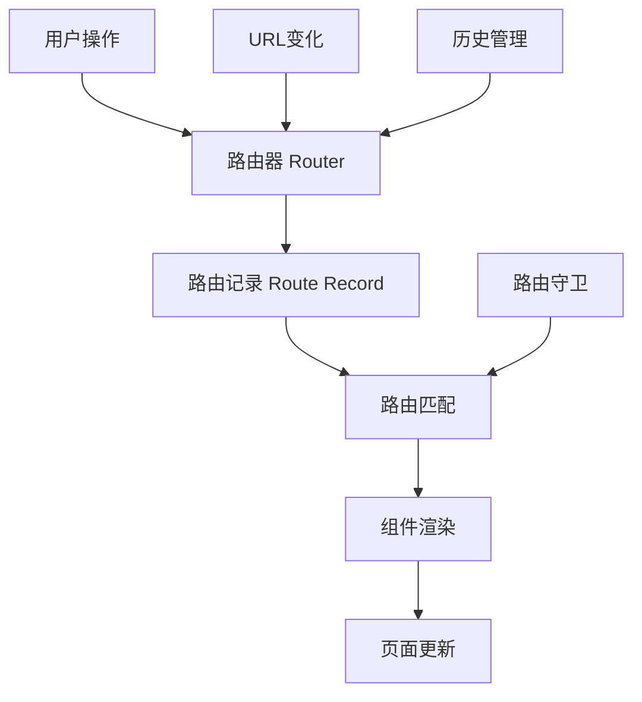
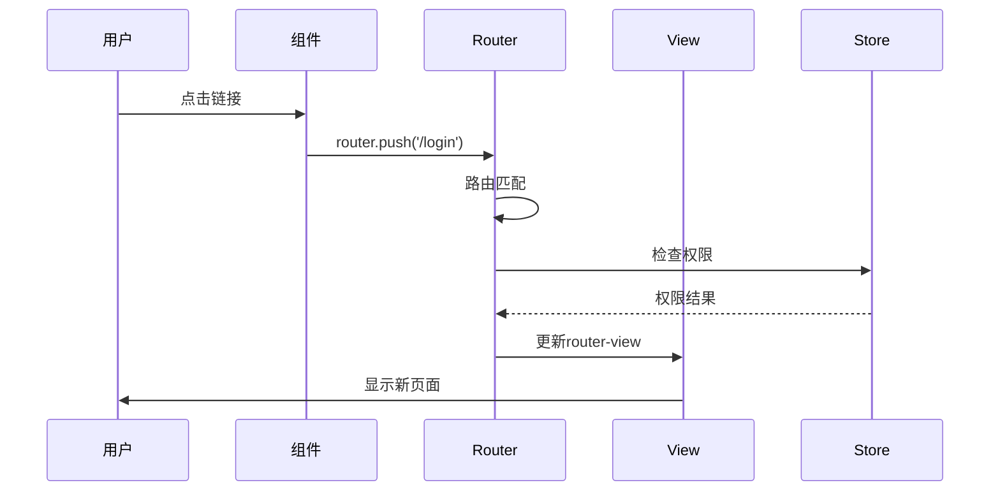

---
tags:
  - Vue Router基础
  - 单页面应用
  - 路由概念
  - SPA原理
  - Vue3
created: 2025-11-18
modified: 2025-11-18
category: Vue核心概念
difficulty: beginner
---

# Vue Router基础概念详解

> **学习目标**：从零开始理解Vue Router的核心概念，为后续深入学习打下坚实基础

## 🎯 什么是路由？

### 📖 生活中的路由概念

想象一下邮递员送信的过程：

```
传统网站（多页面）：
用户输入地址 → 邮递员送到 → 收到新信件 → 重新打开信封

现代应用（单页面）：
用户告诉地址 → 邮递员内部传递 → 在同一个信封里换内容 → 用户看到新内容
```

### 🌐 网页应用中的路由

**路由（Routing）** 就是根据URL地址，决定显示哪个页面内容的技术。

```javascript
// 简单理解：URL → 页面内容的对应关系
'/home'      → 显示首页组件
'/login'     → 显示登录组件
'/dashboard' → 显示仪表板组件
```

---

## 🆚 传统网站 vs 单页面应用

### 🏢 传统多页面网站（MPA）

```
用户点击链接 → 浏览器发送HTTP请求 → 服务器返回HTML页面 → 浏览器重新渲染整个页面
```

**特点：**
- ✅ SEO友好
- ✅ 首次加载快
- ❌ 页面切换有白屏
- ❌ 用户体验不连贯
- ❌ 重复加载相同资源

**代码示例：**
```html
<!-- page1.html -->
<html>
<head><title>页面1</title></head>
<body>
  <h1>这是页面1</h1>
  <a href="page2.html">去页面2</a>
</body>
</html>

<!-- page2.html -->
<html>
<head><title>页面2</title></head>
<body>
  <h1>这是页面2</h1>
  <a href="page1.html">去页面1</a>
</body>
</html>
```

### 🚀 现代单页面应用（SPA）

```
用户点击链接 → JavaScript拦截链接 → 更新URL地址 → 动态替换页面组件 → 无刷新更新内容
```

**特点：**
- ✅ 用户体验流畅
- ✅ 页面切换无白屏
- ✅ 资源复用率高
- ❌ SEO需要特殊处理
- ❌ 首次加载较慢

**代码示例：**
```javascript
// 只有一个HTML文件
// index.html
<html>
<head><title>单页面应用</title></head>
<body>
  <div id="app">
    <!-- 这里会动态显示不同的组件 -->
    <router-view></router-view>
  </div>
</body>
</html>

// JavaScript控制显示内容
const routes = {
  '/home': '<h1>这是首页</h1>',
  '/login': '<h1>这是登录页</h1>'
}

// 根据URL显示不同内容
function showPage(url) {
  document.getElementById('app').innerHTML = routes[url] || '404'
}
```

---

## 🧠 Vue Router的工作原理

### 📋 核心组件

Vue Router由以下几个核心部分组成：



### 🔧 关键概念解释

#### 1. **Router（路由器）**
```javascript
// Router是整个路由系统的管理者
// 负责管理所有路由规则、处理导航、控制页面切换

const router = createRouter({
  // 路由配置
})
```

**作用：**
- 📋 管理所有路由规则
- 🎯 处理URL变化
- 🛡️ 执行路由守卫
- 🎭 控制组件渲染

#### 2. **Route（路由）**
```javascript
// Route是单个路由规则的定义
// 描述了URL路径和对应组件的映射关系

const route = {
  path: '/login',           // URL路径
  component: LoginComponent, // 对应的组件
  name: 'login'            // 路由名称
}
```

**作用：**
- 📍 定义URL路径
- 🏗️ 指定对应组件
- 🏷️ 提供路由标识
- 📋 存储元数据

#### 3. **Router-view（路由视图）**
```vue
<!-- Router-view是组件显示的容器 -->
<!-- 匹配到的路由组件会在这里渲染 -->

<template>
  <div>
    <h1>我的应用</h1>
    <router-view />  <!-- 🔥 路由组件会在这里显示 -->
  </div>
</template>
```

**作用：**
- 🎭 组件渲染容器
- 🔄 自动更新内容
- 📍 支持嵌套显示
- 🎨 可添加过渡效果

---

## 🛣️ 路由模式对比

### 📜 History模式

```javascript
// 使用HTML5 History API
createWebHistory()
```

**URL格式：**
```
http://localhost:5173/dashboard
http://localhost:5173/login
http://localhost:5173/user/123
```

**工作原理：**
```javascript
// 内部使用HTML5 History API
history.pushState({}, '', '/dashboard')  // 前进
history.replaceState({}, '', '/login')  // 替换
history.back()                           // 后退
```

**优点：**
- ✅ URL美观，像真实网站
- ✅ SEO友好
- ✅ 符合用户习惯

**缺点：**
- ❌ 需要服务器配置支持
- ❌ 刷新页面可能404

**服务器配置示例：**
```nginx
# Nginx配置
location / {
  try_files $uri $uri/ /index.html;
}
```

### 🔗 Hash模式

```javascript
// 使用URL哈希
createWebHashHistory()
```

**URL格式：**
```
http://localhost:5173/#/dashboard
http://localhost:5173/#/login
http://localhost:5173/#/user/123
```

**工作原理：**
```javascript
// 监听hashchange事件
window.addEventListener('hashchange', () => {
  const path = window.location.hash.slice(1) // 去掉#
  // 根据path显示对应组件
})

// 改变hash不会刷新页面
window.location.hash = '#/dashboard'
```

**优点：**
- ✅ 兼容性好（支持IE9+）
- ✅ 无需服务器配置
- ✅ 部署简单

**缺点：**
- ❌ URL有#号，不够美观
- ❌ SEO不友好
- ❌ 不符合现代Web标准

### 📊 模式选择对比表

| 特性 | History模式 | Hash模式 |
|------|-------------|----------|
| **URL美观度** | 🌟🌟🌟🌟🌟 | 🌟🌟 |
| **SEO友好度** | 🌟🌟🌟🌟🌟 | 🌟 |
| **服务器配置** | 需要配置 | 无需配置 |
| **浏览器兼容** | 现代浏览器 | IE9+ |
| **开发体验** | 🌟🌟🌟🌟 | 🌟🌟🌟🌟 |
| **生产部署** | 🌟🌟🌟 | 🌟🌟🌟🌟 |

---

## 🏗️ 路由系统架构

### 📁 文件组织结构

```
frontend/src/
├── router/                # 🔥 路由配置目录
│   ├── index.js          # 主路由文件
│   ├── modules/          # 路由模块
│   │   ├── auth.js       # 认证相关路由
│   │   └── admin.js      # 管理员路由
│   └── guards.js         # 路由守卫
├── views/                # 页面组件
│   ├── Login.vue
│   ├── Dashboard.vue
│   └── ...
├── layouts/              # 布局组件
│   ├── DefaultLayout.vue
│   └── AuthLayout.vue
├── App.vue               # 根组件
└── main.js               # 入口文件
```

### 🔄 数据流转过程



---

## 🎯 为什么需要Vue Router？

### 1. **用户体验提升**

```javascript
// 传统方式：每次都要重新加载
用户点击 → 等待 → 白屏 → 新页面加载完成

// Vue Router方式：无缝切换
用户点击 → 立即响应 → 平滑过渡 → 新内容显示
```

### 2. **代码组织优化**

```javascript
// 传统方式：所有页面混在一起
index.html (包含所有页面内容)

// Vue Router方式：模块化组织
views/
├── Login.vue      (登录逻辑)
├── Dashboard.vue  (仪表板逻辑)
└── Profile.vue    (个人资料逻辑)
```

### 3. **权限控制便利**

```javascript
// 路由级别的权限控制
const routes = [
  {
    path: '/admin',
    meta: { requiresAuth: true, role: 'admin' }
  }
]

// 自动检查用户权限，无需在每个组件中重复代码
```

### 4. **性能优化**

```javascript
// 懒加载：只加载需要的代码
component: () => import('./views/Admin.vue')

// 结果：首次加载更快，按需加载其他页面
```

---

## 🚀 实际应用场景

### 🛒 电商网站

```javascript
// 电商网站路由结构
const routes = [
  { path: '/', component: Home },           // 首页
  { path: '/products', component: Products }, // 商品列表
  { path: '/product/:id', component: ProductDetail }, // 商品详情
  { path: '/cart', component: Cart },       // 购物车
  { path: '/checkout', component: Checkout }, // 结算页面
  { path: '/profile', component: Profile }   // 个人中心
]
```

### 📱 管理后台

```javascript
// 管理后台路由结构
const routes = [
  {
    path: '/admin',
    component: AdminLayout,
    children: [
      { path: '', component: Dashboard },      // 仪表板
      { path: 'users', component: UserManagement }, // 用户管理
      { path: 'products', component: ProductManagement }, // 商品管理
      { path: 'orders', component: OrderManagement }     // 订单管理
    ]
  }
]
```

---

## 📋 学习检查清单

### ✅ 基础概念理解

- [ ] 能够解释什么是路由
- [ ] 理解SPA和MPA的区别
- [ ] 知道Vue Router的核心组件
- [ ] 明白Router-view的作用

### ✅ 技术原理掌握

- [ ] 理解History模式的工作原理
- [ ] 理解Hash模式的工作原理
- [ ] 知道两种模式的优缺点
- [ ] 能够根据需求选择合适的模式

### ✅ 实际应用能力

- [ ] 能够设计合理的路由结构
- [ ] 理解路由系统的数据流转
- [ ] 知道Vue Router的应用价值
- [ ] 能够规划项目的路由架构

---

## 🎯 下一步学习

掌握了基础概念后，继续深入学习：

- [[02-导入语句逐行详解.md|导入语句解析]]
- [[03-createRouter函数深度解析.md|路由器创建详解]]
- [[04-createWebHistory参数详解.md|History模式详解]]

---

**记住：理解基础概念是掌握Vue Router的第一步，坚实的基础会让后续学习事半功倍！** 🎉

---

*这个章节专注于最基础的概念理解，确保你对Vue Router有一个清晰的认识，为后续的技术细节学习做好准备。*