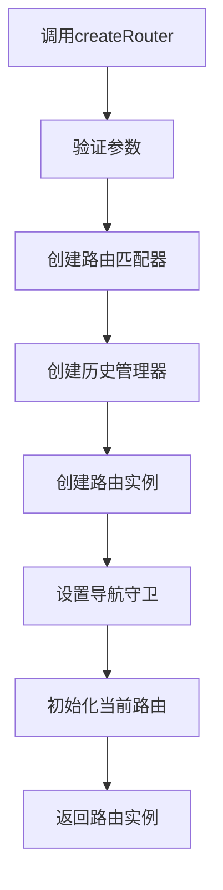
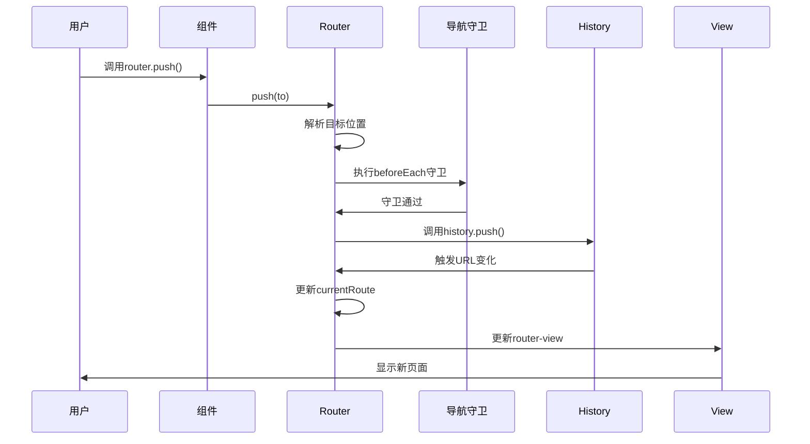

---
tags:
  - createRouter
  - 路由实例
  - 路由配置
  - Vue Router核心
  - Vue3
created: 2025-11-18
modified: 2025-11-18
category: Vue核心概念
difficulty: intermediate
---

# createRouter函数深度解析

> **学习目标**：彻底理解createRouter函数的工作原理、参数配置和内部机制

## 🎯 回顾createRouter的使用

在你的项目中，createRouter函数是这样使用的：

```javascript
// router/index.js
const router = createRouter({
  history: createWebHistory(import.meta.env.BASE_URL),
  routes: [
    // 路由规则数组
  ]
})
```

这行代码看起来简单，但createRouter函数是Vue Router的核心，它做了很多复杂的工作。让我们深入解析。

---

## 🔧 createRouter函数签名

### 📋 完整的函数定义

```typescript
// createRouter的TypeScript类型定义
function createRouter(options: RouterOptions): Router {
  // 内部实现逻辑
}

// RouterOptions接口定义
interface RouterOptions {
  history: RouterHistory              // 🔥 历史管理实例
  routes: RouteRecordRaw[]           // 🔥 路由规则数组
  scrollBehavior?: RouterScrollBehavior  // 可选：滚动行为
  linkActiveClass?: string           // 可选：激活链接样式类
  linkExactActiveClass?: string      // 可选：精确激活链接样式类
  parseQuery?: (query: string) => any  // 可选：查询参数解析函数
  stringifyQuery?: (query: object) => string  // 可选：查询参数序列化函数
  sensitive?: boolean                // 可选：是否区分大小写
  strict?: boolean                   // 可选：是否严格匹配
  end?: boolean                      // 可选：是否匹配结尾
}
```

### 🧩 参数详解

#### **1. `history` 参数（必需）**

```javascript
// history参数负责管理浏览器的历史记录
// 它决定了URL的格式和导航行为

// 你的项目中使用：
history: createWebHistory(import.meta.env.BASE_URL)

// history的可选值：
createWebHistory()     // HTML5 History模式
createWebHashHistory() // Hash模式
createMemoryHistory()  // 内存模式（用于SSR）
```

**history对象的作用：**

```javascript
// history对象必须提供以下方法：
const history = {
  // 基础路径
  base: '/',

  // 当前位置信息
  location: {
    pathname: '/dashboard',
    search: '?id=123',
    hash: '#section'
  },

  // 导航方法
  push(to) {
    // 前进到新页面
  },

  replace(to) {
    // 替换当前页面
  },

  go(delta) {
    // 前进或后退
  },

  // 监听器管理
  listen(callback) {
    // 添加路由变化监听器
  },

  // 清理
  destroy() {
    // 清理监听器等资源
  }
}
```

#### **2. `routes` 参数（必需）**

```javascript
// routes参数定义了所有的路由规则
// 它是一个数组，每个元素是一个路由对象

const routes = [
  {
    path: '/',                    // URL路径
    name: 'home',                // 路由名称
    component: HomeComponent,    // 对应组件
    meta: { title: '首页' }      // 元数据
  },
  {
    path: '/about',
    name: 'about',
    component: AboutComponent,
    children: [                  // 嵌套路由
      {
        path: 'team',
        component: TeamComponent
      }
    ]
  }
]
```

**路由对象的完整结构：**

```typescript
interface RouteRecordRaw {
  path: string                    // 🔥 URL路径模式
  name?: string                   // 路由名称
  component?: Component          // 路由组件
  components?: Record<string, Component>  // 多个命名视图
  redirect?: string | Location   // 重定向
  alias?: string | string[]      // 别名
  children?: RouteRecordRaw[]    // 子路由
  meta?: Record<string, any>     // 元数据
  beforeEnter?: NavigationGuard  // 路由守卫
  props?: boolean | Object | Function  // 组件props
}
```

---

## 🏗️ createRouter内部工作原理

### 📋 创建过程分解



### 🔍 详细实现步骤

#### **步骤1：参数验证**

```javascript
// 简化版参数验证
function createRouter(options) {
  // 1. 验证必需参数
  if (!options.history) {
    throw new Error('history option is required')
  }

  if (!options.routes || !Array.isArray(options.routes)) {
    throw new Error('routes option must be an array')
  }

  // 2. 验证路由配置
  options.routes.forEach((route, index) => {
    if (!route.path) {
      throw new Error(`Route at index ${index} must have a path`)
    }
  })

  // 继续后续步骤...
}
```

#### **步骤2：创建路由匹配器**

```javascript
// 路由匹配器的作用：根据URL找到对应的路由配置
function createMatcher(routes) {
  // 1. 扁平化路由树
  const flatRoutes = flattenRoutes(routes)

  // 2. 创建路径匹配器
  const matchers = flatRoutes.map(route => ({
    path: route.path,
    regex: pathToRegexp(route.path),  // 将路径转换为正则表达式
    record: route,
    parent: undefined
  }))

  // 3. 返回匹配器对象
  return {
    match(location) {
      // 根据location.path找到匹配的路由
      for (const matcher of matchers) {
        if (matcher.regex.test(location.path)) {
          return {
            path: location.path,
            params: extractParams(matcher.regex, location.path),
            matched: [matcher.record]
          }
        }
      }
      return null
    },

    addRoute(route) {
      // 动态添加路由
    },

    removeRoute(name) {
      // 动态删除路由
    }
  }
}
```

**路径匹配示例：**

```javascript
// 路由配置：'/user/:id'
// 转换为正则表达式：/^\/user\/([^\/]+)(?:\/)?$/

// 匹配测试：
'/user/123'  ✅ 匹配，params = { id: '123' }
'/user/abc'  ✅ 匹配，params = { id: 'abc' }
'/user/'     ❌ 不匹配
'/user/123/profile'  ❌ 不匹配（除非配置了通配符）
```

#### **步骤3：创建路由实例**

```javascript
function createRouter(options) {
  // ...前面的步骤

  // 创建路由实例
  const router = {
    // 🔥 核心属性
    options: options,                    // 路由配置
    history: options.history,            // 历史管理器
    matcher: createMatcher(options.routes), // 路由匹配器

    // 🔥 响应式状态
    currentRoute: shallowRef({            // 当前路由信息
      path: '/',
      name: undefined,
      params: {},
      query: {},
      hash: '',
      fullPath: '/',
      matched: []
    }),

    // 🔥 导航方法
    push,
    replace,
    go,
    back,
    forward,

    // 🔥 工具方法
    resolve,
    addRoute,
    removeRoute,
    hasRoute,
    getRoutes,

    // 🔥 安装方法（Vue插件）
    install(app) {
      app.config.globalProperties.$router = this
      app.provide(routerKey, this)
      app.provide(routeLocationKey, this.currentRoute)
    }
  }

  return router
}
```

---

## 🚀 导航方法详解

### 1. `push` 方法

```javascript
// push方法：导航到新页面，添加到历史记录
router.push('/dashboard')
router.push({ path: '/dashboard', query: { id: 123 } })
router.push({ name: 'dashboard', params: { id: 123 } })

// 内部实现：
function push(to) {
  // 1. 解析目标位置
  const location = normalizeLocation(to)

  // 2. 执行导航守卫
  return this.navigate(location, false)  // false表示不替换历史
}
```

### 2. `replace` 方法

```javascript
// replace方法：导航到新页面，替换当前历史记录
router.replace('/dashboard')

// 内部实现：
function replace(to) {
  const location = normalizeLocation(to)
  return this.navigate(location, true)   // true表示替换历史
}
```

### 3. `go` 方法

```javascript
// go方法：在历史记录中前进或后退
router.go(1)     // 前进1页
router.go(-1)    // 后退1页
router.go(2)     // 前进2页

// 内部实现：
function go(delta) {
  this.history.go(delta)
}
```

### 4. `back` 和 `forward` 方法

```javascript
// back：后退一页
router.back()    // 等价于 router.go(-1)

// forward：前进一页
router.forward() // 等价于 router.go(1)
```

---

## 🎯 导航过程深度解析

### 📋 完整的导航流程



### 🔍 详细代码流程

```javascript
// 用户调用：router.push('/dashboard')

// 1. 解析目标位置
function normalizeLocation(to) {
  if (typeof to === 'string') {
    return { path: to }
  }
  if (to.name) {
    // 通过路由名称解析路径
    const route = this.matcher.resolveName(to.name, to.params)
    return { ...route, query: to.query, hash: to.hash }
  }
  return to
}

// 2. 执行导航
async function navigate(to, replace) {
  // 2.1 执行全局前置守卫
  const guards = this.beforeEachGuards.slice()
  for (const guard of guards) {
    await guard(to, from, next)
  }

  // 2.2 确认导航
  const failure = await confirmTransition(to)
  if (failure) {
    return failure
  }

  // 2.3 更新历史记录
  if (replace) {
    this.history.replace(to.fullPath)
  } else {
    this.history.push(to.fullPath)
  }

  // 2.4 更新当前路由
  this.currentRoute.value = to

  // 2.5 执行全局后置守卫
  this.afterEachGuards.forEach(guard => {
    guard(to, from)
  })
}
```

---

## 🛠️ 高级配置选项

### 1. `scrollBehavior` 滚动行为

```javascript
const router = createRouter({
  history: createWebHistory(),
  routes: [...],
  scrollBehavior(to, from, savedPosition) {
    // savedPosition：浏览器保存的滚动位置
    if (savedPosition) {
      return savedPosition  // 恢复之前的位置
    } else if (to.hash) {
      return { el: to.hash }  // 滚动到锚点
    } else {
      return { top: 0 }      // 滚动到顶部
    }
  }
})
```

### 2. `linkActiveClass` 激活样式

```javascript
const router = createRouter({
  history: createWebHistory(),
  routes: [...],
  linkActiveClass: 'active-link',        // 自定义激活样式类
  linkExactActiveClass: 'exact-active'    // 精确匹配激活样式类
})
```

### 3. `parseQuery` 查询参数解析

```javascript
const router = createRouter({
  history: createWebHistory(),
  routes: [...],
  parseQuery(query) {
    // 自定义查询参数解析
    // 默认：使用URLSearchParams
    return qs.parse(query)  // 使用qs库解析
  }
})
```

---

## 📊 性能优化技巧

### 1. 路由懒加载

```javascript
// ✅ 懒加载路由组件
const routes = [
  {
    path: '/dashboard',
    component: () => import('./views/Dashboard.vue')
  }
]

// 打包结果：
// dashboard.js (单独的chunk)
// 只在访问/dashboard时才加载
```

### 2. 路由预加载

```javascript
// 在用户可能访问前预加载
router.beforeEach((to, from, next) => {
  // 预加载管理员页面（如果用户是管理员）
  if (user.isAdmin && to.path !== '/admin') {
    import('./views/Admin.vue')
  }
  next()
})
```

### 3. 路由缓存

```javascript
// 使用keep-alive缓存路由组件
<template>
  <router-view v-slot="{ Component }">
    <keep-alive include="Dashboard,Profile">
      <component :is="Component" />
    </keep-alive>
  </router-view>
</template>
```

---

## 🐛 常见问题和解决方案

### ❌ 问题1：路由不匹配

```javascript
// 症状：访问路由时显示空白页面

// 原因：路由配置错误
const routes = [
  { path: 'dashboard', component: Dashboard }  // ❌ 缺少前导斜杠
]

// 解决方案：
const routes = [
  { path: '/dashboard', component: Dashboard }  // ✅ 正确格式
]
```

### ❌ 问题2：重复导航

```javascript
// 症状：重复跳转到相同路由时报错

// 解决方案：添加重复导航检测
const originalPush = Router.prototype.push
Router.prototype.push = function push(location) {
  return originalPush.call(this, location).catch(err => {
    if (err.name !== 'NavigationDuplicated') {
      throw err
    }
  })
}
```

### ❌ 问题3：路由参数丢失

```javascript
// 症状：页面刷新后路由参数消失

// 原因：没有正确处理参数传递

// 解决方案：
// 正确的参数传递方式
router.push({
  name: 'user-detail',
  params: { id: '123' }  // params用于路径参数
})

// 路由配置
{
  path: '/user/:id',
  name: 'user-detail',
  component: UserDetail
}
```

---

## 📋 学习检查清单

### ✅ createRouter理解

- [ ] 理解createRouter函数的作用
- [ ] 掌握必需参数history和routes
- [ ] 了解可选配置选项
- [ ] 知道路由实例的结构

### ✅ 内部机制掌握

- [ ] 理解路由匹配器的工作原理
- [ ] 掌握导航方法的实现
- [ ] 了解导航守卫的执行流程
- [ ] 知道响应式路由状态的管理

### ✅ 实际应用能力

- [ ] 能够正确配置createRouter
- [ ] 能够处理导航相关问题
- [ ] 知道如何优化路由性能
- [ ] 能够解决常见的路由问题

---

## 🎯 下一步学习

掌握了createRouter函数后，继续深入学习：

- [[04-createWebHistory参数详解.md|History模式详解]]
- [[05-路由规则配置逐行解析.md|路由配置详解]]
- [[06-懒加载机制原理详解.md|懒加载机制]]

---

**记住：createRouter是Vue Router的核心，理解它的工作原理对于掌握整个路由系统至关重要！** 🎉

---

*这个章节深入解析了createRouter函数的每一个细节，确保你对Vue Router的核心机制有全面的理解。*