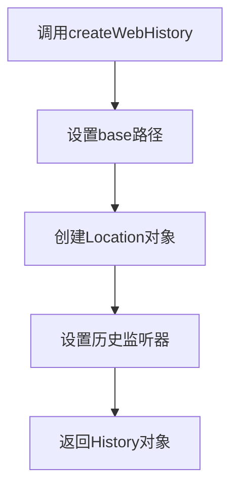

---
tags:
  - createWebHistory
  - History模式
  - BASE_URL
  - Vite环境变量
  - 路由模式
  - Vue3
created: 2025-11-18
modified: 2025-11-18
category: Vue核心概念
difficulty: intermediate
---

# createWebHistory参数详解

> **学习目标**：彻底理解createWebHistory函数的参数配置、工作原理和实际应用

## 🎯 回顾你的项目配置

在你的项目中，createWebHistory是这样使用的：

```javascript
// router/index.js
const router = createRouter({
  history: createWebHistory(import.meta.env.BASE_URL),
  routes: [...]
})
```

这行代码中的 `import.meta.env.BASE_URL` 特别重要，让我们深入解析每一个部分。

---

## 🔧 createWebHistory函数签名

### 📋 完整的函数定义

```typescript
// createWebHistory的TypeScript类型定义
function createWebHistory(base?: string): RouterHistory {
  // 内部实现逻辑
}

// RouterHistory接口定义
interface RouterHistory {
  base: string                    // 🔥 基础路径
  location: Location              // 🔥 当前位置信息
  state: any                      // 🔥 历史状态

  // 导航方法
  push(to: string): void
  replace(to: string): void
  go(delta: number): void

  // 监听器管理
  listen(callback: (to: string, from: string, info: NavigationInfo) => void): () => void
  destroy(): void
}
```

### 🧩 参数详解：`base` 参数

#### **参数类型和默认值**

```javascript
// base参数是可选的，类型为string
// 默认值：'/'

// 你的项目中：
createWebHistory(import.meta.env.BASE_URL)
// 如果import.meta.env.BASE_URL是'/'，等价于：
createWebHistory('/')
```

#### **base参数的作用**

```javascript
// base参数指定了应用的基础路径
// 所有路由都会基于这个路径进行解析

// 示例1：根路径部署
createWebHistory('/')
// 结果：
// - 路由：/dashboard → 实际URL：http://example.com/dashboard
// - 路由：/login → 实际URL：http://example.com/login

// 示例2：子路径部署
createWebHistory('/my-app/')
// 结果：
// - 路由：/dashboard → 实际URL：http://example.com/my-app/dashboard
// - 路由：/login → 实际URL：http://example.com/my-app/login
```

---

## 🌐 import.meta.env.BASE_URL 深度解析

### 📋 什么是 import.meta.env

```javascript
// import.meta.env 是Vite提供的环境变量对象
// 它在构建时被替换为实际的值

// 开发环境 (npm run dev)
import.meta.env = {
  BASE_URL: '/',              // 🔥 基础URL
  MODE: 'development',        // 🔥 运行模式
  DEV: true,                  // 🔥 是否开发环境
  PROD: false,                // 🔥 是否生产环境
  SSR: false                  // 🔥 是否服务端渲染
}

// 生产环境 (npm run build)
import.meta.env = {
  BASE_URL: '/',              // 或其他配置值
  MODE: 'production',
  DEV: false,
  PROD: true,
  SSR: false
}
```

### 🎯 BASE_URL 的配置方式

#### **1. Vite配置文件**

```javascript
// vite.config.js
export default defineConfig({
  // 🔥 base配置决定BASE_URL的值
  base: '/',                    // 根路径部署

  // 其他配置选项：
  // base: '/my-app/',          // 子路径部署
  // base: './',                // 相对路径部署
  // base: 'https://cdn.example.com/', // CDN部署
})
```

#### **2. 环境变量文件**

```bash
# .env.development (开发环境)
VITE_BASE_URL=/

# .env.production (生产环境)
VITE_BASE_URL=/my-app/

# .env.local (本地覆盖)
VITE_BASE_URL=/local-dev/
```

#### **3. package.json配置**

```json
{
  "scripts": {
    "dev": "vite --base=/",
    "build": "vite build --base=/my-app/",
    "build:cdn": "vite build --base=https://cdn.example.com/"
  }
}
```

---

## 🏗️ createWebHistory 内部工作原理

### 📋 创建过程分解



### 🔍 详细实现步骤

#### **步骤1：处理base参数**

```javascript
// 简化版内部实现
function createWebHistory(base = '/') {
  // 1. 标准化base路径
  if (base && !base.startsWith('/')) {
    base = '/' + base
  }
  if (!base.endsWith('/')) {
    base = base + '/'
  }

  // 2. 确保base是有效的URL路径
  base = base.replace(/\/+/g, '/')

  return createHTML5History(base)
}
```

**base路径标准化示例：**

```javascript
// 输入 → 输出
'' → '/'
'my-app' → '/my-app/'
'/my-app' → '/my-app/'
'/my-app/' → '/my-app/'
'//my-app//' → '/my-app/'
```

#### **步骤2：创建History对象**

```javascript
function createHTML5History(base) {
  // 1. 获取当前URL信息
  const currentLocation = {
    pathname: window.location.pathname,
    search: window.location.search,
    hash: window.location.hash
  }

  // 2. 验证当前URL是否匹配base路径
  if (!currentLocation.pathname.startsWith(base)) {
    console.warn(`Current path "${currentLocation.pathname}" does not start with base "${base}"`)
  }

  // 3. 创建History对象
  return {
    base: base,
    location: normalizeLocation(currentLocation, base),
    state: window.history.state,

    // 导航方法
    push(to) {
      const url = base + to
      window.history.pushState({ key: generateKey() }, '', url)
      notifyListeners(to, currentLocation)
    },

    replace(to) {
      const url = base + to
      window.history.replaceState({ key: generateKey() }, '', url)
      notifyListeners(to, currentLocation)
    },

    go(delta) {
      window.history.go(delta)
    },

    // 监听器管理
    listeners: [],
    listen(callback) {
      this.listeners.push(callback)

      // 返回取消监听的函数
      return () => {
        const index = this.listeners.indexOf(callback)
        if (index > -1) {
          this.listeners.splice(index, 1)
        }
      }
    },

    destroy() {
      this.listeners.length = 0
      window.removeEventListener('popstate', handlePopState)
    }
  }
}
```

#### **步骤3：设置事件监听**

```javascript
// 监听浏览器的前进/后退按钮
function handlePopState(event) {
  const location = normalizeLocation(window.location, base)
  notifyListeners(location, currentLocation)
}

// 注册监听器
window.addEventListener('popstate', handlePopState)
```

---

## 🚀 实际应用场景

### 📦 场景1：根路径部署

```javascript
// 应用部署在域名根目录
// 网址：https://example.com/

// vite.config.js
export default defineConfig({
  base: '/'
})

// router/index.js
const router = createRouter({
  history: createWebHistory('/'),  // 或 createWebHistory()
  routes: [
    { path: '/', component: Home },        // → https://example.com/
    { path: '/dashboard', component: Dashboard }  // → https://example.com/dashboard
  ]
})
```

### 📁 场景2：子路径部署

```javascript
// 应用部署在子目录
// 网址：https://example.com/my-app/

// vite.config.js
export default defineConfig({
  base: '/my-app/'
})

// router/index.js
const router = createRouter({
  history: createWebHistory('/my-app/'),
  routes: [
    { path: '/', component: Home },        // → https://example.com/my-app/
    { path: '/dashboard', component: Dashboard }  // → https://example.com/my-app/dashboard
  ]
})
```

### ☁️ 场景3：CDN部署

```javascript
// 应用部署在CDN
// 网址：https://cdn.example.com/my-app/

// vite.config.js
export default defineConfig({
  base: 'https://cdn.example.com/my-app/'
})

// router/index.js
const router = createRouter({
  history: createWebHistory('https://cdn.example.com/my-app/'),
  routes: [
    { path: '/', component: Home },
    { path: '/dashboard', component: Dashboard }
  ]
})
```

---

## 🛠️ 服务器配置要求

### 🌐 Nginx配置

```nginx
# 根路径部署配置
server {
  listen 80;
  server_name example.com;
  root /var/www/html;
  index index.html;

  # 🔥 关键配置：将所有路由请求重定向到index.html
  location / {
    try_files $uri $uri/ /index.html;
  }
}

# 子路径部署配置
server {
  listen 80;
  server_name example.com;

  location /my-app/ {
    alias /var/www/html/my-app/;
    try_files $uri $uri/ /my-app/index.html;
  }
}
```

### 🌐 Apache配置

```apache
# 根路径部署 (.htaccess)
<IfModule mod_rewrite.c>
  RewriteEngine On
  RewriteBase /
  RewriteRule ^index\.html$ - [L]
  RewriteCond %{REQUEST_FILENAME} !-f
  RewriteCond %{REQUEST_FILENAME} !-d
  RewriteRule . /index.html [L]
</IfModule>

# 子路径部署
<IfModule mod_rewrite.c>
  RewriteEngine On
  RewriteBase /my-app/
  RewriteRule ^index\.html$ - [L]
  RewriteCond %{REQUEST_FILENAME} !-f
  RewriteCond %{REQUEST_FILENAME} !-d
  RewriteRule . /my-app/index.html [L]
</IfModule>
```

### 🌐 Node.js配置

```javascript
// Express服务器配置
const express = require('express')
const path = require('path')
const history = require('connect-history-api-fallback')

const app = express()

// 🔥 History API回退支持
app.use(history({
  rewrites: [
    { from: /^\/my-app\/.*$/, to: '/my-app/index.html' }
  ]
}))

// 静态文件服务
app.use(express.static(path.join(__dirname, 'dist')))

// 所有路由都返回index.html
app.get('*', (req, res) => {
  res.sendFile(path.join(__dirname, 'dist', 'index.html'))
})

app.listen(3000)
```

---

## 🐛 常见问题和解决方案

### ❌ 问题1：刷新页面404

```javascript
// 症状：
// - 直接访问 /dashboard 正常
// - 刷新页面后404错误
// - 在路由页面刷新后白屏

// 原因：服务器没有配置History API回退
// 浏览器请求 /dashboard，服务器找不到这个文件

// 解决方案：配置服务器回退到index.html
// 见上面的Nginx、Apache、Node.js配置
```

### ❌ 问题2：base路径不匹配

```javascript
// 症状：
// - 控制台警告："Current path does not start with base"
// - 路由无法正常工作
// - 页面显示空白

// 原因：base配置与实际部署路径不匹配

// 检查清单：
// 1. vite.config.js中的base配置
// 2. 实际部署的URL路径
// 3. 服务器配置的路径映射

// 解决方案：统一配置
// vite.config.js
export default defineConfig({
  base: '/my-app/'  // 确保与部署路径一致
})
```

### ❌ 问题3：资源加载失败

```javascript
// 症状：
// - 页面能显示，但CSS、JS文件加载失败
// - 控制台404错误

// 原因：base路径影响资源引用

// 错误示例：
//   // 总是从根路径查找
// 正确示例：
//  // 相对于当前HTML文件
// 或使用绝对路径：
//  // 包含base路径
```

### ❌ 问题4：开发环境正常，生产环境异常

```javascript
// 症状：
// - 开发环境一切正常
// - 生产环境路由不工作

// 原因：生产环境的base配置与开发环境不一致

// 解决方案：统一base配置
// vite.config.js
export default defineConfig({
  base: process.env.NODE_ENV === 'production' ? '/my-app/' : '/',
  // 或者在环境变量中统一配置
})
```

---

## 📊 不同部署模式对比

| 部署方式 | base配置 | URL格式 | 服务器配置 | 适用场景 |
|----------|----------|---------|------------|----------|
| **根路径** | `/` | `https://example.com/page` | 简单 | 独立域名应用 |
| **子路径** | `/app/` | `https://example.com/app/page` | 复杂 | 多应用共享域名 |
| **CDN** | `https://cdn.com/app/` | `https://cdn.com/app/page` | CORS配置 | 静态资源CDN |
| **相对路径** | `./` | `./page` | 无需配置 | 本地开发 |

---

## 🔧 调试和验证技巧

### 📋 验证base配置

```javascript
// 在浏览器控制台中验证
console.log('BASE_URL:', import.meta.env.BASE_URL)
console.log('当前路径:', window.location.pathname)
console.log('基础路径:', window.location.origin)

// 检查路由实例
console.log('Router base:', router.options.history.base)
```

### 📋 测试路由功能

```javascript
// 测试不同路由的URL生成
const routes = ['/', '/dashboard', '/login']
routes.forEach(route => {
  const url = router.resolve(route).href
  console.log(`Route: ${route} → URL: ${url}`)
})

// 预期输出（base='/my-app/'）：
// Route: / → URL: /my-app/
// Route: /dashboard → URL: /my-app/dashboard
// Route: /login → URL: /my-app/login
```

### 📋 网络请求检查

```javascript
// 在Network标签页中检查：
// 1. HTML文件是否正确加载
// 2. CSS/JS资源路径是否正确
// 3. API请求URL是否包含base路径
// 4. 404错误的具体原因
```

---

## 📋 学习检查清单

### ✅ createWebHistory理解

- [ ] 理解createWebHistory函数的作用
- [ ] 掌握base参数的配置方法
- [ ] 了解import.meta.env.BASE_URL的来源
- [ ] 知道History模式的工作原理

### ✅ 配置管理掌握

- [ ] 能够正确配置vite.config.js的base
- [ ] 知道如何设置环境变量
- [ ] 理解不同部署场景的配置
- [ ] 掌握服务器配置要求

### ✅ 问题解决能力

- [ ] 能够诊断404问题
- [ ] 知道如何检查base路径匹配
- [ ] 能够解决资源加载问题
- [ ] 掌握调试和验证技巧

---

## 🎯 下一步学习

掌握了createWebHistory后，继续深入学习：

- [[05-路由规则配置逐行解析.md|路由配置详解]]
- [[06-懒加载机制原理详解.md|懒加载机制]]
- [[07-Meta元数据系统详解.md|元数据系统]]

---

**记住：createWebHistory的base配置是Vue Router部署的关键，正确的配置能确保你的应用在任何环境下都能正常工作！** 🎉

---

*这个章节详细解释了createWebHistory的每一个细节，确保你对History模式和部署配置有全面的理解。*