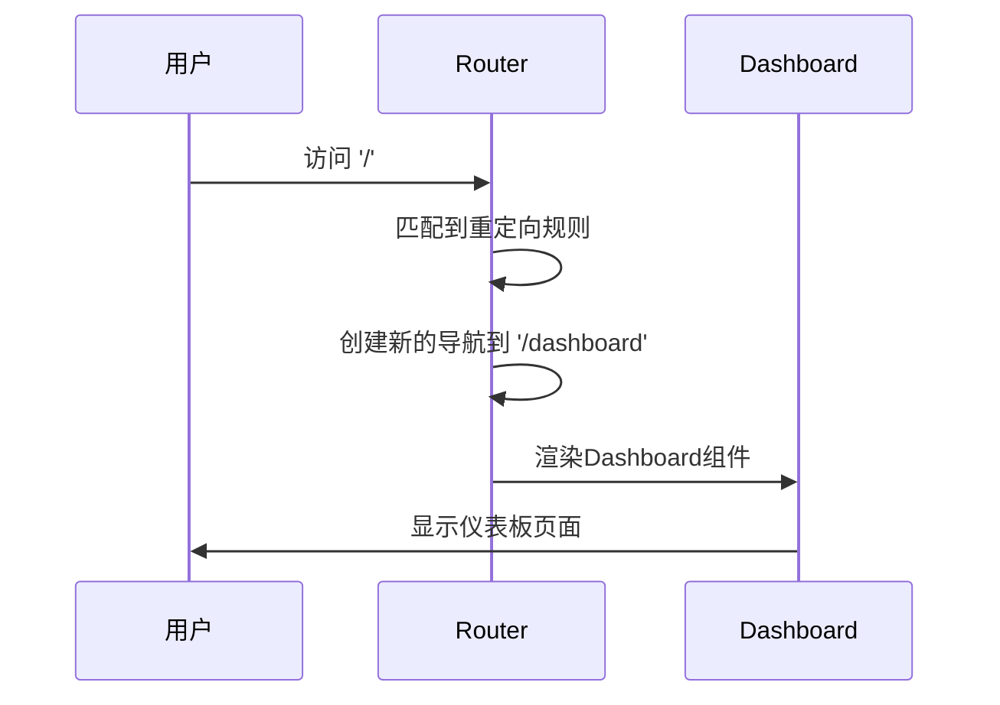

---
tags:
  - 路由配置
  - routes数组
  - 路由对象
  - Vue Router配置
  - Vue3
created: 2025-11-18
modified: 2025-11-18
category: Vue核心概念
difficulty: intermediate
---

# 路由规则配置逐行解析

> **学习目标**：彻底理解routes数组中每个路由对象的配置细节和最佳实践

## 🎯 回顾你的项目路由配置

在你的项目中，路由规则是这样配置的：

```javascript
// router/index.js
const router = createRouter({
  history: createWebHistory(import.meta.env.BASE_URL),
  routes: [
    {
      path: '/',
      redirect: '/dashboard'
    },
    {
      path: '/dashboard',
      name: 'dashboard',
      component: () => import('../views/Dashboard.vue'),
      meta: { requiresAuth: true }
    },
    {
      path: '/login',
      name: 'login',
      component: () => import('../views/Login.vue'),
      meta: { guest: true }
    },
    {
      path: '/register',
      name: 'register',
      component: () => import('../views/Register.vue'),
      meta: { guest: true }
    }
  ]
})
```

这个routes数组是路由系统的核心配置，让我们逐行深入解析每一个路由对象。

---

## 🔧 routes数组结构解析

### 📋 routes数组的基本概念

```javascript
// routes是一个数组，包含所有路由规则
const routes = [
  // 每个元素都是一个路由对象
  routeObject1,
  routeObject2,
  routeObject3,
  // ...
]
```

### 🧩 路由对象的完整结构

```typescript
interface RouteRecordRaw {
  path: string                    // 🔥 URL路径（必需）
  name?: string                   // 🔥 路由名称（可选）
  component?: Component          // 🔥 路由组件
  components?: Record<string, Component>  // 🔥 命名视图组件
  redirect?: string | Location   // 🔥 重定向
  alias?: string | string[]      // 🔥 别名
  children?: RouteRecordRaw[]    // 🔥 子路由
  meta?: Record<string, any>     // 🔥 元数据
  beforeEnter?: NavigationGuard  // 🔥 路由守卫
  props?: boolean | Object | Function  // 🔥 组件props
}
```

---

## 🛣️ 第一个路由：根路径重定向

### 📋 路由配置代码

```javascript
{
  path: '/',
  redirect: '/dashboard'
}
```

### 🔍 逐属性解析

#### **1. `path: '/'`**

```javascript
// path属性定义URL的匹配模式
// '/' 匹配网站的根路径

// 匹配示例：
// http://localhost:5173/          ✅ 匹配
// http://localhost:5173/          ✅ 匹配（带尾部斜杠）
// http://localhost:5173/home      ❌ 不匹配
// http://localhost:5173/dashboard  ❌ 不匹配
```

**路径匹配规则：**

```javascript
// 精确匹配
'/' → 只匹配根路径

// 通配符匹配
'/users/:id' → 匹配 /users/123, /users/abc
'/users/*'   → 匹配 /users/123/abc, /users/abc/def
'/users/:id?' → 匹配 /users, /users/123

// 正则表达式匹配
'/users-:id(\\d+)' → 匹配 /users-123, 不匹配 /users-abc
```

#### **2. `redirect: '/dashboard'`**

```javascript
// redirect属性定义重定向目标
// 当用户访问'/'时，自动跳转到'/dashboard'

// 重定向类型：
const redirectOptions = {
  // 1. 字符串重定向
  redirect: '/dashboard',

  // 2. 对象重定向（可带参数）
  redirect: { path: '/dashboard', query: { from: 'home' } },

  // 3. 命名路由重定向
  redirect: { name: 'dashboard' },

  // 4. 函数重定向（动态重定向）
  redirect: to => {
    const { query, params } = to
    if (query.to) {
      return { path: query.to }
    } else {
      return { name: 'dashboard' }
    }
  }
}
```

**重定向的工作流程：**



---

## 🏠 第二个路由：仪表板页面

### 📋 路由配置代码

```javascript
{
  path: '/dashboard',
  name: 'dashboard',
  component: () => import('../views/Dashboard.vue'),
  meta: { requiresAuth: true }
}
```

### 🔍 逐属性解析

#### **1. `path: '/dashboard'`**

```javascript
// 定义仪表板页面的URL路径
// 用户访问 http://localhost:5173/dashboard 时会匹配这个路由

// 路径命名建议：
// ✅ 使用小写字母
// ✅ 使用连字符分隔
// ✅ 使用复数形式（列表页面）
// ✅ 保持RESTful风格

// 示例：
'/dashboard'           // 仪表板
'/user-profile'        // 用户资料
'/product-list'        // 产品列表
'/order-detail/:id'    // 订单详情
```

#### **2. `name: 'dashboard'`**

```javascript
// name属性为路由提供唯一标识
// 用于编程式导航和路由链接

// 使用示例：
// 1. 编程式导航
router.push({ name: 'dashboard' })

// 2. 路由链接
<router-link :to="{ name: 'dashboard' }">仪表板</router-link>

// 3. 路由解析
const route = router.resolve({ name: 'dashboard' })
console.log(route.href) // /dashboard
```

**name属性的优势：**

```javascript
// ❌ 使用路径的问题
router.push('/dashboard')
// - 路径改变时需要修改所有引用
// - 没有类型检查
// - 容易出现拼写错误

// ✅ 使用名称的优势
router.push({ name: 'dashboard' })
// - 路径改变时只需修改一处
// - 有TypeScript类型检查
// - IDE支持自动补全
```

#### **3. `component: () => import('../views/Dashboard.vue')`**

```javascript
// component属性指定路由对应的Vue组件
// 这里使用了动态导入（懒加载）

// 传统导入（同步）：
import Dashboard from '../views/Dashboard.vue'
// 问题：所有组件都会打包到主文件，增加初始加载时间

// 动态导入（异步）：
component: () => import('../views/Dashboard.vue')
// 优势：
// 1. 代码分割：组件单独打包
// 2. 按需加载：只在访问时才下载
// 3. 缓存优化：浏览器可缓存已加载的组件
// 4. 开发体验：热重载更快
```

**懒加载的工作机制：**

```javascript
// 当用户访问 /dashboard 时：
// 1. 路由匹配到 dashboard 路由
// 2. 发现组件是动态导入
// 3. 触发 import('../views/Dashboard.vue')
// 4. 下载并解析 Dashboard.vue 文件
// 5. 创建组件实例
// 6. 渲染到 router-view
```

**打包结果对比：**

```javascript
// 传统方式打包结果：
app.js (2MB) - 包含所有组件

// 懒加载方式打包结果：
app.js (500KB)        - 主应用代码
dashboard.[hash].js (200KB) - 仪表板组件
login.[hash].js (150KB)    - 登录组件
register.[hash].js (180KB) - 注册组件
```

#### **4. `meta: { requiresAuth: true }`**

```javascript
// meta属性用于存储路由的元数据
// 这些数据可以在路由守卫和组件中访问

// meta的用途：
// 1. 权限控制
// 2. 页面标题
// 3. 面包屑导航
// 4. 缓存控制
// 5. 页面过渡效果

// 常见的meta字段：
const commonMeta = {
  title: '页面标题',           // 页面标题
  requiresAuth: true,        // 需要登录
  roles: ['admin', 'user'],   // 需要的角色权限
  permissions: ['read'],     // 需要的操作权限
  layout: 'default',         // 使用的布局
  keepAlive: true,           // 缓存组件状态
  icon: 'dashboard',          // 图标名称
  breadcrumb: true,          // 显示面包屑
  hidden: false,             // 在菜单中隐藏
  cache: true                // 缓存页面
}
```

---

## 🔐 第三个路由：登录页面

### 📋 路由配置代码

```javascript
{
  path: '/login',
  name: 'login',
  component: () => import('../views/Login.vue'),
  meta: { guest: true }
}
```

### 🔍 逐属性解析

#### **1. `path: '/login'`**

```javascript
// 登录页面的URL路径
// 用户访问 http://localhost:5173/login 时匹配

// 路径设计原则：
// 1. 简洁明了
// 2. 符合用户习惯
// 3. 使用动词+名词的组合
// 4. 保持RESTful风格

// 示例：
'/login'              // 登录
'/register'           // 注册
'/forgot-password'     // 忘记密码
'/reset-password'      // 重置密码
'/logout'              // 登出（通常不用路由）
```

#### **2. `name: 'login'`**

```javascript
// 登录页面的唯一标识
// 用于在代码中引用这个路由

// 使用场景：
// 1. 编程式导航
router.push({ name: 'login' })

// 2. 重定向到登录页
router.push({ name: 'login', query: { redirect: to.fullPath } })

// 3. 检查当前路由
if (route.name === 'login') {
  // 在登录页面的特殊逻辑
}
```

#### **3. `component: () => import('../views/Login.vue')`**

```javascript
// 登录页面的Vue组件
// 懒加载：只在用户访问时才加载

// Login.vue 组件可能包含：
// - 登录表单
// - 用户名输入框
// - 密码输入框
// - 记住我选项
// - 忘记密码链接
// - 注册链接
// - 表单验证
// - 登录逻辑
```

#### **4. `meta: { guest: true }`**

```javascript
// guest: true 表示这个页面只允许未登录用户访问
// 这是一个常用的权限控制标记

// 在路由守卫中的使用：
router.beforeEach((to, from, next) => {
  const authStore = useAuthStore()

  // 如果是访客页面但用户已登录，重定向到仪表板
  if (to.meta.guest && authStore.isLoggedIn) {
    next('/dashboard')
    return
  }

  next()
})
```

**guest页面的设计理念：**

```javascript
// 常见的guest页面：
const guestPages = [
  { path: '/login', meta: { guest: true } },      // 登录页
  { path: '/register', meta: { guest: true } },   // 注册页
  { path: '/forgot-password', meta: { guest: true } }, // 忘记密码
  { path: '/reset-password', meta: { guest: true } },  // 重置密码
  { path: '/welcome', meta: { guest: true } }     // 欢迎页
]

// 这些页面的共同特点：
// 1. 用户未登录时才需要看到
// 2. 登录后访问没有意义
// 3. 应该直接进入应用的主要功能
```

---

## 📝 第四个路由：注册页面

### 📋 路由配置代码

```javascript
{
  path: '/register',
  name: 'register',
  component: () => import('../views/Register.vue'),
  meta: { guest: true }
}
```

### 🔍 逐属性解析

#### **1. `path: '/register'`**

```javascript
// 注册页面的URL路径
// 用户访问 http://localhost:5173/register 时匹配

// 注册页面通常包含：
// - 用户名输入框
// - 邮箱输入框
// - 密码输入框
// - 确认密码输入框
// - 用户协议同意
// - 已有账号登录链接
// - 表单验证逻辑
// - 注册成功处理
```

#### **2. `name: 'register'`**

```javascript
// 注册页面的唯一标识
// 用于在代码中引用和编程式导航

// 使用示例：
// 在登录页面添加注册链接
<router-link :to="{ name: 'register' }">还没有账号？立即注册</router-link>

// 注册成功后的跳转
function handleRegisterSuccess() {
  // 显示成功消息
  ElMessage.success('注册成功！')
  // 跳转到登录页
  router.push({ name: 'login' })
}
```

#### **3. `component: () => import('../views/Register.vue')`**

```javascript
// 注册页面的Vue组件
// 同样使用懒加载，优化性能

// Register.vue 组件可能的结构：
<template>
  <div class="register-container">
    <div class="register-form">
      <h2>用户注册</h2>
      <el-form @submit.prevent="handleRegister">
        <el-form-item prop="username">
          <el-input v-model="form.username" placeholder="用户名" />
        </el-form-item>
        <el-form-item prop="email">
          <el-input v-model="form.email" type="email" placeholder="邮箱" />
        </el-form-item>
        <el-form-item prop="password">
          <el-input v-model="form.password" type="password" placeholder="密码" />
        </el-form-item>
        <el-form-item prop="confirmPassword">
          <el-input v-model="form.confirmPassword" type="password" placeholder="确认密码" />
        </el-form-item>
        <el-form-item>
          <el-checkbox v-model="form.agreeTerms">
            我已阅读并同意用户协议
          </el-checkbox>
        </el-form-item>
        <el-form-item>
          <el-button type="primary" @click="handleRegister">注册</el-button>
        </el-form-item>
      </el-form>
    </div>
  </div>
</template>

<script setup>
import { ref, reactive } from 'vue'
import { useRouter } from 'vue-router'
import { authAPI } from '@/api/auth'

const router = useRouter()
const form = reactive({
  username: '',
  email: '',
  password: '',
  confirmPassword: '',
  agreeTerms: false
})

async function handleRegister() {
  try {
    await authAPI.register(form)
    router.push({ name: 'login' })
  } catch (error) {
    console.error('注册失败:', error)
  }
}
</script>
```

#### **4. `meta: { guest: true }`**

```javascript
// 同样标记为访客页面
// 只有未登录用户才能访问注册页面

// 权限控制逻辑：
if (to.meta.guest && authStore.isLoggedIn) {
  // 已登录用户访问注册页
  // 应该跳转到仪表板，因为用户已经有账号了
  next('/dashboard')
  return
}
```

---

## 🚀 高级路由配置技巧

### 1. 动态路由参数

```javascript
// 带参数的路由
{
  path: '/user/:id',
  name: 'user-detail',
  component: () => import('../views/UserDetail.vue'),
  props: true  // 将路由参数作为props传递给组件
}

// UserDetail.vue 中接收参数
export default {
  props: {
    id: {
      type: String,
      required: true
    }
  },
  setup(props) {
    // props.id 就是路由参数
    console.log('用户ID:', props.id)
  }
}
```

### 2. 嵌套路由

```javascript
// 父路由
{
  path: '/admin',
  component: () => import('../layouts/AdminLayout.vue'),
  children: [
    // 子路由
    {
      path: '',           // 默认子路由：/admin
      name: 'admin-home',
      component: () => import('../views/admin/Home.vue')
    },
    {
      path: 'users',      // 子路由：/admin/users
      name: 'admin-users',
      component: () => import('../views/admin/Users.vue')
    },
    {
      path: 'settings',   // 子路由：/admin/settings
      name: 'admin-settings',
      component: () => import('../views/admin/Settings.vue')
    }
  ]
}
```

### 3. 路由别名

```javascript
{
  path: '/dashboard',
  name: 'dashboard',
  component: Dashboard,
  alias: ['/home', '/index']  // 多个别名
}

// 访问以下URL都会渲染Dashboard组件：
// /dashboard (主路径)
// /home (别名1)
// /index (别名2)
```

### 4. 路由守卫

```javascript
{
  path: '/admin',
  component: AdminLayout,
  meta: { requiresAuth: true },
  beforeEnter: (to, from, next) => {
    // 路由级别的守卫
    const authStore = useAuthStore()
    if (!authStore.user || authStore.user.role !== 'admin') {
      next('/403')
    } else {
      next()
    }
  }
}
```

---

## 📊 路由配置最佳实践

### ✅ 推荐做法

1. **路径命名规范**
```javascript
// ✅ 使用小写和连字符
'/user-profile'
'/order-detail/:id'

// ❌ 避免大写和下划线
'/UserProfile'
'/order_detail'
```

2. **组件懒加载**
```javascript
// ✅ 所有路由组件都使用懒加载
component: () => import('../views/Dashboard.vue')

// ❌ 避免同步导入
import Dashboard from '../views/Dashboard.vue'
```

3. **元数据标准化**
```javascript
// ✅ 使用标准化的meta字段
meta: {
  title: '页面标题',
  requiresAuth: true,
  roles: ['admin']
}
```

4. **路由分组管理**
```javascript
// ✅ 按功能模块分组
const authRoutes = [...]
const adminRoutes = [...]
const userRoutes = [...]

const routes = [...authRoutes, ...adminRoutes, ...userRoutes]
```

### ❌ 避免做法

1. **路径冲突**
```javascript
// ❌ 避免路径重复
{ path: '/user/:id' },
{ path: '/user/:id/profile' }  // 第二个永远不会匹配

// ✅ 使用嵌套路由
{ path: '/user/:id', children: [
  { path: 'profile' }
]}
```

2. **过度复杂的正则表达式**
```javascript
// ❌ 避免复杂的正则
{ path: '/user-:id(\\d{3,8})-:name([a-z]+)' }

// ✅ 简化路径，在组件中验证
{ path: '/user/:id/:name' }
```

---

## 📋 学习检查清单

### ✅ 路由配置理解

- [ ] 理解routes数组的作用和结构
- [ ] 掌握path属性的匹配规则
- [ ] 知道name属性的用途和优势
- [ ] 理解component属性的懒加载机制

### ✅ 元数据掌握

- [ ] 理解meta字段的作用
- [ ] 掌握requiresAuth的权限控制
- [ ] 知道guest字段的访客限制
- [ ] 能够设计合适的元数据结构

### ✅ 实际应用能力

- [ ] 能够设计合理的路由结构
- [ ] 掌握动态路由参数的使用
- [ ] 理解嵌套路由的配置
- [ ] 知道路由别名的应用场景

---

## 🎯 下一步学习

掌握了路由规则配置后，继续深入学习：

- [[06-懒加载机制原理详解.md|懒加载机制]]
- [[07-Meta元数据系统详解.md|元数据系统]]
- [[08-路由守卫逐行详解.md|路由守卫]]

---

**记住：routes数组是Vue Router的配置核心，掌握每一个属性的用法，就能构建出功能强大、性能优秀的路由系统！** 🎉

---

*这个章节详细解析了routes数组中每个路由对象的配置，确保你对路由配置有全面的理解，能够设计出符合最佳实践的路由系统。*