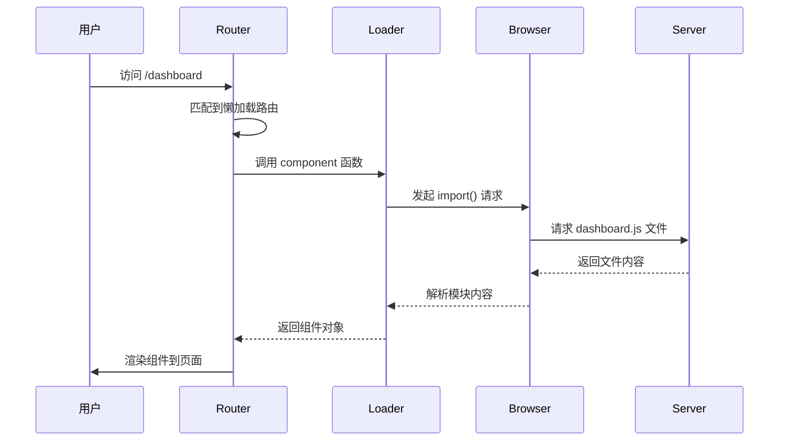

---
tags:
  - 懒加载
  - 动态导入
  - 代码分割
  - 性能优化
  - Vue Router
  - Vue3
created: 2025-11-18
modified: 2025-11-18
category: Vue核心概念
difficulty: intermediate
---

# 懒加载机制原理详解

> **学习目标**：深入理解Vue Router懒加载的工作原理、打包机制和性能优化技巧

## 🎯 回顾你的项目中的懒加载

在你的项目中，所有路由组件都使用了懒加载：

```javascript
// router/index.js
const router = createRouter({
  history: createWebHistory(import.meta.env.BASE_URL),
  routes: [
    {
      path: '/dashboard',
      component: () => import('../views/Dashboard.vue'),  // 🔥 懒加载
      meta: { requiresAuth: true }
    },
    {
      path: '/login',
      component: () => import('../views/Login.vue'),       // 🔥 懒加载
      meta: { guest: true }
    },
    {
      path: '/register',
      component: () => import('../views/Register.vue'),   // 🔥 懒加载
      meta: { guest: true }
    }
  ]
})
```

这个 `() => import()` 语法就是Vue Router的懒加载机制，让我们深入解析它的工作原理。

---

## 🧩 动态导入基础概念

### 📋 什么是动态导入

```javascript
// 传统导入（同步）
import Dashboard from '../views/Dashboard.vue'
// 特点：
// 1. 在模块加载时立即执行
// 2. 所有依赖都会被打包到主文件
// 3. 代码无法按需加载

// 动态导入（异步）
const Dashboard = () => import('../views/Dashboard.vue')
// 特点：
// 1. 在需要时才执行导入
// 2. 返回Promise对象
// 3. 支持代码分割和按需加载
```

### 🔄 动态导入的工作原理

```javascript
// () => import('../views/Dashboard.vue')
// 等价于：

function loadDashboard() {
  return import('../views/Dashboard.vue')
}

// import() 函数返回一个Promise
const promise = import('../views/Dashboard.vue')
promise.then(module => {
  // module.default 就是导出的组件
  console.log('组件加载完成:', module.default)
})
```

### 🎯 Promise的执行时机

```javascript
// Vue Router中的懒加载过程：
{
  path: '/dashboard',
  component: () => import('../views/Dashboard.vue')
}

// 当用户访问 /dashboard 时：
// 1. 路由匹配到 dashboard 路由
// 2. Vue Router发现 component 是一个函数
// 3. 调用这个函数
// 4. 函数执行 import() 并返回Promise
// 5. Promise解析后获取组件
// 6. 渲染组件到页面
```

---

## 🏗️ 懒加载的内部机制

### 📋 Vue Router的懒加载处理

```javascript
// Vue Router内部的简化实现（伪代码）
function createRoute(record) {
  let component = record.component

  // 如果component是函数，说明是懒加载
  if (typeof component === 'function') {
    // 创建懒加载包装器
    component = defineAsyncComponent(() => {
      return component().then(module => {
        // 处理模块导出
        return module.default || module
      })
    })
  }

  return {
    ...record,
    component
  }
}

// defineAsyncComponent 的实现
function defineAsyncComponent(loader) {
  let component = null
  let loading = false
  let error = null

  return {
    setup() {
      // 返回一个占位组件
      return () => {
        if (loading) {
          return h('div', 'Loading...')
        }
        if (error) {
          return h('div', 'Error: ' + error.message)
        }
        if (component) {
          return h(component)
        }
      }
    }
  }
}
```

### 🔄 完整的加载流程



---

## 📦 代码分割机制

### 🎯 什么是代码分割

```javascript
// 代码分割（Code Splitting）是将代码拆分成多个文件
// 这样可以实现按需加载，优化初始加载性能

// 传统方式（不分割）
// 所有组件打包到一个文件
app.js (2MB)
├── Dashboard.vue
├── Login.vue
├── Register.vue
└── ...

// 代码分割方式
// 每个组件独立打包
app.js (500KB)          // 主应用代码
dashboard.[hash].js (200KB)  // 仪表板组件
login.[hash].js (150KB)      // 登录组件
register.[hash].js (180KB)   // 注册组件
```

### 🔧 Vite的代码分割

```javascript
// Vite使用原生ES模块进行代码分割
// 开发环境：每个import() 都是独立的HTTP请求

// 生产环境：通过打包工具优化
// vite.config.js
export default defineConfig({
  build: {
    rollupOptions: {
      output: {
        // 手动指定代码分割规则
        manualChunks: {
          // 将路由组件单独打包
          'router': ['vue-router'],

          // 将页面组件分组
          'pages': [
            './src/views/Dashboard.vue',
            './src/views/Login.vue',
            './src/views/Register.vue'
          ]
        }
      }
    }
  }
})
```

### 📊 打包结果分析

```javascript
// 实际打包后的文件结构
dist/
├── assets/
│   ├── index.html
│   ├── index.[hash].css
│   └── index.[hash].js        (500KB)
│   └── assets/
│       ├── dashboard.[hash].js   (200KB)
│       ├── login.[hash].js       (150KB)
│       └── register.[hash].js    (180KB)
└── vite.svg
```

**加载性能对比：**

```javascript
// 首次加载性能
// 不分割：
// - 下载 2MB 的 app.js
// - 解析所有组件代码
// - 初始加载时间：2-3秒

// 代码分割：
// - 下载 500KB 的 index.js
// - 立即显示首页
// - 按需加载其他组件
// - 初始加载时间：0.5-1秒
```

---

## ⚡ 懒加载的性能优势

### 🎯 1. 减少初始加载时间

```javascript
// 用户访问应用时的加载过程：

// 传统方式：
// 1. 下载 app.js (2MB)
// 2. 解析所有组件
// 3. 显示首页
// 时间：2-3秒

// 懒加载方式：
// 1. 下载 index.js (500KB)
// 2. 解析主应用代码
// 3. 立即显示首页
// 4. 用户点击其他页面时才加载对应组件
// 时间：0.5-1秒
```

### 🎯 2. 优化缓存策略

```javascript
// 懒加载支持更好的缓存

// 浏览器缓存策略：
// index.js - 缓存1小时
// dashboard.js - 缓存7天
// login.js - 缓存7天
// register.js - 缓存7天

// 用户访问流程：
// 首次访问：下载所有需要的文件
// 后续访问：大部分文件已缓存，加载很快
// 组件更新：只有修改的组件需要重新下载
```

### 🎯 3. 内存使用优化

```javascript
// 内存使用对比：

// 不分割：
// - 所有组件代码都在内存中
// - 内存占用：~5MB
// - 即使用户只访问1个页面

// 懒加载：
// - 只有访问过的组件在内存中
// - 内存占用：~1MB
// - 内存使用更加高效
```

---

## 🔧 懒加载的高级技巧

### 1. 魔名注释

```javascript
// 为打包文件指定名称
{
  path: '/dashboard',
  component: () => import(
    /* webpackChunkName: "dashboard" */
    /* vite:preload */
    '../views/Dashboard.vue'
  )
}

// 打包结果：
// dashboard.[hash].js (有意义的文件名)
// 而不是：
// 123abc456.[hash].js (无意义的文件名)
```

### 2. 预加载策略

```javascript
// 预加载用户可能访问的页面
const prefetchRoutes = ['dashboard', 'profile', 'settings']

// 在应用启动时预加载
prefetchRoutes.forEach(routeName => {
  import(`@/views/${routeName}.vue`)
})

// 或者使用 Intersection Observer 实现智能预加载
const observer = new IntersectionObserver((entries) => {
  entries.forEach(entry => {
    if (entry.isIntersecting) {
      // 预加载即将进入视图的组件
      prefetchComponent(entry.target.dataset.route)
    }
  })
})
```

### 3. 错误边界处理

```javascript
// 懒加载的错误处理
{
  path: '/dashboard',
  component: () => import('../views/Dashboard.vue')
    .catch(() => import('../views/ErrorPage.vue'))  // 加载失败时的备用页面
    .finally(() => {
      console.log('Dashboard组件加载完成')
    })
}
```

### 4. 加载状态显示

```javascript
// 创建一个加载状态管理
const loadingState = ref(false)

const routes = [
  {
    path: '/dashboard',
    component: () => {
      loadingState.value = true
      return import('../views/Dashboard.vue')
        .finally(() => {
          loadingState.value = false
        })
    }
  }
]

// 在组件中显示加载状态
<template>
  <div>
    <div v-if="loadingState" class="loading">
      <div class="spinner"></div>
      <p>加载中...</p>
    </div>
    <router-view v-else />
  </div>
</template>
```

---

## 🛠️ 实际应用场景

### 📦 电商网站

```javascript
// 电商网站的路由配置
const routes = [
  {
    path: '/',
    component: () => import('../views/Home.vue'),        // 首页（立即需要）
  },
  {
    path: '/products',
    component: () => import('../views/ProductList.vue')    // 商品列表（可能需要）
  },
  {
    path: '/product/:id',
    component: () => import('../views/ProductDetail.vue')  // 商品详情（按需加载）
  },
  {
    path: '/cart',
    component: () => import('../views/Cart.vue')          // 购物车（按需加载）
  },
  {
    path: '/checkout',
    component: () => import('../views/Checkout.vue')      // 结算页面（按需加载）
  }
]
```

### 🏢 管理后台

```javascript
// 管理后台的路由配置
const routes = [
  {
    path: '/dashboard',
    component: () => import('../views/Dashboard.vue'),     // 仪表板（主要功能）
  },
  {
    path: '/users',
    component: () => import('../views/UserManagement.vue')   // 用户管理（管理员功能）
  },
  {
    path: '/orders',
    component: () => import('../views/OrderManagement.vue')   // 订单管理（管理员功能）
  },
  {
    path: '/settings',
    component: () => import('../views/Settings.vue')          // 设置页面（按需加载）
  }
]
```

### 📱 移动应用

```javascript
// 移动应用的路由配置
const routes = [
  {
    path: '/',
    component: () => import('../views/MobileHome.vue'),     // 移动首页
  },
  {
    path: '/profile',
    component: () => import('../views/Profile.vue'),        // 个人资料（重要功能）
  },
  {
    path: '/messages',
    component: () => import('../views/Messages.vue')       // 消息列表（按需加载）
  }
]
```

---

## 📊 懒加载的性能监控

### 🔍 加载时间监控

```javascript
// 监控组件加载时间
router.beforeEach((to, from) => {
  const startTime = performance.now()

  // 在组件加载完成后记录时间
  router.afterEach(() => {
    const endTime = performance.now()
    const loadTime = endTime - startTime

    if (loadTime > 1000) {
      console.warn(`慢路由检测: ${to.path} 加载时间: ${loadTime}ms`)
    } else {
      console.log(`路由加载: ${to.path} 耗时: ${loadTime}ms`)
    }
  })
})
```

### 📊 网络请求监控

```javascript
// 监控懒加载的网络请求
const originalImport = window.import

window.import = function(url) {
  console.log(`开始加载: ${url}`)
  const startTime = performance.now()

  return originalImport(url).then(module => {
    const endTime = performance.now()
    const loadTime = endTime - startTime
    console.log(`加载完成: ${url} 耗时: ${loadTime}ms`)
    return module
  }).catch(error => {
    console.error(`加载失败: ${url}`, error)
    throw error
  })
}
```

---

## 🐛 常见问题和解决方案

### ❌ 问题1：懒加载组件闪烁

```javascript
// 症状：页面切换时出现白屏或闪烁

// 原因：组件加载需要时间，期间显示空白

// 解决方案：添加加载状态
const loadingComponents = {
  Loading: () => h('div', 'Loading...'),
  Error: () => h('div', '加载失败')
}

const routes = [
  {
    path: '/dashboard',
    component: defineAsyncComponent({
      loader: () => import('../views/Dashboard.vue'),
      loadingComponent: loadingComponents.Loading,
      errorComponent: loadingComponents.Error,
      delay: 200,  // 延迟显示loading，避免快速切换时的闪烁
      timeout: 3000  // 超时时间
    })
  }
]
```

### ❌ 问题2：缓存失效

```javascript
// 症状：更新代码后，用户看到的还是旧版本

// 原因：浏览器缓存了旧的JS文件

// 解决方案：配置缓存策略
// vite.config.js
export default defineConfig({
  build: {
    rollupOptions: {
      output: {
        entryFileNames: 'assets/[name].[hash].[ext]',
        chunkFileNames: 'assets/[name].[hash].[ext]',
        assetFileNames: 'assets/[name].[hash].[ext]'
      }
    }
  }
})

// 添加版本号到文件名，确保更新时文件名不同
```

### ❌ 问题3：开发环境热重载慢

```javascript
// 症状：修改组件后，热重载很慢

// 原因：动态导入的热重载机制

// 解决方案：优化开发配置
// vite.config.js
export default defineConfig({
  server: {
    hmr: {
      overlay: false  // 关闭错误覆盖层，提升性能
    }
  },
  optimizeDeps: {
    include: ['vue', 'vue-router']
  }
})
```

---

## 📋 学习检查清单

### ✅ 懒加载理解

- [ ] 理解动态导入的语法和原理
- [ ] 知道懒加载的工作时机
- [ ] 掌握代码分割的概念
- [ ] 理解Promise的作用

### ✅ 性能优化掌握

- [ ] 知道懒加载的性能优势
- [ ] 能够配置代码分割策略
- [ ] 理解缓存优化机制
- [ ] 掌握内存使用优化

### ✅ 实际应用能力

- [ ] 能够为不同场景设计懒加载策略
- [ ] 知道如何处理加载状态
- [ ] 能够实现预加载功能
- [ ] 能够监控懒加载性能

---

## 🎯 下一步学习

掌握了懒加载机制后，继续深入学习：

- [[07-Meta元数据系统详解.md|元数据系统]]
- [[08-路由守卫逐行详解.md|路由守卫]]
- [[10-导出语句和最佳实践.md|最佳实践]]

---

**记住：懒加载是现代前端性能优化的核心技术，掌握它就能构建出快速、高效、用户友好的单页面应用！** 🎉

---

*这个章节详细解析了Vue Router懒加载的每一个细节，从基础概念到高级技巧，确保你对懒加载机制有全面的理解和掌握。*