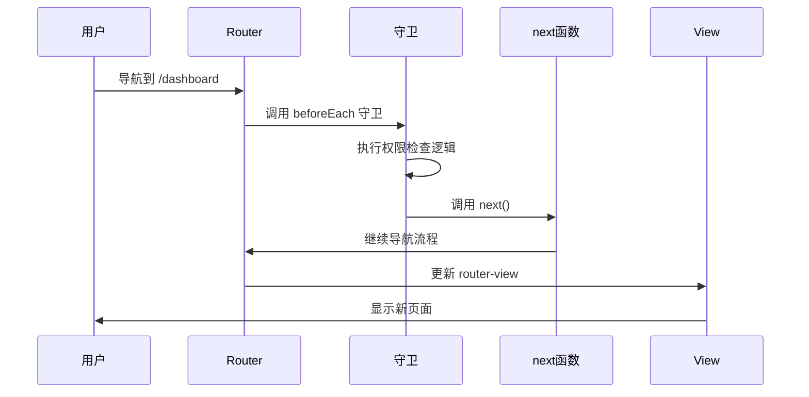
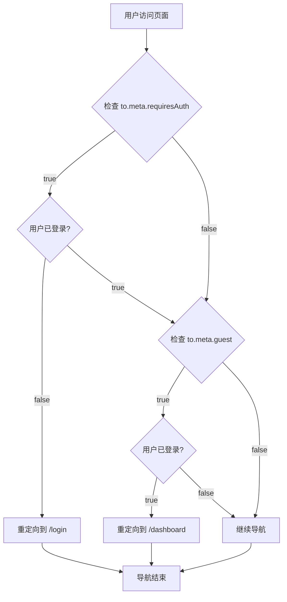

---
tags:
  - 路由守卫
  - beforeEach
  - 权限控制
  - 导航守卫
  - Vue Router
  - Vue3
created: 2025-11-18
modified: 2025-11-18
category: Vue核心概念
difficulty: advanced
---

# 路由守卫逐行详解

> **学习目标**：彻底理解路由守卫的工作原理、参数含义和权限控制逻辑

## 🎯 回顾你的项目中的路由守卫

在你的项目中，路由守卫是这样实现的：

```javascript
// router/index.js
router.beforeEach((to, from, next) => {
  const authStore = useAuthStore()

  // 需要登录的页面
  if (to.meta.requiresAuth && !authStore.isLoggedIn) {
    next('/login')
    return
  }

  // 已登录用户访问登录/注册页面，重定向到首页
  if (to.meta.guest && authStore.isLoggedIn) {
    next('/dashboard')
    return
  }

  next()
})
```

这段代码是整个路由系统的权限控制核心，让我们逐行深入解析。

---

## 🔧 beforeEach 守卫详解

### 📋 守卫函数签名

```typescript
// beforeEach的TypeScript类型定义
router.beforeEach(
  guard: (to: RouteLocationNormalized, from: RouteLocationNormalized, next: NavigationGuardNext) => void
): () => void

// 参数详解：
interface RouteLocationNormalized {
  path: string              // 🔥 目标路径
  fullPath: string          // 🔥 完整路径（包含查询参数）
  name?: string             // 🔥 路由名称
  params: Record<string, any>  // 🔥 路由参数
  query: Record<string, any>   // 🔥 查询参数
  hash: string              // 🔥 哈希值
  meta: Record<string, any>    // 🔥 元数据
  matched: RouteRecord[]    // 🔥 匹配的路由记录
}

type NavigationGuardNext = (to?: any) => void
```

---

## 🧩 第一行：守卫函数定义

```javascript
router.beforeEach((to, from, next) => {
```

### 🔍 逐参数解析

#### **1. `router` 对象**

```javascript
// router是我们之前创建的路由实例
const router = createRouter({
  history: createWebHistory(import.meta.env.BASE_URL),
  routes: [...]
})

// router对象包含：
// - history: 历史管理对象
// - currentRoute: 当前路由的响应式引用
// - options: 路由配置选项
// - matcher: 路由匹配器
// - 各种导航方法（push, replace, go等）
```

#### **2. `beforeEach` 方法**

```javascript
// beforeEach是全局前置守卫的注册方法
// 作用：在每次导航前执行指定的函数

// 方法签名：
router.beforeEach(guard: NavigationGuard): () => void

// 返回值：一个函数，调用它可以移除这个守卫
const removeGuard = router.beforeEach((to, from, next) => {
  console.log('导航守卫执行')
})

// 移除守卫：
removeGuard()
```

**beforeEach的执行时机：**



#### **3. `(to, from, next) => {}` 箭头函数**

```javascript
// 这是一个ES6箭头函数
// 等价于传统的function写法：

// 箭头函数（你的项目中使用）：
router.beforeEach((to, from, next) => {
  // 守卫逻辑
})

// 传统函数写法：
router.beforeEach(function(to, from, next) {
  // 守卫逻辑
})

// 为什么用箭头函数？
// 1. 语法更简洁
// 2. 没有自己的this绑定
// 3. 更适合函数式编程风格
```

---

## 🎯 守卫参数深度解析

### 📍 `to` 参数：目标路由对象

```javascript
// to 参数表示用户想要导航到的目标路由
// 它包含了目标路由的所有信息

// 示例：用户访问 /dashboard?id=123#section
const to = {
  path: '/dashboard',                    // 🔥 路由路径
  fullPath: '/dashboard?id=123#section', // 🔥 完整URL
  name: 'dashboard',                     // 🔥 路由名称（如果定义了）
  params: {},                            // 🔥 路由参数（如 /user/:id 中的 id）
  query: { id: '123' },                  // 🔥 查询参数（?id=123）
  hash: '#section',                      // 🔥 哈希值（#section）
  meta: { requiresAuth: true },          // 🔥 元数据
  matched: [                             // 🔥 匹配的路由记录数组
    {
      path: '/dashboard',
      components: { default: DashboardComponent },
      meta: { requiresAuth: true }
    }
  ]
}
```

**to参数的实际应用：**

```javascript
// 检查目标路由是否需要认证
if (to.meta.requiresAuth) {
  console.log('这个页面需要登录才能访问')
}

// 获取路由参数
if (to.params.id) {
  console.log('用户ID:', to.params.id)
}

// 获取查询参数
if (to.query.redirect) {
  console.log('登录后重定向到:', to.query.redirect)
}
```

### 📍 `from` 参数：来源路由对象

```javascript
// from 参数表示用户当前所在的路由
// 它的结构与 to 参数完全相同

// 示例：从 /login 页面导航到 /dashboard
const from = {
  path: '/login',
  fullPath: '/login?redirect=/dashboard',
  name: 'login',
  params: {},
  query: { redirect: '/dashboard' },
  hash: '',
  meta: { guest: true },
  matched: [
    {
      path: '/login',
      components: { default: LoginComponent },
      meta: { guest: true }
    }
  ]
}
```

**from参数的实际应用：**

```javascript
// 记录用户来源
console.log(`用户从 ${from.path} 导航到 ${to.path}`)

// 根据来源执行不同逻辑
if (from.path === '/login' && to.path === '/dashboard') {
  console.log('用户成功登录')
}

// 保存来源页面（用于返回）
const previousPage = from.fullPath
```

### 🛠️ `next` 参数：导航控制函数

```javascript
// next 是控制导航流程的关键函数
// 它决定了导航是继续、中止还是重定向

// next 函数的三种调用方式：

// 1. next(): 继续导航
next()  // 继续执行导航流程

// 2. next(false): 中止导航
next(false)  // 取消当前导航，停留在当前页面

// 3. next('/path'): 重定向到其他路径
next('/login')  // 重定向到登录页
next({ name: 'login' })  // 也可以使用路由对象
```

**next函数的详细行为：**

```javascript
// 场景1：继续导航
router.beforeEach((to, from, next) => {
  if (to.path !== '/forbidden') {
    next()  // ✅ 继续导航到目标页面
  } else {
    next(false)  // ❌ 取消导航，停留在当前页面
  }
})

// 场景2：重定向导航
router.beforeEach((to, from, next) => {
  if (to.meta.requiresAuth && !isLoggedIn) {
    next('/login')  // 🔄 重定向到登录页
  } else {
    next()  // ✅ 继续导航
  }
})

// 场景3：传递错误信息
router.beforeEach((to, from, next) => {
  if (hasError) {
    next(new Error('导航失败'))  // ❌ 导航失败，传递错误
  } else {
    next()  // ✅ 继续导航
  }
})
```

---

## 🛡️ 第二行：获取认证状态

```javascript
const authStore = useAuthStore()
```

### 🔍 逐部分解析

#### **1. `useAuthStore` 函数**

```javascript
// useAuthStore 是 Pinia 状态管理的钩子函数
// 它返回认证状态管理的实例

// 在 stores/auth.js 中定义：
import { defineStore } from 'pinia'

export const useAuthStore = defineStore('auth', {
  state: () => ({
    user: null,
    token: null,
    isLoggedIn: false
  }),

  actions: {
    login(credentials) {
      // 登录逻辑
    },
    logout() {
      // 登出逻辑
    }
  }
})
```

#### **2. `authStore` 对象**

```javascript
// authStore 包含了所有认证相关的状态和方法
const authStore = {
  // 🔥 状态（响应式）
  user: {
    id: 1,
    username: '张三',
    email: 'zhangsan@example.com',
    role: 'user'
  },
  token: 'eyJhbGciOiJIUzI1NiIsInR5cCI6IkpXVCJ9...',
  isLoggedIn: true,

  // 🔥 计算属性
  userInfo: computed(() => authStore.user),
  isAuthenticated: computed(() => authStore.isLoggedIn),

  // 🔥 方法
  login: (credentials) => { /* 登录逻辑 */ },
  logout: () => { /* 登出逻辑 */ },
  updateProfile: (data) => { /* 更新资料逻辑 */ }
}
```

**在守卫中使用authStore的优势：**

```javascript
// 1. 响应式状态
// 当登录状态改变时，守卫会自动获取最新状态

// 2. 集中管理
// 所有认证逻辑都在一个地方，便于维护

// 3. 类型安全
// TypeScript支持，减少错误

// 4. 测试友好
// 可以轻松mock authStore进行单元测试
```

---

## 🔐 第三行：权限检查逻辑

```javascript
// 需要登录的页面
if (to.meta.requiresAuth && !authStore.isLoggedIn) {
  next('/login')
  return
}
```

### 🔍 逐部分解析

#### **1. 条件判断：`to.meta.requiresAuth && !authStore.isLoggedIn`**

```javascript
// 这是一个逻辑与（AND）条件
// 两个条件都必须为true，整个表达式才为true

// 条件分解：
// 条件1: to.meta.requiresAuth
// 条件2: !authStore.isLoggedIn

// 真值表：
// requiresAuth | isLoggedIn | !isLoggedIn | 结果
//     true     |    true     |   false     | false
//     true     |   false     |    true     | true
//     false    |    true     |   false     | false
//     false    |   false     |    true     | false
```

#### **2. `to.meta.requiresAuth` 检查**

```javascript
// 检查目标路由是否需要认证
// 这个值在路由配置中定义

// 路由配置示例：
const routes = [
  {
    path: '/dashboard',
    component: Dashboard,
    meta: {
      requiresAuth: true,  // 🔥 这个页面需要登录
      title: '仪表板'
    }
  },
  {
    path: '/login',
    component: Login,
    meta: {
      guest: true,         // 🔥 这个页面只允许未登录用户访问
      title: '登录'
    }
  },
  {
    path: '/home',
    component: Home,
    meta: {
      title: '首页'        // 🔥 这个页面没有requiresAuth，所有人都可以访问
    }
  }
]
```

**meta字段的扩展使用：**

```javascript
// 更复杂的权限配置
{
  path: '/admin',
  component: AdminPanel,
  meta: {
    requiresAuth: true,    // 需要登录
    roles: ['admin'],      // 需要管理员角色
    permissions: ['read', 'write'],  // 需要读写权限
    title: '管理员面板'
  }
}
```

#### **3. `!authStore.isLoggedIn` 检查**

```javascript
// 检查用户是否未登录
// ! 是逻辑非操作符

// authStore.isLoggedIn 的可能值：
// true: 用户已登录
// false: 用户未登录

// !authStore.isLoggedIn 的结果：
// !true = false  (用户已登录)
// !false = true   (用户未登录)
```

**isLoggedIn状态的来源：**

```javascript
// 在 stores/auth.js 中
export const useAuthStore = defineStore('auth', {
  state: () => ({
    token: null,
    user: null
  }),

  getters: {
    // 🔥 isLoggedIn 是一个计算属性
    isLoggedIn: (state) => {
      return !!state.token && !!state.user
      // !! 的作用：将其他类型转换为布尔值
      // !!null = false
      // !!'string' = true
      // !!{} = true
    }
  },

  actions: {
    login(credentials) {
      // 登录成功后
      this.token = 'jwt_token_here'
      this.user = { id: 1, username: '张三' }
      // 此时 isLoggedIn 会自动变为 true
    },

    logout() {
      // 登出时
      this.token = null
      this.user = null
      // 此时 isLoggedIn 会自动变为 false
    }
  }
})
```

#### **4. `next('/login')` 重定向**

```javascript
// 当条件为真时执行重定向
// 将用户导航到登录页面

// 重定向的详细过程：
// 1. 取消当前导航（如 /dashboard）
// 2. 开始新的导航（到 /login）
// 3. 再次执行路由守卫
// 4. 检查 /login 的权限（guest: true）
// 5. 允许访问登录页面
```

#### **5. `return` 语句**

```javascript
// return 的作用：立即退出守卫函数
// 防止执行后续代码

// 为什么需要 return？
if (to.meta.requiresAuth && !authStore.isLoggedIn) {
  next('/login')
  return  // 🔥 如果没有 return，会继续执行下面的代码
}

// 没有 return 的问题：
if (condition) {
  next('/login')  // 重定向到登录页
  // 继续执行...
}
next()  // 这行也会执行，导致混乱
```

---

## 🔄 第四行：访客页面检查

```javascript
// 已登录用户访问登录/注册页面，重定向到首页
if (to.meta.guest && authStore.isLoggedIn) {
  next('/dashboard')
  return
}
```

### 🔍 逐部分解析

#### **1. 条件判断：`to.meta.guest && authStore.isLoggedIn`**

```javascript
// 检查目标页面是否只允许访客访问，并且用户已经登录

// 条件分解：
// 条件1: to.meta.guest (页面是否只允许访客)
// 条件2: authStore.isLoggedIn (用户是否已登录)

// 真值表：
// guest | isLoggedIn | 结果 | 行为
// true  |    true     | true  | 重定向到仪表板
// true  |   false     | false | 允许访问
// false |    true     | false | 允许访问
// false |   false     | false | 允许访问
```

#### **2. 访客页面的设计理念**

```javascript
// 访客页面（guest: true）的设计目的：
// 1. 登录页面 - 只有未登录用户需要看到
// 2. 注册页面 - 只有未登录用户需要看到
// 3. 忘记密码页面 - 只有未登录用户需要看到
// 4. 欢迎页面 - 可能只对未登录用户显示

// 已登录用户访问这些页面没有意义：
// - 已经登录了，不需要再登录
// - 已经有账号了，不需要注册
// - 应该直接进入应用的主要功能
```

#### **3. 用户体验优化**

```javascript
// 这个检查提升了用户体验：

// 场景1：用户已登录，但手动输入 /login
// 结果：自动重定向到 /dashboard
// 好处：避免用户困惑，直接进入有用的页面

// 场景2：用户登录成功后，浏览器后退
// 结果：不会回到登录页，而是留在仪表板
// 好处：防止用户意外"退出登录"

// 场景3：用户在新标签页打开登录链接
// 结果：如果已经登录，直接进入仪表板
// 好处：无缝的用户体验
```

---

## 🏁 第五行：继续导航

```javascript
next()
```

### 🔍 逐部分解析

#### **1. `next()` 的含义**

```javascript
// next() 表示：继续执行导航
// 这是守卫函数的"通行证"

// 执行 next() 后会发生什么：
// 1. 路由系统继续处理导航
// 2. 更新浏览器URL
// 3. 更新 router.currentRoute
// 4. 渲染对应的组件
// 5. 执行 afterEach 守卫（如果有）
```

#### **2. 什么时候会执行到这一行？**

```javascript
// 只有在以下情况下才会执行 next()：

// 情况1：不需要权限的页面
// to.meta.requiresAuth = false
// 继续执行到 next()

// 情况2：需要权限但用户已登录
// to.meta.requiresAuth = true
// authStore.isLoggedIn = true
// 继续执行到 next()

// 情况3：访客页面但用户未登录
// to.meta.guest = true
// authStore.isLoggedIn = false
// 继续执行到 next()

// 情况4：普通页面（无特殊权限要求）
// 继续执行到 next()
```

#### **3. next() 的安全性**

```javascript
// next() 是安全的，因为：
// 1. 前面的检查已经确保了权限正确
// 2. 用户被允许访问目标页面
// 3. 路由系统会处理所有必要的更新

// 如果没有权限检查，直接 next() 的风险：
router.beforeEach((to, from, next) => {
  // ❌ 危险：没有权限检查
  // 任何人都可以访问任何页面
  next()
})
```

---

## 🎯 完整的权限控制流程

### 📋 所有可能的访问场景

```javascript
// 场景1：未登录用户访问仪表板
// 访问：/dashboard
// to.meta.requiresAuth = true
// authStore.isLoggedIn = false
// 条件1: true && true = true
// 执行：next('/login') → 重定向到登录页

// 场景2：已登录用户访问仪表板
// 访问：/dashboard
// to.meta.requiresAuth = true
// authStore.isLoggedIn = true
// 条件1: true && false = false
// 条件2: false && true = false
// 执行：next() → 允许访问

// 场景3：未登录用户访问登录页
// 访问：/login
// to.meta.requiresAuth = false
// to.meta.guest = true
// authStore.isLoggedIn = false
// 条件1: false && false = false
// 条件2: true && false = false
// 执行：next() → 允许访问

// 场景4：已登录用户访问登录页
// 访问：/login
// to.meta.requiresAuth = false
// to.meta.guest = true
// authStore.isLoggedIn = true
// 条件1: false && false = false
// 条件2: true && true = true
// 执行：next('/dashboard') → 重定向到仪表板

// 场景5：访问公共页面
// 访问：/home
// to.meta.requiresAuth = false
// to.meta.guest = false
// 无论登录状态如何
// 执行：next() → 允许访问
```

### 🔄 流程图



---

## 🛠️ 进阶用法和最佳实践

### 1. 保存重定向路径

```javascript
router.beforeEach((to, from, next) => {
  const authStore = useAuthStore()

  if (to.meta.requiresAuth && !authStore.isLoggedIn) {
    // 🔥 保存用户想要访问的页面
    next({
      path: '/login',
      query: { redirect: to.fullPath }
    })
    return
  }

  // 登录成功后，重定向到之前想访问的页面
  if (to.path === '/login' && to.query.redirect && authStore.isLoggedIn) {
    next(to.query.redirect)
    return
  }

  next()
})
```

### 2. 角色权限控制

```javascript
router.beforeEach((to, from, next) => {
  const authStore = useAuthStore()

  // 基础认证检查
  if (to.meta.requiresAuth && !authStore.isLoggedIn) {
    next('/login')
    return
  }

  // 角色权限检查
  if (to.meta.roles && authStore.isLoggedIn) {
    const hasRole = to.meta.roles.includes(authStore.user.role)
    if (!hasRole) {
      next('/unauthorized')  // 无权限页面
      return
    }
  }

  next()
})
```

### 3. 动态权限检查

```javascript
router.beforeEach(async (to, from, next) => {
  const authStore = useAuthStore()

  // 异步权限检查
  if (to.meta.permission) {
    try {
      const hasPermission = await checkPermission(to.meta.permission)
      if (!hasPermission) {
        next('/forbidden')
        return
      }
    } catch (error) {
      next('/error')
      return
    }
  }

  next()
})

async function checkPermission(permission) {
  // 调用API检查权限
  const response = await api.checkPermission(permission)
  return response.hasPermission
}
```

---

## 📋 学习检查清单

### ✅ 路由守卫理解

- [ ] 理解beforeEach守卫的作用
- [ ] 掌握三个参数的含义和用法
- [ ] 知道next函数的三种调用方式
- [ ] 理解守卫的执行时机

### ✅ 权限控制逻辑

- [ ] 理解requiresAuth的检查逻辑
- [ ] 理解guest的检查逻辑
- [ ] 掌握authStore的使用方法
- [ ] 知道如何处理重定向

### ✅ 实际应用能力

- [ ] 能够设计复杂的权限控制逻辑
- [ ] 知道如何保存重定向路径
- [ ] 理解角色权限控制
- [ ] 能够处理异步权限检查

---

## 🎯 下一步学习

掌握了路由守卫后，继续深入学习：

- [[09-权限控制逻辑详解.md|权限控制进阶]]
- [[10-导出语句和最佳实践.md|最佳实践总结]]
- [[../01-组件系统/01-组件基础概念详解.md|组件系统]]

---

**记住：路由守卫是Vue Router的"门卫系统"，掌握它就掌握了应用的访问控制权！** 🎉

---

*这个章节详细解释了路由守卫的每一行代码，确保你对权限控制有深入的理解，能够构建安全可靠的应用。*