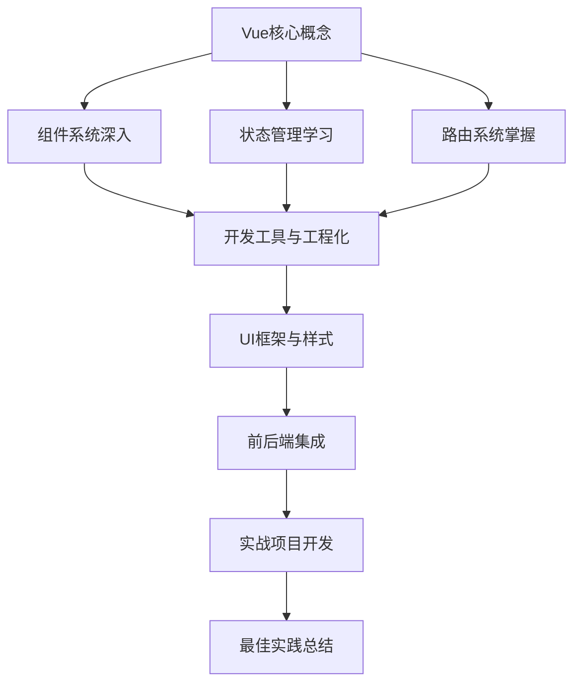

---
tags:
  - Vue3
  - 学习笔记
  - 教程
  - 学习指南
  - 前端开发
created: 2025-11-18
modified: 2025-11-18
category: 学习指南
difficulty: beginner
---

# Vue 3 学习笔记

> **系统化学习Vue 3，从核心概念到实战应用**

## 🎯 学习理念

### 🏗️ 概念优先，实践并重
我们采用**概念驱动**的学习方法：
1. **先理解核心思想** - 掌握Vue的设计哲学
2. **再学习具体技术** - 在理解基础上学习Vue生态
3. **最后实战应用** - 通过项目巩固所学知识

### 🔄 学→练→会 循环学习
每个知识点都遵循这个循环：
- **学** - 理论学习，理解概念
- **练** - 动手实践，编写代码
- **会** - 总结提升，真正掌握

---

## 📚 学习结构

### 🥇 第一层：核心概念基础（必读）
**目录**: [[00-Vue核心概念/]]

这个层次是整个学习体系的基石，**强烈建议按顺序学习**：

1. [[00-Vue核心概念/01-Vue响应式原理与组件化思想.md|Vue响应式原理与组件化思想]]
   - 理解Vue的灵魂：响应式系统和组件化开发
   - 通过对比传统方式，理解为什么需要Vue

2. [[00-Vue核心概念/02-Vue指令与CompositionAPI体系概览.md|Vue指令与Composition API体系概览]]
   - 掌握Vue的"语言"：指令系统和Composition API
   - 学会正确使用各种指令和API

3. [[00-Vue核心概念/03-Vue快速入门指南.md|Vue快速入门指南]]
   - 20分钟创建第一个Vue应用
   - 体验响应式和组件化的魔力

4. [[00-Vue核心概念/README.md|核心概念学习指南]]
   - 详细的学习路径和方法指导

### 🥈 第二层：技术深入（核心技能）
掌握核心概念后，深入学习具体技术：

#### 🧩 组件系统
**目录**: [[01-组件系统/]]
- [[01-组件系统/01-组件通信.md|组件通信详解]]
- [[01-组件系统/02-插槽与动态组件.md|插槽与动态组件]]
- [[01-组件系统/03-组件生命周期.md|组件生命周期]]

#### 🗃️ 状态管理
**目录**: [[02-状态管理/]]
- [[02-状态管理/01-Pinia状态管理.md|Pinia状态管理]]
- [[02-状态管理/02-跨组件状态共享.md|跨组件状态共享]]

#### 🛣️ 路由系统
**目录**: [[03-路由系统/]]
- [[03-路由系统/01-Vue-Router基础.md|Vue Router基础]]
- [[03-路由系统/02-路由守卫与导航.md|路由守卫与导航]]

### 🥉 第三层：生态与最佳实践（进阶提升）

#### 🛠️ 开发工具与工程化
**目录**: [[04-开发工具/]]
- [[04-开发工具/01-Vue-CLI与Vite.md|Vue CLI与Vite]]
- [[04-开发工具/02-开发调试技巧.md|开发调试技巧]]

#### 🎨 UI与样式
**目录**: [[05-UI框架/]]
- [[05-UI框架/01-Element-Plus.md|Element Plus]]
- [[05-UI框架/02-自定义组件库.md|自定义组件库]]

#### 🌐 前后端集成
**目录**: [[06-前后端集成/]]
- [[06-前后端集成/01-Axios与API调用.md|Axios与API调用]]
- [[06-前后端集成/02-实战项目集成.md|实战项目集成]]

---

## 🗺️ 学习路线

### 🎯 完整学习路径

### ⏰ 时间安排建议

| 阶段 | 内容 | 预计时间 | 重要性 |
|------|------|----------|--------|
| 核心概念 | 响应式、组件化、Composition API | 3-5天 | ⭐⭐⭐⭐⭐ |
| 技术深入 | 组件、状态管理、路由 | 1-2周 | ⭐⭐⭐⭐ |
| 开发工具 | CLI、Vite、调试技巧 | 3-5天 | ⭐⭐⭐ |
| UI框架 | Element Plus、自定义组件 | 1周 | ⭐⭐ |
| 前后端集成 | API调用、项目实战 | 1-2周 | ⭐⭐⭐ |
| 实战项目 | 完整应用开发 | 2-3周 | ⭐⭐⭐⭐ |

---

## 🎯 学习方法

### 📖 如何使用这些笔记

#### 1️⃣ 按顺序学习
**强烈建议**从 [[00-Vue核心概念/]] 开始，按顺序学习。核心概念是后续所有内容的基础。

#### 2️⃣ 理论与实践结合
每个章节都包含：
- **理论解释** - 概念和原理
- **代码示例** - 实际应用
- **练习题目** - 巩固理解
- **总结要点** - 关键知识

#### 3️⃣ 使用Obsidian功能
- **双向链接** - 点击 `[[文件名]]` 跳转相关内容
- **标签系统** - 通过标签快速定位相关主题
- **图谱视图** - 查看知识关联关系

### 🛠️ 环境准备

#### 必需工具
- **Node.js 16+** - JavaScript运行环境
- **npm 8+** - 包管理器
- **现代浏览器** - Chrome/Firefox/Safari
- **代码编辑器** - VS Code（推荐）

#### 推荐工具
- **Vue DevTools** - 浏览器调试扩展
- **Volar** - VS Code的Vue语言支持
- **ESLint** - 代码质量检查
- **Prettier** - 代码格式化

---

## 📋 学习检查清单

### ✅ 核心概念掌握
- [ ] 理解Vue响应式系统的工作原理
- [ ] 掌握组件化开发的思想
- [ ] 熟悉Composition API的使用
- [ ] 能够创建基本的Vue应用

### ✅ 技术技能培养
- [ ] 正确使用各种Vue指令
- [ ] 实现组件间通信
- [ ] 配置Vue Router路由
- [ ] 使用Pinia管理状态

### ✅ 实践项目能力
- [ ] 独立创建Vue项目
- [ ] 开发交互式用户界面
- [ ] 集成第三方UI组件库
- [ ] 实现前后端数据交互

---

## 🚀 快速开始

### 🎯 如果你是初学者
1. 从 [[00-Vue核心概念/01-Vue响应式原理与组件化思想.md]] 开始
2. 按顺序完成核心概念部分
3. 逐步深入技术细节
4. 通过实践项目巩固

### 🎯 如果你有Vue基础
1. 快速浏览 [[00-Vue核心概念/]] 查漏补缺
2. 重点学习薄弱环节
3. 直接进入感兴趣的技术领域
4. 关注最佳实践部分

### 🎯 如果你要面试准备
1. 重点复习核心概念
2. 深入理解响应式原理
3. 掌握常见面试题
4. 查看实战项目案例

---

## 🎉 学习成果

完成这个学习体系后，你将：

### 🎓 理论深度
- **系统理解** Vue 3的设计哲学
- **深入掌握** 响应式系统和组件化
- **全面了解** Vue生态系统
- **建立正确** 的现代前端开发思维

### 💻 实践能力
- **独立开发** Vue应用
- **灵活运用** 各种Vue特性
- **快速解决** 常见前端问题
- **遵循最佳** 实践规范

### 🚀 职业发展
- **胜任** 前端开发岗位
- **通过** 技术面试
- **具备持续** 学习能力
- **成为优秀** 的Vue开发者

---

## 🆚 Vue 3 vs 其他框架

### 📊 框架对比

| 特性 | Vue 3 | React | Angular |
|------|-------|-------|---------|
| **学习曲线** | 中等 | 中等 | 陡峭 |
| **性能** | 优秀 | 优秀 | 良好 |
| **生态** | 丰富 | 非常丰富 | 完整 |
| **开发体验** | 优秀 | 良好 | 中等 |
| **适用场景** | 中小型项目 | 大型项目 | 企业级应用 |
| **TypeScript** | 原生支持 | 需要配置 | 原生支持 |

### 🎯 为什么选择Vue 3

1. **渐进式框架** - 可以逐步引入，不强制全家桶
2. **优秀的开发体验** - 模板语法直观，学习成本低
3. **性能优异** - 编译时优化，运行时高效
4. **生态完善** - 官方维护的配套工具齐全
5. **社区活跃** - 文档完善，社区支持好

---

## 📞 支持与反馈

### 🤔 遇到问题
- 检查学习顺序是否正确
- 查看相关章节的问题排查部分
- 回顾核心概念理解
- 动手实践验证理论

### 💡 建议反馈
- 学习路径是否合理
- 内容深度是否适宜
- 实践例子是否清晰
- 还需要补充哪些内容

### 🌟 社区资源
- [Vue 3官方文档](https://cn.vuejs.org/)
- [Vue Mastery](https://www.vuemastery.com/)
- [Vue School](https://vueschool.io/)
- [GitHub Vue仓库](https://github.com/vuejs/core)

---

## 🔗 相关学习资源

### 📖 配套学习
- [[../01-Spring-Boot学习笔记/|Spring Boot学习笔记]] - 后端学习
- [[../00-前后端分离实战-服装销售系统/|前后端分离实战]] - 项目实战

### 🛠️ 实践项目
- 用户认证系统
- 商品管理系统
- 购物车系统
- 管理后台

### 📚 扩展阅读
- Vue 3设计原理
- 前端工程化实践
- TypeScript进阶
- 现代JavaScript特性

---

**开始你的Vue 3学习之旅吧！记住：扎实的基础是成功的基石！** 🚀✨

---

**相关链接**:
- [[00-Vue核心概念/README.md|核心概念学习指南]]
- [[快速参考手册.md|常用指令和API速查]]
- [[../00-前后端分离实战-服装销售系统/|实战项目教程]]