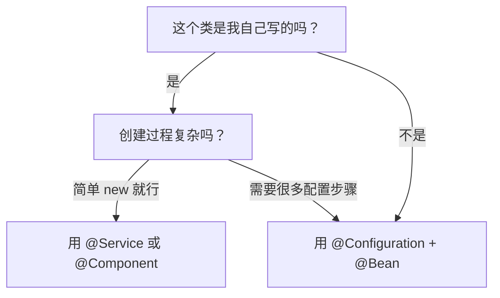

---
tags:
  - Spring注解
  - 配置注解
  - Bean管理
  - 配置管理
  - 依赖注入
created: 2025-11-16
modified: 2025-11-16
category: 注解
difficulty: intermediate
---

# Spring 配置注解详解

## @Configuration

### 基本概念

`@Configuration` 是一个"工厂类"，它里面包含了制造特殊 Bean 的"生产线"。这个"生产线"就是 `@Bean` 注解。

### 核心作用

> [!IMPORTANT] 核心作用
> `@Configuration` 用于创建"私人定制工厂"，当你需要：
> - 管理第三方库的类（无法修改源代码）
> - 创建过程复杂的对象
> - 集中管理Bean的创建逻辑

### 基本使用

```java
@Configuration  // ← 告诉Spring：这是一个"工厂"类
public class MyFactory {

    @Bean        // ← 告诉Spring：这是工厂里的一条"生产线"
    public RestTemplate restTemplate() { // 生产线的方法名，就是Bean的名字
        // 在这里写下"如何制造"这个Bean的详细步骤
        return new RestTemplate(); // 造出一个 RestTemplate 对象
    }
}
```

### 实际应用示例

#### 步骤 1：创建你的"私人定制工厂"

```java
// AppConfiguration.java - 这是你的工厂配置文件
import org.springframework.context.annotation.Bean;
import org.springframework.context.annotation.Configuration;
import org.springframework.web.client.RestTemplate;

@Configuration // ← 我是工厂！
public class AppConfiguration {

    @Bean // ← 我是生产线！我要生产一个叫 "restTemplate" 的Bean
    public RestTemplate restTemplate() {
        // 制造过程：直接 new 一个 RestTemplate 对象
        return new RestTemplate();
    }
}
```

#### 步骤 2：像使用普通Bean一样使用它

```java
@Service
public class WeatherService {

    @Autowired // ← "喂！Spring！我需要一个网络请求工具！"
    private RestTemplate restTemplate; // Spring会自动把工厂里造好的那个给你

    public String getWeather(String city) {
        String url = "http://api.weather.com/" + city;
        // 直接用！你都不用管它是怎么来的
        return restTemplate.getForObject(url, String.class);
    }
}
```

### 何时使用 @Configuration

| 场景 | 解决方案 | 比喻 |
| --- | --- | --- |
| **你自己写的类**，想交给Spring管理 | 用 `@Service` 或 `@Component` | 乐高官方积木 |
| **第三方库的类**，你想交给Spring管理 | 用 `@Configuration` + `@Bean` | 私人定制工厂 |
| **创建Bean需要很复杂的步骤** | 用 `@Configuration` + `@Bean` | 复杂工艺的生产线 |
| **想在一个地方集中管理所有Bean** | 用 `@Configuration` + 多个 `@Bean` | 工厂的中央控制室 |

### 简单记住

- 给**自己的类**当Bean，用 `@Service`。
- 给**别人的类**（或复杂对象）当Bean，用 `@Configuration` + `@Bean`。

---

## @Bean

### 基本概念

`@Bean` 注解用于在 `@Configuration` 类中定义Bean的创建方法。它告诉Spring："**请把我这个方法的返回值变成一个Bean**"。

### 两大核心使用场景

#### 场景一：你无法修改源代码（最常见！）

这是使用 `@Bean` 的 **Top 1** 理由。

**代码演示：**

```java
@Configuration // ← 开设一个"手工定制车间"
public class AppConfig {

    @Bean // ← 这是一条"定制生产线"
    public ObjectMapper objectMapper() {
        // 在这里，你可以像做手工一样，精细地配置这个对象
        ObjectMapper mapper = new ObjectMapper();
        // 比如，设置时间格式
        mapper.setDateFormat(new SimpleDateFormat("yyyy-MM-dd HH:mm:ss"));
        // 比如，遇到未知属性不报错
        mapper.configure(DeserializationFeature.FAIL_ON_UNKNOWN_PROPERTIES, false);
        return mapper; // 把这个精心制作的对象，交给Spring管理
    }

    @Bean // ← 再来一条生产线，造一个 RestTemplate
    public RestTemplate restTemplate() {
        return new RestTemplate();
    }
}
```

#### 场景二：Bean的创建过程非常复杂

**代码演示：**

```java
@Configuration
public class DatabaseConfig {

    @Value("${db.url}") // 读取配置文件的值
    private String dbUrl;

    @Value("${db.user}")
    private String dbUser;

    @Bean // "连接池"的生产线
    public ConnectionPool connectionPool() {
        System.out.println("正在根据配置创建连接池...");
        ConnectionPool pool = new ConnectionPool();
        pool.setUrl(dbUrl);
        pool.setUser(dbUser);
        pool.setPassword("password"); // 密码可能从更安全的地方获取
        pool.setMaxConnections(100);
        pool.setConnectionTimeout(3000);
        // ...其他复杂的初始化逻辑...
        return pool;
    }
}
```

### @Bean 的高级用法

#### 1. 指定Bean名称

```java
@Configuration
public class AppConfig {

    @Bean("customRestTemplate")  // 自定义Bean名称
    public RestTemplate restTemplate() {
        return new RestTemplate();
    }

    @Bean(name = {"paymentService", "payService"})  // 多个别名
    public PaymentService paymentService() {
        return new PaymentServiceImpl();
    }
}
```

#### 2. 依赖其他Bean

```java
@Configuration
public class AppConfig {

    @Bean
    public DataSource dataSource() {
        return new HikariDataSource();
    }

    @Bean
    public JdbcTemplate jdbcTemplate(DataSource dataSource) {  // Spring会自动注入
        return new JdbcTemplate(dataSource);
    }
}
```

#### 3. 生命周期管理

```java
@Configuration
public class LifecycleConfig {

    @Bean(initMethod = "init", destroyMethod = "cleanup")
    public MyService myService() {
        return new MyService();
    }
}

public class MyService {
    public void init() {
        System.out.println("Bean初始化...");
    }

    public void cleanup() {
        System.out.println("Bean销毁前清理...");
    }
}
```

#### 4. 作用域控制

```java
@Configuration
public class ScopeConfig {

    @Bean
    @Scope("prototype")  // 每次请求都创建新实例
    public PrototypeBean prototypeBean() {
        return new PrototypeBean();
    }

    @Bean
    @Scope("singleton")  // 默认，单例
    public SingletonBean singletonBean() {
        return new SingletonBean();
    }
}
```

---

## @Value

### 基本概念

`@Value` 注解用于将外部配置值注入到Spring管理的Bean中。它可以读取配置文件、环境变量、系统属性等。

### 基本使用

```java
@Component
public class AppConfig {

    @Value("${app.name}")  // 读取配置文件中的值
    private String appName;

    @Value("${app.version:1.0.0}")  // 提供默认值
    private String version;

    @Value("${server.port}")  // 读取服务器端口
    private int serverPort;

    @Value("#{systemProperties['java.home']}")  // SpEL表达式
    private String javaHome;
}
```

### 配置文件示例

```properties
# application.properties
app.name=MySpringApp
app.version=2.0.0
server.port=8080
```

### 高级用法

#### 1. 使用SpEL表达式

```java
@Component
public class SpelExample {

    @Value("#{1 + 2}")  // 数学运算
    private int result;

    @Value("#{'Hello ' + systemProperties['user.name']}")  // 字符串拼接
    private String greeting;

    @Value("#{T(java.lang.Math).random() * 100.0}")  // 调用静态方法
    private double randomValue;

    @Value("#{configService.getDatabaseUrl()}")  // 调用其他Bean的方法
    private String dbUrl;
}
```

#### 2. 读取环境变量

```java
@Component
public class EnvironmentExample {

    @Value("${HOME}")  // 读取环境变量
    private String homeDir;

    @Value("${JAVA_HOME:/usr/lib/jvm/default}")  // 带默认值
    private String javaHome;

    @Value("#{systemEnvironment['PATH']}")  // 使用SpEL读取环境变量
    private String path;
}
```

#### 3. 注入列表和Map

```java
@Component
public class CollectionExample {

    @Value("${app.servers}")  // 注入逗号分隔的列表
    private List<String> servers;

    @Value("#{${app.config}}")  // 注入配置Map
    private Map<String, String> config;
}
```

配置文件：
```properties
app.servers=server1,server2,server3
app.config="{url:'http://example.com', timeout:5000}"
```

---

## @PropertySource

### 基本概念

`@PropertySource` 注解用于指定额外的属性文件位置，让Spring能够加载自定义的配置文件。

### 基本使用

```java
@Configuration
@PropertySource("classpath:custom.properties")  // 加载类路径下的配置文件
@PropertySource("file:/etc/app/config.properties")  // 加载文件系统中的配置文件
public class AppConfig {

    @Value("${custom.property}")
    private String customProperty;
}
```

### 多个配置文件

```java
@Configuration
@PropertySources({
    @PropertySource("classpath:default.properties"),
    @PropertySource("classpath:prod.properties"),
    @PropertySource(value = "file:override.properties", ignoreResourceNotFound = true)
})
public class AppConfig {
    // ...
}
```

### 条件加载

```java
@Configuration
@PropertySource("classpath:${spring.profiles.active}.properties")
public class ProfileConfig {
    // 根据激活的profile加载不同的配置文件
}
```

---

## @Import

### 基本概念

`@Import` 注解用于导入其他配置类，实现配置的模块化和复用。

### 基本使用

```java
@Configuration
@Import(DataSourceConfig.class)  // 导入其他配置类
public class WebConfig {
    // Web相关配置
}

@Configuration
public class DataSourceConfig {
    @Bean
    public DataSource dataSource() {
        return new HikariDataSource();
    }
}
```

### 导入多个配置类

```java
@Configuration
@Import({
    DataSourceConfig.class,
    WebConfig.class,
    SecurityConfig.class
})
public class AppConfig {
    // 主配置类
}
```

### 条件导入

```java
@Configuration
@Import({DevConfig.class, ProdConfig.class})
public class ConditionalImportConfig {
    // 可以结合@Conditional注解实现条件导入
}
```

---

## 常见问题解答

### Q1: 什么时候应该用 @Service，什么时候用 @Configuration + @Bean？

**A:** 这是一个关键的架构决策问题。记住这个简单的判断流程：



**具体判断标准：**

1. **用 @Service 的情况：**
   - 你自己写的业务逻辑类
   - 创建过程简单（直接 `new` 就行）
   - 想要Spring自动扫描和管理

```java
@Service  // ✅ 自己写的业务类
public class EmailService {
    public void sendEmail(String to) {
        // 业务逻辑
    }
}
```

2. **用 @Configuration + @Bean 的情况：**
   - 第三方库的类（无法修改源码）
   - 创建过程复杂，需要很多配置步骤
   - 需要精细控制对象的创建过程

```java
@Configuration
public class AppConfig {
    @Bean  // ✅ 第三方库的类，需要复杂配置
    public ObjectMapper objectMapper() {
        ObjectMapper mapper = new ObjectMapper();
        mapper.setDateFormat(new SimpleDateFormat("yyyy-MM-dd HH:mm:ss"));
        mapper.configure(DeserializationFeature.FAIL_ON_UNKNOWN_PROPERTIES, false);
        return mapper;
    }
}
```

---

### Q2: @Value 和 @ConfigurationProperties 有什么区别？

**A:** 两者都用于配置注入，但使用场景不同：

| 特性 | @Value | @ConfigurationProperties |
|------|--------|-------------------------|
| **使用方式** | 单个字段注入 | 批量属性绑定 |
| **类型安全** | ❌ 弱类型 | ✅ 强类型 |
| **SpEL支持** | ✅ 支持 | ❌ 不支持 |
| **校验功能** | ❌ 不支持 | ✅ 支持 |
| **IDE提示** | ❌ 有限 | ✅ 完整支持 |

**@Value 示例：**
```java
@Component
public class ValueExample {
    @Value("${app.name}")
    private String name;

    @Value("${app.timeout:5000}")
    private int timeout;
}
```

**@ConfigurationProperties 示例：**
```java
@Component
@ConfigurationProperties(prefix = "app")
@Data  // Lombok
public class AppProperties {
    private String name;
    private int timeout = 5000;
    private Database database = new Database();

    @Data
    public static class Database {
        private String url;
        private String username;
        private String password;
    }
}
```

**推荐用法：**
- 简单配置、需要SpEL表达式 → 用 `@Value`
- 复杂配置、类型安全要求高 → 用 `@ConfigurationProperties`

---

### Q3: @Bean 方法的调用次数问题？

**A:** 这是一个常见的误解。在 `@Configuration` 类中，`@Bean` 方法不会被多次调用：

```java
@Configuration
public class AppConfig {

    @Bean
    public ServiceA serviceA() {
        System.out.println("创建ServiceA");
        return new ServiceA();
    }

    @Bean
    public ServiceB serviceB() {
        System.out.println("创建ServiceB");
        ServiceA serviceA = serviceA();  // 这里不会创建新实例！
        return new ServiceB(serviceA);
    }

    @Bean
    public ServiceC serviceC() {
        System.out.println("创建ServiceC");
        ServiceA serviceA = serviceA();  // 这里也不会创建新实例！
        return new ServiceC(serviceA);
    }
}
```

**输出：**
```
创建ServiceA
创建ServiceB
创建ServiceC
```

Spring会使用CGLIB代理`@Configuration`类，确保`@Bean`方法只被调用一次，返回的是同一个Bean实例。

---

### Q4: 如何在配置类中使用条件注解？

**A:** Spring提供了丰富的条件注解，可以实现智能配置：

```java
@Configuration
public class ConditionalConfig {

    @Bean
    @ConditionalOnProperty(name = "cache.enabled", havingValue = "true")
    public CacheManager cacheManager() {
        return new ConcurrentMapCacheManager();
    }

    @Bean
    @ConditionalOnClass(name = "redis.clients.jedis.Jedis")
    public RedisTemplate<String, Object> redisTemplate() {
        return new RedisTemplate<>();
    }

    @Bean
    @ConditionalOnMissingBean(DataSource.class)
    public DataSource defaultDataSource() {
        return new HikariDataSource();
    }

    @Bean
    @ConditionalOnWebApplication(type = ConditionalOnWebApplication.Type.SERVLET)
    public WebMvcConfigurer webMvcConfigurer() {
        return new WebMvcConfigurer() {
            // Web配置
        };
    }
}
```

---

## 相关文档链接

- [[01-核心注解(@Required,@Autowired,@Component等)]] - 核心注解详解
- [[03-分层注解(@Service,@Repository,@Controller等)]] - 分层架构注解详解
- [[04-高级注解(@Qualifier,@Primary,@Lazy等)]] - 高级用法注解详解
- [[Spring注解详解]] - Spring注解总览

## 相关学习笔记

- [[Spring配置管理]] - Spring Boot配置管理详解
- [[Bean生命周期详解]] - Bean创建和销毁过程
- [[条件化配置]] - 基于条件的智能配置